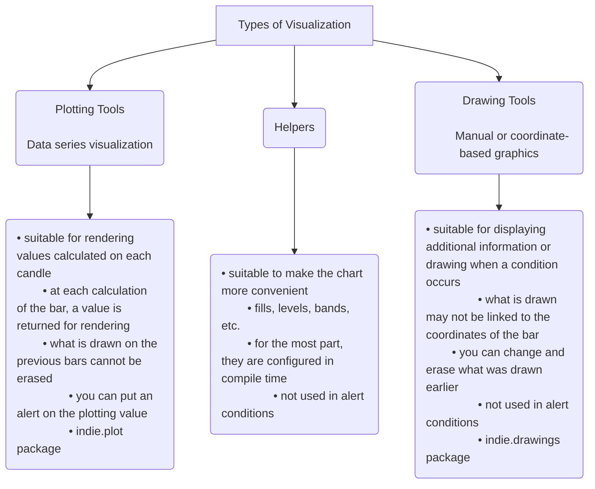

# Alert Limitations, Delivery, and History
Source: https://takeprofit.com/docs/guide/alerts/Alert-limitations-delivery-history


### Alert Limits

* Free users can create 1 alert with up to 3 months expiration
* Premium users can create up to 50 alerts with extended expiration periods
* All alerts remain active as long as the user maintains premium status.

### Notifications Limits

* Real-time platform updates are limited to 10 times per second
* On-platform notifications have no delivery limitations
* Email notifications are limited to once per minute per email address
* Webhook notifications are subject to rate limiting (limits are being adjusted and will be updated soon).

## Alert History & Management

<video />

### Accessing Your Alerts

* Click the bell icon to open the alerts panel with your "My Alerts" list
* View all alerts with their current status and details
* Access complete alert logs and management options.

### Alert Information

Each alert in your list displays:

* Unique identifier
* Trading instrument name and ticker
* Trigger condition
* Current status (Active, Fired, Expired, Stopped, Error)
* Action buttons (play/pause, delete, menu).

### Managing Alerts

* Click the play/pause button to activate or stop an alert
* Use the context menu (three dots) for additional options:
  * Delete
  * Edit
  * Duplicate
  * Restart
* Double-click any stopped alert to edit its settings.

### Alert Logs

<video />

* Click the "Logs" tab to view complete trigger history
* View detailed information for each trigger:
  Date and exact time
  Trigger criterion
  Alert message
* Double-click any log entry to edit the corresponding alert.

### History Retention

* Complete trigger history is maintained throughout the alert's lifetime
* All alert logs are automatically removed when the alert is deleted.


# Alert Trigger Criteria
Source: https://takeprofit.com/docs/guide/alerts/Alert-trigger-criteria

This guide provides a detailed description of the various alert trigger criteria available in the **TakeProfit** platform. Understanding these criteria will help you set up alerts that align with your trading strategies and preferences, allowing you to respond promptly to market changes.

<video />

## Introduction

Alerts are an important tool for traders, allowing them to respond promptly to market changes. In **TakeProfit**, you can set up alerts with various trigger criteria tailored to your trading strategies. This guide will help you understand and effectively use these criteria, providing examples involving cryptocurrencies, stocks, and technical indicators.

List of availbale criteria:

<CardGroup>
  <Card title="Moving Up" href="#moving-up">
    The trigger activates when the price or indicator value increases by a
    specified amount.
  </Card>

  <Card title="Moving Down" href="#moving-down">
    The trigger activates when the price or indicator value decreases by a
    specified amount.
  </Card>

  <Card title="Moving Up %" href="#moving-up-percent">
    The trigger activates when the price or indicator value increases by a
    specified percentage.
  </Card>

  <Card title="Moving Down %" href="#moving-down-percent">
    The trigger activates when the price or indicator value decreases by a
    specified percentage.
  </Card>

  <Card title="Crossing" href="#crossing">
    The trigger activates when two data series cross at any point.
  </Card>

  <Card title="Cross Up" href="#cross-up">
    The trigger activates when one data series crosses another from below.
  </Card>

  <Card title="Cross Down" href="#cross-down">
    The trigger activates when one data series crosses another from above.
  </Card>

  <Card title="Greater Than" href="#greater-than">
    The trigger activates when the price or indicator value exceeds a specified
    value.
  </Card>

  <Card title="Lower Than" href="#lower-than">
    The trigger activates when the price or indicator value falls below a
    specified value.
  </Card>

  <Card title="Entering Channel" href="#entering-channel">
    The trigger activates when the price or indicator value enters a specified
    range.
  </Card>

  <Card title="Exiting Channel" href="#exiting-channel">
    The trigger activates when the price or indicator value exits a specified
    range.
  </Card>

  <Card title="Inside Channel" href="#inside-channel">
    The trigger activates as long as the price or indicator value remains within
    a specified range.
  </Card>

  <Card title="Outside Channel" href="#outside-channel">
    The trigger activates when the price or indicator value is outside a
    specified range.
  </Card>
</CardGroup>

***

## Moving Up <a name="moving-up" />

**Description:**

The trigger activates when an asset's price or indicator value increases by a specified amount within a certain number of bars.

**Usage:**

* Monitoring significant increases in price or indicator over a short period.
* Identifying the start of an upward trend.
* Tracking strong bullish momentum.

**Examples:**

| Asset                | Condition                                                                                                             |
| -------------------- | --------------------------------------------------------------------------------------------------------------------- |
| **Stocks**           | Notify when the price of **Apple (AAPL)** increases by **5** over the last **3 hours**.                               |
| **Cryptocurrencies** | Notify when **Bitcoin (BTC)** rises by **1,000** within the last **2 hours**.                                         |
| **Indicators**       | Notify when the **RSI** value increases by **10 points** over the last **5 bars**, indicating strengthening momentum. |

**Tips:**

* Adjust the amount of change according to the asset's volatility.
* Use to spot entry opportunities in a rising market.
* When monitoring indicators, pay attention to significant shifts that may signal a trend change.

***

## Moving Down <a name="moving-down" />

**Description:**

The trigger activates when an asset's price or indicator value decreases by a specified amount within a certain number of bars.

**Usage:**

* Monitoring sharp declines in price or indicator.
* Identifying the start of a downward trend or buying opportunities during a pullback.
* Monitoring weakening market momentum.

**Examples:**

| Asset                | Condition                                                                                                         |
| -------------------- | ----------------------------------------------------------------------------------------------------------------- |
| **Stocks**           | Notify when the price of **Tesla (TSLA)** decreases by **10** over the last **4 hours**.                          |
| **Cryptocurrencies** | Notify when **Ethereum (ETH)** drops by **200** within the last **6 hours**.                                      |
| **Indicators**       | Notify when the **MACD** value decreases by **5 points** over the last **3 bars**, indicating weakening momentum. |

**Tips:**

* Helps in timely decision-making for exiting positions or entering at a better level.
* Combine with volume analysis to confirm the strength of the movement.
* When monitoring indicators, track declines that may precede price reversals.

***

## Moving Up % <a name="moving-up-percent" />

**Description:**

The trigger activates when an asset's price or indicator value increases by a specified percentage over a defined period.

**Usage:**

* Monitoring significant percentage gains.
* Identifying assets or indicators with strong upward momentum.
* Tracking market dynamics.

**Examples:**

| Asset                | Condition                                                                                                                     |
| -------------------- | ----------------------------------------------------------------------------------------------------------------------------- |
| **Stocks**           | Notify when **Netflix (NFLX)** shares rise by **5%** over the last **2 days**.                                                |
| **Cryptocurrencies** | Notify when **Ripple (XRP)** increases by **10%** within the last **24 hours**.                                               |
| **Indicators**       | Notify when the **On-Balance Volume (OBV)** increases by **8%** over the last **10 bars**, indicating strong buying pressure. |

**Tips:**

* Percentage changes are convenient for comparing assets with different price levels.
* Useful when screening the market for assets or indicators showing strong momentum.
* Apply to percentage-based indicators for consistent analysis.

***

## Moving Down % <a name="moving-down-percent" />

**Description:**

The trigger activates when an asset's price or indicator value decreases by a specified percentage over a defined period.

**Usage:**

* Monitoring significant percentage declines.
* Identifying buying opportunities after a price correction.
* Monitoring weakening indicators that may precede a reversal.

**Examples:**

| Asset                | Condition                                                                                                                            |
| -------------------- | ------------------------------------------------------------------------------------------------------------------------------------ |
| **Stocks**           | Notify when **Amazon (AMZN)** shares fall by **8%** over the last **3 days**.                                                        |
| **Cryptocurrencies** | Notify when **Litecoin (LTC)** decreases by **15%** within the last **12 hours**.                                                    |
| **Indicators**       | Notify when the **Stochastic Oscillator** decreases by **20%** over the last **5 bars**, indicating approaching oversold conditions. |

**Tips:**

* Helps identify oversold assets or weakening indicators.
* Combine with technical analysis for signal confirmation.
* Monitoring indicator declines can help anticipate potential reversals.

***

## Crossing <a name="crossing" />

**Description:**

The trigger activates when two data series cross at any point.

**Usage:**

* Identifying potential trend reversals.
* Monitoring crossovers between moving averages or indicators.
* Detecting significant market signals.

**Examples:**

| Asset                | Condition                                                                                                                       |
| -------------------- | ------------------------------------------------------------------------------------------------------------------------------- |
| **Indicators**       | Notify when the **50-day SMA** crosses the **200-day SMA** on **Google (GOOGL)** chart (Golden Cross or Death Cross).           |
| **Cryptocurrencies** | Notify when the **MACD line** crosses the **signal line** on **Bitcoin (BTC)** chart, signaling a potential change in momentum. |
| **Stocks**           | Notify when the **Price** crosses the **Ichimoku Cloud** on **NVIDIA (NVDA)** chart, indicating a potential trend change.       |

**Tips:**

* Crossovers of moving averages or indicators can signal significant market shifts.
* Use in combination with other technical tools to confirm signals.
* Be aware of false signals in volatile markets.

***

## Cross Up <a name="cross-up" />

**Description:**

The trigger activates when one data series crosses another from below.

**Usage:**

* Signals a possible start of an upward trend.
* Identifying bullish signals.
* Monitoring increasing market momentum.

**Examples:**

| Asset                | Condition                                                                                                                          |
| -------------------- | ---------------------------------------------------------------------------------------------------------------------------------- |
| **Stocks**           | Notify when the price of **Microsoft (MSFT)** crosses above the **100-day SMA** from below, indicating a bullish trend.            |
| **Indicators**       | Notify when the **RSI** crosses above the **30** level on **Ethereum (ETH)** chart, indicating exit from the oversold zone.        |
| **Cryptocurrencies** | Notify when the **Chaikin Money Flow (CMF)** crosses above zero on **Cardano (ADA)** chart, suggesting increasing buying pressure. |

**Tips:**

* Cross Up is often considered a buy signal.
* Confirm signals with volume and other indicators for increased reliability.
* Consider the context and overall market conditions.

***

## Cross Down <a name="cross-down" />

**Description:**

The trigger activates when one data series crosses another from above.

**Usage:**

* Signals a possible start of a downward trend.
* Identifying bearish signals.
* Monitoring decreasing market momentum.

**Examples:**

| Asset                | Condition                                                                                                                                |
| -------------------- | ---------------------------------------------------------------------------------------------------------------------------------------- |
| **Stocks**           | Notify when the price of **Facebook (FB)** crosses below the **50-day SMA** from above, indicating potential weakness.                   |
| **Indicators**       | Notify when the **RSI** crosses below the **70** level on **Litecoin (LTC)** chart, indicating exit from the overbought zone.            |
| **Cryptocurrencies** | Notify when the **MACD line** crosses below the **signal line** on **Bitcoin Cash (BCH)** chart, signaling a potential bearish reversal. |

**Tips:**

* Cross Down can serve as a signal to sell or close long positions.
* Use stop-loss orders to manage risks when trading on these signals.
* Consider the timeframe to filter out short-term noise.

***

## Greater Than <a name="greater-than" />

**Description:**

The trigger activates when the price or indicator value exceeds a specified value or another data series.

**Usage:**

* Monitoring breakouts above key resistance levels.
* Identifying the start of bullish movement.
* Tracking extreme indicator values.

**Examples:**

| Asset                | Condition                                                                                      |
| -------------------- | ---------------------------------------------------------------------------------------------- |
| **Stocks**           | Notify when **Tesla (TSLA)** exceeds **800**, indicating a potential breakout.                 |
| **Cryptocurrencies** | Notify when **Bitcoin (BTC)** surpasses its all-time high, signaling strong bullish sentiment. |
| **Indicators**       | Notify when the **RSI** on **Apple (AAPL)** exceeds **70**, entering overbought territory.     |

**Tips:**

* Useful for setting price targets and automating notifications when key levels are reached.
* Combine with volume analysis to confirm breakouts.
* For indicators, be cautious as overbought conditions may precede reversals.

***

## Lower Than <a name="lower-than" />

**Description:**

The trigger activates when the price or indicator value falls below a specified value or another data series.

**Usage:**

* Monitoring breakdowns below support levels.
* Identifying the start of bearish movement.
* Tracking extreme low indicator values.

**Examples:**

| Asset                | Condition                                                                                     |
| -------------------- | --------------------------------------------------------------------------------------------- |
| **Stocks**           | Notify when **Netflix (NFLX)** drops below **500**, possibly indicating further downside.     |
| **Cryptocurrencies** | Notify when **Ethereum (ETH)** falls below **2,000**, breaking a key support level.           |
| **Indicators**       | Notify when the **RSI** on **Amazon (AMZN)** drops below **30**, entering oversold territory. |

**Tips:**

* Helps react promptly to price declines and make decisions about exiting positions.
* Can be used to set stop-loss levels or identify buying opportunities.
* For indicators, oversold conditions may suggest potential rebounds.

***

## Entering Channel <a name="entering-channel" />

**Description:**

The trigger activates when the price or indicator value enters a specified range between upper and lower boundaries.

**Usage:**

* Monitoring price consolidation within a certain range.
* Preparing for range-bound trading strategies.
* Tracking reduced volatility.

**Examples:**

| Asset                | Condition                                                                                                                                             |
| -------------------- | ----------------------------------------------------------------------------------------------------------------------------------------------------- |
| **Stocks**           | Notify when **Apple (AAPL)** enters the price range between **130** and **135**, indicating consolidation.                                            |
| **Cryptocurrencies** | Notify when **Bitcoin (BTC)** enters the Bollinger Bands after being outside, suggesting reduced volatility.                                          |
| **Indicators**       | Notify when the **ADX (Average Directional Index)** on **Tesla (TSLA)** enters the range between **20** and **25**, indicating a non-trending market. |

**Tips:**

* Use to monitor sideways markets and plan trades within the range.
* Combine with other indicators to assess potential breakouts.
* Be prepared for increased volatility when exiting the channel.

***

## Exiting Channel <a name="exiting-channel" />

**Description:**

The trigger activates when the price or indicator value exits a specified range.

**Usage:**

* Identifying breakouts upwards or downwards.
* Signaling the start of a new trend or increased volatility.
* Monitoring significant market changes.

**Examples:**

| Asset                | Condition                                                                                                       |
| -------------------- | --------------------------------------------------------------------------------------------------------------- |
| **Stocks**           | Notify when **Tesla (TSLA)** breaks out of the **700** - **750** price range.                                   |
| **Cryptocurrencies** | Notify when **Ethereum (ETH)** moves outside the Keltner Channel, indicating a potential trend change.          |
| **Indicators**       | Notify when the **Volatility Index (VIX)** exits a low volatility range, signaling potential market turbulence. |

**Tips:**

* Breaking out of a channel may indicate the start of a significant movement.
* Confirm breakouts using volume and other technical indicators.
* Be cautious of false breakouts; consider waiting for confirmation.

***

## Inside Channel <a name="inside-channel" />

**Description:**

The trigger activates as long as the price or indicator value remains within a specified range.

**Usage:**

* Monitoring stable periods for trading within the range.
* Tracking assets or indicators during consolidation phases.
* Planning entry and exit strategies.

**Examples:**

| Asset                | Condition                                                                                                                 |
| -------------------- | ------------------------------------------------------------------------------------------------------------------------- |
| **Stocks**           | Continuously notify while **Microsoft (MSFT)** trades between **250** and **260**.                                        |
| **Cryptocurrencies** | Notify while **Bitcoin (BTC)** is within the **45,000** - **50,000** range.                                               |
| **Indicators**       | Notify when the **Stochastic Oscillator** on **Ethereum (ETH)** remains between **40** and **60**, indicating neutrality. |

**Tips:**

* Useful for range-bound trading strategies.
* Be vigilant for signs of an impending breakout.
* Adjust range boundaries as market conditions change.

***

## Outside Channel <a name="outside-channel" />

**Description:**

The trigger activates when the price or indicator value is outside a specified range.

**Usage:**

* Monitoring extreme price levels or indicator readings.
* Identifying assets with increased volatility or trend strength.
* Tracking significant market events.

**Examples:**

| Asset                | Condition                                                                                                                    |
| -------------------- | ---------------------------------------------------------------------------------------------------------------------------- |
| **Stocks**           | Notify if **Facebook (FB)** trades above **350** or below **300**, indicating significant movement.                          |
| **Cryptocurrencies** | Notify if **Ripple (XRP)** moves outside the Bollinger Bands, suggesting increased volatility.                               |
| **Indicators**       | Notify when the **RSI** on **Litecoin (LTC)** is above **70** or below **30**, indicating overbought or oversold conditions. |

**Tips:**

* Helps react promptly to significant market events.
* Combine with news analysis to understand underlying causes.
* For indicators, extreme values may precede reversals.

***

## Best Practices

<AccordionGroup>
  <Accordion title="Clearly Define Alert Goals">
    Understand exactly what you want to monitor and why. Set up alerts according
    to your trading strategy.
  </Accordion>

  <Accordion title="Use a Reasonable Number of Alerts">
    Avoid notification overload. Focus on the most important criteria for you.
  </Accordion>

  <Accordion title="Combine Alerts with Other Analysis Tools">
    Confirm signals using technical indicators and fundamental analysis.
  </Accordion>

  <Accordion title="Regularly Review Settings">
    Adjust criteria in line with changing market conditions. Analyze alert
    effectiveness and make necessary changes.
  </Accordion>

  <Accordion title="Use Appropriate Timeframes">
    Choose time intervals that match your trading style (day trading, swing
    trading, long-term investing).
  </Accordion>

  <Accordion title="Ensure Timely Notifications">
    Set up alert delivery methods (mobile app, email, messengers) for quick
    response.
  </Accordion>

  <Accordion title="Test Your Alerts">
    Start with small thresholds to ensure alerts are working correctly. Adjust
    parameters based on results.
  </Accordion>

  <Accordion title="Stay Informed">
    Keep an eye on market news that may affect your alerts. Be aware of
    scheduled events like earnings reports or economic data releases.
  </Accordion>
</AccordionGroup>

***

## Conclusion

Effectively using the various alert trigger criteria in the **TakeProfit** platform allows you to stay ahead in dynamic markets. By understanding and correctly applying these criteria, you can tailor alerts to your specific trading strategies, helping you make timely and informed decisions.

<Info>
  Remember, the key to successful alert management is continuous learning and
  adaptation. Regularly refine your alerts based on market changes and personal
  experience to optimize your trading outcomes.
</Info>

***

> **Note:** Always consider the individual characteristics of the assets and indicators you work with, as well as the current market environment when setting up alerts. This will enhance the relevance and effectiveness of your notifications.


# Creating and Managing Alerts
Source: https://takeprofit.com/docs/guide/alerts/Alerts-overview


TakeProfit alerts notify you when market conditions meet your custom criteria. Set up notifications for price movements, indicator conditions, or custom indicators you've developed.

<video />

Currently available:

* Price-based alerts
* Indicator-based alerts (for any indicator on your chart)
* Custom indicator alerts (for your own indicators).

## How to Set Up Alerts

There are two ways to set up alerts in TakeProfit platform: directly on the chart or through the Alerts dialog window.

### Setting up alerts through the Alerts dialog window

<video />

1. Click the "Alerts" button in the top right corner of your workspace
2. Click "New Alert"
3. In the dialog window, configure the following basic parameters:
   * **Source**: Choose between Price or Indicator (if available on the chart)
   * **Criteria**: Select the conditions that will trigger the alert
   * **Target**: Enter the specific value (price level or indicator parameter)
   * Click "**Add more**" to create multiple alerts simultaneously in the same window.

### Setting up alerts directly on the chart

<video />

There are several ways to create alerts right from the chart.

1. Click the bell icon that appears when hovering over the chart - this will automatically use the current price or indicator value


2. Create alerts through the chart's context menu (right click)


3. Add alerts directly from the price scale.

<video />

You can manage price alerts directly on the chart by dragging their visible line to a new level.

<video />

### Create Alerts (ALT+A)

Quickly open the alert dialog by pressing Alt + A. More shortcuts will be added soon.

## Additional settings


Additional settings are available under the "Expand" dropdown:

* Frequency settings
* Expiration date
* Email address for notifications
* Telegram - toggle to activate sending notifications to Telegram messenger
* Webhook URL for automated integrations
* Message field for customizing text with variable support.

### Multiconditional Alerts

<video />

You can define multiple conditions within a single alert using the **Add Condition** button in the Alerts dialog window.

Each condition in the group is evaluated together, meaning the alert will only trigger when **all specified criteria are met**.

This allows you to:

* Monitor several price levels for the same instrument
* Set alerts for multiple indicators at once
* Combine different alert types (e.g., price + indicator) in a single form

This feature streamlines your workflow by reducing the need to create and manage alerts one by one.

## Alerts Tab in Chart Settings

<video />

When working with charts, you can access additional alert configuration options directly from the chart widget. In the chart settings, you'll find a dedicated **Alerts** tab that provides the following customization options:

* **Alerts Lines**: Toggle this option to display or hide alert lines on your chart (enabled by default). When active, this makes it easier to visualize where your alerts are positioned on the price scale.

* **Inactive Alerts**: This setting allows you to show or hide alerts that are currently inactive. By default, this option is disabled, showing only active alerts.

* **Show Ticker**: When enabled (default setting), this option displays the ticker symbol alongside your alert indicators, making it easier to identify which instrument each alert belongs to.


# Discord Notifications via webhook
Source: https://takeprofit.com/docs/guide/alerts/Discord-webhook

This guide will help you configure automatic notifications from the **TakeProfit** platform to **Discord** using Webhook. This will allow you to receive timely alerts directly on your Discord server, enhancing your work efficiency.

## Creating a Webhook in Discord

### For a Server

1. **Open Discord** and log into your server.
2. **Go to server settings:**
   * Click on the server name in the top-left corner.
   * Select **"Server Settings"**.
3. **Choose the channel for notifications:**
   * In the left menu, select **"Integrations"**.
   * Click on **"Webhooks"**.
4. **Create a new Webhook:**
   * Click **"Create Webhook"**.
   * Set a **Webhook name** (e.g., "TakeProfit Alerts").
   * Choose the **channel** where messages will be sent.
   * **Copy the Webhook URL**—you will need it for the setup in TakeProfit.
   * Click **"Save Changes"**.

***

## Configuring Webhook in TakeProfit

### Preparing the Webhook URL

* Use the Webhook URL obtained from Discord in the previous step.
* Example Webhook URL:

  ```URL theme={null}
  https://discord.com/api/webhooks/123456789012345678/abcdefghijklmnopqrstuvwxyz
  ```

### Setting Up the Payload

1. **Log in** to your **TakeProfit** account.
2. **Create a new alert** or edit an existing one.
3. **Configure the alert conditions:**
   * Specify the required parameters: **ticker**, **exchange**, **trigger condition**, etc.
4. **Add the Webhook:**
   * In the notifications section, select the **Webhook URL** option.
   * **Paste the Webhook URL** from Discord into the appropriate field.
5. **Set up the Payload:**
   * In the **Message** field, enter the JSON with the necessary parameters.

***

## Forming Messages Using Variables

You can use TakeProfit variables to dynamically form the content of the message.

**Common variables:**

* `{{ticker}}` — The instrument's ticker.
* `{{exchange}}` — Exchange name.
* `{{condition_type}}` — Type of trigger condition.
* `{{condition_source_1}}` — Condition source (e.g., price).

**Example usage in the Message field:**

```json theme={null}
{
	"content": "🔔 Alert: {{ticker}} on {{exchange}} — {{condition_type}} {{close}}"
}
```

***

## Configuration Examples

### Example 1: Simple Text Message

**Message:** `The price of BTC/USD exceeded $50,000 on Binance`

**Payload in the Message field:**

```json theme={null}
{
	"content": "🔔 Alert: The price of {{ticker}} exceeded {{close}} on {{exchange}}"
}
```

### Example 2: Sending an Embedded Message (Embed)

**Payload with Embed:**

```json theme={null}
{
	"embeds": [
		{
			"title": "📈 {{ticker}} Alert",
			"description": "**Condition:** {{condition_type}}\n**Price:** {{close}}\n**Exchange:** {{exchange}}",
			"color": 3066993
		}
	]
}
```

* **title**: Message title, can contain variables.
* **description**: Main content using Markdown for formatting.
* **color**: Color of the Embed bar in decimal RGB format (e.g., `3066993` for green).

***

## Testing the Configuration

1. **Save the alert settings** in TakeProfit.
2. **Create a condition** that will surely trigger (e.g., set the price above the current one).
3. **Check for the message** in your Discord channel.
4. **Ensure** that all variables have been correctly replaced with actual data.

***

## Troubleshooting

* **Messages are not received:**
  * Check the correctness of the Webhook URL.
  * Ensure that the alert in TakeProfit is active.
* **Incorrect message display:**
  * Verify the correctness of the JSON in the Payload.
  * Use a [JSON validator](https://jsonlint.com/) to check.
* **Variables are not replaced:**
  * Ensure the variables are spelled correctly.
  * Check if the used variables are supported by the TakeProfit platform.

***

## Helpful Tips

* **Advanced Embed Features:**
  * You can add fields, images, and other elements to the Embed. Refer to the [Discord documentation](https://discord.com/developers/docs/resources/channel#embed-object) for details.
* **Notifications in multiple channels:**
  * Create multiple Webhooks for different channels and set up corresponding alerts.
* **Security:**
  * Do not share the Webhook URL with unauthorized individuals.
  * Regularly check your server's security settings.

***

## Conclusion

You have now set up integration between **TakeProfit** and **Discord** via Webhook. This allows you to receive instant and visual notifications about important events, helping you to respond promptly to market changes.

If you have any questions or need additional assistance, refer to the official Discord documentation or contact TakeProfit support.

***

**Useful Links:**

* [Discord Developer Portal — Webhook Documentation](https://discord.com/developers/docs/resources/webhook)
* [Discord Embed Visualizer](https://leovoel.github.io/embed-visualizer/) — a tool for previewing Embeds.
* [TakeProfit — Official Website](https://takeprofit.com/)
* [JSON Validator](https://jsonlint.com/)

***

**Note:** Always stay updated on the APIs and functions you use, as they may be updated or changed over time.


# Using Variables in Alerts
Source: https://takeprofit.com/docs/guide/alerts/How-use-variable-InAlert


<video />

Create powerful, informative alerts by incorporating dynamic data directly in your alert messages.

### Variable Placeholders

You can customize alert messages with real-time data using special placeholders. For example:

```
{{ticker}}:{{exchange}} {{condition_type}} {{condition_source_1}}
```

When triggered, this might display as: `TSLA:NASDAQ Crossing Down 144.68`

### Message Formatting Options

<video />

Switch between two formatting modes:

* **Plain Text Mode**: Type variables manually
* **JSON Mode**: Click variables to insert them or use the "+" icon to add new ones

### Available Variables

| Variable                 | Description                                                                                                                               |
| ------------------------ | ----------------------------------------------------------------------------------------------------------------------------------------- |
| `{{exchange}}`           | Trading venue (NASDAQ, NYSE, etc.)                                                                                                        |
| `{{ticker}}`             | Symbol of the instrument (TSLA, AAPL)                                                                                                     |
| `{{time_frame}}`         | Chart timeframe (1m, 1h, D)                                                                                                               |
| `{{session}}`            | Trading session (regular, extended)                                                                                                       |
| `{{condition_type}}`     | Alert trigger type (crossing, reaching)                                                                                                   |
| `{{open}}`               | Opening price of the bar                                                                                                                  |
| `{{high}}`               | Highest price of the bar                                                                                                                  |
| `{{low}}`                | Lowest price of the bar                                                                                                                   |
| `{{close}}`              | Closing price of the bar                                                                                                                  |
| `{{volume}}`             | Trading volume                                                                                                                            |
| `{{time}}`               | Time of the price bar                                                                                                                     |
| `{{condition_source_0}}` | The first series value (e.g., 144.68)                                                                                                     |
| `{{condition_source_1}}` | Second series value (if applicable)                                                                                                       |
| `{{condition_source_2}}` | Third series value (if applicable)                                                                                                        |
| `{{cond<i>.src<k>}}`     | i from \[0, 4], k from \[0, 2]. The value if i-th condition's k-th series. `{{cond0.src<k>}}` are an aliases for `{{condition_source_k}}` |
| `{{time_now}}`           | Current time when alert triggers                                                                                                          |

### Examples

Simple price alert:

```
Alert: {{ticker}}:{{exchange}} {{condition_type}} {{condition_source_1}} 
```

Multi-condition alert:

```
Alert: {{ticker}}:{{exchange}} crossing {{cond0.src1}} AND {{ticker}}:{{exchange}} crossing {{cond1.src1}} AND {{ticker}}:{{exchange}} crossing {{cond2.src1}} 
```

<Note>`src1` is a fixed parameter name. It stays `src1` no matter what source you select (price, indicator, or constant).
You can’t change the number — `src2` or other variants don’t exist.</Note>


# Telegram Notifications
Source: https://takeprofit.com/docs/guide/alerts/Telegram-alerts


Get alerts directly in your Telegram app with two setup options:

### Automatic Setup with TakeProfit Bot

<video />

For quick and simple configuration:

1. Toggle "Telegram" to ON in alert settings
2. In the popup dialog, click "Connect Telegram"
3. Open the link in your Telegram app (must be installed)
4. Click "Start bot" to initialize the connection
5. Press "Start" in the bot chat to activate notifications
6. Complete! Your alerts will now appear in this chat.

You can also disconnect your Telegram account from TakeProfit anytime by clicking the "Connected" button and selecting "Disconnect" in the dialogue window.

<video />

### Manual Setup via Webhook

For advanced users wanting customization:

* Use webhook functionality for custom Telegram integrations
* Send alerts to personal chats, channels, or groups
* Configure advanced message formatting
* Follow our detailed guide at [Telegram Webhook Setup](/guide/alerts/Telegram-webhook)

<Note> The automatic method is recommended for most users, while the webhook approach offers more flexibility for specific needs.</Note>


# Telegram Notifications via webhook
Source: https://takeprofit.com/docs/guide/alerts/Telegram-webhook

This guide will help you configure automatic notifications from the **TakeProfit** platform to **Telegram** using your own bot and Webhook. This allows you to receive timely alerts directly in the messenger, enhancing your workflow efficiency.

## Creating a Telegram Bot

Begin by creating your own Telegram bot, which will send you messages.

### Obtaining the API Token

1. **Open Telegram** and search for [@BotFather](https://t.me/BotFather).
2. **Create a new bot:**
   * Send the command `/newbot`.
   * Follow the instructions to set your bot's name and username.
3. **Receive the API token:**
   * After creation, BotFather will send you an API token. Example: `123456789:ABCDefGhIJKlmNoPQRsTUVwxyZ`.
   * **Save this token** securely; you'll need it for further setup.

***

## Obtaining the Chat ID

To send messages, you need the chat identifier (`chat_id`) where the bot will send notifications.

### For Personal Messages

1. **Start a conversation with your bot:**
   * Open a chat with your bot and send `/start`.
2. **Get your `User ID`:**
   * Search for [@userinfobot](https://t.me/userinfobot).
   * Send any message to it.
   * It will reply with your `User ID` and other information.

### For Group Chats

1. **Create or use an existing group.**
2. **Add your bot to the group.**
3. **Obtain the group's `Chat ID`:**
   * Add [@userinfobot](https://t.me/userinfobot) to the same group.
   * Send a message in the group.
   * [@userinfobot](https://t.me/userinfobot) will provide the group's `Chat ID`.

**Important:** Ensure your bot has the necessary permissions in the group to send messages.

***

## Configuring Webhook in TakeProfit

Setting up a Webhook allows the TakeProfit platform to send notifications to your bot.

### Preparing the Webhook URL

Create the URL for the Telegram API:

```
https://api.telegram.org/bot<YOUR_BOT_TOKEN>/sendMessage
```

* **Replace** `<YOUR_BOT_TOKEN>` with the token from step 1.

**Example:**

```
https://api.telegram.org/bot123456789:ABCDefGhIJKlmNoPQRsTUVwxyZ/sendMessage
```

### Setting Up Webhook in the Platform

1. **Log in** to your **TakeProfit** account.
2. **Create a new alert** or edit an existing one.
3. **Set up alert conditions:**
   * Specify parameters like ticker, exchange, trigger condition, etc.
4. **Add the Webhook:**
   * In the notifications section, select **Webhook URL**.
   * **Paste the Webhook URL** you prepared.
5. **Configure the Payload:**
   * In the **Message** field, enter JSON with `chat_id` and `text` parameters.

**Example Payload:**

```json theme={null}
{
	"chat_id": "YOUR_CHAT_ID",
	"text": "YOUR_MESSAGE"
}
```

* **Replace** `YOUR_CHAT_ID` with your `User ID` or group `Chat ID`.
* **Replace** `YOUR_MESSAGE` with your notification text or use TakeProfit variables.

***

## Forming a Message Using Variables

### Using TakeProfit Variables

TakeProfit allows the use of variables for dynamic message content.

**Common variables:**

* `{{ticker}}` — The instrument's ticker.
* `{{exchange}}` — Exchange name.
* `{{condition_type}}` — Type of trigger condition.
* `{{condition_source_1}}` — Condition source (e.g., price).

**Example in the Message field:**

```json theme={null}
{
	"chat_id": "987654321",
	"text": "Alert for {{ticker}} on {{exchange}}: {{condition_type}} at {{condition_source_1}}"
}
```

When the alert triggers, the variables will be replaced with real-time values.

***

## Configuration Examples

### Example 1: Simple Text Message

**Details:**

* **Bot Token:** `123456789:ABCDefGhIJKlmNoPQRsTUVwxyZ`
* **Chat ID:** `987654321`
* **Message:** `BTC price exceeded $50,000`

**Webhook URL:**

```
https://api.telegram.org/bot123456789:ABCDefGhIJKlmNoPQRsTUVwxyZ/sendMessage
```

**Payload in the Message field:**

```json theme={null}
{
	"chat_id": "987654321",
	"text": "{{ticker}} price exceeded ${{close}}"
}
```

### Example 2: Sending JSON Data

**Objective:** Send structured JSON with alert data.

**Payload:**

```json theme={null}
{
	"chat_id": "987654321",
	"text": "{ \"symbol\": \"{{ticker}}\", \"exchange\": \"{{exchange}}\", \"price\": \"{{close}}\" }"
}
```

**Important:** Escape quotes inside `text` with a backslash (`\`).

**Example of the final message:**

```json theme={null}
{
	"symbol": "BTC/USD",
	"exchange": "Binance",
	"price": "50000"
}
```

***

## Testing the Configuration

1. **Create a test alert** with the settings you've configured.
2. **Check for the message** in your Telegram app.
   * If the message doesn't arrive, double-check your settings and JSON formatting.
3. **Verify the data**, ensuring variables are correctly replaced.

***

## Troubleshooting

* **Messages are not delivered:**
  * Ensure the `chat_id` and bot token are correct.
  * Confirm the bot isn't blocked and has access to the chat or group.
* **Formatting errors:**
  * Use a JSON validator to check the Payload's correctness.
  * Make sure all special characters are properly escaped.
* **Variables are not replaced:**
  * Verify the variables are spelled correctly.
  * Ensure the variables are supported by TakeProfit.

***

## Helpful Tips

* **Using Telegram Formatting:**

  * Add `"parse_mode": "Markdown"` or `"parse_mode": "HTML"` to the Payload for text formatting.
  * **Example:**

    ```json theme={null}
    {
    	"chat_id": "987654321",
    	"text": "*BTC price exceeded $50,000!*",
    	"parse_mode": "Markdown"
    }
    ```

* **Sending Messages to Multiple Chats:**

  * Create multiple alerts with different `chat_id`s.
  * Alternatively, implement distribution within the bot (requires additional programming).

* **Security:**

  * Never share your bot's token with anyone.
  * Ensure the Webhook URL doesn't contain sensitive information.

***

## Conclusion

You have now set up integration between **TakeProfit** and **Telegram** using your own bot. This enables you to receive instant notifications about important events and respond promptly to market changes.

If you encounter questions or difficulties, refer to the official Telegram Bot API documentation or contact TakeProfit support.

***

**Useful Links:**

* [Telegram Bot API Documentation](https://core.telegram.org/bots/api#sendmessage)
* [TakeProfit — Official Website](https://takeprofit.com/)
* [JSON Validator](https://jsonlint.com/)

***

**Note:** Always verify the APIs and functions you use are up to date, as they may change over time.


# Webhook Notifications Basics
Source: https://takeprofit.com/docs/guide/alerts/Webhook-notifications

Webhooks allow you to automate the transfer of data and notifications from the **TakeProfit** platform to other applications and services in real-time. This guide will help you set up notifications via webhooks in TakeProfit for integration with various services such as Telegram, Discord, Slack, or your own servers.

## What is a Webhook in the Context of TakeProfit

A **Webhook** is a mechanism by which **TakeProfit** automatically sends HTTP requests to a specified URL when certain events occur, such as an alert triggering. This allows you to integrate TakeProfit with other services, receiving notifications and data in real-time.


## How Webhooks Work in TakeProfit

1. **Alert Triggering**: When a specified alert condition in TakeProfit is met (e.g., the price of an asset reaches a certain level), the platform initiates a webhook.

2. **Sending an HTTP Request**: TakeProfit automatically sends an HTTP request (`POST` method) to the URL you have configured for the webhook, transmitting data about the triggered alert in JSON format.

3. **Receiving and Processing Data**: The service or application to which the webhook is directed receives the request and processes the data according to its settings (e.g., sends a notification to a user, updates a database, executes a trading operation).

***

## Steps to Set Up Notifications via Webhooks in TakeProfit

### 1. Preparing the Webhook Receiver

The **Webhook Receiver** is the service or application that will receive and process data from TakeProfit.

* **Choosing a Receiver Service**:

  * **Messengers**: Telegram, Discord, Slack, etc.
  * **Third-Party Services**: IFTTT, Zapier, etc.
  * **Own Server**: Your own server or API for data processing.

* **Creating or Configuring a URL to Receive the Webhook**:

  * **For Messengers**:

    * **Telegram**: Create a bot via [@BotFather](https://t.me/BotFather) and obtain an API token.
    * **Discord**: Create a webhook in the server channel settings.
    * **Slack**: Set up an Incoming Webhook in the Slack app.

  * **For Your Own Server**:

    * Configure an endpoint on your server to receive HTTP requests.
    * Ensure processing of incoming data and implementation of the necessary logic (e.g., writing to a database, sending messages).

  * **For Third-Party Services**:
    * Follow the instructions of the chosen service to obtain the webhook URL and set up the integration.

### 2. Obtaining the Webhook URL

* **Copy or save the webhook URL** that will be used in TakeProfit.

* **Ensure the Security of the URL**: Do not share it publicly to avoid unauthorized access or spam.

### 3. Configuring the Webhook in TakeProfit

1. **Log in to your account** on the **TakeProfit** platform.

2. **Create a new alert** or edit an existing one:

   * Specify the necessary alert parameters: **ticker**, **exchange**, **trigger condition**, **timeframe**, etc.

3. **Add the Webhook in the Notification Settings**:

   * In the **Notifications** section, select the **Webhook URL** option.

   * **Paste the webhook URL** obtained in the previous step.

4. **Configure the Payload** (request body):

   * In the **Message** field, enter the JSON with the data that will be sent when the alert triggers.

   * Use TakeProfit variables to dynamically form the message.

**Example Payload:**

```json theme={null}
{
	"ticker": "{{ticker}}",
	"exchange": "{{exchange}}",
	"price": "{{close}}",
	"condition": "{{condition_type}}",
	"time": "{{time_now}}"
}
```

### 4. Using TakeProfit Variables

TakeProfit provides a number of variables that can be used in the Payload:

* `{{ticker}}` — The instrument's ticker (e.g., BTC/USD).
* `{{exchange}}` — The exchange name (e.g., Binance).
* `{{condition_type}}` — The type of trigger condition (e.g., Crossing Up).
* `{{condition_source_1}}` — The source of the first condition (e.g., closing price).
* `{{close}}` — The closing price of the last bar.

**Note:** A full list of available variables can be found in [this article](/guide/alerts/How-use-variable-InAlert) or in the interface when creating an alert.

### 5. Saving and Activating the Alert

* **Check the correctness of the alert settings** and webhook, including the correctness of the URL and the JSON syntax in the Payload.

* Click **Create Alert** or **Save** to save and activate the alert.

***

## Testing the Webhook

1. **Trigger the Alert**: Set a condition that is easy to fulfill so that the alert triggers (e.g., price below the current level).

2. **Check for Notification Receipt** on the webhook receiver side (e.g., in Telegram, Discord, or your server).

3. **Debugging**:

   * If the notification is not received, check the correctness of the webhook URL.

   * Ensure that the Payload format meets the receiver's requirements and is correctly formed (check the JSON syntax).

   * Check logs on the receiver side to identify possible errors or reasons for failure.

***

## Examples of Using Webhooks in TakeProfit

### 1. Sending Notifications to Telegram

* **Create a bot** in Telegram via [@BotFather](https://t.me/BotFather) and obtain the API token.

* **Obtain your Chat ID** (for a personal chat or group) using the bot [@userinfobot](https://t.me/userinfobot).

* **Form the URL for sending messages** via the Telegram API:

  ```
  https://api.telegram.org/bot<YOUR_BOT_TOKEN>/sendMessage
  ```

* **Configure the Payload** in TakeProfit:

  ```json theme={null}
  {
  	"chat_id": "YOUR_CHAT_ID",
  	"text": "🔔 Alert: {{ticker}} on {{exchange}} reached {{condition_source_1}}.\nPrice: {{close}}"
  }
  ```

### 2. Integration with Discord

* **Create a Webhook** in Discord:

  * Go to the channel settings on your server.

  * In the **Integrations** section, select **Webhooks** and create a new one.

  * **Copy the webhook URL**.

* **Configure the Payload** in TakeProfit:

  ```json theme={null}
  {
  	"content": "🔔 **Alert for {{ticker}}**\nExchange: {{exchange}}\nPrice: {{close}}\nCondition: {{condition_type}}"
  }
  ```

### 3. Sending Data to Your Own Server

* **Set up your server** to receive `POST` requests at a specific URL.

* **Process the data** received from TakeProfit according to your requirements (e.g., saving to a database, initiating automated trading).

* **Use the Payload** to transmit the necessary data:

  ```json theme={null}
  {
  	"symbol": "{{ticker}}",
  	"exchange": "{{exchange}}",
  	"price": "{{close}}",
  	"condition": "{{condition_type}}",
  	"time": "{{time_now}}"
  }
  ```

***

## Best Practices and Tips

* **Security**:

  * **Keep the webhook URL secret** to prevent unauthorized access.

  * **Use authentication**: If possible, add parameters to authenticate requests.

* **Data Format**:

  * **JSON Validation**: Use JSON validators to ensure the syntax is correct.

  * **Escaping Characters**: Escape special characters in strings if necessary.

* **Debugging and Monitoring**:

  * **Logging**: Enable logging on the webhook receiver side to track received requests and possible errors.

  * **Testing**: Regularly test the webhooks, especially after making changes to settings or platform updates.

* **Using Variables**:

  * **Up-to-date Data**: Use variables to get current data each time the alert triggers.

  * **Availability Check**: Ensure that the variables used are supported by TakeProfit and work correctly.

* **Documentation**:

  * **Study the official TakeProfit documentation** for detailed information on webhook capabilities and available variables.

***

## Conclusion

Setting up notifications via webhooks in the **TakeProfit** platform provides powerful opportunities for integration with other services and automating your workflows. By following this guide and adhering to best practices, you can effectively configure webhooks and receive notifications in a format convenient for you, allowing you to respond promptly to market changes.

***

**Note**: Always keep up-to-date with the TakeProfit platform documentation and the services you integrate with, as functionality may be updated and changed over time.


# null
Source: https://takeprofit.com/docs/guide/changelog


<Update label="2026-02-05" icon="lucide:sun">
  ## Second-Based Timeframes, Indicator Groups, Drawings and MCP Improvements

  The new year has just begun, and we're already rolling out a substantial pack of updates! This release includes major new features that expand charting capabilities, improve workflow efficiency, and enhance platform performance.

  Highlights include:

  * **Second-based [timeframes](https://takeprofit.com/docs/guide/platform/chart-widget/Chart-timeframes)** for more precise short-term analysis and tighter alignment between price action, entries, exits, and alerts.
  * **[Widget Linking](https://takeprofit.com/docs/guide/getting-started/Widget-Hub#widget-linking): Indicators Toggle** to keep indicator sets in sync across multiple charts.
  * **[Chart Settings](https://takeprofit.com/docs/guide/platform/chart-widget/Chart-settings) Templates** to quickly reuse your favorite visual setups.
  * A **refactored chart engine** with better drawing performance, geometry handling, and stability.
  * **Smarter [MCP Search](https://takeprofit.com/docs/indie/Mcp-server/Mcp-server-guide)** to explore concepts, or search for exact terms when you know what you're looking for — all without pulling unnecessary content into context.

  <Accordion title="Improvements">
    - Post preview aspect ratio — post previews in the main feed now display with their original aspect ratio instead of a fixed 1:2 crop, making the feed feel more dynamic and natural.
    - Redesign of widget covers — updated visual design for widget cover images.
    - Posts open in overlay — posts from the feed widget now open in an overlay (similar to how indicators open), keeping you in context.
    - Registration flow improvements — added background overlay for the login popup and other UX refinements.
    - Hide non-index watchlists in built-ins — the built-in watchlist section now shows only major index watchlists (S\&P 500, Nasdaq 100, etc.) for a cleaner experience.
    - Optimized history requests — history requests are now split into chunks matching the history depth, reducing load during explicit history scrolls.
  </Accordion>

  <Accordion title="Fixes">
    * Fixed issues with modifying drawing labels and relative label positioning.
    * Resolved Long/Short drawing duplicates and restored stop parameter behavior.
    * Fixed disappearing 'Add to chart' button in the IDE.
    * Fixed timeframe errors — corrected issues where requests would fail on certain timeframes.
    * Fixed platform freezes when resizing charts.
    * Fixed context menu actions in the chart object tree.
    * Fixed password reset for users without username.
  </Accordion>
</Update>

<Update label="2025-12-25" icon="lucide:sun">
  ## DEX sources, smarter linking, Feed widget, and Indie® updates

  This month we’re rolling out new DEX market sources, improved widget linking, the new community Feed widget, and Indie® enhancements.

  * **Widget Linking — symbols, chart type, timeframes.** Create [linked groups](https://takeprofit.com/docs/guide/getting-started/Widget-Hub#widget-linking) to sync symbols, chart type, and timeframes across charts (more parameters coming). To change a symbol, click the ticker on the chart to open Search — or just start typing.
  * **New DEX integrations — Hyperliquid & Aster.** Low-latency, real-time feeds now power custom indicators, technical analysis, and sophisticated alert setups.
  * **Feed Widget.** Add the [Feed widget](https://takeprofit.com/docs/guide/platform/feed-widget/feed-widget) to your workspace and follow what’s happening in the TakeProfit community without leaving your charts.
  * **Indie® & indicator updates.** Color parameters via [`@param.color`](https://takeprofit.com/docs/indie/Library-reference/package-indie#decor_param_color), updated [ZigZag example](https://takeprofit.com/docs/indie/Library-reference/package-indie), and [`enumerate`](https://takeprofit.com/docs/indie/Library-reference/builtins#enumerate) support in Indie® .

  <Accordion title="Improvements">
    - Widget Linking: enhanced channels with new toggles for quicker control
    - Tooltips on chart icon buttons for faster discovery
    - 2FA (authenticator) added
    - Sources → Search: improved sorting
  </Accordion>

  <Accordion title="Fixes">
    * Close Favorites Drawing panel with Esc
    * Fixed broken paywall for indicator product and platform subscription
    * Search: open modal by hotkey works reliably
    * Search: free-roll users can open the search window
    * Fixed delete for indicator pills collapse button
    * Fixed closing of indicator category panel
    * Prevented duplicate widgets
    * Indie®: fixed failure after switching from Screener
    * Fixed referral links for embedded Charts and Financials
  </Accordion>
</Update>

<Update label="2025-12-05" icon="lucide:sun">
  ## Backtesting around the corner. Trading up next

  We’re putting most of our energy into launching trading on the platform, including the ability to connect your preferred broker - one of our biggest updates to date.

  Backtesting, with strategy creation and testing, is entering the final stretch and will roll out soon.

  Join our [Discord](https://discord.gg/WVk8TjwU7p) to follow progress and try early builds.

  <Accordion title="Improvements">
    * User cards updated for **Light** and **Default** themes
    * **Support new label types** on chart
    * **IDE:** clear undo history after script creation
    * **IDE:** hide “Add to chart” for deleted indicators
    * **IDE:** disable editing source code for marketplace indicators
  </Accordion>

  <Accordion title="Fixes">
    * **Search → Watchlist:** add symbol via “+” works without freezes
    * **Watchlist:** removing a symbol no longer freezes the platform
    * **Auth:** improved flows and alerts for **change/reset password** for OAuth users
    * **Light Theme → Chart components:** fixed dividers for external indicators when switching themes
    * **Light Theme:** image rendering issues fixed
    * **Light Theme → Indicator Marketplace:** display glitches fixed
    * **User/Author pages:** layout corrected on account page
    * **User/Author pages:** tooltips added to badges
    * **User/Author pages:** fixed missing user info on profile
    * **User/Author pages:** fixed paid subscription disappearing after page refresh
    * **IDE:** background for hints corrected
    * **IDE:** unsaved script draft handling fixed
    * **IDE:** fixed error state for the "indicator pill" after creating/saving a script
    * **Indicator Settings:** source select now closes on the second click (as expected)
    * **IDE:** context menu and version list fixed for unsaved scripts
    * **Indicator pill:** display issues fixed
    * **Sharing modal:** indicator layers display fixed
    * **Indicator search:** fixed uppercase search behavior
    * **Chart settings:** saving settings fixed
    * **Favorites drawing panel:** can be closed with **Esc**
    * **Chart settings:** “Reset” works correctly for color items
  </Accordion>
</Update>

<Update label="2025-11-05" icon="lucide:sun">
  ## Settings Panels Overhaul, Profile Controls, and What’s Next

  We’ve introduced a **unified Settings Panel** that works the same way across the platform and brought major upgrades to chart and indicator configuration — faster, clearer, and consistent.

  We’re also expanding **Profile Settings** and continuing active work on **Backtesting** — a public beta is on track for the coming weeks.

  <Accordion title="Improvements">
    * **Chart Settings redesign:** new floating panel, **Extended Hours** moved into Chart Settings, clearer categories
    * **Chart types via settings:** customize **Candles**, **Bars** and **Lines** directly in the panel
    * **Indicator Settings redesign:** independent params/styles per instance, quick **visibility toggles** and fast setup switching
    * **Profile Settings:** edit username, **reset password**, manage **subscriptions**, and adjust **notifications** in one place
  </Accordion>

  <Accordion title="Fixes">
    * **Heatmap Screener:** period selection now **persists after page refresh** (e.g., 4h stays 4h)
    * **User avatar:** broken avatars fixed; if missing, a **default bull** is shown
    * **Long & Short Tool:** incorrect rendering with multiple TP/SL fixed
    * **Old workspaces:** **histogram color** changes apply immediately (no extra actions needed)
    * **Auth & validation:** clearer alerts for invalid email and related signup cases
    * **Screener multi-select:** action panel **always appears** when selecting multiple symbols, regardless of screen type switches
    * **Light Theme – Notes Widget:** corrected menu, headings, quotes color, and card borders
    * **Chart settings:** **Reset** for color items works as expected
    * **Monetization:** fixed **500 error** when opening the page via direct link
    * **Old chart snapshots:** fixed **price range** so candles/indicators are visible on load (e.g., snapshots like the BTC/USDT example)
  </Accordion>
</Update>

<Update label="2025-10-05" icon="lucide:sun">
  ## New Fibonacci Tools — Speed Resistance Fan & Time Zone

  We’ve added two Fibonacci drawing tools:

  **Fibonacci Speed Resistance Fan** plots diagonal rays from a chosen pivot using key ratios (0.236/0.382/0.5/0.618/0.786) to reveal dynamic support/resistance and trend strength.

  **Fibonacci Time Zone** places vertical lines at Fibonacci intervals (1, 2, 3, 5, 8, 13, 21…) to highlight moments when pivots or accelerations are more likely.

  Learn more about the new and existing tools in the [Fibonacci tools](https://takeprofit.com/docs/guide/platform/chart-widget/Fibonacci-tools) section of our guide.

  ### MCP now works across more surfaces

  Model Context Protocol support now includes Claude Code CLI, Cursor, and VSCode integrations, plus live browser support. If you’re on a free Claude account without remote MCP, you can use `mcp-remote` to run local tools.\
  **Learn more:** [MCP Server Guide](https://takeprofit.com/docs/indie/Mcp-server/Mcp-server-guide)

  ### Widget linking channels

  Widgets can now be grouped via numbered channels **1–4** (each with a fixed color). A widget links only with others set to the same number (1↔1, 2↔2, etc.), while the **“–”** option unlinks it. Within a channel you can sync instrument, timeframe, crosshair, and range for cleaner multi-chart layouts and faster workspace control.\
  **Learn more:** [Widget Hub → Widget Linking](https://takeprofit.com/docs/guide/getting-started/Widget-Hub#widget-linking)

  <Accordion title="Improvements">
    * **Search:** new animation when adding a security from results
    * **Search → Sources tab:** updated keyboard hints and interactions
    * **Search → Sources tab:** `Esc` now saves changes (button removed)
    * **Provider groups:** **Pepperstone** moved into its own group between Stocks and Crypto
    * **Author & Followers pages:** subscribe from profile, see followers, paid subscriber counts, and active paid subscriptions
  </Accordion>

  <Accordion title="Fixes">
    * **Charts:** removed duplicate favorite timeframe entry
    * **Search modal:** pressing **Enter** now creates a Watchlist (modal no longer closes unexpectedly)
    * **Exchange cards:** fixed clipping of descenders (letters like “p”, “g”, “у”)
    * **Sources tab:** fixed checkbox rendering/behavior (Windows edge case included)
    * **Published indicator page:** fixed broken chart rendering (indicators now load correctly)
    * **Watchlist sorting:** no longer resets when switching Watchlists; sorting is per-Watchlist and consistent across widgets using the same list
    * **Search modal:** now opens correctly even when no active Watchlist is set
    * **Community:** fixed infinite scroll after navigating back from a post/indicator/screener
    * **User card:** fixed cover image not displaying
    * **Widget sharing modal:** fixed white username color
    * **Fibonacci drawings:** settings/edit panel opens even after all levels are deleted
    * **Search:** fixed `ContextMenu` scroll bug
  </Accordion>
</Update>

<Update label="2025-09-05" icon="lucide:sun">
  ## Interactive Trading Instrument Search Center

  We’ve reimagined the search window and turned it into a full trading instrument search center with more intuitive ways to work:

  * Use keyboard shortcuts to navigate filters and interact with search results.
  * A single click on the **Add to Watchlist** icon instantly saves the instrument to your default Watchlist.
  * A double click opens extended options — choose another Watchlist or create a new one, making it easy to organize instruments across multiple lists.
  * All your existing Watchlists are now accessible at the bottom of the search window. Select an active Watchlist, hold `Shift` + `Enter`, and add instruments directly to it while browsing search results.

  <Accordion title="Improvements">
    - Scrollbars are now always visible when needed, not only on hover
    - Added Light Theme support for system pages (4xx/5xx)
    - Polished Light Theme visuals for better readability
    - Improved chart behavior on touch devices: disabled new drawings for now, fixed selection and unselecting of indicators, added scroll-to-history button
    - Posts and edits now update instantly on profile pages
  </Accordion>

  <Accordion title="Fixes">
    * Fixed issue where “All sources” wasn’t displayed after selecting all exchanges
    * Fixed search form not opening in Marketplace
    * Fixed search not opening when clicking on chart instrument name
    * Fixed Watchlist checkboxes not saving their state correctly
    * Fixed creating Watchlist by Enter key in search modal
    * Fixed infinite loader after login — spaces now load normally
    * Fixed homepage layout glitch after deleting a post
    * Fixed rendering of old chart snapshots
    * Fixed duplicate favorite timeframes
    * Fixed broken charts on published indicator pages
    * Fixed inaccurate VWAP bands — now calculated by standard deviation
    * Fixed non-registered user message on published charts
  </Accordion>
</Update>

<Update label="2025-08-22" icon="lucide:sun">
  ## Mobile Platform Release

  The mobile version of the platform is now live. All core features previously available on desktop can now be used on mobile as well. This release marks a major milestone on the way toward a fully featured mobile app.

  <Accordion title="Improvements">
    * Added **Help** and **Born to Earn** buttons for unregistered users
    * Redesigned **indicator card visuals** so that preview and published pages look consistent — no more dull colors or thinner lines on the preview
    * Improved **display of settings block** when creating a post — it now opens visible by default
    * **Refresh page immediately** after user settings fail — smoother error handling
  </Accordion>

  <Accordion title="Fixes">
    * Fixed issue where indicators **moved between panes after settings change** (drawings no longer split into separate panes unexpectedly)
    * Fixed **500 error on mobile posts with media**
    * Fixed issue with **ticker selection when adding to Watchlist**
    * Fixed **saving of scale type after reset** — log/regular scale is preserved
    * Fixed **death loop on Indie® history scroll**
    * Fixed **channels extending horizontally when width = 0**
    * Fixed **cross line disappearing after enabling extended session** on 1h timeframe
    * Fixed **Fibonacci sync glitch** where removed levels still displayed after geometry sync
    * Fixed **tooltip offset** for plotted lines with offset
    * Fixed **Create new indicator** button — it now opens IDE or adds it to space if missing
    * Fixed **open indicators page by direct link** (no more 500 error)
    * Fixed **black charts & indicators on Android**
    * Fixed inability to **delete certain filters in Screener** (now all filters are removable, even with empty results)
    * Fixed **download of candles in shared charts** (no more errors on 5–15 min TF shared links)
  </Accordion>
</Update>

<Update label="2025-08-01" icon="lucide:sun">
  ### Light Mode

  This update brings one of the most requested features — **Light Mode**.\
  You can now switch between **Light, Dark, and System themes** across the entire platform, with changes applying instantly to all workspaces.

  The Light mode provides a clean, bright interface that feels natural in well‑lit environments, while System mode adapts automatically to your OS theme.\
  Your choice is saved across sessions, so your setup stays consistent every time you return.

  ### Born to Earn

  We’re introducing a major new initiative — [**Born to Earn**](https://takeprofit.com/born-to-earn) — designed to shift platform growth into the hands of creators rather than ads.

  * **[Lifetime Revenue Share: Up to 50%](https://takeprofit.com/monetization)**\
    Share links with your ID. Every user who signs up is permanently tied to your account, generating lifetime revenue share.

  * **[Sell Indicators with 0% Fees for Invited Users](https://takeprofit.com/monetization)**\
    Build with Indie®, set your own price, and earn recurring subscription revenue — with 0% fees for invited users.

  * **[Paywall. 0% Fees vs Substack’s 13.6%](https://takeprofit.com/monetization)**\
    Launch a private hub for exclusive posts, charts, financials, or videos. Keep 100% of revenue from your invited audience.

  * **[Ambassador Program — Born to Earn: MAXX](https://takeprofit.com/born-to-earn)**\
    For influential traders ready to go all‑in with TakeProfit. Get 0% platform fees, 50% lifetime revenue share, and VIP perks.

  <Accordion title="Improvements">
    - Added support for Light theme in IDE widget
    - Indicators theming update + new brown, pink, and orange colors for Indie®
    - Update sharing covers — improved, more consistent visuals when sharing custom screeners
    - Disable hotkeys and drawing on charts in published posts (shared charts are now fully view‑only)
    - Re‑add indicator after any fail: indicators now recover gracefully by showing available history instead of crashing, with an added refresh button
  </Accordion>

  <Accordion title="Fixes">
    * Watchlist: fixed **Add Symbol** button visibility, fixed button shift when watchlist name is long, fixed header alignment in watchlist widget
    * Fixed save function in IDE
    * Fixed closing of Marketplace with **Esc** key
    * Fixed issue with removing built‑in indicators from chart (now deletes correctly across multiple charts and IDE)
  </Accordion>
</Update>

<Update label="2025-07-10" icon="lucide:list">
  ### Platform & Theming Updates

  We've been hard at work on **Indie®** — check out the full Indie changelog [here →](https://takeprofit.com/docs/indie/Changelog)

  We're also preparing light theme support across the platform. As part of that work, you can now fine-tune the [visual style of your chart](https://takeprofit.com/docs/guide/platform/chart-widget/Chart-settings#style-tab) — adjust background, text, grid, and candle colors to better match your workflow or theme preference.

  Color changes are preserved across sessions, and you can always reset to default when needed.

  More visual customization options are coming soon — but even now, you have control over key color elements.

  <Accordion title="Improvements">
    * You can now add **multiple TP/SL levels** directly from the Long-Short Tool
    * Introduced **Alt + A** hotkey to quickly create alerts
    * Added **Alt + W** hotkey to add symbols to Watchlist
    * Alerts creation flow now works on mobile
    * Updated design for indicator "pills" (collapsed indicator list on chart)
    * Added support for **default avatars and covers**:
      * Empty user avatars and screener covers now show default images
      * Social sign-ins pull avatars automatically
      * Email signups get neutral default image (non-removable, replaceable)
  </Accordion>

  <Accordion title="Fixes">
    * Fixed applying colors to histogram and candle series
    * Fixed eternal skeleton screen in Screener Lite View (empty table with background only)
    * Fixed dropdown menu behavior in Screener view settings
    * Fixed dropdown arrow logic in Screener (arrows now update on open/close, including edge cases when clicking between blocks or headers)
    * Fixed grouping dropdown arrow direction in Heatmap
    * Fixed color handling in **Add to Watchlist** modal (checkboxes)
    * Fixed multiple issues in **chart background settings**
    * Fixed alert modification by dragging for non-expiring alerts
    * Fixed widget sharing issues (now shares focused chart, not the last added one)
    * Fixed chart focus bug when adding new widgets
    * Fixed return of missing candles after reconnect
    * Fixed icon visibility in Financials (e.g. Common size icon now visible on hover)
    * Fixed Financials column headings
  </Accordion>
</Update>

<Update label="2025-06-06" icon="lucide:list">
  ### Multiconditional Alerts

  A major upgrade to our alert system. You can now set multiple conditions for a single alert — it will only trigger when **all** selected criteria are met. This turns alert logic into a powerful orchestration tool, where you define precise market scenarios using logical AND.

  Each condition displays its own icon, so it's easier to visually recognize what's being tracked, even when several criteria are set.

  As always, alerts support multiple delivery methods — from simple [Telegram notifications](https://takeprofit.com/docs/guide/alerts/Telegram-alerts) to [advanced webhooks in Telegram or Discord](https://takeprofit.com/docs/guide/alerts/Webhook-notifications).

  ### Hotkey Panel

  No need to dig through the guide every time you forget a shortcut. A new **Hotkey Panel** is now available at the bottom of the screen. To open it, click the **question mark icon** in the top-right corner and choose **Keyboard Shortcuts**.

  Currently, shortcuts are grouped into categories like **Essential** (Workspaces, Lists & Tables) and **Charts**, with more categories coming soon.\
  You can also find the [full shortcut list in our guide](https://takeprofit.com/docs/guide/platform/chart-widget/Drawing-Tools-Keybord-Shortcuts).

  <Accordion title="Improvements">
    * Added an illustrated panel to guide users through creating and managing alerts
    * Updated monetization FAQ page → [https://takeprofit.com/monetization](https://takeprofit.com/monetization)
    * Added ability to delete individual logs from the alert log panel
  </Accordion>

  <Accordion title="Fixes">
    * Fixed unread log count not updating after deletion
    * Corrected time zone display in alert tooltips
    * Added default alert on indicator and sharing pages
    * Numerous alert stability fixes based on user feedback
  </Accordion>
</Update>

<Update label="2025-05-23" icon="lucide:list">
  ### Post-it: share & embed charts

  When [sharing a chart](/guide/platform/chart-widget/Sharing-chart-widget), you can now instantly create a community post with the embedded chart. To add an interactive chart to a new or existing post, just paste the chart link while writing or editing. Then click “Show embed” to insert a live, interactive version of the chart directly into your post.

  The same workflow applies to the [Financials widget](/guide/platform/financials-widget/Sharing-financials-widget) — simply paste its link and use “Show embed” to add an interactive version to your post.

  ### Watchlist and Screener: Sorting and Lite View Redesign

  [Watchlist](/guide/platform/watchlist-widget/Creating-and-managing-watchlist) and [Screener](/guide/platform/stock-screener/Stock-screener-overview) now support full column-based sorting. You can sort by any field available in the table view, with sorting synchronized across both table and list (Lite) views. The redesigned Lite view features a cleaner layout with no column headers, selection checkboxes, and a sorting icon integrated into the settings menu. Legacy header rows and right-click sorting options have been removed for a more streamlined experience.

  ### Pepperstone Bonds added

  Bonds are now available from Pepperstone. A dedicated search tab is coming soon.

  <Accordion title="Improvements">
    * Left header redesign\
      For users without a workspace, we now show the `platform` label. Once a workspace is created, the full list of available workspaces becomes visible.
  </Accordion>

  <Accordion title="Fixes">
    * Resolved infinite loading when adding a custom indicator to a chart
    * Fixed visibility bugs for non-series indicators like Pivots and ZigZag
    * Fixed issues with hiding comparison indicators in multi-series charts
    * Fixed disappearing candles issue
    * Fixed copy-paste behavior for code blocks in posts
    * Fixed numbered lists in post preview and published mode
    * Unified ticker display across widgets using `SecurityInfo.ticker`
  </Accordion>
</Update>

<Update label="2025-05-16" icon="lucide:settings">
  ### Multiple Take-Profit and Stop-Loss levels

  [Long-Short Tool](/guide/platform/chart-widget/Measurement-tools#long-short-tool-alt-%2B-l) now support multi-level TakeProfit/StopLoss. You can calculate partial closes, display level zones on the chart, and configure more advanced position sizing using account size and risk.

  ### Customizable chart appearance

  Fine-tune your chart with full control over background color, grid, crosshair, text, and candle styling (including body, border, and wick).

  ### Pepperstone equities added

  Expanded market coverage now includes popular equities via Pepperstone. [See full market data coverage](/guide/market-data/Market-data-overview)

  <Accordion title="Improvements">
    * Backend optimization for indicator calculations
    * Zoom price scale using mouse wheel
  </Accordion>
</Update>

<Update label="2025-04-30">
  ### Visual Price Updates

  Added smooth visual effects when prices update in Watchlist and Screener, making it easier to track real-time changes and identify active instruments at a glance.

  ### Enhanced Indicator Marketplace

  * **Redesigned Product Pages**: Indicator pages now feature a cleaner, post-like design for better readability
  * **Direct Integration**: Added "Add to Chart" button for free and purchased indicators, allowing immediate use without leaving the marketplace. [See example](https://takeprofit.com/indicator/ehma-exponential-hull-moving-average-mastrocoin-83)

  ### New Screener Data Columns

  Added pre-market and post-market price ratio columns to the Screener, helping traders identify potential gap opportunities and overnight price action significance. [Learn more about Stock Screener](https://takeprofit.com/docs/guide/platform/stock-screener/Stock-screener-overview)

  ### New Market Data Provider

  Added Pepperstone CFD data provider with access to indices, forex pairs, and popular commodity CFDs, expanding our market coverage for global traders.

  <Accordion title="Improvements">
    * Added support for marker indicators in alerts for more precise technical signal detection
    * Updated chart quote status icons with improved colors for better visibility
    * Added access to pending payout information for indicator publishers and affiliates
    * Optimized screen drawing code to reduce memory usage
    * Removed limits for count functions to enable more complex calculations
    * Refactored screener filters to improve performance
    * Enhanced mobile styles for better experience on smartphones
  </Accordion>

  <Accordion title="Fixes">
    * Fixed platform crash when changing tickers in workspaces with notes and fullscreen widgets
    * Resolved infinite loading issue on monetization page for iPhone Safari users
    * Fixed issue where editor toggle button was sometimes hidden
    * Corrected behavior of drawing settings modal to prevent unwanted movement
    * Fixed issue with deletion of product paid status in payout processing
    * Resolved problem with drawing tools between bars
    * Fixed bug in screener filter updates when selecting new filter properties
  </Accordion>
</Update>


# Community Tools Overview
Source: https://takeprofit.com/docs/guide/community/Community-overview


<video />

TakeProfit Community is where traders, analysts, and creators come together to share insights, publish tools, and grow their audience -- and income -- in one place.

Whether you're looking to broadcast your market views, build a loyal following, or monetize your expertise, our Community tools have you covered.

## What You Can Do

* **Publish Market Insights**\
  Share your take on the markets in our [global feed](https://takeprofit.com/feed). From quick opinions to deep analytical posts -- you choose the format and audience.

* **Create & Share Stock Screens**\
  Build custom stock screeners with our powerful [screening engine](/guide/platform/stock-screener/Stock-screener-sharing), then [share](https://takeprofit.com/screens) them with the community or embed them in your posts.

* **Monetize Your Content**\
  Launch paid posts or subscriptions using our built-in monetization system. Our [Born2Earn](https://takeprofit.com/born-to-earn) program rewards you for creating value -- whether you're an independent analyst or a full-time content creator.

* **Publish & Sell Indicators**\
  Share your custom indicators in the [Indicator Marketplace](https://takeprofit.com/indicators). Publish them for free to grow your audience, or offer premium access via subscription.

* **Earn Through Referrals**\
  Already have an audience? Use your [personal referral link](https://takeprofit.com/monetization) to introduce them to TakeProfit and earn passive income when they subscribe.


# Creating and Publishing Posts
Source: https://takeprofit.com/docs/guide/community/Creating-publishing-posts


TakeProfit lets you publish market insights, research, trading ideas, curated screeners, and even indicator code — all in one place. Whether you're sharing knowledge or building a subscription-based content business, every post is a chance to grow your voice and your income.

## Post Types & Use Cases

You can create posts to:

* Share trading opinions and market takes
* Publish technical or fundamental analysis
* [Embed and explain stock screeners](/guide/platform/stock-screener/Stock-screener-sharing)
* Insert [interactive charts](/guide/platform/chart-widget/Sharing-chart-widget) and [financials](/guide/platform/financials-widget/Sharing-financials-widget)
* Upload charts or screenshots for visual reference
* Include custom indicator logic or code
* Offer [paid insights](/guide/monetization-tools/Monetizing-posts) to subscribers

## Creating a Post

<video />

Each post includes:

* **Title** (up to 120 characters)
* **Subtitle** (optional, up to 240 characters)
* **Content blocks** — use `/` to insert:
  * Paragraphs, headings, subheadings
  * Bullet or numbered lists
  * Quotes and callouts
  * Code blocks
  * Images (up to 2MB each)
  * Embedded links, charts, or widgets

<video />

You can add multiple images and later select one as the **Post Cover**. Avoid uploading images larger than 2MB — they may affect performance in long-form posts.

### Embedding Interactive Charts and Financials

<video />

You can embed fully interactive widgets -- not just static images or links.

* To embed a **chart** or **financials widget**, simply paste its share link into the post editor.
* Then, click **"Show embed"** from the context menu that appears.
* The widget will be displayed inline, fully interactive: users can zoom, expand, copy it to their workspace, or open it in a new tab.

This is ideal for illustrating technical setups, financial breakdowns, or market commentary with real-time data.

> [Learn how to share and embed widgets →](/guide/platform/chart-widget/Sharing-chart-widget)

### Visibility & Access

<video />

* Public posts are visible to all users and indexed by search engines.
* Enable **"Only for Subscribers"** to restrict full access behind a paywall.
* To control what part of your post is public, use the **"Paid Content Below This Line"** divider. All content above it will be freely available, while the rest remains subscriber-only.

### Tags & Discoverability

Use tags to help others find your post. Tags can include stock tickers, topics, or ideas. You can add as many as needed.

### Preview Before Publishing

<video />

Click **Preview** in the top right corner to review your post before publishing. This lets you verify formatting, layout, and content flow before it goes live.

### Edit and Delete


You can edit and delete any post at any time — even after publishing. This applies to both content and metadata like tags or visibility settings.

## Sharing Posts & Referral Earnings

<video />

Every post can be shared via link. Shared links automatically include your **referral ID**, so if someone subscribes after reading your post, you earn **25%** of their payments for the lifetime of the subscription.\
Share your work and [earn more](https://takeprofit.com/monetization).


# Unlocking Paid Posts
Source: https://takeprofit.com/docs/guide/community/Unlocking-paid-posts


<video />

Some posts on TakeProfit are available only to paying subscribers. Here's how to unlock premium content in just a few steps.

## How to Subscribe

1. Click the **"Subscribe to Unlock"** button below the locked content.
2. In the popup window, enter your **card details** and click **Subscribe**.
3. Once your payment is confirmed, click **"Start Using New Status"**.

You'll instantly gain access to the full content of the post.

## Viewing Subscription Details

After subscribing, the lock will disappear, and your status will change to **Subscribed**. You can:

* Click the **Subscribed** badge to view your renewal date.
* Use **Manage Subscriptions** to update your payment method or cancel anytime.

## Managing Multiple Subscriptions

Tools for managing multiple product subscriptions are currently under development and will be added to the platform soon.

Stay tuned for [updates](/guide/changelog).


# Overview
Source: https://takeprofit.com/docs/guide/getting-started/Overview


# Welcome to TakeProfit

TakeProfit is a highly flexible, customizable trading platform designed for traders of all experience levels. Our platform combines powerful analysis tools, advanced charting, and a vibrant community to enhance your trading journey.

## Get started

If you're new to TakeProfit, start here to learn the essentials and begin customizing your trading experience.

<CardGroup>
  <Card icon="table-cells-large" title="Working with Workspaces" href="/guide/getting-started/Workspaces">
    Learn how to create and customize your trading environment.
  </Card>

  <Card icon="square-dashed-circle-plus" title="Widget Hub" href="/guide/getting-started/Widget-Hub">
    Discover and add interactive components to customize your trading workspace.
  </Card>

  <Card icon="chart-waterfall" title="Chart Fundamentals" href="/guide/platform/chart-widget/Chart-widget-overview">
    Learn to use charts for effective market analysis and price tracking.
  </Card>

  <Card icon="pen-swirl" title="Drawing Tools" href="/guide/platform/chart-widget/Measurement-tools">
    Explore tools for annotating charts with technical analysis patterns and measurements.
  </Card>
</CardGroup>

## Explore Features

<CardGroup>
  <Card icon="filter" title="Stock Screener" href="/guide/platform/stock-screener/Stock-screener-overview">
    Find trading opportunities with our powerful screening tools.
  </Card>

  <Card icon="code" title="Indicator Development" href="/indie/What-is-Indie">
    Create or customize technical indicators using our Indie<sup>™</sup> language.
  </Card>

  <Card icon="bell" title="Alerts System" href="/guide/alerts/Alerts-overview">
    Stay informed with customizable price and indicator alerts.
  </Card>

  <Card icon="users" title="Community Features" href="/guide/community/Community-overview">
    Share insights, strategies, and connect with other traders.
  </Card>
</CardGroup>


# Platform Search
Source: https://takeprofit.com/docs/guide/getting-started/Platform-Search


The **Trading Instrument Search Center** lets you discover and add symbols to Watchlists without leaving the chart.

<video />

* Navigate by keyboard, filter by asset class or source, and open charts instantly.
* Add instruments to Watchlists in one click, or sort them into multiple lists with a double-click.
* See all your Watchlists at the bottom of the search window and add to the **active** one with a shortcut.

## Accessing Search

There are two quick ways to open the search window:

1. **From the chart:** click the **instrument ticker icon** shown on the chart (the symbol badge).

<video />

2. Or simply start typing anywhere on the chart.

Then:

* **Start/Continue typing** a ticker, company/asset name, or keyword. Results update instantly.
* Use the **asset-class tabs** and **All Sources** to narrow results (details below).
* Press **Esc** anytime to close the window.

**Tips**

* If keyboard arrows don’t move the selection, **click inside the search panel** to restore focus.
* To quickly add multiple symbols, **select an active Watchlist** at the bottom first, then use **Shift + Enter** as you browse.

## Browse by Asset Class

<video />

Use the tabs to narrow results:

* **All**, **Funds**, **Equities**, **Crypto**, **Commodities**, **Forex**, **Bonds**, **Indices**

<video />

What the tabs do:

* Show only instruments in the chosen class.
* Group related markets (e.g., **Perpetual Futures**, **Delivered Futures**, **Spot**).
* Let you expand each group with **Show more** to see all available venues.

## Sources (Exchanges & Venues)

<video />

Use **All Sources** to limit results by venue or data provider.

* Click **All Sources** and pick a venue to **compare the same instrument** across exchanges.
* In grouped results, click **Show more** to reveal every listing for that symbol (useful for futures and crypto).

## Read a Result Card

Each result row includes:

* **Symbol & venue** (e.g., `BTC/USD.P · MEXC`)
* **Instrument type** (Perpetual Futures, Spot, Delivered Futures, etc.)
* **Last price** and currency
* **Change** (absolute and %) for quick sentiment
* **Add to Watchlist** icon
* **Show more** when multiple markets exist

## Quick Actions & Watchlists

<video />

* **Add to default Watchlist:** **single-click** the **Add to Watchlist** icon.
* **Choose another Watchlist / create new:** **double-click** the icon to open extended options.
* **Active Watchlist bar:** at the **bottom** of the search window, you’ll see all your Watchlists.
  * Click a list to make it **active**.
  * Press **Shift + Enter** to add the highlighted instrument directly to that active list while browsing.

## Keyboard Shortcuts

<video />

The search center is fully navigable by keyboard:

* **↑ / ↓** — Move through results
* **Tab + Space** — Jump to filters and toggle asset-class/source filters
* **Enter** — Open the selected instrument on chart (**Apply Selection**)
* **Shift + Enter** — Add the selected instrument to the **active Watchlist**
* **Esc** — Close the search

## Tips

* Comparing venues? Use **All Sources** and **Show more** within a symbol group to see every market.
* Building a thematic list? **Pick the Watchlist first** (bottom bar), then add with **Shift + Enter** as you browse.
* Need faster symbol entry? Stay in the search window and use **↑/↓ + Enter** to open, **Shift + Enter** to file to lists.

## Troubleshooting

* **No results?** Clear filters (asset class / source) and try a broader term.
* **Added to the wrong list?** Check which Watchlist is **active** in the bottom bar before adding.
* **Keys not working?** Click inside the search panel to restore focus, then use shortcuts.


# Profile Settings
Source: https://takeprofit.com/docs/guide/getting-started/Profile-settings


## Public Profile Settings


The Profile Settings section allows you to manage your public profile information, including:

* Display name

* Username

* Bio (up to 150 symbols)

* Date of birth

* Location

* Website.

## Billing Settings


From the Billing tab, you can:

* Cancel subscription (if on a paid plan)

* Upgrade to All-in plan (if on Freeroll)

* Modify payment methods

* View billing history.

## Payment Methods


To manage your payment methods:

1. Click the "Edit" link.

2. In the "Update your payment method" dialog: &#x20;


* Click "Add a new card" to add new payment methods

* Set a default payment method

* View the default payment notice: "This payment method will be used to pay for all purchases on [TakeProfit.com](http://TakeProfit.com)".

### Important Payment Information

* Multiple cards can be added

* Only one card can be set as default payment method

* Default payment method cannot be deleted unless a new one is added

* All payments are processed through the Stripe platform. TakeProfit does not store or process your payment information

* To remove all payment data, contact [support@takeprofit.com](mailto:support@takeprofit.com).

### Payment Method Deletion


* Click the trash icon next to a payment method to remove it.

<Info>The default payment method cannot be deleted unless a new default is set.</Info>

<Note>For complete payment data removal, email us [support@takeprofit.com](mailto:support@takeprofit.com).</Note>


# Registration
Source: https://takeprofit.com/docs/guide/getting-started/Registration


## Creating a New Account

There are two ways to initiate the registration process:

1. Click the "Get Started" button in the top right corner of the website

<video />

2. Or start interacting with the platform at takeprofit.com/platform, where you'll be automatically prompted to register.

<video />

### Account Creation Options

You can create your account using one of these methods:

1. Social media accounts:

   * Google account

   * Apple ID

   * Facebook

   * X (formerly Twitter).

2. Email registration.

<Note> When using social media authentication, no password is required. You'll always be able to log in using the same authentication method you chose during registration.</Note>

### Linking Your Social Media Email

If you want to login using the email address associated with your social media account, you'll need to verify your email ownership:

<Steps>
  <Step title="Email Verification"> We'll send you a verification email</Step>

  <Step title="Confirm Link">Click the link in the email</Step>

  <Step title="Connect Accounts">This will establish a connection between your email login and social media account</Step>

  <Step title="Flexible Access">After verification, you can use either method to access your account.</Step>
</Steps>

### Account Verification Process

1. After selecting your registration method, you'll need to verify your account by confirming your email address:

   * For social media registrations: The platform will use the email associated with your social media account

   * If your social media account doesn't have an associated email, you'll be prompted to provide one.

2. Email Verification:

   * You'll receive a verification email

   * Either click the "Verify Email" button in the email

   * Or copy and paste the verification link into your browser

3. After verification, you'll be automatically redirected to [takeprofit.com](http://takeprofit.com).

### Setting Up Your Username

The final step is creating your username:


* By default, the system uses the first part of your email address.

* You can customize your username to any available name that meets the platform's requirements.

* The platform will provide real-time feedback on:

  * Whether your chosen username is available

  * If it meets the platform's naming requirements

  * Any naming restrictions.

Once you complete these steps, you'll have full access to:

* Comment on posts

* Create your own posts

* Use the platform's features after activating your trial period.


# Widget Hub
Source: https://takeprofit.com/docs/guide/getting-started/Widget-Hub


<video />

TakeProfit platform is built around an interactive workspace system where users can create customized trading environments using widgets. These widgets can be easily dragged from the Widget Hub into your workspace and configured according to your needs.

Currently available widgets include:

* Charts
* Watchlist
* Financials
* IDE
* Notes
* Stock Screener
* LimeOrder

The platform is continuously evolving, and more widgets will be added to enhance your trading experience.

## Adding Widgets From Widget Hub to Your Workspace

<video />

1. Click "Add widgets" in the top right corner
2. Select the widget you want
3. Drag and drop it into your workspace

<Note>If you're using a template, charts may already be present. The process for adding new charts remains the same whether you're working with a template or starting from scratch.</Note>

## Moving and Removing Widgets

Find the six vertical dots icon in the upper right corner of any widget. Click on this icon and hold to drag the widget.
Drag it to the new location:

<video />

Or use the widget’s top bar. The Remove **Widget action** appears when you hover it:

<video />

You can also remove the Chart Widget through its settings by using the three-dot menu in the top left corner.

<video />

## Resizing Widgets

<video />

* Click and drag any widget border
* Widget display automatically adjusts to new dimensions.

## Widget Linking

Widget linking lets you connect multiple widgets for synchronized analysis and efficient workspace management. Link widgets to analyze instruments across different timeframes, drawings or with various indicators simultaneously. Organize complex analysis setups while maintaining clear visual separation between instrument groups.

### How to Link Widgets

**Linking** groups widgets into **channels** labeled **1–4**.\
Each channel has its **own color** for quick recognition (e.g., *1 = pink, 2 = blue, 3 = lime, 4 = cyan*).

<video />

* **Widgets link only with the same number.**\
  *1 links with 1, 2 with 2, 3 with 3, 4 with 4.*
* The **color is fixed to the number** and used for visual clarity.
* The **“–” (minus)** option means **Unlinked**.

### Sync Controls

Choose exactly which data a channel should share:

* **Symbol** — **on by default**. Changing a symbol in any widget updates all widgets in the channel.
* **Timeframe** — Keep views aligned across charts.

<video />

* **Indicators** — Apply the same indicator set across linked charts.

<video />

* **Chart Type** — Mirror chart style (e.g., candles ↔ line) across the channel.

<video />

### Linking Scenarios

<video />

#### Single Instrument Analysis

* Connect multiple charts of the same instrument
* View different timeframes simultaneously
* Use separate drawing tools and indicators
* Setup: Select the same linking number for all widgets.

#### Multiple Instrument Analysis

* Create separate chart groups for different instruments
* Assign unique numbers to each instrument group
* Switch between linked groups by clicking any widget
* Maintain independent analysis for each group.

### Compatible Widgets

You can link these widgets together:

* Chart widget
* Financials widget
* Notes widget
* LimeOrder widget.

### Unlinking Widgets

<video />

Click on the **Link Widget** menu → choose **“–” (Unlinked)**.


# Workspaces
Source: https://takeprofit.com/docs/guide/getting-started/Workspaces


<video />

A workspace is your customizable trading command center on TakeProfit. With unmatched flexibility, you can design exactly the setup you need for your analysis and trading - whether simple or complex.

## Setting Up Your First Workspace

Your TakeProfit journey begins with choosing how to build your workspace:


### Option 1: Template Gallery

Browse our extensive collection of professionally designed layouts tailored for different trading approaches:


* **Find Your Style**: Use filters (Chart, Screener, Watchlist, etc.) to narrow down templates matching your trading preferences
* **Instant Setup**: Select a template to immediately populate your workspace with the appropriate widgets
* **Ready to Trade**: Each template comes pre-configured for specific trading scenarios.

### Option 2: Build From Scratch

Start with a clean slate for maximum customization:

<video />

* **Complete Freedom**: Begin with just the Widget Hub
* **Custom Design**: Add only the exact tools you need
* **Perfect Positioning**: Arrange everything precisely to your specifications.

## Key Workspace Features

* **Unlimited Layouts**: Create separate workspaces for different strategies, markets, or timeframes
* **Flexible Arrangement**: Resize, reposition, and reconfigure any widget
* **Widget Synchronization**: Link related widgets to work together
* **Persistent Setups**: Your workspaces save automatically.
* **Light Mode**: Offers three display options: Light, Dark, and System.

## Managing Workspaces

### Renaming and Deleting Workspaces

<video />

1. Click the active workspace name in the top right corner
2. In the dropdown menu, locate the current workspace (listed first)
3. Hover right to reveal:
   * Pencil icon: Rename workspace
   * Trash icon: Delete workspace

> **Warning**: Workspace deletion is permanent. All settings, drawings, and configurations will be lost and no recovery option available after deletion.

### Light Mode

<video />

You can switch between Light, Dark, and System modes globally for the entire application, meaning the selected color mode is applied across all workspaces simultaneously.
To change the mode, click the gear icon (settings) in the top right corner of the interface. A settings panel will open, displaying the three options:

* Dark Mode (default)
* Light Mode
* System Mode

Simply select the preferred mode to apply it immediately to all workspaces.

* The Light mode provides a bright and clean interface, which improves visibility and reduces eye strain in brightly lit environments.
* The selected mode setting persists across sessions until changed again by the user.
* Changes to the color mode take effect immediately without needing to reload or switch workspaces.
* System Mode syncs the overall theme with the operating system’s settings, ideal for users who prefer adaptive themes.

<Note>Light mode does not override colors set in the chart’s Style settings (such as candle colors). For example, if you previously used Dark mode with light candle colors, switching to Light mode might cause some chart elements or drawing tools to become less visible due to color conflicts. In such cases, it’s necessary to switch back to Dark mode first to adjust individual chart element colors to ensure visibility in Light mode afterward.</Note>

### Workspace Shortcuts


TakeProfit supports quick navigation between different widgets and list elements using keyboard shortcuts. Here's a reference table to help you move faster across the workspace:

| Action                            | Shortcut        | Description                                                                 |
| --------------------------------- | --------------- | --------------------------------------------------------------------------- |
| Switch between active widgets     | `Tab`           | Cycles focus between main work areas (Chart, Financials, Notes, etc.)       |
| Switch between navigation widgets | `Shift` + `Tab` | Cycles between widgets like Watchlist or Screener without losing main focus |

#### Lists & Tables

| Action                      | Shortcut            | Description                                |
| --------------------------- | ------------------- | ------------------------------------------ |
| Navigate between list items | `Up` / `Down` Arrow | Moves selection up/down within a list view |

Looking for chart drawing shortcuts?\
Check out the full [Keyboard Shortcuts Guide for Drawing Tools](/guide/platform/chart-widget/Drawing-Tools-Keybord-Shortcuts).

<Note> You can always access the full list of available shortcuts by clicking the **question mark icon** in the top-right corner of the platform and selecting **Keyboard Shortcuts**.</Note>

## Subscription Limitations for Workspaces

* **Pro Plan**: Unlimited workspaces
* **Free Plan**: Limited to 2 workspaces

[Learn more about subscription plans →](/guide/getting-started/Trial-activation-subscriptions)


# Two-Factor Authentication (2FA)
Source: https://takeprofit.com/docs/guide/getting-started/mfa


Two-Factor Authentication adds another layer of security to your TakeProfit account. When 2FA is enabled, logging in requires both your password and a time-based one-time code from an authenticator app or a saved recovery code.

***

## Enabling Two-Factor Authentication

You can activate 2FA in your profile settings.

### 1. Open **Settings → Login & Security**

In the **Two-Factor Authentication** section, select **Setup 2FA**.

### 2. Scan the QR code or use the manual key

The setup dialog displays:

* A QR code to scan with an authenticator app (e.g., Google Authenticator)
* A manual setup key if you prefer entering it by hand

After adding the key, your authenticator app will start generating 6-digit one-time codes that refresh every 30 seconds.

### 3. Enter the 6-digit authentication code

Type the current 6-digit code from your authenticator app into the field and select **Verify**.

If something is wrong, you may see messages like:

* “The code you entered is incorrect.”
* “This code has expired.”
* “Too many attempts. Please wait a few minutes.”

When verification succeeds, the setup continues to the backup codes step.

***

## Saving Backup Recovery Codes

After verification, the system will show your **Backup Codes**.

These codes:

* Can be used if you lose access to your authenticator app
* Are displayed only once
* Should be stored securely

You can copy them using **Copy Codes** or save manually.\
When done, select **I’ve Saved Them** to finish activation.

Your profile settings will now show 2FA as **Enabled**.

***

## Using 2FA During Login

When 2FA is enabled, an additional verification step appears after entering your email and password.

### 1. Enter the 6-digit code from your authenticator app

Open the app and type the current 6-digit code.

If the code is expired or invalid, you may see:

* “That didn’t work. Make sure the code hasn’t expired and try again.”

### 2. Using a backup recovery code

If you do not have access to your authenticator app:

* Select **Use recovery code instead**
* Enter one of the single-use backup codes you saved during setup

Each backup code can be used only once.

***

## Disconnecting 2FA

You may remove 2FA from your account at any time.

### 1. Go to **Settings → Login & Security**

In the 2FA section, select **Disconnect**.

### 2. Confirm removal

To turn off 2FA, enter either:

* A valid 6-digit code from your authenticator app
* One of your backup recovery codes

After successful confirmation, 2FA will be disabled and your profile will show **Two-step verification is turned off**.

***

## Troubleshooting

If you see messages such as:

* “We couldn’t process your request.”
* “Something went wrong. Please try again.”
* “Couldn’t Complete Setup.”

These usually indicate temporary verification issues. Try again after a short pause.\
If errors persist, contact [TakeProfit Support](mailto:support@takeprofit.com).


# Markets We Cover
Source: https://takeprofit.com/docs/guide/market-data/Market-data-overview


TakeProfit aggregates financial data from trusted providers to support accurate charting, trading, and strategy development across multiple asset classes.

## Markets We Cover

### Equities and Funds

Currently, TakeProfit supports data from the major U.S. stock exchanges:

* **New York Stock Exchange (NYSE)**
* **Nasdaq Stock Exchange**
* **BATS Exchange**

We also integrate data from **Pepperstone**, a CFD provider that offers:

* **Indices**
* **Commodities**
* **ETFs**
* **Popular U.S. equities** (such as Apple, Tesla, Amazon, Microsoft)

This is especially useful for traders interested in accessing these assets via **CFD instruments** without direct stock ownership.

<Note> We do not include extremely low-priced (sub-penny) stocks, as they distort technical analysis and reduce chart clarity.</Note>

### Crypto Exchanges

We collect market data from leading cryptocurrency venues. Below, the exchanges are grouped into **CEX** and **DEX**, with approximate counts of listed trading pairs and short notes where relevant.

#### Centralized Exchanges (CEX)

* **Binance** — \~1,500–1,700 pairs
* **Coinbase** — \~500+ pairs
* **Kraken** — \~250–300 pairs
* **KuCoin** — \~1,300–1,500 pairs
* **Bybit** — \~600–700 pairs
* **OKX** — \~700–900 pairs
* **Bitfinex** — \~450–500 pairs
* **Bitstamp** — \~80–100 pairs
* **Crypto.com** — \~350–400 pairs
* **Huobi (HTX)** — \~700+ pairs
* **Gate.io** — \~2,000+ pairs
* **Bitget** — \~1,000–1,200 pairs
* **Gemini** — \~100–120 pairs
* **LBank** — \~1,000+ pairs
* **Bithumb** — \~180–200 pairs
* **BitMart** — \~1,000–1,500 pairs
* **Phemex** — \~350–450 pairs
* **BitFlyer** — \~15–20 pairs

These exchanges provide deep liquidity, stable connectivity, and broad market coverage across spot and derivatives.

#### Decentralized Exchanges (DEX)

* **Hyperliquid** — \~50–70 perpetual markets
  * High-performance Layer-1 with fully on-chain order book.
  * Market data (order book, trades, liquidations) is published on-chain with sub-second latency, enabling verifiable, low-latency feeds.
  * Offers CEX-like structured market data but with full on-chain transparency.

* **Aster Protocol** — \~30–40 supported synthetic and indexed markets
  * On-chain liquidity and synthetic asset infrastructure built for transparent, composable market data.
  * Provides structured oracle-style feeds suitable for analytics and derivatives pricing.

DEX venues supply transparent, verifiable on-chain data and represent an increasingly important segment of the crypto market.

This combination of CEX and DEX sources ensures broad coverage of liquid global markets and enables high-quality, reliable crypto market data throughout the platform.

### Forex, Indices, Commodities, Bonds

Through **Pepperstone**, we provide CFD data on:

* **Forex**: EUR/USD, USD/JPY, GBP/USD, and others
* **Indices**: S\&P 500, NASDAQ 100, DAX 40, FTSE 100
* **Commodities**: Gold, Silver, Brent Crude, WTI Oil
* **Bonds**:
  * EUSHATZ (2Y German Schatz Futures),
  * USTN2YR / USTN5YR / USTN10YR (U.S. Treasury Notes)
  * US\_TBOND (30Y U.S. Treasury Bond)
  * EUBOBL / EUBUND / EUBUXL (German Bobl, Bund, and Buxl Futures)
  * UKGILT (10Y U.K. Government Gilt)
  * EURIBOR (Euro Interbank Offered Rate Futures)

These instruments allow traders to apply technical analysis across both traditional and digital markets — all from a single platform.


# Born to Earn Maxx Program
Source: https://takeprofit.com/docs/guide/monetization-tools/Ambassador-rules


## Unlock Elite Creator Terms

TakeProfit doesn't spend on ads — we invest directly in creators through the **Born to Earn Maxx Program**.

This exclusive ambassador program gives you access to the highest possible earnings across all monetization tools.

***

### What You Get as a Maxx Ambassador

<video />

| Feature                       | Regular Users | Maxx Ambassadors |
| ----------------------------- | ------------- | ---------------- |
| **Revenue Share (Referrals)** | 25%           | **50%**          |
| **Indie™ Marketplace Fees**   | 20%           | **0%**           |
| **WidgetHub Commission**      | 30%           | **0%**           |
| **Paid Content Fees**         | 10%           | **0%**           |

You keep 100% from:

* Your indicators
* Your widgets
* Your paywalled content

***

### Additional Perks

* 🎯 **Ambassador-Only Equity Offers**\
  Discounted access to future TakeProfit funding rounds

* 🛠️ **All-In Plan Access**\
  Full access to all platform tools, screeners, and market data

* 🚀 **Priority Feature Influence**\
  Your feedback is prioritized for platform improvements

* 🎖️ **Ambassador Profile Badge**\
  Exclusive visual status on your profile and published content

* 🧪 **Early Feature Access**\
  Get new features before anyone else

* 💬 **Private Ambassador Chat**\
  Direct access to TakeProfit founder and other Maxx creators

* 🙋 **Dedicated Personal Manager**\
  1:1 support for onboarding, strategy, and growth

***

### How to Qualify

You can join by meeting **one** of the following criteria:

**Community Requirement**

* A community (bot-free) or audience of **10,000+ followers**

**or**

**Referral Requirement**

* Refer **1,000+ paid subscribers** to TakeProfit within **3 months**

***

### Apply Now

We're looking for serious ambassadors with real experience in driving traffic and building engaged communities. If you're ready to grow with us long-term — this is your chance to join early and shape the future of TakeProfit.

[Apply Now](https://o23f7dwzwzr.typeform.com/to/GvLtOSae)


# Born to Earn Overview
Source: https://takeprofit.com/docs/guide/monetization-tools/Born-to-earn-overview


## All-in-One Monetization Hub

<video />

Welcome to **Born to Earn** — your toolkit to monetize directly inside TakeProfit. Whether you're a content creator, developer, or ambassador, there are multiple ways to earn:

* 💸 **Refer users** and earn lifetime revenue share.
* 📄 **Sell premium posts** through subscriptions.
* 📊 **Publish indicators** using the Indie scripting language.
* 🧩 **Integrate widgets** into user workspaces.
* 🏦 **Withdraw earnings** easily via Stripe.

All tools are accessible via the **Monetization Hub**:

> Go to your profile icon → **Monetization Hub**\
> or visit [https://takeprofit.com/monetization](https://takeprofit.com/monetization)

You'll find:

* A full dashboard with earnings and tools
* A referral link that tracks new users you bring
* Modules for content, indicators, and widget creation
* Stats on purchases, earnings, and payouts

***

## Getting Started

Here's what each monetization stream includes:

<CardGroup>
  <Card icon="people-group" title="Invite Traders & Friends" href="/guide/monetization-tools/Referral-program">
    Earn passive income by sharing your referral link — 25% lifetime commission.
  </Card>

  <Card icon="dollar-sign" title="Write Paywalled Posts" href="/guide/monetization-tools/Monetizing-posts">
    Monetize your insights with subscription-based access to exclusive content.
  </Card>

  <Card icon="store" title="Sell Your Indicators" href="/guide/monetization-tools/Sell-your-indicators">
    Publish custom indicators to the marketplace — free or paid.
  </Card>

  <Card icon="gear-code" title="Launch Custom Widgets" href="#">
    Distribute your own widgets and tools across the TakeProfit platform.
  </Card>

  <Card icon="user-group-crown" title="Born to Earn Maxx Program" href="/guide/monetization-tools/Ambassador-rules">
    Apply to become an official ambassador and earn with zero platform fees.
  </Card>

  <Card icon="money-bills" title="How Payouts Work" href="/guide/monetization-tools/How-payouts-work">
    Learn how and when you receive revenue from your monetized content.
  </Card>
</CardGroup>


# How Payouts Work
Source: https://takeprofit.com/docs/guide/monetization-tools/How-payouts-work


## Get Paid with Stripe

All earnings are paid through **Stripe**, our secure payout partner.

* Click **Payout** when your balance reaches **\$100**
* You can also start onboarding earlier — as soon as you publish your first paid product (a paywalled post, indicator, or widget), or reach \$100 in referral earnings.
* First-time users complete **embedded Stripe onboarding**
* You'll be asked to select your **region** — *this cannot be changed later*
* Stripe supports most countries: [check here](https://stripe.com/global)
* If Stripe isn't available in your country, email us [affiliates@takeprofit.com](mailto:affiliates@takeprofit.com)

***

## Estimated vs. Available

* **Estimated Earnings** = pending income during a 60-day hold
* After 60 days, funds move to **Available to Payout**

Once available:

* You can request your payout
* Money is sent to your connected Stripe account

***

## Payout FAQ

* Minimum payout: **\$100**
* Payouts are **manual** — click the Payout button
* First-time setup includes ID verification via Stripe — please have your identity documents ready.
* The verification process is managed entirely by Stripe. If any documents fail verification, you'll receive a direct notification from Stripe. In that case, you'll need to re-enter your information in the TakeProfit onboarding flow.
* Changing country or bank may require re-onboarding

***

## Need Help?

Visit the **Monetization Hub** or contact [affiliates@takeprofit.com](mailto:affiliates@takeprofit.com)


# Monetizing Posts
Source: https://takeprofit.com/docs/guide/monetization-tools/Monetizing-posts


TakeProfit gives you the tools to turn your expertise into income through paid subscriptions. You can monetize a single post or create an ongoing membership for your readers -- all with zero commission through the [**Born to Earn** program](https://takeprofit.com/born-to-earn).

## Enabling Paid Access

<video />

1. In the post editor, enable **"Only for Subscribers"** in the right sidebar.
2. Set a monthly price from 1 USD  to 100 USD.

<video />

The content above the line remains public, while the rest becomes visible only to active subscribers.

<video />

Subscribers will pay monthly for access to all posts in your subscription plan.

## Managing Paid Posts

You can change the pricing model of a post at any time:

* Make a public post paid (adds it to your subscription).
* Make a paid post public -- **note**: if there are active subscribers, TakeProfit will automatically issue refunds when the paywall is removed.

<Note> You **cannot increase the price** of an existing paid post if it already has subscribers. If you want to offer a higher-tier plan, create a new subscription. </Note>

## Best Practices

* Publish consistently to build trust with your audience.
* Use public previews to give readers a taste of the value.
* Avoid locking 100% of the post unless it's very exclusive.
* Keep posts performant -- optimize images and structure for readability.


# Invite Traders & Friends
Source: https://takeprofit.com/docs/guide/monetization-tools/Referral-program


### Earn for Life with Revenue Sharing

Invite traders, friends, or followers to TakeProfit and earn from their activity — forever.

* **25% lifetime revenue share** from platform purchases (subscriptions, plans)
* **100% revenue from your own product sales** (posts, indicators, widgets)
* No platform fees when selling to your referrals

***

### Where to Find Your Link

Your unique referral link is located in your:

> **Profile → Monetization Hub → Invite Friends**\
> or visit [https://takeprofit.com/monetization](https://takeprofit.com/monetization)

Copy the link and share it anywhere — social, blog, chat, or embedded in your content.

You can also:

* Share any post, indicator, or widget — your referral handle is **automatically included**
* Track results directly in the **Invite Friends** dashboard

***

### How Referral Tracking Works

We use **first-party cookies** (not third-party) via Rewardful — this ensures tracking works reliably without being blocked by browser privacy settings.

Here's how it works:

* When a user clicks your referral link, a **first-party cookie** is stored on their device (expires in **90 days**)
* If they sign up within this period, they are permanently tied to your account
* You'll earn revenue share from their future purchases — forever

> ⚠️ If cookies are cleared before the user signs up, the referral **won't be tracked**\
> 🔒 We do not use fingerprinting or IP matching — only cookies

***

### Understanding the Stats

In your **Invite Friends** dashboard, you'll see:

* **Your Link** — your personal referral URL
* **Clicks** — total visitors from your shared links
* **Registrations** — users who created a TakeProfit
* **Sells** — number of purchased subscriptions by invited users
* **Earned** —  cumulative revenue you've generated from all referred activity (includes paid plans and product sales)
* **Estimated Earnings** — revenue pending clearance (under 60-day holding)
* **Available to Payout** — funds cleared and ready to withdraw

<Note>Earnings move from Estimated to Available after a 60-day buffer, used to prevent chargebacks and refund abuse.</Note>

Estimated earnings become withdrawable 60 days after the transaction (to cover chargebacks/refunds).


# Developing and Selling Indicators
Source: https://takeprofit.com/docs/guide/monetization-tools/Sell-your-indicators


## AI-Powered Indicator Development with MCP Server

Developing new indicators from existing ones has never been easier with the TakeProfit MCP Server. You can now leverage LLMs to write, convert, validate, and explain [Indie®](http://localhost:3001/indie/What-is-Indie) code directly in your workflow.

Whether you want to create fresh indicators from your own trading ideas, combine classical tools like RSI and MACD, or explore advanced features like price-action-based support/resistance detection, the MCP Server gives you interactive AI-powered development help.

It also makes learning Indie more intuitive: you can ask for code examples, get explanations of technical logic, and follow best practices guided by AI.

<Note>Dive deeper in the full guide: [MCP Server Guide](https://takeprofit.com/docs/indie/Mcp-server/Mcp-server-guide).</Note>

## Publish & Monetize Technical Indicators

<video />

Turn your Indie scripts into monthly income. Publish indicators on TakeProfit's Marketplace and earn:

* **80%** from every sale to platform users
* **100%** from sales to users you referred via your link

***

## Where to Find the Marketplace

You can view all published indicators in two ways:

1. **All published indicators in Community:** [https://takeprofit.com/indicators](https://takeprofit.com/indicators)\
   Use filters like **Free** and **Paid** to browse specific categories.
2. **Platform:** Open the platform at [https://takeprofit.com/platform](https://takeprofit.com/platform), click the **Explore** button inside the indicator picker dropdown.

<video />

***

## How to Publish an Indicator

To list your indicator on the Marketplace:

1. Go to [https://takeprofit.com/platform](https://takeprofit.com/platform)
2. Add your script under **My Indicators** via the IDE widget
3. Open the indicator → click the **Publish** button

> First time publishing? Follow this guide:\
> [IDE Widget: Creating New Indicators](https://takeprofit.com/docs/guide/platform/ide-widget/IDE-overview#creating-new-indicators)

***

### Configure Your Indicator for Marketplace

<video />

When the **Publish overlay** appears, you'll be able to:

* Edit the **name** of the indicator
* Preview the interactive chart with your code
* Add a **description** (minimum 100 characters)
* Choose whether to **publish source code** or keep it closed
* Set a **price** using the slider (Free to \$100)
* Add **tags** to help users find it

***

### Final Step: Submit for Review

<video />

Click **Continue Publish** to open the preview screen. From there:

* Review how your indicator will appear in the marketplace
* Click **Edit** to go back, or **Send to Review** to submit it

You'll get a confirmation email once it's been submitted.

***

### After Submission

* ✅ **Approved** — you'll receive a confirmation email, and your indicator goes live
* ❌ **Rejected** — you'll receive an email with feedback so you can revise and resubmit

You can track all your indicators (Draft, Published, Rejected) in the **My Indicators** section on the platform.

<video />

***

## Key Rules & Notes

* Only indicators created via the [IDE widget](/guide/platform/ide-widget/IDE-overview) can be published
* Descriptions must be **at least 100 characters**
* Publishing source code is optional
* Moderation may take up to 1--2 business days
* [Stripe onboarding](/guide/monetization-tools/How-payouts-work#payout-faq) is required to receive earnings


# Chart Features
Source: https://takeprofit.com/docs/guide/platform/chart-widget/Chart-features


## Chart comparison


Compare multiple instruments directly on your chart to analyze relative performance. Layer different asset classes and track their movements against each other.

### Using Comparison Tools

#### Adding Instruments

1. Click the "VS" icon on your chart
2. Use the search window to find instruments
3. Select instruments to overlay on your chart
4. Add multiple instruments for comprehensive comparison

#### Viewing Options

* Default view: Percentage mode for easy relative comparison
* Alternative: Switch to absolute values in bottom panel

<Note>Percentage view often works better when comparing instruments with different price ranges or volatility.</Note>

### Managing Comparisons

* Each compared instrument appears as a colored line
* Hide instruments: Click the eye icon
* Remove instruments: Click the bin icon
* Customization options coming soon:
  * Line colors
  * Line types
  * Additional display settings

### Performance Considerations

* Add as many instruments as needed
* Remove excess comparisons if you notice slowdown
* Consider removing unused comparisons for optimal performance

## Accessing Drawing Tools

The drawing toolbar appears when you hover your mouse over the chart area. It contains 8 tool categories:

* Measure
* Measures
* Lines
* Patterns
* Shapes
* Drawings
* Fibonacci
* Text

Plus utility tools: Magnet mode, Hide/Show, Sync, Lock, and Favorite.


# Chart Settings
Source: https://takeprofit.com/docs/guide/platform/chart-widget/Chart-settings


To customize your chart appearance and behavior, open **Chart Settings** from the widget menu.\
Click the **three dots** in the top-right corner of the chart and select **Settings**.

<video />

Once opened, the settings panel contains **five expandable categories**:

### 1. Style

<video />

Choose how your data is displayed: **Candles**, **Line**, or **Bars**.\
You can adjust colors for **body**, **border**, and **wick** candles, as well as for **volume bars**.\
Each color option has visibility toggles, so you can show or hide specific elements.

### 2. Canvas

<video />

Configure the visual layout of your chart background and grid.\
Options include:

* **Background** and **Text color** adjustments
* **Grid** styles with visibility control
* **Crosshair** customization, including line style selection (**solid**, **dashed**, or **dotted**) for more precise data reading

<video />

### 3. Security Label

<video />

Manage the header display above your chart.\
You can toggle:

* **Symbol information** — logo, full name, exchange, and market status
* **Status values** — bar change data, OHLC values, and volume value

### 4. Scales

<video />

Control how price and time data are represented.

* **Scale type:** choose between *Regular*, *Logarithmic*, *Percent*, or *Index to 100*
* **Price labels:** show the last price label or overlapping labels
* Enable **Extended Hours** view  to see afterhours trading data
* Adjust the **Timezone** display mode

### 5. Alerts

<video />

Manage visibility for chart alerts.\
Toggle **Alert lines**, **Inactive alerts**, and **Ticker labels** to control how alert data appears on the chart.

At the bottom of the panel, you can:

* Click **Use as default** to apply your preferences globally
* Click **Reset Settings** to restore defaults

### 6. Templates

<video />

Chart templates allow you to save the current chart configuration and reuse it across layouts.\
Templates include visual settings, grid and crosshair styles, and general chart appearance, making it easy to maintain a consistent setup or quickly switch between preferred configurations.

## Drawing Tools

<video />

* Located in the lower third of the chart (left side)
* Visible on chart interaction
* Contains technical analysis and drawing instruments. [Learn more about drawing tools](/guide/platform/chart-widget/Measurement-tools)

## Bottom Timeline Panel

<video />

* Default timeframe display
* Interactive elements appear on hover:
  * Current time (adjustable timezone)
  * Range selector (1 day to full history)
  * Scale controls:
    * Percentage mode
    * Logarithmic scale
    * Regular (auto) scale
    * Index to 100
    * Reset to default
    * Timezone selection


# Chart Timeframes
Source: https://takeprofit.com/docs/guide/platform/chart-widget/Chart-timeframes


TakeProfit doesn't rely on static, pre-generated candle data. Instead, it uses a dynamic time series engine built in-house. Every timeframe — from default intervals like 1 second or 1 hour to custom ones like 7 minutes or 3 hours — is generated on the fly using raw quote data.

This means you're not limited to common presets. You can analyze the market with any timeframe you need, calculated precisely in real time, and powered by TakeProfit's own infrastructure.

<video />

## Available Intervals

By default, the chart supports standard intervals:

* Seconds: 1, 3, 5, 10, 15, 30, 45
* Minutes: 1, 3, 5, 15, 30, 45
* Hours: 1, 2, 3, 4
* Days: 1 Day, 1 Week, 1 Month

You can also define **custom timeframes** down to the minute. Whether you're scalping on a 7-minute chart or swing trading with 3-hour setups, TakeProfit generates these dynamically using raw quote data. The platform:

* Collects raw quotes
* Normalizes and stores them
* Generates candles in real time

This approach ensures high-precision time series without relying on pre-bucketed data.

## Favorites

Mark any timeframe with a star to add it to the top bar for quick access. This allows you to keep your most used intervals readily available, including custom ones like 4 minutes or 3 hours.

## Historical Data Depth

All intervals — whether 1 minute or 1 month — provide maximum historical depth based on symbol availability. However:

* Daily and higher timeframes typically offer longer historical coverage.
* Intraday data (seconds, 1m, 5m, etc.) may be limited in duration depending on the asset.

The chart automatically adjusts to the deepest available history for each timeframe.


# Getting Started with Charts
Source: https://takeprofit.com/docs/guide/platform/chart-widget/Chart-widget-overview


The Chart widget lets you add unlimited charts to your workspace. Place and scale them however you want. Each chart works independently with its own settings. Link multiple charts together to analyze different instruments in sync.

## Chart Interface Elements


### Top Control Panel

#### Navigation Controls

* **Move/delete icon** (top left).

#### Analysis Tools

* **Timeframe selector**
* **Chart type selection** (candles, line, bars)
* **'f' icon**: Access pre-built indicators and marketplace
* **'VS' icon**: Compare charts with other instruments
* **Object tree**: Group and manage chart objects
* **Undo/Redo buttons**.

#### Widget Controls

* **Three-dot menu** (Settings, Duplicate, Delete)
* **Share icon**: Publish and share charts
* **Maximize widget**
* **Widget linking controls.** [Learn more about widget linking](/guide/getting-started/Widget-Hub#widget-linking).


# Drawing Tools Keyboard Shortcuts
Source: https://takeprofit.com/docs/guide/platform/chart-widget/Drawing-Tools-Keybord-Shortcuts


## General

| Function            | Shortcut                                          |
| ------------------- | ------------------------------------------------- |
| Measure             | **Shift + M**                                     |
| Copy Selected       | **Cmd/Ctrl + C**                                  |
| Paste Object        | **Cmd/Ctrl + V**                                  |
| Hide All Drawings   | **Cmd/Ctrl + H**                                  |
| Clone               | **Cmd/Ctrl + Drag**                               |
| Magnet Mode         | **Cmd/Ctrl + HOLD** (activates strong magnet)     |
| Lock/Unlock Drawing | **Cmd/Ctrl + L**                                  |
| Bar Zoom            | **Cmd/Ctrl + Scroll** (zooms relative to one bar) |

## Measurement Tools

| Tool              | Shortcut            |
| ----------------- | ------------------- |
| Long & Short Tool | **Alt + L**         |
| Date Range        | **Alt + D**         |
| Price Range       | **Alt + Shift + M** |

## Line Tools

| Tool            | Shortcut            |
| --------------- | ------------------- |
| Line            | **Alt + T**         |
| Horizontal Line | **Alt + H**         |
| Horizontal Ray  | **Alt + Shift + H** |
| Vertical Line   | **Alt + V**         |
| Cross Line      | **Alt + X**         |
| Channel         | **Alt + Shift + C** |

## Shapes

| Shape     | Shortcut            |
| --------- | ------------------- |
| Rectangle | **Alt + R**         |
| Circle    | **Alt + O**         |
| Ellipse   | **Alt + Shift + O** |
| Triangle  | **Alt + G**         |
| Curve     | **Alt + K**         |
| Arc       | **Alt + Shift + K** |

## Fibonacci Tools

| Tool                  | Shortcut            |
| --------------------- | ------------------- |
| Fibonacci Retracement | **Alt + F**         |
| Fibonacci Extension   | **Alt + Shift + F** |

## Pattern Tools

| Pattern            | Shortcut            |
| ------------------ | ------------------- |
| XABCD              | **Alt + Shift + X** |
| Cypher             | **Alt + Y**         |
| Head and Shoulders | **Alt + S**         |
| ABCD               | **Alt + Shift + A** |
| Triangle Pattern   | **Alt + Shift + V** |
| Three Drives       | **Alt + M**         |
| Elliott Impulse    | **Alt + E**         |
| Elliott Correction | **Alt + Shift + E** |

## Drawing Tools

| Tool        | Shortcut            |
| ----------- | ------------------- |
| Pen         | **Alt + P**         |
| Highlighter | **Alt + I**         |
| Path        | **Alt + Shift + P** |
| Polyline    | **Alt + N**         |

## Text Tools

| Tool      | Shortcut            |
| --------- | ------------------- |
| Text      | **Alt + Shift + T** |
| Callout   | **Alt + Shift + Y** |
| Price Tag | **Alt + Shift + G** |

## Additional

| Function                  | Shortcut                     |
| ------------------------- | ---------------------------- |
| Snap to Angle (45° & 90°) | **Hold Shift** while drawing |


# Fibonacci Tools
Source: https://takeprofit.com/docs/guide/platform/chart-widget/Fibonacci-tools


## Fibonacci Retracement (Alt + F)

<video />

Fibonacci Retracement is a powerful technical analysis tool that helps identify potential support and resistance levels during price corrections. These levels are based on key ratios derived from the Fibonacci sequence.

### How to Use

1. Select the Fibonacci Retracement tool (Alt + F)
2. Click at the starting point of the trend (first extreme point)
3. Drag to the second extreme point and click to complete
   * For uptrends: Start at low, drag to high
   * For downtrends: Start at high, drag to low

### Key Fibonacci Levels

The tool automatically creates horizontal lines at key percentage levels:

* 0% (start of the measured move)
* 23.6%
* 38.2%
* 50% (not actually a Fibonacci ratio but widely used)
* 61.8%
* 78.6%
* 100% (end of the measured move)

### Practical Applications

* Identify potential reversal zones during retracements
* Set strategic entry points after pullbacks
* Place stop-loss orders below/above key levels
* Determine price targets for trades
* Confirm support/resistance with other indicators

### Customization Options

#### Trend Line Settings

* Toggle trend line visibility
* Change line color and opacity
* Adjust line thickness

#### Level Line Settings

* Modify line thickness and style
* Add custom levels (click "Add level" at bottom of level list)
* Remove unwanted levels

#### Background Options

* Enable/disable background fill between levels
* Adjust background opacity

#### Display Options

* Reverse: Flip the retracement vertically
* Prices: Show price values next to each level
* Levels: Toggle visibility of level percentages
* Labels: Position level values along the line
* Font size: Adjust text size

### Precise Positioning

Fine-tune placement using the Coordinates properties:

* Price 1: Set exact position of first point (bar number and price)
* Price 2: Set exact position of second point (bar number and price)

**Pro Tip:** Former resistance levels often become support levels after breakouts. Pay special attention to how price reacts at the 38.2% and 61.8% retracement levels, as these often provide strong support/resistance.

## Fibonacci Extension (Alt + Shift + F)

<video />

Fibonacci Extension helps identify potential price targets beyond the original trend. It's particularly useful for setting profit targets and identifying possible reversal zones after a retracement has completed.

### How to Use

1. Select the Fibonacci Extension tool (Alt + Shift + F)
2. Click to place the first point at the beginning of the move
3. Click to place the second point at the end of the initial move
4. Click to place the third point at the end of the retracement
   * The extensions will project beyond the second point

### Key Extension Levels

Common extension levels include:

* 100% (the length of the original move)
* 127.2%
* 138.2%
* 161.8%
* 200%
* 261.8%

### Practical Applications

* Project potential price targets beyond previous highs/lows
* Identify possible reversal points after strong trends
* Set profit-taking levels for trend-following trades
* Plan position sizing based on risk/reward at extension levels
* Confirm price objectives from other technical methods

### Customization Options

The Fibonacci Extension tool offers the same customization options as the Retracement tool:

* Line appearance settings
* Level configuration
* Background options
* Text display preferences

### Precise Positioning

The Coordinates properties allow exact placement of all three points:

* Price 1: First point of the move (starting point)
* Price 2: Second point of the move (end of initial move)
* Price 3: Third point (end of retracement)

## Fibonacci Speed Resistance Fan

<video />

Projects **diagonal** lines from key pivots using Fibonacci ratios to map dynamic support/resistance and trend strength.

### How to Use

* Choose **Fibonacci Speed Resistance Fan** in the drawing toolbar.
* Click the **anchor** at a major swing (low for uptrends, high for downtrends).
* Drag to the **opposite pivot** to set the 0→1 base; rays render automatically.
* Reposition either handle to refine anchors; the fan updates live.

### Key Fibonacci Levels

* Defaults: **0**, **0.236**, **0.382**, **0.5**, **0.618**, **0.786**, **1**.
* Each ray = a **slope** that often acts as dynamic S/R.

### Practical Applications

* **Trend strength**: Holding above 0.382/0.5 = strong; testing 0.618/0.786 = weakening.
* **Pullback entries**: Buy reactions to rising rays; sell rallies to falling rays.
* **Confluence**: Pair with **RSI/MACD** or MAs for timed entries/exits.
* **Targets/Stops**: Next ray as a **target**; stop just beyond the broken ray.

### Customization Options

* Open the tool panel: **Style → Levels / Parameters**.
* Save setups via **Templates**; revert with **Reset settings**.

### Trend Line Settings

* **Reverse**: Flip orientation for opposite trend context.
* **Grid**: Optional helper grid for visual alignment.
* **Levels Line**: Global thickness and color mode (single color or per-level palette).

### Level Line Settings

* **Levels** tab:
  * Add/remove levels; set exact ratios.
  * Reorder with ▲▼; delete via trash icon.
  * Toggle **Left / Right / Top Labels** for ratio text.

### Background Options

* **Background**: Fill sectors between rays.
  * Toggle visibility.
  * Choose color or gradient for faster zone recognition.

### Display Options

* **Templates**: Store your fan style/levels.
* **Reset settings**: Return to defaults.

### Precise Positioning

* Zoom in; place anchors on **wick extremes**.
* Use magnet/snap (if enabled) for bar highs/lows.
* For new impulses, re-anchor the 0→1 base to the latest **impulse + retrace**.

## Fibonacci Time Zone

<video />

Plots **vertical** lines at Fibonacci intervals to highlight time windows where pivots or accelerations are more likely.

### How to Use

* Choose **Fibonacci Time Zone**.
* Click the **origin bar** (key pivot).
* Drag horizontally to define the **base span** (0→1); verticals plot at Fib numbers of that span.

### Key Fibonacci Levels

* Defaults: **0, 1, 2, 3, 5, 8, 13, 21, 34…**
* Use them as **time windows** for potential turns or breakouts.

### Practical Applications

* **Timing pivots**: Watch price behavior as a zone approaches.
* **Event mapping**: Place earnings/FOMC within zones for time confluence.
* **Pair with price tools**: Combine with **Fib Fan** or **Retracements** to align **when** and **where**.

### Customization Options

* Open **Style → Levels / Parameters**.
* Save sequences/colors via **Templates**; reset anytime.

### Trend Line Settings

* **Levels Line**: Global thickness and color for all verticals.
* (No diagonal rays; this tool is time-only.)

### Level Line Settings

* **Levels** tab:
  * Enable/disable specific Fibonacci numbers.
  * Assign **per-level colors** (e.g., emphasize **8/13/21**).
  * Add more levels to extend the sequence.

### Background Options

* **Background**: Shade areas between verticals.
  * Toggle visibility and set fill opacity/color.

### Display Options

* **Templates**: Save your configuration.
* **Reset settings**: Restore defaults.

### Precise Positioning

* Set **0** on the bar that starts the move.
* Place **1** on a meaningful subsequent pivot to match market rhythm.
* Zoom in; verticals snap to whole bars for consistent timing.


# Freeform Drawing Tools
Source: https://takeprofit.com/docs/guide/platform/chart-widget/Free-form-tools


These tools provide flexibility for creating custom annotations and highlighting specific chart areas through free-hand drawing.

## Pen (Alt + P)

The Pen tool allows for completely freeform drawing on your chart, similar to drawing with a pen on paper. It creates a continuous line that follows your mouse movement exactly.

### How to Use

1. Select the Pen tool from the drawing toolbar
2. Click and hold on the chart where you want to begin drawing
3. Move your mouse while holding down the button to create your line
4. Release to complete the drawing

### Practical Applications

* Create custom annotations
* Draw attention to irregular patterns
* Circle multiple areas with a single tool
* Add personalized notes and markings
* Sketch potential price trajectories

### Customization

* Adjust line color
* More customization options coming soon

## Highlighter (Alt + I)

The Highlighter creates semi-transparent colored areas to emphasize important regions on your chart without obscuring the underlying price action.

### How to Use

1. Select the Highlighter tool
2. Click and hold where you want to begin highlighting
3. Drag across the chart area you want to emphasize
4. Release to complete the highlight

### Practical Applications

* Mark important price zones
* Highlight historical areas of interest
* Emphasize potential accumulation/distribution regions
* Create visual reference points
* Mark important news events or earnings periods

### Customization

* Choose highlight color
* Fixed transparency for maximum readability

## Path (Alt + Shift + P)

The Path tool creates a connected series of straight line segments. Unlike the freeform Pen tool, Path creates precise, connected straight lines between each click.

### How to Use

1. Select the Path tool
2. Click to set the starting point
3. Click each subsequent point to create connected line segments
4. Double-click or press Enter to complete the path

### Practical Applications

* Create complex trendlines with multiple segments
* Draw irregular support/resistance zones
* Chart custom price channels
* Map out potential price targets
* Create detailed annotations with exact positioning

### Customization

* Line color selection
* Additional style options coming in future updates

## Polyline Tool (Alt + N)

The Polyline tool creates an open-ended series of connected line segments. Similar to Path but designed for creating open shapes rather than closed figures.

### How to Use

1. Select the Polyline tool
2. Click to place the first point
3. Click to add each additional point
4. Double-click or press Enter to finish

### Practical Applications

* Draw complex price projections
* Create multi-segment trendlines
* Map zigzag patterns
* Chart irregular market structures
* Connect multiple key price points

### Customization

* Line color selection
* More customization features planned


# Line Tools
Source: https://takeprofit.com/docs/guide/platform/chart-widget/Line-tools


## Standard Line (Alt + T)

Creates a straight line with three control points:

* Start point: Controls line origin
* End point: Sets line termination
* Middle point: Adjusts positioning precisely

Used for trendlines, support/resistance, and connecting chart points.

## Arrow

Functions like a standard line but adds directional emphasis:

* Includes arrow pointer at endpoint
* Highlights directional movement
* Ideal for marking breakouts or trend direction

## Ray

Line that extends infinitely in one direction:

* Has starting point and direction
* No endpoint (continues to chart edge)
* Perfect for ongoing trendlines
* Eliminates need to redraw as chart develops

## Horizontal Ray (Alt + Shift + H)

Specialized ray that maintains horizontal orientation:

* Extends infinitely to the right
* Maintains consistent price level
* Excellent for support/resistance levels, targets, and stop levels

## Specialized Lines

* **Horizontal Line (Alt + H)**: Fixed price level with defined endpoints
* **Vertical Line (Alt + V)**: Fixed time point with defined endpoints
* **Cross Line (Alt + X)**: Creates intersection of horizontal and vertical lines

## Parallel Channel (Alt + Shift + C)

Creates trading channel with parallel boundaries:

* Two parallel outer lines
* Optional middle line
* Adjustable angle and width
* Configurable to extend infinitely

## Common Customization Options

All line tools share these settings:

* Line properties (color, style, thickness)
* Background color options
* Line extension controls
* Synchronization levels:
  * Global (all charts)
  * Workspace (current workspace)
  * Channel (linked charts)
  * Local (current chart only)
* Lock feature to prevent accidental changes


# Measurement Tools
Source: https://takeprofit.com/docs/guide/platform/chart-widget/Measurement-tools


## Quick Measure (Shift + M)


Take instant measurements without leaving marks on your chart:

1. Click starting point
2. Click endpoint
3. View measurement data:
   * Price change (absolute, percentage, ticks)
   * Bar count (days and hours)
   * Trading volume (if available)

## Date & Price


Similar to Quick Measure, but remains on your chart:

* Measures both price changes and time periods
* Shows distance in bars/time and price movement
* Displays results in absolute values and percentages

## Date Only (Alt + D)

Focuses on temporal measurements:

* Counts bars between points
* Converts to weeks/days/hours (any chosen timeframe on the chart)
* Perfect for timing analysis

## Price Only (Alt + Shift + M)

Concentrates on price movements:

* Shows vertical price changes
* Displays movement in absolute values
* Includes percentage calculations

## Long-Short Tool (Alt + L)

<video />

Visualize trade scenarios and evaluate risk/reward — now with support for multiple Take-Profit and Stop-Loss levels.

### Basic Usage

1. Select entry point
2. Drag upward for a long, downward for a short
3. View dynamic PnL and risk metrics as you move

### Key Features

* Visual TP/SL zones on the chart
* Support for multiple TP and SL levels
* Partial position closure calculation
* Floating real-time PnL display
* Risk Ratio visualization

### Risk & Sizing Settings

* **Account-based sizing**: Configure position size based on account size and risk percentage
* **Multi-level exits**: Set specific prices and volumes for each take-profit or stop-loss step
* **Live feedback**: Changes instantly reflected on chart

### Risk Ratio Modes

1. **Fixed Mode**
   * Lock a ratio like 2:1 or 3:1
   * Prevent accidental edits
   * Ideal for strict risk frameworks

2. **Flexible Mode**
   * Freely adjust ratio directly on chart
   * Fine-tune values in the settings panel
   * Recalculate instantly based on market move

### Long-Short Tool Customization


* Set custom colors for entries, exits, and zones
* Adjust markers per TP/SL level
* Save setups as templates for reuse

The Long-Short Tool provides realistic trade modeling, especially for traders using tiered exits and advanced position sizing techniques.
<Tip>Learn more about how to work with Long-Short Tool in [this guide](/guide/platform/chart-widget/How-to-work-with-long-short-tool)</Tip>

## Customization Options

All measurement tools share these settings:

* Line properties:
  * Color selection
  * Line style (solid, dashed, dotted)
  * Line thickness
* Background color
* Template saving
* Drawing sync
* Lock option to prevent accidental changes


# Object Tree (Layers)
Source: https://takeprofit.com/docs/guide/platform/chart-widget/Object-tree


The Object Tree provides a centralized management system for all chart elements, making it easy to organize, edit, and control multiple drawings and indicators on your chart.

<video />

## Accessing Object Tree

Click the "Layers" icon on your chart to open the Object Tree panel.

## Key Features

### Grouping Drawings


Organize related drawings into logical collections:

1. Select multiple drawings using Ctrl or Shift
2. Click the Group icon to combine them
3. Rename groups for better organization

### Group Management


Right-click on any group to access management options:

* **Visibility:** Hide/show entire groups at once
* **Lock:** Prevent accidental changes to group elements
* **Ordering:** Bring to Front, Send to Back, Forward, Backward
* **Duplication:** Copy entire groups with all settings
* **Renaming:** Give descriptive names to groups
* **Synchronization:** Set sync level (global, workspace, channel, local)

### Bulk Operations

Efficiently manage multiple elements:

* Select several drawings using Ctrl or Shift
* Delete multiple items simultaneously
* Apply settings to multiple drawings at once
* Organize drawings across different groups

### Visibility Control

Toggle different analytical layers:

* Show/hide specific analysis scenarios
* Maintain multiple studies on one chart
* Reduce visual clutter while preserving work
* Switch between different analytical perspectives

## Practical Applications

* Separate drawings by strategy or timeframe
* Group related pattern components
* Organize drawings by trade setup
* Create analysis layers for different scenarios
* Maintain clean charts while preserving all analysis


# Pattern Tools
Source: https://takeprofit.com/docs/guide/platform/chart-widget/Pattern-tools


## XABCD Pattern


A powerful tool for harmonic pattern analysis:

* **Basic Structure:**
  * Five control points (X, A, B, C, D)
  * Four connecting legs (XA, AB, BC, CD)
  * Each point represents significant price high or low
  * Adjacent legs move in opposite directions
* **Identified Patterns:**
  Four major harmonic patterns with bullish or bearish variations:
  * Gartley
  * Butterfly
  * Crab
  * Bat
* **Usage:**
  * Manually position five points at key swing highs/lows
  * Adjust points to match specific pattern requirements
  * Analyze potential reversal zones
  * Identify potential price targets
* **Customization:**
  * Adjust point positions
  * Change line properties
  * Modify pattern colors

## Cypher Pattern


A precise harmonic pattern for identifying high-probability reversal points:

* **Origin:** Developed by Darren Oglesbee
* **Structure:** Five key points (X, A, B, C, D) forming four legs
* **Key Feature:** Highly accurate Potential Reversal Zone (PRZ)

### Pattern Structure

* **XA leg:** Initial price movement
* **AB leg:** First correction after XA move
* **BC leg:** Price movement following the correction
* **CD leg:** Final move to the reversal point D
* **PRZ (Potential Reversal Zone):** Located in XD region with Fibonacci ratio 0.768-0.886

### Pattern Variations

* **Bullish Cypher:**
  * Forms an M-shaped pattern
  * Indicates upcoming uptrend after correction
  * Entry point at D for long positions
* **Bearish Cypher:**
  * Forms a W-shaped pattern
  * Signals beginning of downtrend after temporary rise
  * Entry point at D for short positions

### Identification Tips

* Use Fibonacci tools to confirm ratio relationships
* Look for precise geometric formations
* Confirm with additional indicators at point D
* Watch for reversal candlestick patterns at PRZ

## Head and Shoulders Pattern


A classic reversal pattern signaling trend change:

**Structure:** Three distinct components with connecting neckline

* Left shoulder
* Head (central peak/trough)
* Right shoulder
* Neckline (horizontal support/resistance)

**Pattern Variations:**

* **Bearish Head and Shoulders:**
  * Forms at market tops
  * Signals upcoming downtrend
  * Head higher than both shoulders
* **Bullish Head and Shoulders (Inverse):**
  * Forms at market bottoms
  * Signals upcoming uptrend
  * Head lower than both shoulders

**Key Formation Elements:**

1. **Previous Trend:** Must form after established trend
2. **Left Shoulder:** Initial peak/trough with high volume
3. **Head:** Higher peak (or lower trough) than shoulders
4. **Right Shoulder:** Similar height to left shoulder
5. **Neckline:** Connecting line of support/resistance
6. **Volume:** Typically decreases throughout formation

**Confirmation:**

* Price breaks neckline after right shoulder
* Bearish: Break below neckline
* Bullish: Break above neckline
* Often accompanied by volume increase

## ABCD Pattern


A versatile four-point pattern for identifying potential reversal zones:

**Basic Structure:**

* Four control points (A, B, C, D)
* Three connecting legs (AB, BC, CD)
* Adjacent legs move in opposite directions
* Points mark significant highs and lows

**Pattern Formation:**

* First leg (AB): Initial price movement
* Second leg (BC): Retracement of first move
* Third leg (CD): Final move to completion point
* These three legs combine to create recognizable price structures that signal potential reversals

**Major Pattern Variations:**

1. **AB=CD Pattern:**
   * Distance of AB approximately equals CD
   * Time duration of AB similar to CD
   * Creates symmetrical price movements
   * Signals potential reversal at point D
2. **Classic ABCD:**
   * CD leg extends 127.2% or 161.8% of BC leg
   * Uses key Fibonacci extension levels
   * Often forms in trending markets
3. **ABCD Extension:**
   * CD leg extends 127.2% or 161.8% of AB leg
   * Focuses on relationship between first and last legs
   * Potentially stronger reversal signals

**Understanding Ratio Display:**
The number shown between B\&D represents the ratio of the CD leg relative to the BC distance. For example, when you see "127.9%" on the pattern, it means point D extends beyond point B by 27.9% of the BC distance. This corresponds to the 1.279 Fibonacci extension level (100% + 27.9%).

**Fibonacci Percentages:**
The values 127.2% and 161.8% are Fibonacci extension levels derived from mathematical relationships found throughout nature and markets. These specific ratios help determine the likely extension of the CD leg based on previous price movements.

**Learn More:** For detailed trading strategies and practical examples of the ABCD pattern, check out our comprehensive guide at [Harmonic Pattern ABCD Education](https://takeprofit.com/posts/harmonic-pattern-abcd-education-english-52?via=mustermann84).

## Triangle Pattern


A powerful consolidation pattern indicating potential breakout opportunities:

* **Basic Structure:**
  * Four control points (A, B, C, D)
  * Points placed on alternating highs and lows
  * A and C on consecutive highs (or lows)
  * B and D on consecutive lows (or highs)
  * Creates converging trendlines
* **Triangle Variations:**
  1. **Symmetrical Triangle:**
     * Support and resistance lines converge with similar slopes
     * Both lines move toward a central apex
     * Generally considered a continuation pattern
     * Expected breakout in direction of previous trend
     * Unexpected breakout direction signals potential trend reversal
  2. **Ascending Triangle:**
     * AC line forms flat resistance
     * BD line forms ascending support
     * Bullish pattern suggesting upward pressure
     * Expected breakout above resistance line
     * False breakouts possible below support line
  3. **Descending Triangle:**
     * BD line forms flat support
     * AC line forms descending resistance
     * Bearish pattern suggesting downward pressure
     * Expected breakout below support line
     * False breakouts possible above resistance line

## Three Move Pattern


A precise reversal pattern requiring symmetry in both price and time:

* **Basic Structure:**
  * Five key points creating three drives and two retracements
  * Three drive points (1, 2, 3) following the trend direction
  * Two retracement points (A, C) moving counter to the trend
  * Complete pattern signals potential trend reversal
* **Pattern Requirements:**
  * **Symmetry:** Both price movements and time duration must be proportional
  * **Extensions:** Drives 2 and 3 should extend 127.2% or 161.8% of retracements A and C
  * **Retracements:** Points A and C typically retrace 61.8% or 78.6% of previous drives
    * In strong trends, may only retrace 38.2% or 50%
  * **Time Symmetry:** Horizontal distance between points should be approximately equal
* **Pattern Variations:**
  * **Bullish Three Drives:**
    * Drives move downward with trend
    * Final drive signals potential upward reversal
  * **Bearish Three Drives:**
    * Drives move upward with trend
    * Final drive signals potential downward reversal

## Elliott Impulse and Elliott Correction

A systematic approach to market cycles based on Ralph Nelson Elliott's wave theory:

* **Basic Concept:**
  * Markets move in predictable, repeating wave patterns driven by human psychology
  * The fundamental pattern consists of 8 waves (5 impulse waves followed by 3 corrective waves)
  * These patterns appear at all scales, from minute-by-minute charts to multi-year trends
  * Elliott discovered that larger waves contain smaller waves with the same structure (fractal nature)
* **Wave Classifications:**
  * **Elliott Impulse (Motive Waves):**
    
    * Move in the direction of the main trend
    * Consist of five distinct waves labeled 1-2-3-4-5
    * Generally stronger and longer than corrective waves
    * Create the primary movement in the market
  * **Elliott Correction (Corrective Waves):**
    
    * Move against the main trend direction
    * Consist of three distinct waves labeled A-B-C
    * Typically retrace a portion of the preceding impulse wave
    * Often more complex and difficult to identify than impulse waves
* **Elliott Impulse Structure (5 waves):**
  1. **Wave Structure:** Each impulse consists of 5 waves, with waves 1, 3, and 5 being impulses themselves, and waves 2 and 4 being corrections
  2. **Wave 2 Limitation:** The second wave never retraces more than 100% of wave 1 (never goes beyond the starting point of wave 1)
  3. **Wave 3 Extension:** The third wave always moves beyond the end of wave 1, often the longest and strongest wave
  4. **Wave 3 Prominence:** Among waves 1, 3, and 5, wave 3 is never the shortest and frequently the longest
  5. **Wave 4 Boundary:** The fourth wave typically doesn't enter the price territory of wave 1 (no overlap)
* **Elliott Correction Structure (3 waves):**
  1. **ZigZag Formation:** The most common corrective pattern is a zigzag structured as 5-3-5 (five waves down, three waves up, five waves down in a bearish market)
  2. **Wave B Characteristics:** Wave B is typically shorter than wave A, showing the underlying strength of the main trend
  3. **Wave C Extension:** Wave C usually extends beyond the end of wave A, creating a new extreme in the correction
* **Wave Hierarchy Notation:**
  * **Main Waves:** Marked as (1), (2), (3), (4), (5), (A), (B), (C) showing the larger degree pattern
  * **Sub-waves:** Marked as 1, 2, 3, 4, 5, a, b, c representing smaller waves inside the main waves
  * **Analysis Scope:** The pattern typically examines 600 previous bars to identify wave structures

**Learn More:** For a comprehensive guide on Elliott Impulses with detailed examples and trading strategies, check out our in-depth tutorial at [MTC Education - Elliott Impulses](https://takeprofit.com/posts/mtc-education-elliott-impulses-38).


# Shapes
Source: https://takeprofit.com/docs/guide/platform/chart-widget/Shapes


## Circle (**Alt + O**)

A versatile tool for highlighting significant chart areas.

### Usage

* Highlight important price areas
* Mark peaks and valleys
* Identify overbought/oversold regions
* Draw attention to price spikes

### Drawing Steps

1. Select the Circle tool from the drawing toolbar or use Alt + O
2. Click to set the center point
3. Move cursor to desired radius
4. Click again to complete the circle

### Customization

* Line color and thickness
* Line style (solid, dashed, dotted)
* Fill color and transparency
* Enable/disable fill

**Note:** As chart scaling changes, the circle maintains its shape while chart proportions may change. This can affect which price areas remain highlighted.

## Rectangle Tool (Alt + R)


The **Rectangle** tool is used to visually highlight price zones and time ranges on a chart. It is commonly applied to mark consolidation areas, support and resistance zones, and key price regions used in technical analysis.

### Drawing a Rectangle

1. Select the **Rectangle** tool from the drawing toolbar or press **Alt + R**
2. Click on the chart to set the first corner
3. Drag the cursor to define the opposite corner
4. Release the mouse to place the rectangle

After placement, the rectangle can be resized or repositioned by dragging its anchor points.

### Style Settings

#### Line

* Enable or disable the rectangle border
* Change line color
* Adjust line thickness
* Select line style (solid, dashed, dotted)

#### Background

* Enable or disable background fill
* Set background color
* Adjust transparency to keep price action visible

### Extension Options

The Rectangle tool supports directional extensions that allow zones to project beyond their original boundaries.

* **Extended Top** — extends the upper boundary infinitely upward
* **Extended Bottom** — extends the lower boundary infinitely downward
* **Extended Right** — extends the rectangle forward into future bars
* **Extended Left** — extends the rectangle backward into past bars

Extension options can be enabled independently and are useful for:

* Projecting support and resistance zones into the future
* Defining price ranges without fixed vertical limits
* Keeping historical zones relevant on live charts

### Middle Line

* Enable **Middle Line** to display a horizontal 50% level inside the rectangle
* Useful for:
  * Identifying equilibrium levels within a range
  * Tracking mean price reactions
  * Structuring accumulation and consolidation zones

### Additional Controls

* **Visibility toggle** — quickly show or hide the rectangle
* **Templates** — save and reuse predefined rectangle styles
* **Reset settings** — restore default rectangle parameters

The Rectangle tool is a flexible building block for both short-term trade planning and higher-timeframe structural analysis.

## Triangle Tool (Alt + G)


The **Triangle** tool is used to draw three-point geometric shapes on a chart. It is primarily applied to highlight classical triangle-based price structures, trend contractions, and directional breakouts in technical analysis.

### Drawing a Triangle

1. Select the **Triangle** tool from the drawing toolbar
2. Click on the chart to place **Point A** (base point)
3. Click again to place **Point B**
4. Click a third time to place **Point C** and complete the triangle

After placement, each point can be moved independently to refine the shape and align it precisely with price action.

### Style Settings

#### Line

* Enable or disable triangle borders
* Change line color
* Adjust line thickness
* Select line style (solid, dashed, dotted)

#### Background

* Enable or disable background fill
* Set fill color
* Adjust transparency to preserve chart readability

### Anchor Points and Context Actions

Each triangle point (A, B, C) can be selected individually. From the context menu, you can:

* Draw horizontal or vertical lines from a specific point
* Draw a horizontal ray from a selected vertex
* Use point-based references for precise level marking

This allows the triangle to act as a structural anchor for additional technical tools.

### Practical Applications

The Triangle tool is ideal for marking classic chart patterns:

* Symmetrical triangles (converging trendlines)
* Ascending triangles (flat resistance, rising support)
* Descending triangles (flat support, falling resistance)
* Pennants and flags, etc.

## Ellipse Tool (Alt + Shift + O)

The Ellipse tool creates oval-shaped highlights to emphasize important chart areas. More flexible than a circle, the ellipse can be stretched to cover elongated price regions or time periods.

### Drawing an Ellipse

1. Select the Ellipse tool (Alt + Shift + O)
2. Click to set the starting point
3. Drag to define the shape and size
4. Click again to complete the ellipse

### Customization Options

#### Line Properties

* Adjust line color
* Change line thickness
* Select line style (solid, dashed, dotted)

#### Background Options

* Set fill color
* Control transparency
* Enable/disable background fill

### Practical Applications

* Highlight price gaps in the market
* Mark overbought or oversold regions
* Circle significant price peaks and valleys
* Emphasize divergence between price and indicators
* Identify seasonal or cyclical price patterns, etc.

## Curve Tool (Alt + K)

The Curve tool creates a flexible curved line that can be adjusted to follow price movements that aren't straight. Unlike straight trendlines, the curve can adapt to gradually changing market conditions.

### Drawing a Curve

1. Select the Curve tool (Alt + K)
2. Click to place the starting point
3. Click again to set the end point
4. Adjust the curvature by moving the middle control point
5. Click to finalize the curve

### Customization Options

* Change line color and thickness
* Adjust line style (solid, dashed, dotted)
* No fill option - curve is a line only

### Practical Applications

* Draw curved trendlines for non-linear price movements
* Map gradual transitions in market sentiment
* Highlight rounded tops or bottoms
* Create custom support and resistance curves
* Draw freeform annotations

## Arc Tool (Alt + Shift + K)

The Arc tool creates a curved segment with fill capability. Unlike the Curve tool, the Arc forms a sector shape with the area between start and end points filled.

### Drawing an Arc

1. Select the Arc tool (Alt + Shift + K)
2. Click to set the starting point
3. Click to place the ending point
4. Adjust the curvature using the control point
5. Click to complete the arc

### Customization Options

* Line color, thickness, and style
* Fill color and transparency
* Enable/disable background fill

### Practical Applications

* Highlight cup and handle chart patterns
* Mark cyclic price movements
* Visualize price projections based on historical swings
* Identify rounded reversals
* Create Fibonacci arcs manually


# Sharing Chart Widget
Source: https://takeprofit.com/docs/guide/platform/chart-widget/Sharing-chart-widget


You can easily share your chart with others — whether you're collaborating, showcasing your analysis, or monetizing your expertise.

<video />

## Share your insights — and earn

Use the **Share Chart** feature to send your chart to friends or the community. If they subscribe through your shared link, you earn a share of the revenue.\
[Learn how monetization works →](https://takeprofit.com/monetization)

### Open the Share window

Click the **Share Chart** icon in the top-right corner of the chart.

### Customize your shared chart

In the share window, you can:

* **Choose a color theme** — 6 style options are available
* **Adjust the view** — zoom or pan to the desired section before sharing
* **Allow to copy** — enable this toggle to let users duplicate your chart (including built-in indicators and settings) into their workspace

### Create a link

Click **Create a link** to generate a unique URL. You can then share this link anywhere.

### Post to community

Click **Post it** to instantly create a new community post from your chart.\
Alternatively, paste a chart link into an existing or draft post and click **Show embed** from the context menu to make the chart interactive in the post.

<video />

### Save as static image

Click **Save as image** if you only need a screenshot.

> The saved image will be exported at `1920x1080` resolution and no larger than `1 MB`.


# Text Tools
Source: https://takeprofit.com/docs/guide/platform/chart-widget/Text-tools


## Text (Alt + Shift + T)


The Text tool allows you to add custom text annotations directly on the chart. Use it to add notes, analysis commentary, or important reminders.

### How to Use

1. Select the Text tool from the drawing toolbar
2. Click on the chart where you want to place your text
3. Type your message
4. Click outside the text box to confirm

### Practical Applications

* Add trading notes to specific price levels
* Mark important events on the chart
* Record analysis observations
* Create custom labels for patterns
* Document trend characteristics

### Customization Options

* Text formatting:
  * Bold, italic, underline, strikethrough
  * Font size adjustment
  * Text alignment (left, center, right)
* Color settings:
  * Text color
  * Background color
* List formatting:
  * Bulleted lists
  * Numbered lists

### Precise Positioning

* Set exact price level in the Parameters settings
* Adjust position after placement by dragging

## Callout (Alt + Shift + Y)


The Callout tool adds text with a directional pointer, allowing you to highlight specific chart points while adding descriptive text.

### How to Use

1. Select the Callout tool
2. Click on the chart to place the callout
3. Type your message
4. Adjust the direction of the pointer as needed

### Practical Applications

* Point to specific candlestick patterns
* Highlight breakout points
* Indicate entry/exit signals
* Call attention to gap areas
* Mark exact reversal points

### Customization Options

* Same text formatting options as Text tool:
  * Bold, italic, underline, strikethrough
  * Font size adjustment
  * Text alignment options
* Color settings:
  * Text color
  * Background color
* Pointer position:
  * Up, down, left, right
  * Upper right, upper left
  * Lower right, lower left

### Precise Positioning

* Set exact price level in Parameters settings
* Reposition both text box and pointer after placement

## Price Tag (Alt + Shift + G)


The Price Tag tool creates a labeled marker showing price information at specific chart points. It's perfect for highlighting key price levels.

### How to Use

1. Select the Price Tag tool
2. Click on the chart at the desired price level
3. Add custom text if needed
4. Adjust position as required

### Practical Applications

* Mark support and resistance levels
* Highlight important price thresholds
* Annotate historical highs and lows
* Label price targets
* Mark stop-loss or take-profit levels

### Customization Options

* Text formatting options:
  * Bold, italic, underline, strikethrough
  * Font size adjustment
  * Text alignment choices
* Color settings:
  * Text color
  * Background color
* Pointer position:
  * Up, down, left, right
  * Upper right, upper left
  * Lower right, lower left

### Precise Positioning

* Set exact price level in Parameters settings
* Fine-tune position after placement


# Utility Tools
Source: https://takeprofit.com/docs/guide/platform/chart-widget/Utility-tools


These essential utilities enhance your drawing experience, making it easier to create precise, organized, and consistent technical analysis on your charts.

## Magnet Mode

<video />

Magnet Mode helps your drawing tools snap precisely to important price points, ensuring accurate placement of trendlines, patterns, and other drawings.

### How to Use

* **Standard Magnet:** Click the magnet icon in the drawing toolbar
* **Strong Magnet:** Hold Cmd/Ctrl while drawing
* **Temporary Activation:** Hold Cmd/Ctrl at any time for quick snapping

### Magnet Strength Levels

* **Regular Magnet:** Snaps to significant price levels (highs, lows)
* **Strong Magnet:** Snaps to every OHLC value of each bar
  * Open, High, Low, Close prices
  * Ensures ultra-precise placement

### Practical Benefits

* Create perfectly aligned trendlines
* Place Fibonacci tools exactly on swing highs/lows
* Draw support/resistance levels with precision
* Ensure pattern measurements are exact
* Eliminate small errors in manual placement

## Hide/Show Tool

<video />

The Hide/Show tool allows you to temporarily conceal drawings without deleting them, reducing chart clutter while keeping your analysis intact.

### How to Use

* **Hide All Drawings:** Cmd/Ctrl + H
* **Show/Hide Individual:** Select drawing and toggle visibility in properties
* **Toggle Groups:** Control visibility of groups of related drawings

### Practical Applications

* Clear chart view for fresh analysis
* Hide completed trades while keeping records
* Focus on specific drawing sets for different scenarios
* Present cleaner charts for sharing or screenshots
* Maintain multiple analysis layers

## Sync Tool

<video />

The Sync tool allows drawings to be synchronized across multiple charts, timeframes, or workspaces, ensuring consistent analysis.

### Synchronization Levels

* **Global:** Sync across all charts and workspaces
* **Workspace:** Sync only within current workspace
* **Channel:** Sync between linked charts
* **Local:** No synchronization (default)

### Practical Benefits

* Maintain consistent analysis across timeframes
* View the same support/resistance levels on different charts
* Update drawings in multiple places with one edit
* Create unified analytical framework

## Lock Tool

<video />

The Lock feature prevents accidental movement or modification of your drawings, preserving your careful analysis.

### How to Use

* **Lock Drawing:** Select drawing and click lock icon (or Cmd/Ctrl + L)
* **Unlock Drawing:** Select locked drawing and click unlock icon
* **Lock Multiple:** Select multiple drawings to lock together

### When to Use

* After completing precise analysis
* For important support/resistance levels
* When sharing workspaces with others
* To prevent accidental changes during active trading
* For drawings you reference frequently

## Favorites Tool

<video />

The Favorites feature allows you to save frequently used drawing configurations for quick access.

### How to Use

* **Save as Favorite:** Configure drawing, then click star icon
* **Access Favorites:** Click favorites menu in drawing toolbar
* **Apply to New Drawing:** Select favorite before creating new drawing

### Practical Applications

* Save custom Fibonacci levels
* Store preferred color schemes
* Maintain consistent drawing styles
* Quick access to complex pattern templates
* Standardize analysis presentation

## Remove All Drawings

<video />

The Remove All feature allows you to quickly delete all drawing objects from your chart at once.
How to Use

* Click the trash icon in the drawing toolbar
* Select "Delete all drawings" from the popup menu
* All drawing objects will be removed, including locked ones

### Important Notes

This action can be undone (click the Back icon in the top chart panel or press Ctrl + Z)
Use with caution as it removes all drawing objects at once
Provides a quick way to clear your chart and start fresh


# Feed Widget
Source: https://takeprofit.com/docs/guide/platform/feed-widget/feed-widget


The **Feed Widget** lets you follow community activity directly from your workspace.\
You can read posts, react to them, and report content without switching contexts.

<video />

## Adding the Feed Widget

To add the widget to your workspace:

1. Click **Add widget** in the top-right corner of the screen.
2. Select **Feed Widget** from the widget list.
3. Drag and drop it into the desired area of your workspace.

The Feed Widget behaves like any other widget on the platform:

* Resize it as needed
* Move it to any part of the workspace
* Remove it at any time

## How the Feed Works

The Feed displays community posts in a compact, readable format:

* Each post shows:
  * The post **title**
  * A short **introductory text**
* Click a post to:
  * Read the full content
  * Leave a comment

The full post always opens in a **new browser tab**, so your workspace layout remains unchanged.

## Interactions Without Leaving the Workspace

You can interact with posts directly inside the Feed Widget:

* Like posts
* Report posts

All actions are available without opening the full post or navigating away from your workspace.

## Feed Filtering (Coming Soon)

At the moment, the Feed shows **all community posts**.

Planned updates include:

* Filtering posts by **users you follow**
* More personalized feed views

These improvements will be added in upcoming releases.


# Sharing Financials Widget
Source: https://takeprofit.com/docs/guide/platform/financials-widget/Sharing-financials-widget


The **Financials Widget** lets you share key company data in a clear, interactive format — perfect for embedding in analytical posts, reports, or newsletters.
Just like with the [Chart Widget](/guide/platform/chart-widget/Sharing-chart-widget), you can share your financial view with the community or your audience using a unique link or interactive embed.

<video />

## Ideal for context in analysis

The interactive embedded version of the Financials Widget is designed to complement your analysis. It's perfect for illustrating earnings reports, valuation breakdowns, or comparative metrics directly inside your post.

You can also monetize the traffic from shared links — [learn more here](https://takeprofit.com/monetization).

### Open the Share panel

Click the **Share** icon in the top-right corner of the Financials widget to open the sharing panel.

### Customize your shared widget

In the sharing panel, you can:

* **Choose a theme** — 6 display styles are available
* **Adjust visible columns** — pick which financial metrics and categories to show
* **Change chart type** — switch between bar, column, or line for visual sections
* **Hide or remove metrics** — remove metrics you don't want shown
* **Allow to copy** — let users duplicate your Financials view to their own workspace

### Create a shareable link

Click **Create a link** to generate a unique URL. This lets others open your configured widget view.

### Post to community or embed in articles

Click **Post it** to create a new community post with the interactive widget.\
You can also paste the link into any post and select **Show embed** to include a fully interactive version that users can expand, copy, or open in a new tab.

<video />

### Save as static image

Click **Save as image** to export a screenshot of the current widget view.

> Image resolution: `1920x1080`, file size under `1 MB`.


# Financials Widget
Source: https://takeprofit.com/docs/guide/platform/financials-widget/financials-widget


The Financials widget integrates seamlessly with Stock Screener and Watchlist, allowing efficient financial analysis as you browse through instruments. Link these widgets together for instant financial data updates while reviewing your watchlist or screener results, or you can also use it independently.

## Financial Data Categories

### Core Reports

<video />

1. **Income Statement**
   * Company's income, costs, profits, and losses
   * Key profitability indicators
2. **Balance Sheet**
   * Assets, liabilities, shareholder equity
   * Capital structure evaluation
3. **Cash Flow**
   * Cash inflows and outflows
   * Free cash flow analysis
   * Activity-specific cash movements
4. **Statistics**
   * Financial ratios
   * Valuation metrics (P/E, P/S, P/B, etc.)

### Data Periods

<video />

* Annual (Fiscal Year)
* Quarterly
* TTM (Trailing Twelve Months)
* Historical depth: 10 years annual or 12 quarters

<Note>Quarterly data may not be available for all companies.</Note>

## Customizing Data Display

### Display Settings

<video />

* Units: Millions (M) or Billions (B)
* Default currency: USD (more currencies coming soon)
* Decimal precision: Toggle between .0 and .00
* Layout: Switch between table/chart positions using "Swap Chart and Table"
* Hide/show chart with collapsible divider.

### Table Features

<video />

1. **Common Size Analysis**
   * Convert absolute values to percentages
   * Apply to entire table or specific metrics
   * Compare companies of different scales
2. **Year-over-Year Growth**
   * Track growth rates
   * Apply %YoY to whole table or individual metrics
3. **Visualization Options**
   * Add metrics to chart directly from table
   * Chart types: Line, Area, Column, Stacked, Percent
   * Separated Axis for different scale metrics
   * Hide/show specific metrics.

## Chart Management

<video />

Once data is on the chart:

* All added metrics appear as labeled items above the chart
* Click any metric label to:
  * Change visualization type
  * Toggle Separated Axis
  * Hide temporarily without removing
  * Remove from chart completely
* Manage multiple metrics efficiently without returning to the table.

## Built-in Presets


Presets offer curated combinations of financial metrics designed for specific analysis needs. Instead of manually selecting individual metrics, presets give you instant access to professionally designed metric combinations that tell a complete story about different aspects of company performance.

### List of Built-in Presets

1. Valuation Metrics
2. Dividends & Buyback
3. Profit Margin
4. Expense Breakdown
5. Return Analysis
6. ROE Analysis
7. Solvency
8. Financial Health
9. Asset Conversion Cycle.

### Custom Presets


* Modify existing presets
* Create new presets from scratch
* Save and access your presets.


# Indicator Code Editor (IDE) Widget
Source: https://takeprofit.com/docs/guide/platform/ide-widget/IDE-overview


The IDE Widget enables you to create new technical indicators or modify existing ones. It provides a complete development environment for working with indicators on the TakeProfit platform. You can also add the indicators you have developed to the Indicators Marketplace and earn commission from sales and/or purchases of referrals.

## Adding IDE Widget

<video />

Two ways to access the IDE:

* Drag from Widget Hub to your workspace
* Click the Source Code icon of any open-source indicator (automatically creates a fork).

## Creating New Indicators

### Initial Setup

<video />

1. Start with an "Unsaved Script" widget
2. Access available indicators through the dropdown menu:
   * Built-in indicators
   * Marketplace purchases
   * Your custom indicators
3. Selecting any indicator creates a fork, indicated by a "Fork" label
4. Click the Fork label to rename your indicator.

## Key Features


### Top Controls

* Left side:
  * Indicator name (editable)
  * Three-dot menu (Fork creation, Delete indicator)
  * Publish button for marketplace submission.

* Right side:
  * Version history (auto-saves after each code change)
  * Indie<sup>®</sup> language documentation
  * Find and Replace functionality.

### Standard Widget Controls

* Delete widget
* Duplicate widget (creates renamed copy)
* Share functionality (coming soon).

### Bottom Panel

* Add to Chart button:
  * Adds indicator to selected chart
  * Prompts to add chart if none exists
* Console button:
  * View indicator logs
  * Debug error messages.

## Working with Multiple IDEs

<video />

You can work with several indicators simultaneously by opening multiple IDE widgets. This is particularly useful when:

* Developing related indicators
* Comparing different versions
* Testing multiple approaches.

### Multiple Charts Workflow

<video />

* Before adding any indicator, click on your target chart to select it
* Make sure the chart is highlighted (active)
* Use Add to Chart to apply the indicator
* Repeat for other charts as needed.

### Working with Linked Charts

<video />

Linked charts have independent indicators. Although charts can sync for symbols and timeframes, you must select each chart individually to add indicators, as each chart has its own set.

<Note>Keep your workspace organized by arranging IDE widgets near their corresponding charts for easier management.</Note>


# Indicator Settings
Source: https://takeprofit.com/docs/guide/platform/ide-widget/indicator-settings


Customize indicators from the settings dialog on the Chart Widget where they’re applied. You can do this whether the Indicators IDE Widget is open or when you’re using only the chart.

<video />

Settings are accessible in two ways:

* Click the **gear icon** next to the indicator’s name above the chart.
* For **oscillators**, access the same gear icon below the chart area.

When clicked, a settings panel appears for the selected indicator.

***

## Inputs and Outputs

<video />

Every indicator includes two collapsible sections:

### **Inputs**

Defines how the indicator calculates its values.\
Typical parameters include:

* **Length** – the number of periods used in the calculation.
* **Source** – the data type (Close, Open, High, Low, etc.).
* **StdDev / Offset / Multiplier** – depending on the indicator type.

### **Outputs**

Controls the visual appearance of indicator components.\
You can:

* Change **line colors** and **styles**.
* Adjust **line thickness** using a slider.
* Toggle visibility for each output (e.g., upper/lower bands, basis line, background fill).

<video />

The number and names of output elements vary by indicator — for example, *Bollinger Bands* has **Lower**, **Basis**, **Upper**, and **Background**.

***

## Resetting to Default

At the bottom of the settings window, you can click **Reset Settings** to restore the original parameters and styles.

***

These flexible settings let you fine-tune both the logic and the appearance of your indicators without modifying the code itself.


# LimeOrder Widget
Source: https://takeprofit.com/docs/guide/platform/lime-widget/lime-widget-overview


LimeOrder widget enables direct trading through [Lime Trading](https://lime.co/), a New York City-based agency broker. TakeProfit users who are Lime Trading clients can choose to trade using either TakeProfit's interface or Lime Trading's native platform.

<Note>
  Lime Order and Lime Portfolio are third-party widgets. Their interface and functionality are managed by Lime Trading.
</Note>

## Setting Up Trading Widgets


From Widget Hub, drag and drop:

* Lime Order widget (for trading)
* Lime Portfolio widget (optional, for viewing available instruments)

## Authentication Process

1. Sign in to your Lime Trading account or register for a demo
2. In Lime Trading dashboard:
   * Click "Go to trading"
   * Choose between Lime Trader or TakeProfit
   * Select TakeProfit to return to the platform
3. If prompted:
   * Re-enter your Lime Trading credentials
   * Wait for widget content to load

## Trading Functionality


For detailed information about:

* Order placement
* Order management
* Portfolio monitoring
* Trading rules and guidelines

Please refer to [Lime Trading's technical documentation](https://lime.co/faq/).


# Notes Widget
Source: https://takeprofit.com/docs/guide/platform/notes-widget/notes-widget-overview


Notes widget is your personal research and idea repository on TakeProfit. Use it to capture trading insights, create detailed analysis, and store visual references while maintaining complete privacy until you choose to share.

## Key Features

* Write comprehensive posts or quick notes
* Add charts from TakeProfit or external images
* Private by default - only you can see your notes
* Available across all your workspaces.

## Getting Started

1. Drag Notes widget from Widget Hub to your workspace
2. Select a ticker (required for note creation)
3. Start capturing your ideas.

## Managing Notes

### Accessing Your Notes

<video />

* Click "All notes" in the top-left corner to view:
  * Note titles
  * Preview text or thumbnail images
  * Last update timestamps

### Text Formatting

<video />

Format your notes using the same tools available in posts:

* Headers (H1-H2)
* Bullet and numbered lists
* Image and video embedding
* X (formerly Twitter) post integration
* Text highlights and callouts.

### Deleting Notes

1. Open All notes
2. Click three vertical dots next to the note
3. Select Delete Note: Deletion removes the note from all workspaces.

## Important Considerations

### Workspace Integration

* Notes automatically appear in all your workspaces
* Access your notes even in newly created workspaces
* Each note is linked to a specific trading instrument.

### Cryptocurrency Notes


For cryptocurrency traders:

* Separate notes for identical pairs on different exchanges (Example: BTC/USDT notes are unique for each exchange)
* Useful for exchange-specific technical analysis.

### Privacy and Sharing

* All notes remain private by default
* Share individual notes when ready (coming soon)
* Control access to your trading insights.


# Managing Stock Screener Results
Source: https://takeprofit.com/docs/guide/platform/stock-screener/Managing-Stock-Screener-Results


## View Options

<video />

See your screening results from multiple angles through three distinct viewing modes:

1. **Table View** (see Managing Results Display)
   * Detailed data presentation
   * Customizable columns
   * Individual column filtering.

2. **Lite View**
   * Compact display
   * Quick scanning
   * Essential metrics.

3. **Heatmap View**

<video />

The heatmap view offers flexible grouping to visualize your screening results through different analytical lenses:

* **Market Structure**

* **Business Categories**

* **Performance Metrics**

* **Navigation Features:**
  * Zoom in/out using mouse wheel
  * Use +/- controls in bottom right
  * View detailed tooltips on hover
  * Adjust block sizes based on selected metric.

* **Color Coding:**
  * Green shades: Positive performance
  * Red shades: Negative performance
  * Intensity indicates magnitude of change.

## Default Table Structure

The default table view offers extensive customization options, allowing you to analyze screening results from multiple angles. Let's explore how to tailor your view for optimal analysis.

Your initial view includes essential metrics:

* Price
* Price change 1 day %
* Volume 1 day
* Market cap
* P/E TTM
* Dividend Yield FY
* Performance 1 Year
* Sector.

All these columns can be modified into unique column sets to match analysis needs.

## Creating Custom Column Sets

Create an ideal view in three ways:

1. **Start From Scratch**
   * Click the column preset dropdown
   * Select "New Columnset" at the bottom
   * Choose from 80+ available parameters in the window
   * See changes reflect in real-time.

<video />

2. **Quick Modifications**
   * Click "Add column" icon on the right
   * Add or remove columns with one click
   * Make instant adjustments to your view.

3. **Edit Existing Sets**
   * Scroll down in "Add column" menu
   * Click "Edit Column Set"
   * Add or remove multiple columns at once
   * Save changes for future use.

**Saving Your Sets**

* Click "Save as" icon next to the column preset dropdown
* Icon appears whenever you modify columns
* Give your set a unique name
* Access it anytime from the preset menu.

## Managing Result Sorting

Create powerful sorting combinations to identify the most relevant companies:

1. **Primary Sorting**
   * Click "Sort by" icon
   * Select your main sorting parameter
   * Applies to entire result set.

2. **Secondary Sorting**
   * Click any column header
   * Perfect for nested organization
   * Example: Alphabetical order + daily price change.

**Pro Tip:** Combine multiple sorts for complex analysis. For instance, sort alphabetically while maintaining price change order from highest to lowest.

**Important:** Save your sort preferences if you want to maintain this organization for future sessions.

<userStyle>Normal</userStyle>

### Multi-Select Shortcuts in Tables

<video />

| Function                       | Shortcut                                    |
| ------------------------------ | ------------------------------------------- |
| Begin Multi-Select Mode        | **Shift + Click** on any instrument row     |
| Select/Deselect Multiple Items | **Shift + Click** on additional instruments |
| Select All Visible Instruments | **Ctrl/Cmd + A**                            |

<Note> When using Select All in Screener, only currently loaded instruments will be selected. For large result sets, scroll to load more instruments before using Select All.</Note>

These shortcuts make it significantly easier to manage multiple instruments simultaneously, whether you're adding multiple stocks to a watchlist or performing batch operations on screener results.

## Seamless Widget Integration

<video />

Click any stock in your results to instantly update linked charts, financials, and other widgets – creating a fluid workflow from screening to detailed analysis.
[Learn more about widget linking](/guide/getting-started/Widget-Hub#widget-linking)


# Stock Screener Widget
Source: https://takeprofit.com/docs/guide/platform/stock-screener/Stock-screener-overview


TakeProfit Stock Screener is a powerful tool for stock selection and strategy development based on fundamental company metrics. It helps you identify investment and trading opportunities using over 80 different parameters and filters.


## Core Specifications

* Coverage: US stock market (\~5000 companies)
* 80+ screening parameters including pre-and post-market price data in filters and column sets
* Multiple time periods: TTM, Fiscal Year, CAGR3/5 years
* Advanced visualization options (list, table, heatmap)
* Auto refresh of search results: 30 seconds, every minute, every 3 minutes, disable refresh
* The ability to share your screener with users.

## Getting Started

<video />

1. Add the screener widget to your workspace from Widget Hub or choose from pre-built templates
2. Select your initial filters or choose built-in screeners
3. Begin exploring results in your preferred visualization mode.

## Setting Up Your Screener

<video />

There are 4 ways to select stocks:

* Use a Built-in screener template
* Modify existing Built-in screeners
* Duplicate and customize Built-in screeners
* Create a blank screener, removing the default filters.

## Accessing Screeners

<video />

1. Click the screener name in top-right corner (default: "Mega cap stocks")
2. Choose from:
   * Built-in screeners
   * My screens tab (your saved screeners)
   * "Create screener" button (start from scratch)
   * Favorites (Built-in or custom screeners can be added).

## Working with Filters

<video />

1. Click "add filter" to include new parameters
2. Configure filters using:
   * Manual range sliders
   * Preset operators (below, enter, above)
   * Time periods:
     * TTM (Trailing Twelve Months)
     * MRQ (Most Recent Quarter)
     * Fiscal Year
     * Year-over-Year growth
     * CAGR 3Y/5Y (Compound Annual Growth Rate)
3. Click "Apply Changes" to update results.


# Stock Screener Sharing
Source: https://takeprofit.com/docs/guide/platform/stock-screener/Stock-screener-sharing


Sharing your custom stock screeners with the TakeProfit community allows you to showcase your screening strategies and help other traders discover new investment opportunities.

<video />

## Important Distinctions

* Only custom screeners can be shared (built-in screeners cannot be shared)
* Screeners saved in "My Screens" and publicly shared screeners are separate entities
* View your published screeners on your profile page: `https://takeprofit.com/@YourUsername/screeners`.

## Creating a Shareable Screener

### Prerequisites

1. Create and test your custom screener
2. Save your screener by clicking the disk icon
3. Give your screener a meaningful name.

### Publishing Process

1. Click the "Share Screener" icon in the top-right corner of the Stock Screener widget
2. Complete the required fields:
   * Title (minimum 5 characters, up to 120 characters)
   * Description (up to 500 characters)
3. Add a cover image (optional):
   * Choose from default TakeProfit options
   * Upload your own image (maximum 2MB)
4. Click "Publish Screener" to instantly make it available.

## Community Interaction

* Other users can copy your screener to their workspaces
* Your screener becomes part of your public profile
* Connects with your other community contributions (posts, indicators).

## Management Options

* Currently, editing or deleting published screeners requires support
* For modifications, contact:
  * Email: [support@takeprofit.com](mailto:support@takeprofit.com)
  * Discord channel: [https://discord.com/invite/WVk8TjwU7p](https://discord.com/invite/WVk8TjwU7p).

## Monetization Opportunity

Published screeners include your referral link, creating potential earnings through the [TakeProfit Referral Program](https://takeprofit.com/monetization) when:

* Users register through your screener link
* They subscribe to TakeProfit
* They make other purchases on the platform

<Note> Check out the screeners that have already been created so you don't duplicate your screening strategy. You can view existing custom screeners here: [https://takeprofit.com/screens](https://takeprofit.com/screens).</Note>


# Watchlist Features
Source: https://takeprofit.com/docs/guide/platform/watchlist-widget/Creating-and-managing-watchlist


The Watchlist widget helps you track and monitor multiple trading instruments in one place. Add unlimited watchlist widgets to your workspace, each capable of tracking up to 1,000 trading instruments (symbols).

## Creating a Watchlist

1. Drag the Watchlist widget from Widget Hub to your workspace
2. Add instruments directly to the watchlist:
   * Hover over the watchlist area
   * Click the add instrument icon that appears
   * Use the search window to find and select multiple instruments at once

<video />

3. You can add symbols to the watchlist through the Stock Screener. [Learn more about Stock Screener →](/guide/platform/stock-screener/Stock-screener-overview)
4. You can also add the currently active symbol in a chart to the watchlist using the hotkey ALT + W.

## Watchlist Navigation

<video />

Access your watchlists through the top-left dropdown menu, organized in three categories:

* **Recent**: Recently viewed watchlists
* **My Watchlists**: Your custom watchlists
* **Built-in**: TakeProfit's pre-made watchlists

## Watchlist Management

<video />

Manage your watchlists by clicking the menu icon to:

* Rename watchlists
* Duplicate watchlists
* Delete watchlists

<Note>Built-in watchlists can only be duplicated to My Watchlists</Note>

## Multi-Select Shortcuts in Tables

| Function                       | Shortcut                                    |
| ------------------------------ | ------------------------------------------- |
| Begin Multi-Select Mode        | **Shift + Click** on any instrument row     |
| Select/Deselect Multiple Items | **Shift + Click** on additional instruments |
| Select All Visible Instruments | **Ctrl/Cmd + A**                            |

These shortcuts make it significantly easier to manage multiple instruments simultaneously, whether you're adding multiple stocks to a watchlist or performing batch operations on screener results.


# Watchlist Display Options
Source: https://takeprofit.com/docs/guide/platform/watchlist-widget/Watchlist-display-options


<video />

## Lite View (Default)

<video />

* Minimal layout with instrument name, price, and change
* Includes checkboxes and sorting icon in the settings menu
* Sorting syncs across both Lite and Table views

## Table View

<video />

Expanded view showing:

* Full company names
* Current price
* Daily price changes (absolute and percentage)
* High/Low values
* Extended hours performance

## Heatmap View

<video />

Interactive visualization with:

* Size grouping options:
  * Trading volume (default)
  * Instrument type (equity/crypto/funds)
  * Exchange and currency

### Color coding:

* Red shades: Price decrease from market open
* Green shades: Price increase from market open

### Heatmap Navigation

<video />

* Zoom: Mouse wheel or +/- buttons
* Scale percentage indicator
* Detailed information on hover
* Group by:
  * Asset type (left corner)
  * Exchange/Currency (right corner)

## Sharing

Sharing functionality is currently under development.


# null
Source: https://takeprofit.com/docs/indie/Algorithms-for-series-processing

Implementation guide for time-series algorithms in Indie. Learn @algorithm decorators, SeriesF/MutSeriesF types, and sliding window techniques for market data processing.

Due to the real-time nature of a candle chart, most of tech analysis indicators work according to principles of a
*sliding window* technique. Indie has `@algorithm` decorator and `SeriesF`, `MutSeriesF` data types which help to create
algorithms that use this technique. All this provides an effective and convenient way for *series processing*.

## `@algorithm`, `SeriesF` and `MutSeriesF`

Decorator [`@algorithm`](/indie/Library-reference/package-indie#decor_algorithm) is a syntactic sugar that can be applied to a function
definition which is equivalent to writing a class definition of an algorithm inherited from `indie.Algorithm` class.
More details about how this kind of syntactic sugar works are [here](/indie/How-Indies-syntactic-sugar-works).

[`SeriesF`](/indie/Library-reference/package-indie#class_SeriesF) is a data type that represents series of numeric values like prices of
some instrument. Every element of a `SeriesF` object stores a value at time of some bar on a chart. `SeriesF` objects
have an interface which gives access to their values with square brackets operator. For example, series of close prices
of some instrument is `self.close` (where `self` is an object with `Context` interface) and current (the last) close
price can be accessed with expression `self.close[0]`. The close price at the previous candle is `self.close[1]` and so
on.

Series objects like `self.open`, `self.high`, `self.low`, `self.close` and `self.volume` are built-in and read-only. But
Indie lets you create your own series objects, put some values that your algorithm calculates into them and use them in
the further parts of your indicator code. This is exactly what `MutSeriesF` type is intended to be used for.

Function [`MutSeriesF.new`](/indie/Library-reference/package-indie#method_MutSeries_new) wraps any primitive number value and returns
an object of `MutSeriesF` type with that value written into the `[0]` (the most recent element). This provides access to
previous values of that value in the future Indie invocations. In other words, `MutSeriesF` data type is what you need
if you want to persist some value over bars.

NOTE: `MutSeriesF` is a type alias for `MutSeries[float]` and `SeriesF` is a type alias for `Series[float]`. In future
versions of Indie it is planned to support other types for element of those containers besides `float`.

## SMA, Sum and sliding window technique

Now it is a good time to look at some of the algorithms in action. Let us take some very basic indicator like for
example *Simple moving average* (SMA) and see how it works under the hood. To calculate SMA with length=4 of some price
series, we have to divide every element of a corresponding *sum* (with the same length=4) by it's length. That is why,
first we have to look in detail how sum algorithm could be implemented.

The sum of length=4 could be calculated very simple. First, the value of `sum_0` (where `0` is the bar index) is
undefined, because at that point there is only one price is available in the input series. Same with the `sum_1` and
`sum_2`. But the value of `sum_3` equals to `price_0 + price_1 + price_2 + price_3` which is `5 + 2 + 1 + 2 = 10`.
So far so good and the next sum value, `sum_4`, equals to `price_1 + price_2 + price_3 + price_4` which is
`2 + 1 + 2 + 4 = 9` correspondingly. Finally, in the same manner we calculate `sum_5` as
`price_2 + price_3 + price_4 + price_5` which is `1 + 2 + 4 + 6 = 13`. And so on, this is illustrated on the diagram:

Calculation of a sum in a straightforward (but non-effective by time) way:

```txt theme={null}
ctx.bar_index:      0,    1,    2,    3,    4,    5, ...
price:              5,    2,    1,    2,    4,    6, ...
                    _,  ...
                    _,    _,  ...
                    _,    _,    _,   ...
                    _,    _,    _,    10, ...
                    _,    _,    _,    10,   9,  ...
sum(length=4):      _,    _,    _,    10,   9,   13, ...
```

Here is Indie implementation of this algorithm:

```py theme={null}
# indie:lang_version = 5
from indie import algorithm, SeriesF, MutSeriesF

@algorithm
def Sum(self, price: SeriesF, length: int) -> SeriesF:
    result = 0.0
    for i in range(length):
        result += price[i]
    return MutSeriesF.new(result)
```

Reader may notice that we have to sum the same price values more than once. We may calculate the next sum values more
efficiently using the sum value calculated on a previous step. For example `sum_4 = sum_3 - price_0 + price_4`,
`sum_5 = sum_4 - price_1 + price_5` and so on. This other way of calculation is exactly the mentioned before
*sliding window* technique. It turns out that with larger lengths the second way is way more efficient in terms of time.
And here is the Indie implementation of it:

```py theme={null}
# indie:lang_version = 5
from math import nan
from indie import algorithm, SeriesF, MutSeriesF

@algorithm
def Sum(self, price: SeriesF, length: int) -> SeriesF:
    s = MutSeriesF.new(init=0)
    s[0] += price[0]
    result: float
    if len(price) > length:
        s[0] -= price[length]
        result = s[0]
    else:
        result = nan
    return MutSeriesF.new(result)
```

NOTE: If you need a [Sum](/indie/Library-reference/package-indie-algorithms#class_Sum) or [SMA](/indie/Library-reference/package-indie-algorithms#class_Sma) you don't
have to implement them by yourself. Simply import them from the standard library like this:
`from indie.algorithms import Sum, Sma`.

Now, after we have a `Sum` algorithm, it is trivial to write SMA as `Sma` algorithm too:

```py theme={null}
@algorithm
def Sma(self, price: SeriesF, length: int) -> SeriesF:
    s = Sum.new(price, length)
    return MutSeriesF.new(s[0] / length)
```

As you can see, it is very easy to call one algorithm from another. It is very natural to connect them in a sort of a
chain. That is why all the functions decorated with `@algorithm` return `SeriesF` result (or tuple of `SeriesF` values).

Finally here is the `Main` entry point of our indicator that plots it on chart:

```py theme={null}
@indicator('SMA Example', overlay_main_pane=True)
def Main(self):
    result = Sma.new(self.close, 12)
    return result[0]
```

## Series behavior during history vs runtime

Suppose we have an indicator that counts green bars of an instrument on a chart:

```py theme={null}
# indie:lang_version = 5
from indie import indicator, MutSeriesF

@indicator('Green bars counter')
def Main(self):
    green_count = MutSeriesF.new(init=0)
    if self.close[0] > self.open[0]:
        green_count[0] += 1
    return green_count[0]
```


Bar coloring traditionally works this way: if closing price of a bar is greater than it's opening price, then the bar is
green, otherwise it is red. In the Indie code we have a series `green_count` object which accumulates the desired count.
This count is returned from `Main` which plots a blue line on a chart. On Figure 6.1 we see how blue line raises up by 1
on every green bar and stays flat if bar is red. First let us take a close look at how this Series object behaves during
indicator calculation on a historical bars of some imaginary instrument. Close and open prices of our instrument could
be for example:

```txt theme={null}
time:      t0, t1, t2, t3, t4, t5
open:       9, 18,  8,  7,  8, 15
close:     12,  7, 14, 13, 12,  5
```

History prices `open` and `close` will be passed to the indicator for calculation one by one from left to right.
Indicator will calculate, at time `t0`, like this '12 is greater than 9, so we add 1 to green\_count'. On the next
calculation, at time `t1`, it will be '7 is not greater than 18, so do nothing. Value of green\_count is still 1'. In the
end, `green_count` series will contain these values:

```txt theme={null}
time:          t0, t1, t2, t3, t4, t5
green_count:    1,  1,  2,  3,  4,  4
```

Thus, during the calculation of indicator on historical data everything is simple, predictable and very natural.

Let us suppose that starting from time `t6` the realtime begins:

```txt theme={null}
time:          t6, t6, t6, t7, t7, t7, t7, t8, t8, t9, ...
open:           6,  6,  6, 11, 11, 11, 11,  7,  7, ...
close:         10,  2, 12, 14, 12, 16,  9,  5, 12, ...
```

Our indicator will behave like this:

```txt theme={null}
time:              t6, t6, t6, t7, t7, t7, t7, t8, t8, t9, ...
green_count:        5,  4,  5,  6,  6,  6,  5,  5,  6, ...
last bar update:            ^               ^       ^
```

Moments of the final bar update are marked with `^`s. They are important, because values calculated in these moments are
stored in the end in the `green_count` series, overwriting all values written there before at the time of the same bar.

Bar usually updates multiple times at realtime. Every realtime update of a bar triggers a calculation of indicator.
Right before every such calculation the state of the `green_count[0]` series element resets to it's previous value (i.e.
`green_count[1]`) — the value it had at the time of previous bar. That is why during the three updates of bar starting
at `t6`, corresponding element of `green_count` series was set to 5 at first, then reverted back to 4, then finalized at
value 5.

If nothing is written in the `green_count[0]` series element and bar finalizes then this value is carried further to
the next series element without change.

## `MutSeriesF.new()` function description

```py theme={null}
MutSeriesF.new(
  reset: indie.Optional[float] = None,
  init: indie.Optional[float] = None,
  size: indie.Optional[int] = None,
) -> indie.MutSeriesF
```

Function `MutSeriesF.new` creates `MutSeriesF` objects which are containers for calculated values in Indie code. The
main feature of `MutSeriesF` container is ability to store (or 'remember') historical values of some variable, those
values could be later accessed with the square brackets operator. At the moment `MutSeriesF` class supports only
`float` type as series element.

Please note that `MutSeriesF` objects give read-write access only to the last value of the series object and read access
to any (well, down to some limit) previous values.

Parameters:

* `reset` — is a value that is written into the most recent element of the `MutSeriesF` every time `MutSeriesF.new()`
  function is executed. The effect of this parameter is the same as:

```py theme={null}
# this:
s = MutSeriesF.new(reset_val)

# is the same as:
s = MutSeriesF.new()
s[0] = reset_val
```

* `init` — is a value that is written into the most recent element of the series object only once after the `MutSeriesF`
  object was created. Or, in other words, it is a value that is written only at the time of the first `MutSeriesF.new()`
  function call.

```py theme={null}
# this:
s = MutSeriesF.new(init=init_val)

# is similar to:
s = MutSeriesF.new()
if self.bar_index == 0:
    s[0] = init_val
```

* `size` — is number of elements that `MutSeriesF` object should persist in memory. The default and minimum possible
  size is 2, which means that a series of size=2 stores in memory one value at the time of the last candle and another
  at the time of the previous candle. The size is automatically expanded during the historical calculation of an
  indicator. For example:

```py theme={null}
# This series allows us to get access to s[0], s[1] and s[2] elements from now
s = MutSeriesF.new(0.0, size=3)

# We can read previous value which is out of size=3, for example s[5]:
s[0] = s[5] + 1
```

The size of `s` was expanded from 3 to 6. It is allowed to get access to s\[0], s\[1], s\[2], s\[3] and s\[4], s\[5] elements
after that. It may seem to have not very much sense at first. We set some size, but we are allowed to expand it later.
Well, it is allowed to expand the size only during the calculation of indicator history. The algorithm by some reason
may calculate the lookback offset for some series at runtime, depending on prices for example like this:

```py theme={null}
max_size = 100
offset = min(math.round(self.close[0]), max_size)
s = MutSeriesF.new(init=0.0, size=max_size)
a = s[offset]  # calc something with it...
```

We cannot predict values of `self.close` series. They could be less than `max_size = 100` at first but then during
realtime, they could rise higher. That is why we should always limit the max\_offset with `min` and reserve the `s`'s
size with `size` parameter. Otherwise the indicator would fail, since, again, we cannot expand the size at realtime.

NOTE: `MutSeriesF` objects also have a method `request_size(new_size: int)` which can be used to expand the size
explicitly.

`MutSeriesF.new` function has a 'get or create' semantics. It means that only one `MutSeriesF` object is created per one
`MutSeriesF.new` function call occurrence in the code. All subsequent calls of `MutSeriesF.new` in exactly the same
position in Indie script simply return `MutSeriesF` objects created previously. For example:

```py theme={null}
@indicator('Example')
def Main(self):
    s1 = MutSeriesF.new(0.0)
    s2 = MutSeriesF.new(42.0)
    # ...
```

In this code only two `MutSeriesF` objects are created: `s1` and `s2`. The `Main` function is called multiple times -
per every historical candle and per every realtime update of the last candle — thus multiple times `MutSeries.new`
functions are called too. But only when `self.bar_index == 0` the `s1` and `s2` objects are created. During all the
subsequent calls, `s1` and `s2` only receive references to existing `MutSeriesF` objects. If you want more details about how `MutSeriesF.new` function works, read [this](/indie/How-Indies-syntactic-sugar-works#mutseries%5Bt%5D-new-method).

## TL;DR: How to use classes from `indie.algorithms` package in my indicator?

Suppose we have found an algorithm (e.g. [RSI](/indie/Library-reference/package-indie-algorithms#class_Rsi)) in the Indie library and want to use
it in our indicator. These are the steps which should be done in order to achieve this:

* Import the class of the desired algorithm, which in our example let it be the `indie.algorithms.Rsi`:

```py theme={null}
from indie.algorithms import Rsi
```

* Go to the place in the code where you want to call the algorithm. Algorithms can be called either:

  * from [`Main`](/indie/How-Indies-syntactic-sugar-works#main-entry-point) entry point or
  * from [secondary context](/indie/How-Indies-syntactic-sugar-works#functions-decorated-with-%40sec-context) entry point or
  * from some other [algorithm](/indie/How-Indies-syntactic-sugar-works#functions-decorated-with-%40algorithm).

  In our example we go to the `Main` entry point function:

```py theme={null}
@indicator('Test')
def Main(self):
    # ...
    # >>> somewhere here <<<
    # ...
```

NOTE: that you cannot call algorithm's `new()` function from global scope of indicator or from some 'plain old python
function'.

* Call the algorithm's `new()` *syntactic sugar* function according to it's signature which for `Rsi` is
  `new(src: indie.SeriesF, length: int) -> indie.SeriesF` (here is the
  [link](/indie/Library-reference/package-indie-algorithms#method_Rsi_new)) and write the resulting series of RSI values to some variable,
  e.g. `rsi_result`:

```py theme={null}
@indicator('Test')
def Main(self):
    rsi_result = Rsi.new(self.close, 12)
    # ...
```

* From now you may use the `rsi_result` series, for example, return it from `Main` for plotting on chart or pass to some other algorithm for further processing. If you want just access the last `float` RSI value, use square brackets operator `rsi_result[0]`.

Final version of our example looks like this:

```py theme={null}
# indie:lang_version = 5
from indie import indicator
from indie.algorithms import Rsi

@indicator('Example')
def Main(self):
    rsi_result = Rsi.new(self.close, 12)
    return rsi_result[0]
```

## TL;DR: How to use `indie.MutSeriesF` in my indicator?

Suppose we are working on an indicator where we calculate some math formula on every candle. Let us take something simple like `OC2 = (OpenPrice + ClosePrice) / 2` as an example of such a formula. Here is Indie code that calculates and plots `OC2`:

```py theme={null}
# indie:lang_version = 5
from indie import indicator

@indicator('Example', overlay_main_pane=True)
def Main(self):
    OC2 = (self.open[0] + self.close[0]) / 2
    return OC2
```

NOTE: That type of `OC2` variable is `float`.

It could be very useful to store such a value like `OC2` (or, to be more accurate, a *series of values* because we
calculate new value on each candle) in a Series-like container (which is `indie.MutSeriesF`). This gives following
benefits:

* it will be possible to access historical values of `OC2` (values which were calculated previously on historical
  candles);
* it will be possible to process series of `OC2` values with algorithms from `indie.algorithms` package (or our own).

Here is how to do it:

* Import class `indie.MutSeriesF` to your indicator:

```py theme={null}
from indie import MutSeriesF
```

* Wrap the value with `indie.MutSeriesF.new()` *syntactic sugar* static method:

```py theme={null}
OC2 = MutSeriesF.new((self.open[0] + self.close[0]) / 2)
```

Since this moment, type of `OC2` variable is `indie.MutSeriesF`, which is a container with `float` values inside.
Please note, that `indie.MutSeriesF.new()` method can be called either:

* from [`Main`](/indie/How-Indies-syntactic-sugar-works#main-entry-point) entry point or
* from [secondary context](/indie/How-Indies-syntactic-sugar-works#functions-decorated-with-%40sec-context) entry point or
* from some [algorithm](/indie/How-Indies-syntactic-sugar-works#functions-decorated-with-%40algorithm).

NOTE: that you cannot call `indie.MutSeriesF.new()` function from global scope of indicator or from some 'plain old
python function'.

* Use the `OC2` series in further calculations:
  * access historical values of `OC2` variable with the square brackets operator. For example:

```py theme={null}
# indie:lang_version = 5
from indie import indicator, MutSeriesF

@indicator('Example', overlay_main_pane=True)
def Main(self):
    OC2 = MutSeriesF.new((self.open[0] + self.close[0]) / 2)
    return OC2[0], OC2[1], OC2[2]
```

Here `OC2[0]` returns `float` value of our variable on the last candle, `OC2[1]` - value on the previous candle,
`OC2[2]` - value that was 2 candles back and so on.

* process series of `OC2` values with some algorithm, for example SMA, like this:

```py theme={null}
# indie:lang_version = 5
from indie import indicator, MutSeriesF
from indie.algorithms import Sma

@indicator('Example', overlay_main_pane=True)
def Main(self):
    OC2 = MutSeriesF.new((self.open[0] + self.close[0]) / 2)
    smoothed_OC2 = Sma.new(OC2, 12)
    return smoothed_OC2[0]
```


# null
Source: https://takeprofit.com/docs/indie/Changelog

Version history and migration guides for Indie programming language. Documents language changes, new features, and deprecations for Indie

All notable changes to the Indie language project.

<Update label="Unreleased">
  #### Added

  * Backtesting functionality.
  * New series-based plotting capability:
    * `@indie.plot.bar_color`: recolors the bars/candles on the chart.
</Update>

<Update label="22 Dec '25" description="v5.9.0">
  #### Added

  * `@param.color` to pass colors to indicators as input params with customization via UI.

  #### Changed

  * The line color setting has been added to the built-in ZigZag indicator.
</Update>

<Update label="26 Sep '25" description="v5.8.0">
  #### Added

  * Algorithms:
    * `indie.algorithms.Percentile`
    * `indie.algorithms.PivotHighLow`
  * New helper color `color.TRANSPARENT`.
  * Package `sortedcontainers` with class `SortedList`.
  * MCP (Model Context Protocol) server support for Claude integration via the Claude web interface.
</Update>

<Update label="22 Jul '25" description="v5.7.0">
  #### Added

  * Practical guide to common drawing patterns in Indie indicators.
  * New colors: `color.PINK`, `color.ORANGE` and `color.BROWN`.
  * Built-in indicator Linear Regression Channel.
</Update>

<Update label="04 Jul '25" description="v5.6.0">
  #### Added

  * New series-based plotting capability:
    * `@indie.plot.background`: recolors the background of the chart pane.
  * Built-in indicator Trading Sessions.
</Update>

<Update label="24 Jun '25" description="v5.5.0">
  #### Added

  * MCP (Model Context Protocol) server support for Claude Desktop integration.
  * Documentation guide for MCP server installation and configuration.
</Update>

<Update label="10 Jun '25" description="v5.4.0">
  #### Added

  * Non-series drawing objects support:
    * `indie.drawings.LabelAbs`, `indie.drawings.LabelRel`: text labels with absolute and relative positioning.
    * `indie.drawings.LineSegment`: customizable line segments with various styles and endpoints.
    * `indie.drawings.Chart`: class for managing drawing objects with `draw()`, `erase()`, and `clean()` methods.
  * Built-in indicators Pivot Points High/Low, Pivot Points Standard and Zig Zag.
</Update>

<Update label="21 Mar '25" description="v5.3.0">
  #### Added

  * `@indie.plot.marker`: plots circles, crosses and labels (with optional text) above/below candles on the chart.
  * Built-in indicators MA Cross and Parabolic Stop And Reverse.
</Update>

<Update label="13 Mar '25" description="v5.2.0">
  #### Added

  * Built-in indicator Least Squares Moving Average.
  * Algorithms:
    * `indie.algorithms.Macd`
    * `indie.algorithms.Mfi`
    * `indie.algorithms.Sar`
    * `indie.algorithms.SinceTrue`
    * `indie.algorithms.Uo`
  * Package `indie.math` with functions:
    * `cross`
    * `cross_over`
    * `cross_under`
    * `divide`
  * Methods of class `datetime.datetime`:
    * `strptime`
    * `timestamp`

  #### Changed

  * Updated return type of algorithms:
    * `indie.algorithms.SinceHighest`
    * `indie.algorithms.SinceLowest`
</Update>

<Update label="03 Mar '25" description="v5.1.0">
  #### Added

  * Underlining of some errors in the Indie IDE.
</Update>

<Update label="14 Feb '25" description="v5.0.0">
  #### Added

  * Indie language v5 support:
    * `indie.plot` is now a package, not a decorator.
    * Decorators renamed:
      ```java theme={null}
      @indie.fill() -> @indie.plot.fill()
      @indie.plot() -> @indie.plot.line()
      @indie.plot(style=plot_style.STEPS) -> @indie.plot.steps()
      @indie.plot(style=plot_style.HISTOGRAM) -> @indie.plot.histogram()
      @indie.plot(style=plot_style.COLUMNS) -> @indie.plot.columns()
      ```
  * Support of Indie v4 -> v5 migrations in Code Migrator.
  * `display_options` parameter for `@plot.*` decorators.

  #### Removed

  * Indie language v4 support.
  * Deprecated decorator `@param.string`, use `@param.str` instead.
  * Deprecated field `SymbolInfo.marketdata_timezone`, use `SymbolInfo.timezone` instead.
  * Deprecated function `tf`, use `TimeFrame.from_str` instead.
  * Deprecated enum `WeekDay`, use `week_day` instead.
</Update>

<Update label="26 Nov '24" description="v4.5.0">
  #### Added

  * Built-in indicator Correlation Coefficient.
  * Algorithms `indie.algorithms.Corr` and `indie.algorithms.LinReg`.
</Update>

<Update label="18 Nov '24" description="v4.4.0">
  #### Added

  * Introducing `indie.TradingSession` and `indie.schedule.Schedule` classes for trading sessions support.
</Update>

<Update label="08 Nov '24" description="v4.3.0">
  #### Added

  * Support of `indie.Var[T]` container which is like a `indie.MutSeries[T]` but with history depth of 1.
</Update>

<Update label="10 Oct '24" description="v4.2.0">
  #### Added

  * Expanded OOP support: it is now possible to create custom classes with fields and methods, or to add methods to the
    descendants of `indie.Algorithm`, `indie.MainContext`, or `indie.SecContext`.
</Update>

<Update label="16 Sep '24" description="v4.1.0">
  #### Added

  * Generic data types `indie.Series[T]` and `indie.MutSeries[T]`. At the moment `T` can be any of `float`, `int`, `bool`, `str` types.
</Update>

<Update label="27 Aug '24" description="v4.0.0">
  #### Added

  * Indie language v4 support:
    * Classes syntax of algorithms and contexts declaration.
    * `Context.calc_on` call is required to be called only from context's `__init__` body.
  * Support of Indie v3 -> v4 migrations in Code Migrator.

  #### Removed

  * Indie language v3 support.
</Update>

<Update label="30 Jul '24" description="v3.0.0">
  #### Added

  * Indie language v3 support:
    * Package renamed `indie.algorithm` -> `indie.algorithms`.
    * Renamed all algorithms in `indie.algorithm` package to CamelCase, e.g. `std_dev` -> `StdDev`
    * `Algorithm.new()` syntactic sugar method was introduced.
    * Added `self` to every `@func`-decorated function as the first parameter.
    * Renamed decorator `@func` -> `@algorithm`. Introduced base class `indie.Algorithm`.
    * Renamed `def main(ctx)` -> `def Main(self)`. Introduced base class `indie.MainContext`.
    * Syntactic sugar function `mut_series` is replaced with `MutSeriesF.new()`.
    * Classes renamed: `MutSeries` -> `MutSeriesF`, `Series` -> `SeriesF`.
    * Renamed decorator `@ctx_func` -> `@sec_context`. Introduced base class `indie.SecContext`.
    * Renamed the first parameter of a secondary context `ctx` -> `self`.
    * Renamed parameter `ctx_func` -> `sec_context` of the function `Context.calc_on`.
    * Changed signatures of algorithms:
      * `indie.algorithm.since_lowest`, `indie.algorithm.since_highest`
      * `indie.algorithm.lowest`, `indie.algorithm.highest`
      * `indie.algorithm.adx`
      * `indie.algorithm.atr`
      * `indie.algorithm.donchian`
      * `indie.algorithm.ma`
      * `indie.algorithm.mfv`
      * `indie.algorithm.net_volume`
      * `indie.algorithm.supertrend`
      * `indie.algorithm.tr`
      * `indie.algorithm.vwap`
      * `indie.algorithm.vwma`
      * plus all algorithms now return `SeriesF` types instead of `MutSeriesF`.
  * Indie Code Migrator microservice for automatic migration of Indie source code from v2 to v3.

  #### Removed

  * Indie language v2 support.
</Update>

<Update label="29 May '24" description="v2.3.0">
  #### Changed

  * Replaced milliseconds with seconds in `Context.time` series.
</Update>

<Update label="08 May '24" description="v2.2.0">
  #### Added

  * Built-in indicator Volume Weighted Average Price.
</Update>

<Update label="24 Apr '24" description="v2.1.0">
  #### Added

  * `Context.is_last` and `Context.is_realtime`.
  * `in` operator support.
  * `lookahead` param to `Context.calc_on`.
</Update>

<Update label="27 Feb '24" description="v2.0.0">
  #### Added

  * Indie language v2 support:
    * Pass `ctx` object explicitly everywhere in Indie code.

  #### Removed

  * Indie language v1 support.
</Update>

<Update label="30 Nov '23" description="v1.14.0">
  #### Added

  * Popup docstrings and autocompleter in the Indie IDE.
</Update>

<Update label="09 Oct '23" description="v1.13.0">
  #### Added

  * `indie.Optional` type.
</Update>

<Update label="15 Sep '23" description="v1.12.0">
  #### Added

  * Built-in indicators: Accumulation/Distribution, Advance/Decline Ratio (Bars), Average Directional Index, Arnaud Legoux Moving Average, Bull Bear Power, Bollinger Bands Width, Commodity Channel Index, Chande Momentum Oscillator, Choppiness Index, Chop Zone, Chande Kroll Stop, Chaikin Money Flow, Coppock Curve, Connors RSI, Donchian Channels, Directional Movement Index, Detrended Price Oscillator, Elders Force Index, Ease of Movement, Fisher Transform, Hull Moving Average, Keltner Channels, Klinger Oscillator, Know Sure Thing, Moving Average Ribbon, Mass Index, McGinley Dynamic, Median, Net Volume, On Balance Volume, Price Oscillator, Price Volume Trend, Rate Of Change, Relative Vigor Index, Relative Volatility Index, SMI Ergodic Indicator, SMI Ergodic Oscillator, Smoothed Moving Average, Triple EMA, TRIX, True Strength Indicator, Ultimate Oscillator, Volume Oscillator, Vortex Indicator, Williams Percent Range, Woodies CCI.
</Update>

<Update label="08 Sep '23" description="v1.11.0">
  #### Changed

  * Better generics support in Indie.
</Update>

<Update label="29 Aug '23" description="v1.10.0">
  #### Added

  * Built-in indicator Volume Moving Average Weighted.
</Update>

<Update label="23 Aug '23" description="v1.9.0">
  #### Changed

  * Renamed package `take_profit` -> `indie`.
</Update>

<Update label="21 Aug '23" description="v1.8.0">
  #### Added

  * Built-in indicator Chaikin Oscillator.
</Update>

<Update label="03 Aug '23" description="v1.7.0">
  #### Added

  * Better type inferring mechanism in the Indie compiler.
</Update>

<Update label="27 Apr '23" description="v1.6.0">
  #### Changed

  * Significant speed-up of indicator calculation.
</Update>

<Update label="11 Apr '23" description="v1.5.0">
  #### Added

  * Built-in indicators: Stochastic Oscillator, Stochastic RSI.
</Update>

<Update label="06 Apr '23" description="v1.4.0">
  #### Added

  * Built-in indicator Bollinger Bands %B.
</Update>

<Update label="14 Mar '23" description="v1.3.0">
  #### Added

  * Built-in indicator Supertrend.
</Update>

<Update label="03 Mar '23" description="v1.2.0">
  #### Added

  * The first chapters of Indie documentation were published on `https://takeprofit.com/docs/indie/`.
</Update>

<Update label="01 Feb '23" description="v1.1.0">
  #### Added

  * Built-in indicators: Average Day Range, Aroon, Average True Range, Awesome Oscillator, Bollinger Bands, Balance of
    Power, Double EMA, Exponential Moving Average, Envelope, Ichimoku Cloud, Moving Average Convergence Divergence,
    Momentum, Money Flow Index, Relative Strength Index, Simple Moving Average, Williams Alligator, Moving
    Average Weighted.
</Update>

<Update label="24 Jan '23" description="v1.0.0">
  #### Added

  * 'Indicators Code Editor' widget was added to the TakeProfit platform. This can be considered as Indie language v1
    release.
</Update>

<Update label="11 Nov '22" description="v0.3.0">
  #### Changed

  * On this day the name 'Indie' for the new language was invented.
</Update>

<Update label="05 Sep '22" description="v0.2.0">
  #### Added

  * Explicit typing in the language.
</Update>

<Update label="09 Feb '22" description="v0.1.0">
  #### Added

  * Approximate development start of a new *technical analysis*-oriented language for the TakeProfit platform.
</Update>


# Built-in indicators
Source: https://takeprofit.com/docs/indie/Code-examples/built-in-indicators

Comprehensive collection of trading indicator implementations in Indie. Includes complete code examples with decorators, parameters, and return types for technical analysis.

## Accumulation/Distribution

```py Accumulation/Distribution theme={null}
# indie:lang_version = 5
from indie import indicator, format, plot, color
from indie.algorithms import CumSum, Mfv


@indicator('Accum/Dist', format=format.VOLUME)  # Accumulation/Distribution
@plot.line(color=color.OLIVE)
def Main(self):
    return CumSum.new(Mfv.new())[0]
```

## Advance/Decline Ratio (Bars)

```py Advance/Decline Ratio (Bars) theme={null}
# indie:lang_version = 5
from indie import indicator, format, param, level, color, plot, MutSeriesF
from indie.algorithms import Sum
from indie.math import divide


@indicator('ADR_B', format=format.PRICE)  # Advance/Decline Ratio (Bars)
@param.int('length', default=9, min=1)
@level(1, line_color=color.GRAY, title='Equality Line')
@plot.line(color=color.BLUE, title='ADR_B')
def Main(self, length):
    is_up = (self.close[0] - self.open[0]) >= 0.0

    is_down_ints = MutSeriesF.new(0 if is_up else 1)
    is_up_ints = MutSeriesF.new(1 if is_up else 0)

    down_bars = Sum.new(is_down_ints, length)
    up_bars = Sum.new(is_up_ints, length)

    return divide(up_bars[0], down_bars[0], up_bars[0])
```

## Arnaud Legoux Moving Average

```py Arnaud Legoux Moving Average theme={null}
# indie:lang_version = 5
from math import exp, pow
from indie import indicator, param, plot, color
from indie.math import divide


@indicator('ALMA', overlay_main_pane=True)  # Arnaud Legoux Moving Average
@param.int('window_size', default=9, min=1, title='Window Size')
@param.float('offset', default=0.85)
@param.float('sigma', default=6.0, min=0.001)
@plot.line(color=color.BLUE)
def Main(self, window_size, offset, sigma):
    m = offset * (window_size - 1)
    s = window_size / sigma
    sum, norm = 0.0, 0.0
    for i in range(window_size):
        weight = exp(-1 * pow(i - m, 2) / (2 * pow(s, 2)))
        norm += weight
        sum += self.close[window_size - i - 1] * weight
    return divide(sum, norm)
```

## Aroon

```py Aroon theme={null}
# indie:lang_version = 5
from indie import indicator, format, param, plot, color
from indie.algorithms import SinceLowest, SinceHighest


@indicator('Aroon', format=format.PRICE)  # TODO: format=format.PERCENT
@param.int('length', default=14, min=1)
@plot.line(color=color.BLUE, title='Aroon Down')
@plot.line(color=color.YELLOW, title='Aroon Up')
def Main(self, length):
    lo_offset = SinceLowest.new(self.low, length)
    hi_offset = SinceHighest.new(self.high, length)

    down = 100 * (length - lo_offset[0]) / length
    up = 100 * (length - hi_offset[0]) / length

    return down, up
```

## Average Day Range

```py Average Day Range theme={null}
# indie:lang_version = 5
from indie import indicator, param, plot, color
from indie.algorithms import Sma


@indicator('ADR')  # Average Day Range
@param.int('length', default=14, min=1)
@plot.line(color=color.BLUE)
def Main(self, length):
    sma_high = Sma.new(self.high, length)
    sma_low = Sma.new(self.low, length)
    return sma_high[0] - sma_low[0]
```

## Average Directional Index

```py Average Directional Index theme={null}
# indie:lang_version = 5
from indie import indicator, format, param, plot, color
from indie.algorithms import Adx


@indicator('ADX', format=format.PRICE)  # Average Directional Index
@param.int('adx_len', default=14, min=1, title='ADX Smoothing')
@param.int('di_len', default=14, min=1, title='DI Length')
@plot.line(color=color.RED)
def Main(self, adx_len, di_len):
    _, adx, _ = Adx.new(adx_len, di_len)
    return adx[0]
```

## Average True Range

```py Average True Range theme={null}
# indie:lang_version = 5
from indie import indicator, param, plot, color
from indie.algorithms import Atr


@indicator('ATR')  # Average True Range
@param.int('length', default=14, min=1)
@param.str('smoothing', default='RMA', options=['RMA', 'SMA', 'EMA', 'WMA'], title='Smoothing')
@plot.line(color=color.RED)
def Main(self, length, smoothing):
    return Atr.new(length, smoothing)[0]
```

## Awesome Oscillator

```py Awesome Oscillator theme={null}
# indie:lang_version = 5
from indie import indicator, plot, color, MutSeriesF
from indie.algorithms import Sma


# TODO: Support palettes of colors in indicators
@indicator('AO')  # Awesome Oscillator
@plot.columns()
def Main(self):
    ao = MutSeriesF.new(Sma.new(self.hl2, 5)[0] - Sma.new(self.hl2, 34)[0])
    d = ao[0] - ao[1]
    c = color.MAROON if d <= 0 else color.GREEN
    return plot.Columns(ao[0], color=c)
```

## Balance of Power

```py Balance of Power theme={null}
# indie:lang_version = 5
from indie import indicator, format, plot, color
from indie.math import divide


@indicator('BoP', format=format.PRICE)  # Balance of Power
@plot.line(color=color.RED)
def Main(self):
    return divide(self.close[0] - self.open[0], self.high[0] - self.low[0])
```

## Bollinger Bands

```py Bollinger Bands theme={null}
# indie:lang_version = 5
from indie import indicator, param, source, plot, color
from indie.algorithms import Bb


@indicator('BB', overlay_main_pane=True)  # Bollinger Bands
@param.int('length', default=20, min=1)
@param.source('src', default=source.CLOSE, title='Source')
@param.float('mult', default=2.0, min=0.001, max=50.0, title='StdDev')
@param.int('offset', default=0, min=-500, max=500)
@plot.line('lower', color=color.BLUE, title='Lower')
@plot.line(color=color.RED, title='Basis')
@plot.line('upper', color=color.BLUE, title='Upper')
@plot.fill('lower', 'upper', color=color.AQUA(0.05), title='Background')
def Main(self, length, src, mult, offset):
    (lower, middle, upper) = Bb.new(src, length, mult)
    return (
        plot.Line(lower[0], offset=offset),
        plot.Line(middle[0], offset=offset),
        plot.Line(upper[0], offset=offset),
        plot.Fill(offset=offset),
    )
```

## Bollinger Bands %B

```py Bollinger Bands %B theme={null}
# indie:lang_version = 5
from indie import indicator, format, param, source, band, color, level, plot
from indie.algorithms import Bb
from indie.math import divide


@indicator('BB %B', format=format.PRICE)  # Bollinger Bands %B
@param.int('length', default=20, min=1)
@param.source('src', default=source.CLOSE, title='Source')
@param.float('mult', default=2.0, min=0.001, max=50.0, title='StdDev')
@band(0, 1, line_color=color.GRAY, fill_color=color.AQUA(0.1), title='Background')
@level(0.5, line_color=color.GRAY, title='Middle Band')
@plot.line(color=color.AQUA, title='Bollinger Bands %B')
def Main(self, length, src, mult):
    (lower, _, upper) = Bb.new(src, length, mult)
    return divide(src[0] - lower[0], upper[0] - lower[0])
```

## Bollinger Bands Width

```py Bollinger Bands Width theme={null}
# indie:lang_version = 5
from indie import indicator, format, param, source, plot, color
from indie.algorithms import Bb
from indie.math import divide


@indicator('BBW', format=format.PRICE)  # Bollinger Bands Width
@param.int('length', default=20, min=1)
@param.source('src', default=source.CLOSE, title='Source')
@param.float('mult', default=2.0, min=0.001, max=50.0, title='StdDev')
@plot.line(color=color.TEAL)
def Main(self, length, src, mult):
    (lower, middle, upper) = Bb.new(src, length, mult)
    return divide(upper[0] - lower[0], middle[0])
```

## Bull Bear Power

```py Bull Bear Power theme={null}
# indie:lang_version = 5
from indie import indicator, param, plot, color
from indie.algorithms import Ema


@indicator('BBP')  # Bull Bear Power
@param.int('length', default=13, min=1)
@plot.line(color=color.BLUE)
def Main(self, length):
    bear_power = self.low[0] - Ema.new(self.close, length)[0]
    bull_power = self.high[0] - Ema.new(self.close, length)[0]
    return bull_power + bear_power
```

## Chaikin Money Flow

```py Chaikin Money Flow theme={null}
# indie:lang_version = 5
from indie import indicator, format, param, level, color, plot
from indie.algorithms import Sum, Mfv
from indie.math import divide


@indicator('CMF', format=format.PRICE)  # Chaikin Money Flow
@param.int('length', default=20, min=1, title='Length')
@level(0, line_color=color.GRAY, title='Zero')
@plot.line(color=color.GREEN, title='MF')
def Main(self, length):
    mfv_sum = Sum.new(Mfv.new(), length)[0]
    vol_sum = Sum.new(self.volume, length)[0]
    return divide(mfv_sum, vol_sum)
```

## Chaikin Oscillator

```py Chaikin Oscillator theme={null}
# indie:lang_version = 5
from indie import indicator, format, param, level, color, plot
from indie.algorithms import CumSum, Mfv, Ema


@indicator('Chaikin Osc', format=format.VOLUME)  # Chaikin Oscillator
@param.int('fast_length', default=3, min=1, title='Fast Length')
@param.int('slow_length', default=10, min=1, title='Slow Length')
@level(0, line_color=color.GRAY, title='Zero')
@plot.line(color=color.RED, title='Chaikin Oscillator')
def Main(self, fast_length, slow_length):
    ad = CumSum.new(Mfv.new())
    ch_osc = Ema.new(ad, fast_length)[0] - Ema.new(ad, slow_length)[0]
    return ch_osc
```

## Chande Kroll Stop

```py Chande Kroll Stop theme={null}
# indie:lang_version = 5
from indie import indicator, param, plot, color, MutSeriesF
from indie.algorithms import Atr, Lowest, Highest


@indicator('Chande KS', overlay_main_pane=True)  # Chande Kroll Stop
@param.int('p', default=10, min=1)
@param.int('x', default=1, min=1)
@param.int('q', default=9, min=1)
@plot.line(color=color.BLUE, title='Stop Long')
@plot.line(color=color.MAROON, title='Stop Short')
def Main(self, p, x, q):
    atr = Atr.new(p)[0]
    first_low_stop = MutSeriesF.new(Lowest.new(self.low, p)[0] + x * atr)
    first_high_stop = MutSeriesF.new(Highest.new(self.high, p)[0] - x * atr)
    stop_long = Lowest.new(first_low_stop, q)
    stop_short = Highest.new(first_high_stop, q)
    return stop_long[0], stop_short[0]
```

## Chande Momentum Oscillator

```py Chande Momentum Oscillator theme={null}
# indie:lang_version = 5
from indie import indicator, format, param, source, level, color, plot, MutSeriesF
from indie.algorithms import Change, Sum
from indie.math import divide


@indicator('Chande MO', format=format.PRICE)  # Chande Momentum Oscillator
@param.int('length', default=9, min=1)
@param.source('src', default=source.CLOSE, title='Source')
@level(0, line_color=color.GRAY, title='Zero')
@plot.line(color=color.BLUE, title='Chande MO')
def Main(self, length, src):
    momm = Change.new(src)[0]

    m1 = momm if momm >= 0 else 0
    m2 = 0.0 if momm >= 0 else -momm

    sm1 = Sum.new(MutSeriesF.new(m1), length)[0]
    sm2 = Sum.new(MutSeriesF.new(m2), length)[0]

    return 100 * divide(sm1 - sm2, sm1 + sm2)
```

## Chop Zone

```py Chop Zone theme={null}
# indie:lang_version = 5
from math import nan, isnan, atan, pi
from indie import indicator, format, plot, color, Color
from indie.algorithms import Highest, Lowest, Ema
from indie.math import divide


@indicator('Chop Zone', format=format.PRICE, precision=0)
@plot.columns()
def Main(self):
    color_turquoise = color.rgba(38, 198, 218)
    color_dark_green = color.rgba(67, 160, 71)
    color_pale_green = color.rgba(165, 214, 167)
    color_lime = color.rgba(0, 150, 136)
    color_dark_red = color.rgba(213, 0, 0)
    color_red = color.rgba(233, 30, 99)
    color_orange = color.rgba(255, 109, 0)
    color_light_orange = color.rgba(255, 183, 77)
    color_yellow = color.rgba(253, 216, 53)

    periods = 30
    highest_high = Highest.new(self.high, periods)[0]
    lowest_low = Lowest.new(self.low, periods)[0]
    span = divide(25, highest_high - lowest_low) * lowest_low

    ema34 = Ema.new(self.close, 34)
    y2_ema34 = divide(ema34[1] - ema34[0], self.hlc3[0]) * span

    ema_angle_1 = nan
    if not isnan(y2_ema34):
        ema_angle_1 = round(180 * atan(abs(y2_ema34)) / pi)
    ema_angle = -ema_angle_1 if y2_ema34 > 0 else ema_angle_1

    chop_zone_color = color.BLACK  # default value
    if ema_angle >= 5:
        chop_zone_color = color_turquoise
    elif ema_angle >= 3.57:
        chop_zone_color = color_dark_green
    elif ema_angle >= 2.14:
        chop_zone_color = color_pale_green
    elif ema_angle >= 0.71:
        chop_zone_color = color_lime
    elif ema_angle <= -5:
        chop_zone_color = color_dark_red
    elif ema_angle <= -3.57:
        chop_zone_color = color_red
    elif ema_angle <= -2.14:
        chop_zone_color = color_orange
    elif ema_angle <= -0.71:
        chop_zone_color = color_light_orange
    else:  # ema_angle > -0.71 and ema_angle < 0.71
        chop_zone_color = color_yellow
    return plot.Columns(1, color=chop_zone_color)
```

## Choppiness Index

```py Choppiness Index theme={null}
# indie:lang_version = 5
from math import log10
from indie import indicator, format, param, band, color, level, plot
from indie.algorithms import Highest, Lowest, Sum, Atr
from indie.math import divide


@indicator('CHOP', format=format.PRICE)  # Choppiness Index
@param.int('length', default=14, min=1)
@param.int('offset', default=0, min=-500, max=500)
@band(38.2, 61.8, line_color=color.GRAY, fill_color=color.AQUA(0.1), title='Background')
@level(50, line_color=color.GRAY(0.5), title='Middle Band')
@plot.line(color=color.BLUE, title='CHOP')
def Main(self, length, offset):
    hl = Highest.new(self.high, length)[0] - Lowest.new(self.low, length)[0]
    res = 100 * divide(log10(divide(Sum.new(Atr.new(1), length)[0], hl)), log10(length))
    return plot.Line(res, offset=offset)
```

## Commodity Channel Index

```py Commodity Channel Index theme={null}
# indie:lang_version = 5
from indie import indicator, format, param, source, band, color, level, plot
from indie.algorithms import Cci


@indicator('CCI', format=format.PRICE)  # Commodity Channel Index
@param.int('length', default=20, min=1)
@param.source('src', default=source.HLC3, title='Source')
@band(-100, 100, line_color=color.GRAY, fill_color=color.AQUA(0.1), title='Background')
@level(0, line_color=color.GRAY(0.5), title='Middle Band')
@plot.line(color=color.BLUE, title='CCI')
def Main(self, length, src):
    return Cci.new(src, length)[0]
    # TODO: implement smoothing when display.none is supported
```

## Connors RSI

```py Connors RSI theme={null}
# indie:lang_version = 5
from math import isnan
from indie import indicator, format, param, band, color, level, plot, MutSeriesF
from indie.algorithms import Rsi, PercentRank, Roc


def nan_to_zero(val: float) -> float:
    return 0 if isnan(val) else val


@indicator('CRSI', format=format.PRICE)  # Connors RSI
@param.int('len_rsi', default=3, min=1, title='RSI Length')
@param.int('len_up_down', default=2, min=1, title='UpDown Length')
@param.int('len_roc', default=100, min=1, title='ROC Length')
@band(30, 70, line_color=color.GRAY, fill_color=color.AQUA(0.1), title='Background')
@level(50, line_color=color.GRAY(0.5), title='Middle Band')
@plot.line(color=color.BLUE, title='CRSI')
def Main(self, len_rsi, len_up_down, len_roc):
    is_equal = self.close[0] == self.close[1]
    is_growing = self.close[0] > self.close[1]
    ud = MutSeriesF.new(0)  # why not mut_series(init=0)
    if is_growing:
        if nan_to_zero(ud[1]) <= 0:  # why not equal nan_to_zero(ud)[1]
            ud[0] = 1
        else:
            ud[0] = nan_to_zero(ud[1]) + 1
    elif not is_equal:
        if nan_to_zero(ud[1]) >= 0:
            ud[0] = -1
        else:
            ud[0] = nan_to_zero(ud[1]) - 1

    rsi = Rsi.new(self.close, len_rsi)[0]
    ud_rsi = Rsi.new(ud, len_up_down)[0]
    pr = PercentRank.new(Roc.new(self.close, 1), len_roc)[0]
    return (rsi + ud_rsi + pr) / 3
```

## Coppock Curve

```py Coppock Curve theme={null}
# indie:lang_version = 5
from indie import indicator, param, plot, color, MutSeriesF
from indie.algorithms import Roc, Wma


@indicator('Coppock')  # Coppock Curve
@param.int('wma_length', default=10, min=1, title='WMA Length')
@param.int('long_roc_length', default=14, min=1, title='Long RoC Length')
@param.int('short_roc_length', default=11, min=1, title='Short RoC Length')
@plot.line(color=color.BLUE)
def Main(self, wma_length, long_roc_length, short_roc_length):
    l_roc = Roc.new(self.close, long_roc_length)[0]
    s_roc = Roc.new(self.close, short_roc_length)[0]
    curve = Wma.new(MutSeriesF.new(l_roc + s_roc), wma_length)[0]
    return curve
```

## Correlation Coefficient

```py Correlation Coefficient theme={null}
# indie:lang_version = 5
from indie import indicator, MainContext, sec_context, format, param, source, param_ref, level, color, plot
from indie.algorithms import Corr


@sec_context
@param_ref('source')
def SecContext(self, source):
    return source[0]


@indicator('CC', format=format.PRICE)  # Correlation Coefficient
@param.str('exchange', default='NASDAQ')
@param.str('ticker', default='GOOG')
@param.source('source', default=source.CLOSE)
@param.int('length', default=20, min=1)
@level(1, line_color=color.GRAY)
@level(0)
@level(-1, line_color=color.GRAY)
@plot.line(color=color.BLUE, title='Correlation')
class Main(MainContext):
    def __init__(self, exchange, ticker):
        self.ctx_other = self.calc_on(SecContext, exchange=exchange, ticker=ticker)

    def calc(self, source, length):
        corr = Corr.new(source, self.ctx_other, length)
        return corr[0]
```

## Double EMA

```py Double EMA theme={null}
# indie:lang_version = 5
from indie import indicator, param, source, plot, color
from indie.algorithms import Ema


@indicator('DEMA', overlay_main_pane=True)  # Double EMA
@param.int('length', default=9, min=1)
@param.source('src', default=source.CLOSE, title='Source')
@plot.line(color=color.GREEN)
def Main(self, length, src):
    ema1 = Ema.new(src, length)
    ema2 = Ema.new(ema1, length)
    return 2 * ema1[0] - ema2[0]
```

## Detrended Price Oscillator

```py Detrended Price Oscillator theme={null}
# indie:lang_version = 5
from indie import indicator, format, param, level, color, plot
from indie.algorithms import Sma


@indicator('DPO', format=format.PRICE)  # Detrended Price Oscillator
@param.int('length', default=21, min=1)
@param.bool('centered', default=False, title='Centered')
@level(0, line_color=color.GRAY, title='Zero')
@plot.line(color=color.GREEN, title='Detrended Price Oscillator')
def Main(self, length, centered):
    bars_back = length // 2 + 1
    ma = Sma.new(self.close, length)
    dpo = self.close[bars_back] - ma[0] if centered else self.close[0] - ma[bars_back]
    return plot.Line(dpo, offset=-bars_back if centered else 0)
```

## Directional Movement Index

```py Directional Movement Index theme={null}
# indie:lang_version = 5
from indie import indicator, format, param, plot, color
from indie.algorithms import Adx


@indicator('DMI', format=format.PRICE, precision=4)  # Directional Movement Index
@param.int('adx_len', default=14, min=1, title='ADX Smoothing')
@param.int('di_len', default=14, min=1, title='DI Length')
@plot.line(color=color.MAROON, title='-DI')
@plot.line(color=color.RED, title='ADX')
@plot.line(color=color.BLUE, title='+DI')
def Main(self, adx_len, di_len):
    minus, adx, plus = Adx.new(adx_len, di_len)
    return minus[0], adx[0], plus[0]
```

## Donchian Channels

```py Donchian Channels theme={null}
# indie:lang_version = 5
from indie import indicator, param, plot, color
from indie.algorithms import Lowest, Highest, Donchian


@indicator('DC', overlay_main_pane=True)  # Donchian Channels
@param.int('length', default=20, min=1)
@plot.line('lower', color=color.BLUE, title='Lower')
@plot.line(color=color.RED, title='Basis')
@plot.line('upper', color=color.BLUE, title='Upper')
@plot.fill('lower', 'upper', color=color.AQUA(0.05), title='Background')
def Main(self, length):
    lower = Lowest.new(self.low, length)
    upper = Highest.new(self.high, length)
    basis = Donchian.new(length)
    return lower[0], basis[0], upper[0], plot.Fill()
```

## Ease of Movement

```py Ease of Movement theme={null}
# indie:lang_version = 5
from indie import indicator, format, param, plot, color, MutSeriesF
from indie.algorithms import Change, Sma
from indie.math import divide


@indicator('EOM', format=format.VOLUME)  # Ease of Movement
@param.int('length', default=14, min=1)
@param.int('divisor', default=10000, min=1)
@plot.line(color=color.GREEN)
def Main(self, length, divisor):
    eom = divisor * Change.new(self.hl2)[0] * divide(self.high[0] - self.low[0], self.volume[0])
    return Sma.new(MutSeriesF.new(eom), length)[0]
```

## Elders Force Index

```py Elders Force Index theme={null}
# indie:lang_version = 5
from indie import indicator, format, param, level, color, plot, MutSeriesF
from indie.algorithms import Change, Ema


@indicator('EFI', format=format.VOLUME)  # Elders Force Index
@param.int('length', default=13, min=1)
@level(0, line_color=color.GRAY, title='Zero')
@plot.line(color=color.RED, title='Elders Force Index')
def Main(self, length):
    efi = Change.new(self.close)[0] * self.volume[0]
    return Ema.new(MutSeriesF.new(efi), length)[0]
```

## Exponential Moving Average

```py Exponential Moving Average theme={null}
# indie:lang_version = 5
from indie import indicator, param, source, plot, color
from indie.algorithms import Ema


@indicator('EMA', overlay_main_pane=True)  # Moving Average Exponential
@param.int('length', default=9, min=1)
@param.source('src', default=source.CLOSE, title='Source')
@param.int('offset', default=0, min=-500, max=500, title='Offset')
@plot.line(color=color.BLUE)
def Main(self, length, src, offset):
    ema = Ema.new(src, length)
    return plot.Line(ema[0], offset=offset)
    # TODO: implement smoothing when display.none is supported
```

## Envelope

```py Envelope theme={null}
# indie:lang_version = 5
from indie import indicator, param, source, plot, color
from indie.algorithms import Ema, Sma


@indicator('Env', overlay_main_pane=True)  # Envelope
@param.int('length', default=20, min=1)
@param.float('percent', default=10.0)
@param.source('src', default=source.CLOSE, title='Source')
@param.bool('exponential', default=False)
@plot.line('lower', color=color.BLUE, title='Lower')
@plot.line('basis', color=color.RED, title='Basis')
@plot.line('upper', color=color.BLUE, title='Upper')
@plot.fill('lower', 'upper', color=color.AQUA(0.05), title='Background')
def Main(self, length, percent, src, exponential):
    basis = 0.0
    if exponential:
        basis = Ema.new(src, length)[0]
    else:
        basis = Sma.new(src, length)[0]
    k = percent / 100.0
    upper = basis * (1 + k)
    lower = basis * (1 - k)
    return lower, basis, upper, plot.Fill()
```

## Fisher Transform

```py Fisher Transform theme={null}
# indie:lang_version = 5
from math import isnan, nan, log
from indie import indicator, format, param, level, color, plot, MutSeriesF
from indie.algorithms import Highest, Lowest
from indie.math import divide


def nan_to_zero(val: float) -> float:
    return 0 if isnan(val) else val


def round(val: float) -> float:
    if val > 0.99:
        val = 0.999
    elif val < -0.99:
        val = -0.999
    return val


@indicator('Fisher', format=format.PRICE)  # Fisher Transform
@param.int('length', default=9, min=1)
@level(-1.5, line_color=color.RED, title='-1.5')
@level(-0.75, line_color=color.GRAY, title='-0.75')
@level(0, line_color=color.RED, title='0')
@level(0.75, line_color=color.GRAY, title='0.75')
@level(1.5, line_color=color.RED, title='1.5')
@plot.line(color=color.BLUE, title='Fisher')
@plot.line(color=color.MAROON, title='Trigger')
def Main(self, length):
    high = Highest.new(self.hl2, length)[0]
    low = Lowest.new(self.hl2, length)[0]

    value = MutSeriesF.new(init=0)
    value[0] = round(0.66 * (divide(self.hl2[0] - low, high - low) - 0.5) + \
                     0.67 * nan_to_zero(value[1]))
    fish = MutSeriesF.new(init=nan)
    fish[0] = 0.5 * log(divide(1 + value[0], 1 - value[0])) + 0.5 * nan_to_zero(fish[1])
    return fish[0], fish[1]
```

## Hull Moving Average

```py Hull Moving Average theme={null}
# indie:lang_version = 5
from math import floor, sqrt
from indie import indicator, param, source, plot, color, MutSeriesF
from indie.algorithms import Wma


@indicator('HMA', overlay_main_pane=True)  # Hull Moving Average
@param.int('length', default=9, min=1)
@param.source('src', default=source.CLOSE, title='Source')
@plot.line(color=color.BLUE)
def Main(self, length, src):
    wma_l2 = Wma.new(src, length // 2)[0]
    wma_l = Wma.new(src, length)[0]
    return Wma.new(MutSeriesF.new(2 * wma_l2 - wma_l), floor(sqrt(length)))[0]
```

## Ichimoku Cloud

```py Ichimoku Cloud theme={null}
# indie:lang_version = 5
from indie import SeriesF, MutSeriesF, indicator, param, plot, color
from indie.algorithms import Donchian


def mean(price1: SeriesF, price2: SeriesF) -> float:
    # TODO: implement @algorithm avg with variable number of arguments in indie.algorithms
    return (price1[0] + price2[0]) / 2


# TODO: Add palette of colors
@indicator('Ichimoku', overlay_main_pane=True)  # Ichimoku Cloud
@param.int('conversion_periods', default=9, min=1, title='Conversion Line Length')
@param.int('base_periods', default=26, min=1, title='Base Line Length')
@param.int('lagging_span_2_periods', default=52, min=1, title='Leading Span B Length')
@param.int('displacement', default=26, min=1, title='Lagging Span')
@plot.line(color=color.BLUE, title='Conversion Line')
@plot.line(color=color.RED, title='Base Line')
@plot.line(color=color.GREEN, title='Lagging Span')
@plot.line('ls_a', color=color.GREEN(0.6), title='Leading Span A')
@plot.line('ls_b', color=color.RED(0.6), title='Leading Span B')
@plot.fill('ls_a', 'ls_b', title='Background')
def Main(self, conversion_periods, base_periods, lagging_span_2_periods, displacement):
    conversion_line = Donchian.new(conversion_periods)
    base_line = Donchian.new(base_periods)
    lead_line1 = mean(conversion_line, base_line)
    lead_line2 = Donchian.new(lagging_span_2_periods)[0]
    fill_color = color.GREEN(0.1) if lead_line1 > lead_line2 else color.RED(0.1)

    return (
        conversion_line[0],
        base_line[0],
        plot.Line(self.close[0], offset=-displacement + 1),
        plot.Line(lead_line1, offset=displacement - 1),
        plot.Line(lead_line2, offset=displacement - 1),
        plot.Fill(offset=displacement - 1, color=fill_color),
    )
```

## Keltner Channels

```py Keltner Channels theme={null}
# indie:lang_version = 5
from indie import indicator, param, source, plot, color, MutSeriesF
from indie.algorithms import Ma, Tr, Atr, Rma


@indicator('KC', overlay_main_pane=True)  # Keltner Channels
@param.int('length', default=20, min=1)
@param.float('mult', default=2.0, title='Multiplier')
@param.source('src', default=source.CLOSE, title='Source')
@param.bool('exp', default=True, title='Use Exponential MA')
@param.str('bands_style', default='Average True Range', title='Bands Style',
           options=['Average True Range', 'True Range', 'Range'])
@param.int('atr_length', default=10, min=1, title='ATR Length')
@plot.line('lower', color=color.BLUE, title='Lower')
@plot.line(color=color.BLUE, title='Basis')
@plot.line('upper', color=color.BLUE, title='Upper')
@plot.fill('lower', 'upper', color=color.AQUA(0.05), title='Background')
def Main(self, length, mult, src, exp, bands_style, atr_length):
    ma = Ma.new(src, length, 'EMA' if exp else 'SMA')[0]
    range_ma = 0.0
    if bands_style == 'True Range':
        range_ma = Tr.new(True)[0]
    elif bands_style == 'Average True Range':
        range_ma = Atr.new(atr_length)[0]
    else:  # bands_style == 'Range'
        range_ma = Rma.new(MutSeriesF.new(self.high[0] - self.low[0]), length)[0]
    upper = ma + range_ma * mult
    lower = ma - range_ma * mult
    return lower, ma, upper, plot.Fill()
```

## Klinger Oscillator

```py Klinger Oscillator theme={null}
# indie:lang_version = 5
from indie import indicator, format, plot, color, MutSeriesF
from indie.algorithms import Change, Ema


@indicator('Klinger Osc', format=format.VOLUME)  # Klinger Oscillator
@plot.line(color=color.BLUE, title='KO')
@plot.line(color=color.GREEN, title='Signal')
def Main(self):
    sv = MutSeriesF.new(self.volume[0] if Change.new(self.hlc3)[0] >= 0 else -self.volume[0])
    kvo = MutSeriesF.new(Ema.new(sv, 34)[0] - Ema.new(sv, 55)[0])
    sig = Ema.new(kvo, 13)
    return kvo[0], sig[0]
```

## Know Sure Thing

```py Know Sure Thing theme={null}
# indie:lang_version = 5
from indie import algorithm, MutSeriesF, SeriesF, indicator, format, param, level, color, plot
from indie.algorithms import Sma, Roc


@algorithm
def SmaRoc(self, roc_len: int, sma_len: int) -> SeriesF:
    return Sma.new(Roc.new(self.ctx.close, roc_len), sma_len)


@indicator('KST', format=format.PRICE, precision=4)  # Know Sure Thing
@param.int('roc_len1', default=10, min=1, title='ROC Length #1')
@param.int('roc_len2', default=15, min=1, title='ROC Length #2')
@param.int('roc_len3', default=20, min=1, title='ROC Length #3')
@param.int('roc_len4', default=30, min=1, title='ROC Length #4')
@param.int('sma_len1', default=10, min=1, title='SMA Length #1')
@param.int('sma_len2', default=10, min=1, title='SMA Length #2')
@param.int('sma_len3', default=10, min=1, title='SMA Length #3')
@param.int('sma_len4', default=15, min=1, title='SMA Length #4')
@param.int('sig_len', default=9, min=1, title='Signal Line Length')
@level(0, line_color=color.GRAY, title='Zero')
@plot.line(color=color.GREEN, title='KST')
@plot.line(color=color.RED, title='Signal')
def Main(self, roc_len1, roc_len2, roc_len3, roc_len4, sma_len1, sma_len2, sma_len3, sma_len4, sig_len):
    kst = 1 * SmaRoc.new(roc_len1, sma_len1)[0] + \
          2 * SmaRoc.new(roc_len2, sma_len2)[0] + \
          3 * SmaRoc.new(roc_len3, sma_len3)[0] + \
          4 * SmaRoc.new(roc_len4, sma_len4)[0]
    sig = Sma.new(MutSeriesF.new(kst), sig_len)[0]
    return kst, sig
```

## Linear Regression Channel

```py Linear Regression Channel theme={null}
# indie:lang_version = 5
from math import sqrt, isnan, nan
from indie import indicator, param, source, color, MainContext, SeriesF
from indie.drawings import LineSegment, LabelAbs, AbsolutePosition, extend_type, callout_position
from indie.math import divide


def calc_slope(src: SeriesF, length: int) -> tuple[float, float, float]:
    sum_x = 0.0
    sum_y = 0.0
    sum_x_sqr = 0.0
    sum_xy = 0.0

    for i in range(length):
        val = src[i]
        per = i + 1.0
        sum_x += per
        sum_y += val
        sum_x_sqr += per * per
        sum_xy += val * per

    slope = divide(length * sum_xy - sum_x * sum_y, length * sum_x_sqr - sum_x * sum_x)
    average = sum_y / length
    intercept = average - slope * sum_x / length + slope

    return slope, average, intercept


def calc_dev(slope: float, average: float, intercept: float,
             src: SeriesF, high: SeriesF, low: SeriesF, length: int) -> tuple[float, float, float, float]:
    up_dev = 0.0
    dn_dev = 0.0
    std_dev_acc = 0.0
    dsxx = 0.0
    dsyy = 0.0
    dsxy = 0.0
    periods = length - 1
    day_y = intercept + slope * periods / 2
    val = intercept

    for j in range(length):
        price = high[j] - val
        if price > up_dev:
            up_dev = price

        price = val - low[j]
        if price > dn_dev:
            dn_dev = price

        price = src[j]
        dxt = price - average
        dyt = val - day_y
        price -= val
        std_dev_acc += price * price
        dsxx += dxt * dxt
        dsyy += dyt * dyt
        dsxy += dxt * dyt
        val += slope

    std_dev = sqrt(std_dev_acc / (periods if periods != 0 else 1))
    pearson_r = divide(dsxy, sqrt(dsxx * dsyy), 0.0)

    return std_dev, pearson_r, up_dev, dn_dev


@indicator('Linear Regression Channel', overlay_main_pane=True)
@param.int('length_input', default=100, min=1, max=5000, title='Length')
@param.source('source_input', default=source.CLOSE, title='Source')
@param.bool('use_upper_dev_input', default=True, title='Upper Deviation')
@param.float('upper_mult_input', default=2.0, title='Upper Multiplier')
@param.bool('use_lower_dev_input', default=True, title='Lower Deviation')
@param.float('lower_mult_input', default=2.0, title='Lower Multiplier')
@param.bool('show_pearson_input', default=True, title="Show Pearson's R")
@param.bool('extend_left_input', default=False, title='Extend Lines Left')
@param.bool('extend_right_input', default=True, title='Extend Lines Right')
class Main(MainContext):
    def __init__(self, extend_left_input, extend_right_input):
        # Determine extend type
        extend_style = extend_type.NONE
        if extend_left_input and extend_right_input:
            extend_style = extend_type.BOTH
        elif extend_left_input:
            extend_style = extend_type.LEFT
        elif extend_right_input:
            extend_style = extend_type.RIGHT

        self._base_line = LineSegment(
            AbsolutePosition(0, 0),
            AbsolutePosition(0, 0),
            extend_type=extend_style,
            color=color.RED,
        )
        self._upper_line = LineSegment(
            AbsolutePosition(0, 0),
            AbsolutePosition(0, 0),
            extend_type=extend_style,
            color=color.BLUE,
        )
        self._lower_line = LineSegment(
            AbsolutePosition(0, 0),
            AbsolutePosition(0, 0),
            extend_type=extend_style,
            color=color.BLUE,
        )
        self._pearson_label = LabelAbs(
            '',
            AbsolutePosition(0, 0),
            text_color=color.BLUE,
            callout_position=callout_position.BOTTOM_LEFT,
            bg_color=color.TRANSPARENT,
        )

    def calc(self,
             length_input, source_input,
             use_upper_dev_input, upper_mult_input,
             use_lower_dev_input, lower_mult_input,
             show_pearson_input):
        if not self.is_last_bar:
            return

        # Calculate regression parameters
        slope, average, intercept = calc_slope(source_input, length_input)

        if isnan(slope):
            return

        start_price = intercept + slope * (length_input - 1)
        end_price = intercept

        # Calculate deviations
        std_dev, pearson_r, up_dev, dn_dev = calc_dev(slope, average, intercept, source_input,
                                                      self.high, self.low, length_input)

        upper_start_price = start_price + (upper_mult_input * std_dev if use_upper_dev_input else up_dev)
        upper_end_price = end_price + (upper_mult_input * std_dev if use_upper_dev_input else up_dev)
        lower_start_price = start_price + (-lower_mult_input * std_dev if use_lower_dev_input else -dn_dev)
        lower_end_price = end_price + (-lower_mult_input * std_dev if use_lower_dev_input else -dn_dev)

        # Draw lines
        if not isnan(start_price) and not isnan(upper_start_price) and not isnan(lower_start_price):
            start_x = self.time[length_input - 1]
            end_x = self.time[0]

            # Update base line coordinates
            self._base_line.point_a = AbsolutePosition(start_x, start_price)
            self._base_line.point_b = AbsolutePosition(end_x, end_price)
            self.chart.draw(self._base_line)

            # Update upper line coordinates
            self._upper_line.point_a = AbsolutePosition(start_x, upper_start_price)
            self._upper_line.point_b = AbsolutePosition(end_x, upper_end_price)
            self.chart.draw(self._upper_line)

            # Update lower line coordinates
            self._lower_line.point_a = AbsolutePosition(start_x, lower_start_price)
            self._lower_line.point_b = AbsolutePosition(end_x, lower_end_price)
            self.chart.draw(self._lower_line)

            # Update Pearson's R label text and position
            if show_pearson_input and not isnan(pearson_r):
                self._pearson_label.text = str(round(pearson_r, 8))
                self._pearson_label.position = AbsolutePosition(start_x, lower_start_price)
                self.chart.draw(self._pearson_label)
```

## Least Squares Moving Average

```py Least Squares Moving Average theme={null}
# indie:lang_version = 5
from indie import indicator, param, source, plot
from indie.algorithms import LinReg


@indicator('LSMA', overlay_main_pane=True)  # Least Squares Moving Average
@param.int('length', default=25, min=1)
@param.int('offset', default=0)
@param.source('src', default=source.CLOSE)
@plot.line(title='LSMA')
def Main(self, length, offset, src):
    return LinReg.new(src, length, offset)[0]
```

## MA Cross

```py MA Cross theme={null}
# indie:lang_version = 5
from math import nan
from indie import indicator, param, plot, color
from indie.algorithms import Sma
from indie.math import cross


@indicator('MA Cross', overlay_main_pane=True)  # MA Cross
@param.int('short_len', default=9, min=1, title='Short MA Length')
@param.int('long_len', default=21, min=1, title='Long MA Length')
@plot.line(color=color.MAROON, title='Short')
@plot.line(color=color.GREEN, title='Long')
@plot.marker(color=color.BLUE, style=plot.marker_style.CROSS,
             position=plot.marker_position.CENTER, size=7, title='MA Cross')
def Main(self, short_len, long_len):
    short = Sma.new(self.close, short_len)
    long = Sma.new(self.close, long_len)
    return short[0], long[0], short[0] if cross(short, long) else nan
```

## Moving Average Ribbon

```py Moving Average Ribbon theme={null}
# indie:lang_version = 5
from math import nan
from indie import indicator, param, source, plot, color
from indie.algorithms import Ma


@indicator('MA Ribbon', overlay_main_pane=True)  # Moving Average Ribbon
@param.bool('ma1', default=True, title='Show MA №1')
@param.str('ma1_type', default='SMA', title='MA №1 Type', options=['SMA', 'EMA', 'SMMA (RMA)', 'WMA', 'VWMA'])
@param.source('ma1_source', default=source.CLOSE, title='MA №1 Source')
@param.int('ma1_length', default=20, min=1, title='MA №1 Length')
@param.bool('ma2', default=True, title='Show MA №2')
@param.str('ma2_type', default='SMA', title='MA №2 Type', options=['SMA', 'EMA', 'SMMA (RMA)', 'WMA', 'VWMA'])
@param.source('ma2_source', default=source.CLOSE, title='MA №2 Source')
@param.int('ma2_length', default=50, min=1, title='MA №2 Length')
@param.bool('ma3', default=True, title='Show MA №3')
@param.str('ma3_type', default='SMA', title='MA №3 Type', options=['SMA', 'EMA', 'SMMA (RMA)', 'WMA', 'VWMA'])
@param.source('ma3_source', default=source.CLOSE, title='MA №3 Source')
@param.int('ma3_length', default=100, min=1, title='MA №3 Length')
@param.bool('ma4', default=True, title='Show MA №4')
@param.str('ma4_type', default='SMA', title='MA №4 Type', options=['SMA', 'EMA', 'SMMA (RMA)', 'WMA', 'VWMA'])
@param.source('ma4_source', default=source.CLOSE, title='MA №4 Source')
@param.int('ma4_length', default=200, min=1, title='MA №4 Length')
@plot.line(color=color.rgba(246, 195, 9), title='MA №1')
@plot.line(color=color.rgba(251, 152, 0), title='MA №2')
@plot.line(color=color.rgba(251, 101, 0), title='MA №3')
@plot.line(color=color.rgba(246, 12, 12), title='MA №4')
def Main(self, ma1, ma1_type, ma1_source, ma1_length, \
         ma2, ma2_type, ma2_source, ma2_length, \
         ma3, ma3_type, ma3_source, ma3_length, \
         ma4, ma4_type, ma4_source, ma4_length):
    ma1_val = Ma.new(ma1_source, ma1_length, ma1_type)[0]
    ma2_val = Ma.new(ma2_source, ma2_length, ma2_type)[0]
    ma3_val = Ma.new(ma3_source, ma3_length, ma3_type)[0]
    ma4_val = Ma.new(ma4_source, ma4_length, ma4_type)[0]
    return ma1_val if ma1 else nan, \
           ma2_val if ma2 else nan, \
           ma3_val if ma3 else nan, \
           ma4_val if ma4 else nan
```

## Moving Average Convergence Divergence

```py Moving Average Convergence Divergence theme={null}
# indie:lang_version = 5
from indie import indicator, param, source, level, color, plot, Color
from indie.algorithms import Macd


@indicator('MACD')  # Moving Average Convergence Divergence
@param.int('fast_length', default=12, min=1, title='Fast Length')
@param.int('slow_length', default=26, min=1, title='Slow Length')
@param.source('src', default=source.CLOSE, title='Source')
@param.int('signal_length', default=9, min=1, max=50, title='Signal Smoothing')
@param.str('sma_source', default='EMA', title='Oscillator MA Type', options=['SMA', 'EMA'])
@param.str('sma_signal', default='EMA', title='Signal Line MA Type', options=['SMA', 'EMA'])
@level(0, line_color=color.GRAY(0.5))
@plot.columns(title='Histogram')
@plot.line(color=color.BLUE, title='MACD')
@plot.line(color=color.MAROON, title='Signal')
def Main(self, fast_length, slow_length, src, signal_length, sma_source, sma_signal):
    macd, signal, hist = Macd.new(src, fast_length, slow_length, signal_length, sma_source, sma_signal)

    hist_color = color.BLACK  # default value
    if hist[0] >= 0:
        if hist[1] < hist[0]:
            hist_color = color.GREEN
        else:
            hist_color = color.LIME
    else:
        if hist[1] < hist[0]:
            hist_color = color.RED
        else:
            hist_color = color.MAROON

    return (
        plot.Columns(hist[0], color=hist_color),
        macd[0],
        signal[0],
    )
```

## Mass Index

```py Mass Index theme={null}
# indie:lang_version = 5
from indie import indicator, format, param, plot, color, MutSeriesF
from indie.algorithms import Ema, Sum
from indie.math import divide


@indicator('Mass Index', format=format.PRICE)
@param.int('length', default=10, min=1)
@plot.line(color=color.BLUE)
def Main(self, length):
    span = MutSeriesF.new(self.high[0] - self.low[0])
    ema1 = Ema.new(span, 9)
    ema2 = Ema.new(ema1, 9)
    return Sum.new(MutSeriesF.new(divide(ema1[0], ema2[0])), length)[0]
```

## McGinley Dynamic

```py McGinley Dynamic theme={null}
# indie:lang_version = 5
from math import isnan, pow
from indie import indicator, param, plot, color, MutSeriesF
from indie.algorithms import Ema
from indie.math import divide


@indicator('McGinley', overlay_main_pane=True)  # McGinley Dynamic
@param.int('length', default=14, min=1)
@plot.line(color=color.BLUE)
def Main(self, length):
    mg = MutSeriesF.new(init=0)
    if isnan(mg[1]):
        mg[0] = Ema.new(self.close, length)[0]
    else:
        mg[0] = mg[1] + divide(self.close[0] - mg[1], length * pow(divide(self.close[0], mg[1]), 4))
    return mg[0]
```

## Median

```py Median theme={null}
# indie:lang_version = 5
from indie import indicator, param, source, plot, color, MutSeriesF
from indie.algorithms import Median, Atr, Ema


@indicator('Median', overlay_main_pane=True)
@param.source('src', default=source.HL2, title='Source')
@param.int('length', default=3, min=1, title='Median Length')
@param.int('atr_length', default=14, min=1, title='ATR Length')
@param.int('atr_mult', default=2, min=1, title='ATR Multiplier')
@plot.line('ema', color=color.BLUE, title='Median EMA')
@plot.line(color=color.FUCHSIA, title='Lower Band')
@plot.line('median', color=color.RED, line_width=3, title='Median')
@plot.line(color=color.LIME, title='Upper Band')
@plot.fill('median', 'ema', title='Background')
def Main(self, src, length, atr_length, atr_mult):
    median = Median.new(src, length)[0]

    atr = atr_mult * Atr.new(atr_length)[0]

    median_ema = Ema.new(MutSeriesF.new(median), length)[0]

    fill_color = color.LIME(0.9) if median > median_ema else color.FUCHSIA(0.9)
    return (
        median_ema,
        median - atr,
        median,
        median + atr,
        plot.Fill(color=fill_color),
    )
```

## Momentum

```py Momentum theme={null}
# indie:lang_version = 5
from indie import indicator, param, source, plot, color
from indie.algorithms import Change


@indicator('Mom')  # Momentum
@param.int('length', default=10, min=1)
@param.source('src', default=source.CLOSE, title='Source')
@plot.line(color=color.BLUE)
def Main(self, length, src):
    return Change.new(src, length)[0]
```

## Money Flow Index

```py Money Flow Index theme={null}
# indie:lang_version = 5
from indie import indicator, format, param, source, band, color, level, plot
from indie.algorithms import Mfi


@indicator('MFI', format=format.PRICE)  # Money Flow Index
@param.int('length', default=14, min=1)
@param.source('src', default=source.HLC3, title='Source')
@band(20, 80, line_color=color.GRAY, fill_color=color.PURPLE(0.1), title='Background')
@level(50, line_color=color.GRAY, title='Middle Band')
@plot.line(color=color.PURPLE, title='MF')
def Main(self, length, src):
    return Mfi.new(src, length)[0]
```

## Net Volume

```py Net Volume theme={null}
# indie:lang_version = 5
from indie import indicator, format, plot, color
from indie.algorithms import NetVolume


@indicator('Net Volume', format=format.VOLUME)
@plot.line(color=color.BLUE)
def Main(self):
    return NetVolume.new(self.close)[0]
```

## On Balance Volume

```py On Balance Volume theme={null}
# indie:lang_version = 5
from indie import indicator, format, plot, color
from indie.algorithms import CumSum, NanToZero, NetVolume


@indicator('OBV', format=format.VOLUME)  # On Balance Volume
@plot.line(color=color.BLUE)
def Main(self):
    return CumSum.new(NanToZero.new(NetVolume.new(self.close)))[0]
    # TODO: implement smoothing when display.none is supported
```

## Parabolic Stop And Reverse

```py Parabolic Stop And Reverse theme={null}
# indie:lang_version = 5
from indie import indicator, param, plot, color
from indie.algorithms import Sar


@indicator('SAR', overlay_main_pane=True)  # Parabolic Stop And Reverse
@param.float('start', default=0.02)
@param.float('increment', default=0.02)
@param.float('maximum', default=0.2)
@plot.marker(style=plot.marker_style.CROSS, color=color.BLUE, title='ParabolicSAR')
def Main(self, start, increment, maximum):
    return Sar.new(start, increment, maximum)[0]
```

## Pivot Points High/Low

```py Pivot Points High/Low theme={null}
# indie:lang_version = 5
from math import isnan
from indie import indicator, param, Optional, MainContext, color
from indie.algorithms import PivotHighLow, SinceHighest, SinceLowest
from indie.drawings import LabelAbs, AbsolutePosition, callout_position


@indicator('Pivots High/Low', overlay_main_pane=True)
@param.int('length_high_left', default=10, min=1, title='High left length')
@param.int('length_low_left', default=10, min=1, title='Low left length')
@param.int('length_high_right', default=10, min=1, title='High right length')
@param.int('length_low_right', default=10, min=1, title='Low right length')
# Display potential pivot points in real-time before right-side confirmation
@param.bool('show_unconfirmed', default=True, title='Show potential pivot points')
class Main(MainContext):
    def __init__(self):
        none_label: Optional[LabelAbs] = None
        self._prev_high_pivot = self.new_var(none_label)
        self._prev_high_pivot_bar_index = self.new_var(0)
        self._prev_low_pivot = self.new_var(none_label)
        self._prev_low_pivot_bar_index = self.new_var(0)

    def calc(self, length_high_left, length_low_left, length_high_right, length_low_right, show_unconfirmed):
        if show_unconfirmed:
            sh = SinceHighest.new(self.high, length_high_left + 1)
            sl = SinceLowest.new(self.low, length_low_left + 1)

            if sh[0] == 0:
                # we have a new high pivot candidate
                new_h_pivot_candidate_y = self.high[0]
                hp_opt: Optional[LabelAbs] = self._prev_high_pivot.get()
                if hp_opt is not None:  # we have a previous high pivot, must decide which one is better
                    if self.bar_index - self._prev_high_pivot_bar_index.get() > length_high_right:
                        self._prev_high_pivot.set(None)  # prev_high_pivot is too far away in history, forget about it
                    elif hp_opt.value().position.price < new_h_pivot_candidate_y:
                        self._update_high_pivot()  # new pivot candidate is better, update previous pivot
                    # else new pivot candidate is worse, keep the previous pivot
                if self._prev_high_pivot.get() is None:
                    self._update_high_pivot()  # create new low pivot
            if sl[0] == 0:
                new_l_pivot_candidate_y = self.low[0]
                lp_opt: Optional[LabelAbs] = self._prev_low_pivot.get()
                if lp_opt is not None:  # we have a previous low pivot, must decide which one is better
                    if self.bar_index - self._prev_low_pivot_bar_index.get() > length_low_right:
                        self._prev_low_pivot.set(None)  # prev_low_pivot is too far away in history, forget about it
                    elif lp_opt.value().position.price > new_l_pivot_candidate_y:
                        self._update_low_pivot()  # new pivot candidate is better, update previous pivot
                    # else new pivot candidate is worse, keep the previous pivot
                if self._prev_low_pivot.get() is None:
                    self._update_low_pivot()  # create new low pivot
        else:
            ph, _ = PivotHighLow.new(self.high, left_bars=length_high_left, right_bars=length_high_right)
            _, pl = PivotHighLow.new(self.low, left_bars=length_low_left, right_bars=length_low_right)

            if not isnan(ph[0]):
                new_pivot_y = self.high[length_high_right]
                new_pivot_x = self.time[length_high_right]
                self.chart.draw(self._create_new_label(new_pivot_x, new_pivot_y, is_high=True))  # create and draw

            if not isnan(pl[0]):
                new_pivot_y = self.low[length_low_right]
                new_pivot_x = self.time[length_low_right]
                self.chart.draw(self._create_new_label(new_pivot_x, new_pivot_y, is_high=False))  # create and draw

    def _update_high_pivot(self) -> None:
        new_pivot_y = self.high[0]
        new_pivot_x = self.time[0]
        new_pivot_bar_index = self.bar_index

        if self._prev_high_pivot.get() is None:  # create and draw
            self._prev_high_pivot.set(self._create_new_label(new_pivot_x, new_pivot_y, is_high=True))
        else:  # update field values and redraw
            hp = self._prev_high_pivot.get().value()
            hp.position = AbsolutePosition(new_pivot_x, new_pivot_y)
            hp.text = str(round(new_pivot_y, self.info.price_precision))

        self._prev_high_pivot_bar_index.set(new_pivot_bar_index)
        self.chart.draw(self._prev_high_pivot.get().value())

    def _update_low_pivot(self) -> None:
        new_pivot_y = self.low[0]
        new_pivot_x = self.time[0]
        new_pivot_bar_index = self.bar_index

        if self._prev_low_pivot.get() is None:  # create and draw
            self._prev_low_pivot.set(self._create_new_label(new_pivot_x, new_pivot_y, is_high=False))
        else:  # update field values and redraw
            lp = self._prev_low_pivot.get().value()
            lp.position = AbsolutePosition(new_pivot_x, new_pivot_y)
            lp.text = str(round(new_pivot_y, self.info.price_precision))

        self._prev_low_pivot_bar_index.set(new_pivot_bar_index)
        self.chart.draw(self._prev_low_pivot.get().value())

    def _create_new_label(self, time: float, price: float, is_high: bool) -> LabelAbs:
        text_color = color.GREEN if is_high else color.RED
        callout_pos = callout_position.TOP_RIGHT if is_high else callout_position.BOTTOM_LEFT
        return LabelAbs(
            str(round(price, self.info.price_precision)),
            AbsolutePosition(time, price),
            callout_position=callout_pos,
            bg_color=color.TRANSPARENT,
            text_color=text_color,
            font_size=11,
        )
```

## Pivot Points Standard

```py Pivot Points Standard theme={null}
# indie:lang_version = 5
from indie import indicator, param, sec_context, Optional, MainContext, MutSeriesF, Var, color, TimeFrame
from indie.drawings import LineSegment, LabelAbs, extend_type, AbsolutePosition, callout_position
from math import isnan


@sec_context
def HigherTfMain(self):
    return self.high[1], self.low[1], self.close[1]

@indicator('Pivot Points Standard', overlay_main_pane=True)
@param.str('higher_tf', default='Auto',
           options=['Auto', '1m', '3m', '5m', '15m', '30m', '45m',
                    '1h', '2h', '3h', '4h',
                    '1D', '1W', '1M', '12M'])
@param.bool('show_labels', default=True, title='Show Labels')
@param.bool('show_prices', default=True, title='Show Prices')
@param.bool('lookahead', default=True, title='Lookahead on history bars')
@param.int('levels_number', default=3, min=1, max=3, title='Levels Number')
class Main(MainContext):
    def __init__(self, higher_tf, lookahead, levels_number):
        chosen_higher_tf = TimeFrame.from_str('12M')  # default value
        if higher_tf == 'Auto':
            if self.time_frame <= TimeFrame.from_str('15m'):
                chosen_higher_tf = TimeFrame.from_str('1D')
            elif self.time_frame < TimeFrame.from_str('1D'):
                chosen_higher_tf = TimeFrame.from_str('1W')
            elif self.time_frame == TimeFrame.from_str('1D'):
                chosen_higher_tf = TimeFrame.from_str('1M')
            else:
                chosen_higher_tf = TimeFrame.from_str('12M')
        else:
            chosen_higher_tf = TimeFrame.from_str(higher_tf)
        self._prev_high, self._prev_low, self._prev_close = self.calc_on(HigherTfMain, time_frame=chosen_higher_tf, lookahead=lookahead)
        none_line: Optional[LineSegment] = None
        self._pivot_line = self.new_var(none_line)
        self._resistance_lines: list[Var[Optional[LineSegment]]] = []
        self._support_lines: list[Var[Optional[LineSegment]]] = []
        for _ in range(levels_number):
            self._resistance_lines.append(self.new_var(none_line))
            self._support_lines.append(self.new_var(none_line))

    def calc(self, show_labels, show_prices):
        pivot_level = MutSeriesF.new((self._prev_high[0] + self._prev_low[0] + self._prev_close[0]) / 3)
        if isnan(pivot_level[0]):
            return
        resistance_levels = [
            pivot_level[0] * 2 - self._prev_low[0],
            pivot_level[0] + (self._prev_high[0] - self._prev_low[0]),
            self._prev_high[0] + 2 * (pivot_level[0] - self._prev_low[0]),
        ]
        support_levels = [
            pivot_level[0] * 2 - self._prev_high[0],
            pivot_level[0] - (self._prev_high[0] - self._prev_low[0]),
            self._prev_low[0] - 2 * (self._prev_high[0] - pivot_level[0]),
        ]

        pivot_line = self._pivot_line.get()
        res_lines = self._resistance_lines
        sup_lines = self._support_lines
        if pivot_level[0] != pivot_level[1]:
            if pivot_line is not None:  # updating the previous lines if exist
                pivot_line.value().point_b.time = self.time[0]
                pivot_line.value().extend_type = extend_type.NONE
                self.chart.draw(pivot_line.value())

                for res_line in res_lines:
                    res_line.get().value().point_b.time = self.time[0]
                    res_line.get().value().extend_type = extend_type.NONE
                    self.chart.draw(res_line.get().value())

                for sup_line in sup_lines:
                    sup_line.get().value().point_b.time = self.time[0]
                    sup_line.get().value().extend_type = extend_type.NONE
                    self.chart.draw(sup_line.get().value())

            # creating new pivot line and label
            new_pivot_line = LineSegment(
                AbsolutePosition(self.time[0], pivot_level[0]),
                AbsolutePosition(self.time[0], pivot_level[0]),
                line_width=1, extend_type=extend_type.RIGHT, color=color.GRAY,
            )
            self._pivot_line.set(new_pivot_line)
            self.chart.draw(self._pivot_line.get().value())
            if show_labels or show_prices:
                text = 'P ' if show_labels else ''
                text += ('(' + str(round(pivot_level[0], self.info.price_precision)) + ')') if show_prices else ''
                new_pivot_label = LabelAbs(
                    text,
                    AbsolutePosition(self.time[0], pivot_level[0]),
                    bg_color=color.TRANSPARENT,
                    text_color=color.rgba(187, 187, 187),
                    font_size=11,
                    callout_position=callout_position.TOP_LEFT,  # TODO: callout_position.LEFT
                )
                self.chart.draw(new_pivot_label)

            for i in range(len(res_lines)):  # creating new support and resistance lines and labels
                res_line = res_lines[i]
                sup_line = sup_lines[i]
                new_resistance_line = LineSegment(
                    AbsolutePosition(self.time[0], resistance_levels[i]),
                    AbsolutePosition(self.time[0], resistance_levels[i]),
                    extend_type=extend_type.RIGHT, color=color.GRAY,
                    line_width=1,
                )
                res_line.set(new_resistance_line)
                self.chart.draw(res_line.get().value())
                new_support_line = LineSegment(
                    AbsolutePosition(self.time[0], support_levels[i]),
                    AbsolutePosition(self.time[0], support_levels[i]),
                    extend_type=extend_type.RIGHT, color=color.GRAY,
                    line_width=1,
                )
                sup_line.set(new_support_line)
                self.chart.draw(sup_line.get().value())
                if show_labels or show_prices:
                    text = 'R' + str(i + 1) if show_labels else ''
                    text += ('(' + str(round(resistance_levels[i], self.info.price_precision)) + ')') if show_prices else ''
                    new_resistance_label = LabelAbs(
                        text,
                        AbsolutePosition(self.time[0], resistance_levels[i]),
                        bg_color=color.TRANSPARENT,
                        text_color=color.rgba(187, 187, 187),
                        font_size=11,
                        callout_position=callout_position.TOP_LEFT,  # TODO: callout_position.LEFT
                    )
                    self.chart.draw(new_resistance_label)

                    text = 'S' + str(i + 1) if show_labels else ''
                    text += ('(' + str(round(support_levels[i], self.info.price_precision)) + ')') if show_prices else ''
                    new_support_label = LabelAbs(
                        text,
                        AbsolutePosition(self.time[0], support_levels[i]),
                        bg_color=color.TRANSPARENT,
                        text_color=color.rgba(187, 187, 187),
                        font_size=11,
                        callout_position=callout_position.TOP_LEFT,  # TODO: callout_position.LEFT
                    )
                    self.chart.draw(new_support_label)
        else:  # the same levels, just updating the right points of previous lines
            if (pivot_line is not None) and (pivot_line.value().point_b.time != self.time[0]):
                pivot_line.value().point_b.time = self.time[0]
                self.chart.draw(pivot_line.value())
                for res_line in res_lines:
                    res_line.get().value().point_b.time = self.time[0]
                    self.chart.draw(res_line.get().value())
                for sup_line in sup_lines:
                    sup_line.get().value().point_b.time = self.time[0]
                    self.chart.draw(sup_line.get().value())
        return
```

## Price Oscillator

```py Price Oscillator theme={null}
# indie:lang_version = 5
from indie import indicator, format, param, source, level, color, plot
from indie.algorithms import Ema, Sma
from indie.math import divide


@indicator('PPO', format=format.PRICE)  # Price Oscillator
@param.int('short_len', default=10, min=1, title='Short Length')
@param.int('long_len', default=21, min=1, title='Long Length')
@param.source('src', default=source.CLOSE, title='Source')
@param.bool('exponential', default=False)
@level(0, line_color=color.GRAY, title='Zero')
@plot.line(color=color.GREEN, title='OSC')
def Main(self, short_len, long_len, src, exponential):
    short, long = 0.0, 0.0
    if exponential:
        short = Ema.new(src, short_len)[0]
        long = Ema.new(src, long_len)[0]
    else:
        short = Sma.new(src, short_len)[0]
        long = Sma.new(src, long_len)[0]
    return 100 * divide(short - long, long)
```

## Price Volume Trend

```py Price Volume Trend theme={null}
# indie:lang_version = 5
from indie import indicator, format, plot, color, MutSeriesF
from indie.algorithms import CumSum, NanToZero, Change
from indie.math import divide


@indicator('PVT', format=format.VOLUME)  # Price Volume Trend
@plot.line(color=color.BLUE)
def Main(self):
    return CumSum.new(NanToZero.new(MutSeriesF.new(
        divide(Change.new(self.close)[0], self.close[1]) * self.volume[0])))[0]
```

## Rate Of Change

```py Rate Of Change theme={null}
# indie:lang_version = 5
from indie import indicator, format, param, source, level, color, plot
from indie.algorithms import Roc


@indicator('ROC', format=format.PRICE)  # Rate Of Change
@param.int('length', default=9, min=1)
@param.source('src', default=source.CLOSE, title='Source')
@level(0, line_color=color.GRAY, title='Zero')
@plot.line(color=color.BLUE, title='ROC')
def Main(self, length, src):
    return Roc.new(src, length)[0]
```

## Relative Vigor Index

```py Relative Vigor Index theme={null}
# indie:lang_version = 5
from indie import algorithm, SeriesF, MutSeriesF, indicator, format, param, plot, color
from indie.algorithms import Sum
from indie.math import divide


@algorithm  # Symmetrically Weighted Moving Average
def Swma(self, src: SeriesF) -> SeriesF:
    return MutSeriesF.new(src[3] / 6 + src[2] / 3 + src[1] / 3 + src[0] / 6)


@indicator('RVGI', format=format.PRICE, precision=4)  # Relative Vigor Index
@param.int('length', default=10, min=1)
@param.int('offset', default=0, min=-500, max=500)
@plot.line(color=color.GREEN, title='RVGI')
@plot.line(color=color.RED, title='Signal')
def Main(self, length, offset):
    cl_op_sum = Sum.new(Swma.new(MutSeriesF.new(self.close[0] - self.open[0])), length)[0]
    hi_lo_sum = Sum.new(Swma.new(MutSeriesF.new(self.high[0] - self.low[0])), length)[0]
    rvi = divide(cl_op_sum, hi_lo_sum)
    sig = Swma.new(MutSeriesF.new(rvi))[0]
    return plot.Line(rvi, offset=offset), plot.Line(sig, offset=offset)
```

## Relative Volatility Index

```py Relative Volatility Index theme={null}
# indie:lang_version = 5
from math import nan
from indie import indicator, format, param, band, color, level, plot, MutSeriesF
from indie.algorithms import StdDev, Ema, Change, Bb, Ma
from indie.math import divide


@indicator('RVI', format=format.PRICE)  # Relative Volatility Index
@param.int('length', default=10, min=1)
@param.int('offset', default=0, min=-500, max=500)
@param.str('ma_type', default='SMA', title='MA Type', options=['SMA', 'Bollinger Bands', 'EMA', 'SMMA (RMA)', 'WMA', 'VWMA'])
@param.int('ma_length', default=14, title='MA Length', min=1)
@param.float('bb_mult', default=2.0, title='BB StdDev', min=0.001, max=50)
@band(20, 80, line_color=color.GRAY, fill_color=color.PURPLE(0.1))
@level(50, line_color=color.GRAY(0.5))
@plot.line(color=color.YELLOW, title='RVI-based MA')
@plot.line(color=color.PURPLE, title='RVI')
@plot.line('bb_lower', color=color.GREEN, title='Lower Bollinger Band')
@plot.line('bb_upper', color=color.GREEN, title='Upper Bollinger Band')
@plot.fill('bb_lower', 'bb_upper', color=color.GREEN(0.1), title='Bollinger Bands Background Fill')
def Main(self, length, offset, ma_type, ma_length, bb_mult):
    dev = StdDev.new(self.close, length)[0]
    upper = Ema.new(MutSeriesF.new(0 if Change.new(self.close)[0] <= 0 else dev), 14)[0]
    lower = Ema.new(MutSeriesF.new(0 if Change.new(self.close)[0] > 0 else dev), 14)[0]
    rvi = MutSeriesF.new(100 * divide(upper, upper + lower))

    low_value, rvi_ma, high_value = nan, nan, nan
    if ma_type == 'Bollinger Bands':
        (bb_lower, bb_middle, bb_upper) = Bb.new(rvi, ma_length, bb_mult)
        low_value = bb_lower[0]
        rvi_ma = bb_middle[0]
        high_value = bb_upper[0]
    else:
        rvi_ma = Ma.new(rvi, ma_length, ma_type)[0]

    return (
        plot.Line(rvi_ma, offset=offset),
        plot.Line(rvi[0], offset=offset),
        low_value,
        high_value,
        plot.Fill(),
    )
```

## Relative Strength Index

```py Relative Strength Index theme={null}
# indie:lang_version = 5
from math import nan
from indie import indicator, format, param, source, band, color, level, plot
from indie.algorithms import Rsi, Ma, StdDev


@indicator('RSI', format=format.PRICE)  # Relative Strength Index
@param.int('rsi_length', default=14, title='RSI Length', min=1)
@param.source('src', default=source.CLOSE, title='Source')
@param.str('ma_type', default='SMA', title='MA Type',
           options=['SMA', 'Bollinger Bands', 'EMA', 'SMMA (RMA)', 'WMA', 'VWMA'])
@param.int('ma_length', default=14, title='MA Length', min=1)
@param.float('bb_mult', default=2.0, title='BB StdDev', min=0.001, max=50)
@band(30, 70, line_color=color.GRAY, fill_color=color.PURPLE(0.1))
@level(50, line_color=color.GRAY(0.5))
@plot.line(color=color.YELLOW, title='RSI-based MA')
@plot.line(color=color.PURPLE, title='RSI')
@plot.line('bb_lower', color=color.GREEN, title='RSI Lower Band')
@plot.line('bb_upper', color=color.GREEN, title='RSI Upper Band')
@plot.fill('bb_lower', 'bb_upper', color=color.GREEN(0.1), title='Bollinger Bands Background Fill')
def Main(self, rsi_length, src, ma_type, ma_length, bb_mult):
    rsi = Rsi.new(src, rsi_length)

    is_bb = ma_type == 'Bollinger Bands'

    ma_algorithm = 'SMA' if is_bb else ma_type
    rsi_ma = Ma.new(rsi, ma_length, ma_algorithm)

    std_dev = StdDev.new(rsi, ma_length)
    bb_lower = rsi_ma[0] - std_dev[0] * bb_mult if is_bb else nan
    bb_upper = rsi_ma[0] + std_dev[0] * bb_mult if is_bb else nan
    return rsi_ma[0], rsi[0], bb_lower, bb_upper, plot.Fill()
```

## Simple Moving Average

```py Simple Moving Average theme={null}
# indie:lang_version = 5
from indie import indicator, param, source, plot, color
from indie.algorithms import Sma


@indicator('SMA', overlay_main_pane=True)  # Simple Moving Average
@param.int('length', default=9, min=1)
@param.source('src', default=source.CLOSE, title='Source')
@param.int('offset', default=0, min=-500, max=500, title='Offset')
@plot.line(color=color.BLUE)
def Main(self, length, src, offset):
    sma = Sma.new(src, length)
    return plot.Line(sma[0], offset=offset)
    # TODO: implement smoothing when display.none is supported
```

## SMI Ergodic Indicator

```py SMI Ergodic Indicator theme={null}
# indie:lang_version = 5
from indie import indicator, format, param, plot, color
from indie.algorithms import Tsi, Ema


@indicator('SMII', format=format.PRICE, precision=4)  # SMI Ergodic Indicator
@param.int('long_len', default=20, min=1, title='Long Length')
@param.int('short_len', default=5, min=1, title='Short Length')
@param.int('signal_len', default=5, min=1, title='Signal Length')
@plot.line(color=color.BLUE, title='SMI')
@plot.line(color=color.MAROON, title='Signal')
def Main(self, long_len, short_len, signal_len):
    tsi = Tsi.new(self.close, long_len, short_len)
    return tsi[0], Ema.new(tsi, signal_len)[0]
```

## SMI Ergodic Oscillator

```py SMI Ergodic Oscillator theme={null}
# indie:lang_version = 5
from indie import indicator, format, param, plot, color
from indie.algorithms import Tsi, Ema


@indicator('SMIO', format=format.PRICE, precision=4)  # SMI Ergodic Oscillator
@param.int('long_len', default=20, min=1, title='Long Length')
@param.int('short_len', default=5, min=1, title='Short Length')
@param.int('signal_len', default=5, min=1, title='Signal Length')
@plot.histogram(color=color.RED)
def Main(self, long_len, short_len, signal_len):
    tsi = Tsi.new(self.close, long_len, short_len)
    return tsi[0] - Ema.new(tsi, signal_len)[0]
```

## Smoothed Moving Average

```py Smoothed Moving Average theme={null}
# indie:lang_version = 5
from indie import indicator, param, source, plot, color
from indie.algorithms import Rma


@indicator('SMMA', overlay_main_pane=True)  # Smoothed Moving Average
@param.int('length', default=7, min=1)
@param.source('src', default=source.CLOSE, title='Source')
@plot.line(color=color.PURPLE)
def Main(self, length, src):
    return Rma.new(src, length)[0]
```

## Stochastic Oscillator

```py Stochastic Oscillator theme={null}
# indie:lang_version = 5
from indie import indicator, format, param, band, color, level, plot
from indie.algorithms import Sma, Stoch


@indicator('Stoch', format=format.PRICE)  # Stochastic
@param.int('k_length', default=14, min=1, title='Fast K stochastic length')
@param.int('k_smoothing', default=1, min=1, title='Fast K stochastic smoothing')
@param.int('d_smoothing', default=3, min=1, title='Slow D stochastic smoothing')
@band(20, 80, fill_color=color.AQUA(0.1), line_color=color.GRAY, title='Background')
@level(50, line_color=color.GRAY(0.5), title='Middle Band')
@plot.line(color=color.BLUE, title='%K')
@plot.line(color=color.RED, title='%D')
def Main(self, k_length, k_smoothing, d_smoothing):
    k = Sma.new(Stoch.new(self.close, self.low, self.high, k_length), k_smoothing)
    d = Sma.new(k, d_smoothing)
    return k[0], d[0]
```

## Stochastic RSI

```py Stochastic RSI theme={null}
# indie:lang_version = 5
from indie import indicator, format, param, source, band, color, level, plot
from indie.algorithms import Rsi, Stoch, Sma


@indicator('Stoch RSI', format=format.PRICE)  # Stochastic RSI
@param.int('k_smoothing', default=3, min=1, title='Fast K stochastic smoothing')
@param.int('d_smoothing', default=3, min=1, title='Slow D stochastic smoothing')
@param.int('rsi_length', default=14, min=1, title='RSI length')
@param.int('k_length', default=14, min=1, title='Stochastic Length')
@param.source('src', default=source.CLOSE, title='Source')
@band(20, 80, fill_color=color.AQUA(0.1), line_color=color.GRAY, title='Background')
@level(50, line_color=color.GRAY(0.5), title='Middle Band')
@plot.line(color=color.BLUE, title='K')
@plot.line(color=color.RED, title='D')
def Main(self, k_smoothing, d_smoothing, rsi_length, k_length, src):
    rsi = Rsi.new(src, rsi_length)
    k = Sma.new(Stoch.new(rsi, rsi, rsi, k_length), k_smoothing)
    d = Sma.new(k, d_smoothing)
    return k[0], d[0]
```

## Supertrend

```py Supertrend theme={null}
# indie:lang_version = 5
from math import nan
from indie import indicator, param, plot, color
from indie.algorithms import Supertrend


@indicator('Supertrend', overlay_main_pane=True)
@param.int('atr_period', default=10, min=1)
@param.float('factor', default=3.0)
@param.str('ma_algorithm', default='RMA', options=['RMA', 'SMA', 'EMA', 'WMA'])
@plot.line('middle', color=color.GRAY(0.5), title='Body Middle')  # TODO: support display.none
@plot.line('down', color=color.RED, title='Down Trend')
@plot.line('up', color=color.GREEN, title='Up Trend')
@plot.fill('down', 'middle', color=color.RED(0.1), title='Down-Middle Fill')
@plot.fill('middle', 'up', color=color.GREEN(0.1), title='Middle-Up Fill')
def Main(self, factor, atr_period, ma_algorithm):
    st, direction = Supertrend.new(factor, atr_period, ma_algorithm)
    st_down = st[0] if direction[0] > 0 else nan
    st_up = st[0] if direction[0] < 0 else nan
    middle = (self.open[0] + self.close[0]) / 2
    return middle, st_down, st_up, plot.Fill(), plot.Fill()
```

## Triple EMA

```py Triple EMA theme={null}
# indie:lang_version = 5
from indie import indicator, param, source, plot, color
from indie.algorithms import Ema


@indicator('TEMA', overlay_main_pane=True)  # Triple EMA
@param.int('length', default=9, min=1)
@param.source('src', default=source.CLOSE, title='Source')
@plot.line(color=color.BLUE)
def Main(self, length, src):
    ema1 = Ema.new(src, length)
    ema2 = Ema.new(ema1, length)
    ema3 = Ema.new(ema2, length)
    return 3 * (ema1[0] - ema2[0]) + ema3[0]
```

## Trading Sessions

```py Trading Sessions theme={null}
# indie:lang_version = 5
from math import isnan
from indie import indicator, plot, color, TimeFrame, time_frame_unit


@indicator('Trading Sessions', overlay_main_pane=True)
@plot.background(color=color.YELLOW(0.07), title='Pre-market session')
@plot.background(color=color.BLUE(0.07), outline_color=color.BLUE, title='Post-market session')
def Main(self):
    if self.time_frame >= TimeFrame(1, time_frame_unit.DAY):
        return plot.Background(color=color.TRANSPARENT), plot.Background(color=color.TRANSPARENT)

    pre_market_background = plot.Background()
    if self.time[0] not in self.trading_session.pre_market:
        pre_market_background.color = color.TRANSPARENT

    after_hours_background = plot.Background()
    if self.time[0] not in self.trading_session.after_hours:
        after_hours_background.color = color.TRANSPARENT

    after_hours_background.outline_left = (
        not isnan(self.time[1]) and
        not self.trading_session.is_same_period(self.time[0], self.time[1])
    )

    return pre_market_background, after_hours_background
```

## TRIX

```py TRIX theme={null}
# indie:lang_version = 5
from math import log
from indie import indicator, format, param, level, color, plot, MutSeriesF
from indie.algorithms import Change, Ema


@indicator('TRIX', format=format.PRICE)
@param.int('length', default=18, min=1)
@level(0, line_color=color.GRAY, title='Zero')
@plot.line(color=color.RED, title='TRIX')
def Main(self, length):
    return 10000 * Change.new(Ema.new(Ema.new(Ema.new(MutSeriesF.new(log(self.close[0])), length), length), length))[0]
```

## True Strength Indicator

```py True Strength Indicator theme={null}
# indie:lang_version = 5
from indie import indicator, format, param, level, color, plot
from indie.algorithms import Tsi, Ema


@indicator('TSI', format=format.PRICE, precision=4)  # True Strength Indicator
@param.int('long_len', default=25, min=1, title='Long Length')
@param.int('short_len', default=13, min=1, title='Short Length')
@param.int('signal_len', default=13, min=1, title='Signal Length')
@level(0, line_color=color.GRAY, title='Zero')
@plot.line(color=color.BLUE, title='TSI')
@plot.line(color=color.RED, title='Signal')
def Main(self, long_len, short_len, signal_len):
    tsi = Tsi.new(self.close, long_len, short_len)
    return 100 * tsi[0], 100 * Ema.new(tsi, signal_len)[0]
```

## Ultimate Oscillator

```py Ultimate Oscillator theme={null}
# indie:lang_version = 5
from indie import indicator, format, param, plot, color
from indie.algorithms import Uo


@indicator('UO', format=format.PRICE)  # Ultimate Oscillator
@param.int('fast_len', default=7, min=1, title='Fast Length')
@param.int('middle_len', default=14, min=1, title='Middle Length')
@param.int('slow_len', default=28, min=1, title='Slow Length')
@plot.line(color=color.RED)
def Main(self, fast_len, middle_len, slow_len):
    return Uo.new(fast_len, middle_len, slow_len)[0]
```

## Volatility Stop

```py Volatility Stop theme={null}
# indie:lang_version = 5
from math import isnan, nan
from indie import indicator, param, source, plot, color, Var, MutSeries
from indie.algorithms import Atr, Tr


@indicator('VStop', overlay_main_pane=True)  # Volatility Stop
@param.source('src', default=source.CLOSE, title='Source')
@param.int('length', default=20, min=2, title='ATR Length')
@param.float('factor', default=2.0, min=0.25, step=0.25, title='Multiplier')
@plot.marker(title='VStop (Cross)', size=3, style=plot.marker_style.CROSS, position=plot.marker_position.CENTER)
@plot.line(title='VStop (Line)', display_options=plot.LineDisplayOptions())
def Main(self, src, length, factor):
    if isnan(src[0]):
        return plot.Marker(value=nan), plot.Line(value=nan)

    atr_val = Atr.new(length)[0]
    atr_mult = (atr_val * factor) if not isnan(atr_val) else Tr.new()[0]

    uptrend = MutSeries[bool].new(init=True)
    stop = Var[float].new(src[0])
    mn = Var[float].new(src[0])
    mx = Var[float].new(src[0])

    not_first = self.bar_index > 0
    mx.set(max(mx.get(), src[0]))
    mn.set(min(mn.get(), src[0]))
    prev_stop = stop.get()

    prev_trend = uptrend[0]
    vstop = nan
    if prev_trend:
        vstop = max(prev_stop, mx.get() - atr_mult)
    else:
        vstop = min(prev_stop, mn.get() + atr_mult)

    curr_trend = (src[0] >= vstop)
    if not_first and curr_trend != prev_trend:
        mx.set(src[0]); mn.set(src[0])
        vstop = (mx.get() - atr_mult) if curr_trend else (mn.get() + atr_mult)

    stop.set(vstop)
    uptrend[0] = curr_trend

    col = color.TEAL if curr_trend else color.RED
    return (
        plot.Marker(vstop, color=col),
        plot.Line(vstop, color=col)
    )
```

## Volume Oscillator

```py Volume Oscillator theme={null}
# indie:lang_version = 5
from indie import indicator, format, param, level, color, plot
from indie.algorithms import Ema
from indie.math import divide


@indicator('Volume Osc', format=format.PRICE)  # Volume Oscillator  # TODO: format=format.PERCENT
@param.int('short_len', default=5, min=1, title='Short Length')
@param.int('long_len', default=10, min=1, title='Long Length')
@level(0, line_color=color.GRAY, title='Zero')
@plot.line(color=color.BLUE, title='VO')
def Main(self, short_len, long_len):
    short = Ema.new(self.volume, short_len)[0]
    long = Ema.new(self.volume, long_len)[0]
    return 100 * divide(short - long, long)
```

## Vortex Indicator

```py Vortex Indicator theme={null}
# indie:lang_version = 5
from indie import indicator, format, param, plot, color, MutSeriesF
from indie.algorithms import Sum, Atr
from indie.math import divide


@indicator('VI', format=format.PRICE, precision=4)  # Vortex Indicator
@param.int('length', default=14, min=2)
@plot.line(color=color.RED, title='VI -')
@plot.line(color=color.BLUE, title='VI +')
def Main(self, length):
    vmm = Sum.new(MutSeriesF.new(abs(self.low[0] - self.high[1])), length)[0]
    vmp = Sum.new(MutSeriesF.new(abs(self.high[0] - self.low[1])), length)[0]
    satr = Sum.new(Atr.new(1), length)[0]
    vim = divide(vmm, satr)
    vip = divide(vmp, satr)
    return vim, vip
```

## Volume Weighted Average Price

```py Volume Weighted Average Price theme={null}
# indie:lang_version = 5
from indie import indicator, param, source, plot, color
from indie.algorithms import Vwap


@indicator('VWAP', overlay_main_pane=True)  # Volume Weighted Average Price
@param.source('src', default=source.HLC3, title='Source')
# TODO: add Earnings, Dividends, Splits
@param.str('anchor', default='Session', options=['Session', 'Week', 'Month', 'Year'], title='Anchor')
@param.int('offset', default=0, min=-500, max=500, title='Offset')
@plot.line('vwap', title='VWAP', color=color.BLUE)
@plot.line('upper', title='Upper band', color=color.GREEN)
@plot.line('lower', title='Lower band', color=color.GREEN)
@plot.fill('upper', 'lower', color=color.GREEN(0.1), title='Background')
def Main(self, src, anchor, offset):
    std_dev_mult = 1.0
    main_line, upper, lower = Vwap.new(src, anchor, std_dev_mult)
    return (
        plot.Line(main_line[0], offset=offset),
        plot.Line(upper[0], offset=offset),
        plot.Line(lower[0], offset=offset),
        plot.Fill(offset=offset),
    )
```

## Volume Moving Average Weighted

```py Volume Moving Average Weighted theme={null}
# indie:lang_version = 5
from indie import indicator, param, source, plot, color
from indie.algorithms import Vwma


@indicator('VWMA', overlay_main_pane=True)  # Volume Weighted Moving Average
@param.int('length', default=20, min=1)
@param.source('src', default=source.CLOSE, title='Source')
@param.int('offset', default=0, min=-500, max=500, title='Offset')
@plot.line(color=color.BLUE)
def Main(self, length, src, offset):
    result = Vwma.new(src, length)
    return plot.Line(result[0], offset=offset)
```

## Williams Alligator

```py Williams Alligator theme={null}
# indie:lang_version = 5
from indie import indicator, param, plot, color
from indie.algorithms import Rma


@indicator('Alligator', overlay_main_pane=True)  # Williams Alligator
@param.int('jaw_period', default=13, min=1, title='Jaw Period')
@param.int('teeth_period', default=8, min=1, title='Teeth Period')
@param.int('lips_period', default=5, min=1, title='Lips Period')
@param.int('jaw_offset', default=8, min=1, title='Jaw Offset')
@param.int('teeth_offset', default=5, min=1, title='Teeth Offset')
@param.int('lips_offset', default=3, min=1, title='Lips Offset')
@plot.line(color=color.BLUE, title='Jaw')
@plot.line(color=color.RED, title='Teeth')
@plot.line(color=color.GREEN, title='Lips')
def Main(self, jaw_period, teeth_period, lips_period, jaw_offset, teeth_offset, lips_offset):
    jaw = Rma.new(self.hl2, jaw_period)
    teeth = Rma.new(self.hl2, teeth_period)
    lips = Rma.new(self.hl2, lips_period)

    return (
        plot.Line(jaw[0], offset=jaw_offset),
        plot.Line(teeth[0], offset=teeth_offset),
        plot.Line(lips[0], offset=lips_offset),
    )
```

## Williams Percent Range

```py Williams Percent Range theme={null}
# indie:lang_version = 5
from indie import indicator, format, param, source, band, color, level, line_style, plot
from indie.algorithms import Highest, Lowest
from indie.math import divide


@indicator('Williams %R', format=format.PRICE)  # Williams Percent Range
@param.int('length', default=14, min=1)
@param.source('src', default=source.CLOSE, title='Source')
@band(-20, -80, line_color=color.GRAY, fill_color=color.PURPLE(0.1), title='Background')
@level(-50, line_color=color.GRAY, line_style=line_style.DOTTED, title='Middle Level')
@plot.line(color=color.PURPLE, title='%R')
def Main(self, length, src):
    max = Highest.new(self.high, length)[0]
    min = Lowest.new(self.low, length)[0]
    return 100 * divide(src[0] - max, max - min)
```

## Moving Average Weighted

```py Moving Average Weighted theme={null}
# indie:lang_version = 5
from indie import indicator, param, source, plot, color
from indie.algorithms import Wma


@indicator('WMA', overlay_main_pane=True)  # Weighted Moving Average
@param.int('length', default=9, min=1)
@param.source('src', default=source.CLOSE, title='Source')
@param.int('offset', default=0, min=-500, max=500, title='Offset')
@plot.line(color=color.BLUE)
def Main(self, length, src, offset):
    result = Wma.new(src, length)
    return plot.Line(result[0], offset=offset)
```

## Woodies CCI

```py Woodies CCI theme={null}
# indie:lang_version = 5
from indie import indicator, param, level, color, line_style, plot, Color
from indie.algorithms import Cci


@indicator('Woodies CCI')
@param.int('cci_turbo_len', default=6, min=3, max=14, title='CCI Turbo Length')
@param.int('cci_14_len', default=14, min=7, max=20, title='CCI 14 Length')
@level(-100, line_color=color.GRAY, line_style=line_style.DOTTED, title='Minus Line')
@level(0, line_color=color.GRAY, line_style=line_style.SOLID, title='Zero Line')
@level(100, line_color=color.GRAY, line_style=line_style.DOTTED, title='Hundred Line')
@plot.histogram(title='CCI Turbo Histogram')
@plot.line(color=color.GREEN, title='CCI Turbo')
@plot.line(color=color.RED, title='CCI 14')
def Main(self, cci_turbo_len, cci_14_len):
    cci_turbo = Cci.new(self.close, cci_turbo_len)
    cci_14 = Cci.new(self.close, cci_14_len)
    last_5_down = cci_14[5] < 0 and cci_14[4] < 0 and cci_14[3] < 0 and cci_14[2] < 0 and cci_14[1] < 0
    last_5_up = cci_14[5] > 0 and cci_14[4] > 0 and cci_14[3] > 0 and cci_14[2] > 0 and cci_14[1] > 0

    hist_color = color.BLACK  # default value
    if last_5_up:
        hist_color = color.GREEN
    elif last_5_down:
        hist_color = color.RED
    elif cci_14[0] < 0:
        hist_color = color.GREEN
    else:
        hist_color = color.RED
    return plot.Histogram(cci_14[0], color=hist_color), cci_turbo[0], cci_14[0]
```

## Zig Zag

```py Zig Zag theme={null}
# indie:lang_version = 5
from math import isnan
from indie import Optional, SeriesF, color, Color, MainContext, indicator, param
from indie.drawings import LineSegment, LabelAbs, AbsolutePosition, Chart, callout_position
from indie.algorithms import Sum


class Settings:
    def __init__(self,
                 line_color: Color,
                 dev_threshold: float = 5.0,
                 depth: int = 10,
                 extend_last: bool = True,
                 display_reversal_price: bool = True,
                 display_cumulative_volume: bool = True,
                 display_reversal_price_change: bool = True,
                 difference_price_mode: str = 'Absolute',
                 draw: bool = True,
                 allow_zig_zag_on_one_bar: bool = True):
        self.line_color = line_color
        self.dev_threshold = dev_threshold
        self.depth = depth
        self.extend_last = extend_last
        self.display_reversal_price = display_reversal_price
        self.display_cumulative_volume = display_cumulative_volume
        self.display_reversal_price_change = display_reversal_price_change
        self.difference_price_mode = difference_price_mode
        self.draw = draw
        self.allow_zig_zag_on_one_bar = allow_zig_zag_on_one_bar
        self.price_precision = 2


class Pivot:
    def __init__(self,
                 ln: Optional[LineSegment],
                 lb: Optional[LabelAbs],
                 is_high: bool,
                 vol: float,
                 start: AbsolutePosition,
                 end: AbsolutePosition,
                 chart: Chart):
        self.ln = ln
        self.lb = lb
        self.is_high = is_high
        self.vol = vol
        self.start = start
        self.end = end
        self.chart = chart

    def update_pivot(self, end: AbsolutePosition,
                     vol: float, settings: Settings) -> None:
        self.end = end
        self.vol = vol
        if self.lb is not None:
            self.lb.value().position = self.end
            self.lb.value().text = price_rotation_aggregate(self.start.price, self.end.price,
                                                            self.vol, settings)
            self.chart.draw(self.lb.value())
        self.ln.value().point_b = self.end
        self.chart.draw(self.ln.value())

    def delete(self) -> None:
        if self.ln is not None:
            self.chart.erase(self.ln.value())
        if self.lb is not None:
            self.chart.erase(self.lb.value())

    def is_more_price(self, point: AbsolutePosition) -> bool:
        m = 1 if self.is_high else -1
        return point.price * m > self.end.price * m


class ZigZag:
    def __init__(self,
                 settings: Settings,
                 sum_vol: float = 0,
                 extend: Optional[Pivot] = None):
        self.settings = settings
        self.last_pivot = Optional[Pivot]()
        self.pivots_num = 0
        self.sum_vol = sum_vol
        self.extend = extend

    def update_last_pivot(self, point: AbsolutePosition, chart: Chart) -> None:
        last_pivot = self.last_pivot.value()
        if self.pivots_num == 1:
            last_pivot.start = point
            if self.settings.draw:
                last_pivot.ln.value().point_a = point
                chart.draw(last_pivot.ln.value())
        last_pivot.update_pivot(point, last_pivot.vol + self.sum_vol, self.settings)
        self.sum_vol = 0

    def new_pivot_found(self, new_pivot: Pivot) -> None:
        self.last_pivot = new_pivot
        self.pivots_num += 1
        self.sum_vol = 0

    def new_pivot_point_found(self, is_high: bool, point: AbsolutePosition, chart: Chart) -> bool:
        result = False
        last_pivot = self.last_pivot
        if last_pivot is not None:
            if last_pivot.value().is_high == is_high:
                if last_pivot.value().is_more_price(point):
                    self.update_last_pivot(point, chart)
                    result = True
            else:
                dev = calc_dev(last_pivot.value().end.price, point.price)
                if ((not last_pivot.value().is_high and dev >= self.settings.dev_threshold) or
                        (last_pivot.value().is_high and dev <= -1 * self.settings.dev_threshold)):
                    self.new_pivot_found(new_pivot(chart, last_pivot.value().end, point,
                                                   self.sum_vol, is_high, self.settings))
                    result = True
        else:
            self.new_pivot_found(new_pivot(chart, point, point,
                                           self.sum_vol, is_high, self.settings))
            result = True
        return result

    def try_find_pivot(self, chart: Chart, bar_index: int, time: SeriesF, src: SeriesF,
                       is_high: bool, depth: int, register_pivot: bool = True) -> bool:
        point = find_pivot_point(bar_index, time, src, depth, is_high)
        return self.new_pivot_point_found(is_high, point.value(), chart) \
            if point is not None and register_pivot else False


def find_pivot_point(bar_index: int, time: SeriesF, src: SeriesF,
                     length: int, is_high: bool) -> Optional[AbsolutePosition]:
    pivot_price = 0 if isnan(src[length]) else src[length]
    if length == 0:
        return AbsolutePosition(time[0], pivot_price) # redundant branch
    elif length * 2 <= bar_index:
        is_found = True
        for i in range(length):
            if (is_high and src[i] > pivot_price) or (not is_high and src[i] < pivot_price):
                is_found = False
                break
        for i in range(length + 1, 2 * length + 1):
            if (is_high and src[i] >= pivot_price) or (not is_high and src[i] <= pivot_price):
                is_found = False
                break
        if is_found:
            return AbsolutePosition(time[length], pivot_price)
    return None


def calc_dev(base_price: float, price: float) -> float:
    return 100 * (price - base_price) / abs(base_price)


def price_rotation_diff(start: float, end: float, settings: Settings) -> str:
    diff = end - start
    sign = '+' if diff > 0 else ''
    diff_str = ''
    if settings.difference_price_mode == 'Absolute':
        diff_str = str(round(diff, settings.price_precision))
    else:
        diff_str = str(round(diff * 100 / start, 2)) + '%'
    return '(' + sign + diff_str + ')'


def to_vol_format(v: float) -> str:
    if v > 1000000:
        return str(round(v / 1000000, 3)) + 'M'
    if v > 1000:
        return str(round(v / 1000, 3)) + 'K'
    if v == 0:
        return '0'
    return str(v)


def price_rotation_aggregate(start: float, end: float, vol: float, settings: Settings) -> str:
    s = ''
    if settings.display_reversal_price:
        s += str(round(end, settings.price_precision)) + ' '
    if settings.display_reversal_price_change:
        s += price_rotation_diff(start, end, settings) + ' '
    if settings.display_cumulative_volume:
        s += '\n' + to_vol_format(vol)
    return s


def make_pivot_label(chart: Chart, is_high: bool, point: AbsolutePosition,
                     settings: Settings) -> Optional[LabelAbs]:
    if settings.display_reversal_price or settings.display_reversal_price_change or \
            settings.display_cumulative_volume:
        txt_color = color.RED
        callout_pos = callout_position.BOTTOM_RIGHT  # TODO: callout_position.BOTTOM
        if is_high:
            txt_color = color.GREEN
            callout_pos = callout_position.TOP_RIGHT  # TODO: callout_position.TOP
        label = LabelAbs(text='', position=point, text_color=txt_color, callout_position=callout_pos,
                         font_size=11, bg_color=color.TRANSPARENT)  # TODO: text_align=text_align.CENTER
        chart.draw(label)
        return label
    return None


def new_pivot(chart: Chart, start: AbsolutePosition, end: AbsolutePosition,
              vol: float, is_high: bool, settings: Settings) -> Pivot:
    p = Pivot(None, None, is_high, vol, start, end, chart)
    if settings.draw:
        p.ln = LineSegment(start, end, color=settings.line_color, line_width=2)
        chart.draw(p.ln.value())
        p.lb = make_pivot_label(chart, is_high, end, settings)
        chart.draw(p.lb.value())
    p.update_pivot(end, vol, settings)
    return p


@indicator('Zig Zag', overlay_main_pane=True)
@param.float('deviation_input', default=5.0, min=0.00001, max=100.0, step=0.5,
             title='Price deviation for reversals (%)')
@param.int('depth_input', default=10, min=2, title='Pivot legs')
@param.color('line_color', default=color.BLUE, title='Line color')
@param.bool('extend_input', default=True, title='Extend to last bar')
@param.bool('show_price_input', default=True, title='Display reversal price')
@param.bool('show_vol_input', default=True, title='Display cumulative volume')
@param.bool('show_chg_input', default=True, title='Display reversal price change')
@param.str('price_diff_input', default='Absolute', options=['Absolute', 'Percent'],
           title='Price Reversal')
class Main(MainContext):
    def __init__(self, deviation_input, depth_input, line_color, extend_input,
                 show_price_input, show_vol_input, show_chg_input, price_diff_input):
        self._settings = Settings(
            line_color, deviation_input,
            depth_input, extend_input,
            show_price_input, show_vol_input,
            show_chg_input, price_diff_input
        )
        self._zig_zag_var = self.new_var(ZigZag(self._settings))

    def pre_calc(self):
        self._settings.price_precision = self.info.price_precision

    def calc(self):
        zig_zag = self._zig_zag_var.get()

        depth = max(2, zig_zag.settings.depth // 2)
        zig_zag.sum_vol += 0 if isnan(self.volume[depth]) else self.volume[depth]
        something_changed = zig_zag.try_find_pivot(self.chart, self.bar_index, self.time,
                                                   self.high, True, depth)
        something_changed = zig_zag.try_find_pivot(
            self.chart, self.bar_index, self.time, self.low, False, depth,
            zig_zag.settings.allow_zig_zag_on_one_bar or not something_changed
        ) or something_changed
        last_pivot = zig_zag.last_pivot
        rem_vol = Sum.new(self.volume, depth)[0]
        if zig_zag.settings.extend_last and self.is_last_bar and last_pivot is not None:
            is_high = not last_pivot.value().is_high
            cur_series = self.high if is_high else self.low
            end = AbsolutePosition(self.time[0], cur_series[0])
            if zig_zag.extend is None or something_changed:
                if zig_zag.extend is not None:
                    zig_zag.extend.value().delete()
                zig_zag.extend = new_pivot(self.chart, last_pivot.value().end, end,
                                           zig_zag.sum_vol, is_high, zig_zag.settings)
            zig_zag.extend.value().update_pivot(end, zig_zag.sum_vol + rem_vol, zig_zag.settings)
```


# Common drawing patterns
Source: https://takeprofit.com/docs/indie/Code-examples/common-drawing-patterns


This guide provides ready-to-use solutions for common drawing tasks in Indie indicators. Each pattern addresses a specific visualization need with working code examples.

## Key Concepts for Drawing in Indie

Before diving into patterns, let's recall these essential concepts that affect how drawings work in Indie.

### Two Execution Phases: History vs Realtime

Indie indicators run in two distinct phases:

1. **History calculation**: Each bar is processed once sequentially from left to right. Drawing objects are created and remain stable.
2. **Realtime updates**: When new intrabar data arrives, the indicator re-executes for the current bar multiple times.

<Note>
  Code that works perfectly during history calculation can break during realtime updates. Always consider both phases when writing drawing code, and test your indicators on instruments with realtime updates on 1m timeframe for several minutes to catch potential issues.
</Note>

### Chart State Rollbacks

During realtime updates, when new intrabar data arrives:

1. The chart state rolls back to what it was at the **beginning of the current bar**
2. Your indicator's `calc()` function executes again with updated data

<Note>
  If you created a drawing during an intrabar update, the rollback will remove it. If you erased a drawing during an intrabar update, the rollback will restore it.
</Note>

### When and Why to Use Var for Drawings

The mismatch between chart rollbacks and class field persistence creates a critical problem: class fields retain references to drawings that may no longer exist after a rollback. This can lead to runtime errors when trying to erase non-existent objects, or duplicate drawings when modifying and redrawing "ghost" references.

**Use `Var[T]` when you need to:**

* Update the same drawing object across multiple bars
* Maintain drawing references during realtime updates
* Erase drawings created in previous executions

**Simple guidelines:**

1. **One-time drawings** (labels on conditions): Just create and draw - no special handling
2. **Persistent drawings** (info panels): Store in class fields or `Var` and reuse the object
3. **Erasable drawings** (anything you'll erase): Must use `Var` for rollback safety

## Common Drawing Patterns

### Pattern 1: Draw labels when conditions are met

**Problem**: You want to display labels on specific bars when certain conditions are satisfied, such as price patterns, indicator signals, or periodic intervals.

**Solution**: Use conditional logic to check your criteria and create new label objects when conditions are met. No special object management is required.

```py Label breakouts and periodic bars theme={null}
# indie:lang_version = 5
from indie import indicator, color
from indie.drawings import LabelAbs, AbsolutePosition
from indie.algorithms import Highest

@indicator('Conditional Labels', overlay_main_pane=True)
def Main(self):
    # Example 1: Label every 5th bar
    if self.bar_index % 5 == 0:
        self.chart.draw(LabelAbs(
            'Bar ' + str(self.bar_index),
            AbsolutePosition(self.time[0], self.high[0]),
        ))

    # Example 2: Label price breakouts
    highest_20 = Highest.new(self.high, 20)
    if self.close[0] > highest_20[1]:
        self.chart.draw(LabelAbs(
            "BREAKOUT!",
            AbsolutePosition(self.time[0], self.close[0]),
            bg_color=color.BLUE,
        ))
```

**How it works**: Labels are created when conditions are met and automatically persist on the chart. During realtime updates, the chart rolls back and re-executes, creating labels again when conditions are still true.


### Pattern 2: Display information in fixed screen position

**Problem**: You want to show live statistics, indicator values, or other information that stays in a fixed position on screen regardless of chart scrolling or zooming.

**Solution**: Create a `LabelRel` object once and reuse it by updating its text property. Store the label in a class field (for class-based indicators) or use `Var` (for function-based indicators).

<CodeGroup>
  ```py Live stats panel [function-based] theme={null}
  # indie:lang_version = 5
  from indie import indicator, Var
  from indie.drawings import LabelRel, RelativePosition, vertical_anchor as va, horizontal_anchor as ha

  @indicator('Info Panel', overlay_main_pane=True)
  def Main(self):
      # Create label once, position it in top-right corner
      info_label_var = Var[LabelRel].new(LabelRel(
          "Initializing...",
          RelativePosition(va.TOP, ha.RIGHT, 0.1, 0.9)
      ))

      # Update content with current data
      info_label_var.get().text = "Price: " + str(self.close[0]) + "\nBar: " + str(self.bar_count)

      # Redraw to update display
      self.chart.draw(info_label_var.get())
  ```

  ```py Live stats panel [class-based] theme={null}
  # indie:lang_version = 5
  from indie import indicator, MainContext
  from indie.drawings import LabelRel, RelativePosition, vertical_anchor as va, horizontal_anchor as ha

  @indicator('Info Panel', overlay_main_pane=True)
  class Main(MainContext):
      def __init__(self):
          # Create label once, position it in top-right corner
          self.info_label = LabelRel(
              "Initializing...",
              RelativePosition(va.TOP, ha.RIGHT, 0.1, 0.9)
          )

      def calc(self):
          # Update content with current data
          self.info_label.text = "Price: " + str(self.close[0]) + "\nBar: " + str(self.bar_count)

          # Redraw to update display
          self.chart.draw(self.info_label)
  ```
</CodeGroup>

<Info>
  Always reuse the same `LabelRel` object. Creating new relative-positioned labels on each bar will cause an error "count of relative positioned drawings exceeded the limit 100".
</Info>


### Pattern 3: Label that follows the current bar

**Problem**: You want a label that appears only above the most recent bar and moves with it as new bars arrive, displaying current values or active signals.

**Solution**: Create a `LabelAbs` object once and update both its position and text properties on each bar to follow the current price action.

<CodeGroup>
  ```py Current price tracker [function-based] theme={null}
  # indie:lang_version = 5
  from indie import indicator, Var
  from indie.drawings import LabelAbs, AbsolutePosition

  @indicator('Current Bar Tracker', overlay_main_pane=True)
  def Main(self):
      # Create label once with dummy position
      tracker_var = Var[LabelAbs].new(LabelAbs("Initializing", AbsolutePosition(0, 0)))

      # Calculate what to display
      price_change = self.close[0] - self.close[1]
      change_pct = (price_change / self.close[1]) * 100

      # Update both text and position
      tracker_var.get().text = str(round(change_pct, 3)) + '%'
      tracker_var.get().position = AbsolutePosition(self.time[0], self.high[0])

      # Redraw at new position
      self.chart.draw(tracker_var.get())
  ```

  ```py Current price tracker [class-based] theme={null}
  # indie:lang_version = 5
  from indie import indicator, MainContext
  from indie.drawings import LabelAbs, AbsolutePosition

  @indicator('Current Bar Tracker', overlay_main_pane=True)
  class Main(MainContext):
      def __init__(self):
          # Create label once with dummy position
          self.tracker = LabelAbs("Initializing", AbsolutePosition(0, 0))

      def calc(self):
          # Calculate what to display
          price_change = self.close[0] - self.close[1]
          change_pct = (price_change / self.close[1]) * 100

          # Update both text and position
          self.tracker.text = str(round(change_pct, 3)) + '%'
          self.tracker.position = AbsolutePosition(self.time[0], self.high[0])

          # Redraw at new position
          self.chart.draw(self.tracker)
  ```
</CodeGroup>

**Key point**: By reusing the same label object and updating its position, you ensure only one label exists at any time, creating a smooth tracking effect.


### Pattern 4: Draw polyline connecting specific points

**Problem**: You want to create connected lines that pass through specific price points (e.g., highs every 5 bars), forming a polyline that updates as new bars arrive.

**Solution**: Maintain only the current active segment using `Var`. Update the segment's endpoint between anchor points, and create new segments at anchor points.

<CodeGroup>
  ```py Connect highs every 5 bars [function-based] theme={null}
  # indie:lang_version = 5
  from indie import indicator, Var, Optional
  from indie.drawings import LineSegment, AbsolutePosition

  @indicator('Polyline Pattern', overlay_main_pane=True)
  def Main(self):
      # Store current segment in Var for rollback safety
      current_segment = Var[Optional[LineSegment]].new(None)

      # Current point (using high for visibility)
      curr_point = AbsolutePosition(self.time[0], self.high[0])

      # Every 5th bar is an anchor point
      if self.bar_index % 5 == 0:
          start_point = curr_point  # Default for first segment

          # Continue from previous segment's endpoint if it exists
          if current_segment.get() is not None:
              start_point = current_segment.get().value().point_b

          # Create new segment
          current_segment.set(LineSegment(start_point, curr_point))

      # Between anchors: update current segment's endpoint
      elif current_segment.get() is not None:
          current_segment.get().value().point_b = curr_point

      # Draw the active segment
      if current_segment.get() is not None:
          self.chart.draw(current_segment.get().value())
  ```

  ```py Connect highs every 5 bars [class-based] theme={null}
  # indie:lang_version = 5
  from indie import indicator, Var, Optional, MainContext
  from indie.drawings import LineSegment, AbsolutePosition

  @indicator('Polyline Pattern', overlay_main_pane=True)
  class Main(MainContext):
      def __init__(self):
          # Store current segment in Var for rollback safety
          self.current_segment = self.new_var(Optional[LineSegment]())

      def calc(self):
          # Current point (using high for visibility)
          curr_point = AbsolutePosition(self.time[0], self.high[0])

          # Every 5th bar is an anchor point
          if self.bar_index % 5 == 0:
              start_point = curr_point  # Default for first segment

              # Continue from previous segment's endpoint if it exists
              if self.current_segment.get() is not None:
                  start_point = self.current_segment.get().value().point_b

              # Create new segment
              self.current_segment.set(LineSegment(start_point, curr_point))

          # Between anchors: update current segment's endpoint
          elif self.current_segment.get() is not None:
              self.current_segment.get().value().point_b = curr_point

          # Draw the active segment
          if self.current_segment.get() is not None:
              self.chart.draw(self.current_segment.get().value())
  ```
</CodeGroup>

**Why Var is essential**: During realtime updates on anchor bars, without `Var` the polyline would break. The segment reference must survive rollbacks to maintain continuity. Note that even if you used a class field to store the segment, you would still need to wrap it in `Var[Optional[LineSegment]]`.


**What happens without Var**: If you used a regular class field `self.current_segment: Optional[LineSegment]` instead:

1. On anchor bar (e.g., bar 10), you create a new segment starting from the previous segment's endpoint and save it to `self.current_segment`
2. An intrabar update arrives, chart rolls back to the start of bar 10
3. During recalculation, the code tries to create a new LineSegment, but takes its start point from `self.current_segment`, which was modified during the previous update and wasn't rolled back
4. This creates a disconnected polyline - the new segment starts from an incorrect position

### Pattern 5: Safely erase drawings created on previous executions

**Problem**: You need to manually erase drawings that were created during previous bar updates or previous intrabar executions. This is common for temporary overlays, alerts, or any drawings that should appear and disappear based on conditions.

**Solution**: Let's explore this through a concrete example - creating a blinking line indicator. We'll work through the challenges step-by-step to understand why proper erasure handling is crucial.

**First attempt - using class fields:**

```py theme={null}
# indie:lang_version = 5
from indie import indicator, Optional, MainContext
from indie.drawings import LineSegment, AbsolutePosition, extend_type

@indicator('Blinking Line - Broken', overlay_main_pane=True)
class Main(MainContext):
    def __init__(self):
        self.is_visible = True
        self.line_segment: Optional[LineSegment] = None

    def calc(self):
        self.is_visible = not self.is_visible

        if self.is_visible:
            self.line_segment = LineSegment(
                AbsolutePosition(self.time[1], self.close[1]),
                AbsolutePosition(self.time[0], self.close[0]),
                extend_type=extend_type.RIGHT,
            )
            self.chart.draw(self.line_segment.value())
        elif self.line_segment is not None:
            self.chart.erase(self.line_segment.value())  # Runtime error!
```

**Where it breaks**: Consider this scenario:

1. On the last update of bar N, the line is erased (`is_visible` was False)
2. Bar N+1 starts with no line on the chart
3. First execution: `is_visible` becomes True, line is drawn
4. Intrabar update arrives, chart rolls back to start of bar N+1 (no line)
5. Second execution: `is_visible` becomes False, tries to erase non-existent line
6. Runtime error!

<Note>
  This type of error often manifests as "Error: drawing object does not exist" and only appears during realtime, making it hard to catch during development.
</Note>

**Second attempt - using Var for the drawing:**

```py theme={null}
# indie:lang_version = 5
from indie import indicator, Optional, MainContext
from indie.drawings import LineSegment, AbsolutePosition, extend_type

@indicator('Blinking Line - Still Broken', overlay_main_pane=True)
class Main(MainContext):
    def __init__(self):
        self.is_visible = True
        self.line_segment = self.new_var(Optional[LineSegment]())

    def calc(self):
        self.is_visible = not self.is_visible

        if self.is_visible:
            self.line_segment.set(LineSegment(
                AbsolutePosition(self.time[1], self.high[1]),
                AbsolutePosition(self.time[0], self.close[0]),
                extend_type=extend_type.RIGHT,
            ))
            self.chart.draw(self.line_segment.get().value())
        else:
            if self.line_segment.get() is not None:
                self.chart.erase(self.line_segment.get().value())
            self.line_segment.set(None)
```

**Where it still breaks**: Now we hit the opposite problem:

1. On the last update of bar N, the line is drawn (`is_visible` was True)
2. Bar N+1 starts with the line on the chart
3. First execution: `is_visible` becomes False, line is erased
4. Intrabar update arrives, chart rolls back to start of bar N+1 (line is back!)
5. Second execution: `is_visible` becomes True, draws another line
6. Result: Two lines on the chart!

**The working solution - always erase first:**

```py theme={null}
# indie:lang_version = 5
from indie import indicator, MainContext, Optional, Var
from indie.drawings import LineSegment, AbsolutePosition, extend_type

@indicator('Blinking Line', overlay_main_pane=True)
class Main(MainContext):
    def __init__(self):
        self.is_visible = True
        self.line_segment = self.new_var(Optional[LineSegment]())

    def calc(self):
        # Always clean up first - handles all rollback scenarios
        if self.line_segment.get() is not None:
            self.chart.erase(self.line_segment.get().value())
            self.line_segment.set(None)

        # Then conditionally draw
        if self.is_visible:
            self.line_segment.set(LineSegment(
                AbsolutePosition(self.time[1], self.close[1]),
                AbsolutePosition(self.time[0], self.close[0]),
                extend_type=extend_type.RIGHT,
            ))
            self.chart.draw(self.line_segment.get().value())

        # Toggle for next execution
        self.is_visible = not self.is_visible
```

**Why this works**: The "erase-first" pattern elegantly handles all rollback scenarios. Whether the chart rolled back with or without the line, we always start fresh. This simple approach avoids complex state tracking and works reliably in both history calculation and realtime updates.

**Result**: The line blinks with each execution - appearing when `is_visible` is true and disappearing when false. During realtime updates, each intrabar update toggles the visibility, creating a visual heartbeat of market activity.


# Educational indicators
Source: https://takeprofit.com/docs/indie/Code-examples/educational-indicators

Educational implementation examples for TakeProfit indicators. Learn to build custom SMA with series length, generic types, and stateful algorithms in Indie.

## SMA algorithm that accepts 'series' length

Indie’s standard `indie.algorithms.Sma` algorithm has a length parameter which cannot be dynamically changed. Its common usage looks like this: `Sma.new(self.close, length=12)`, where the `length` parameter is typically a literal constant. While it is possible for the `length` to be a variable calculated at the time of indicator initialization or even during calculation over bars/candles, the general rule that should not be broken is as follows: once set, the value of the `length` parameter should not change. Otherwise, the algorithm breaks internally and starts giving inaccurate results\*.

Sometimes, greater flexibility is needed. Fortunately, there is a way to achieve this, and this indicator with `MySma` algorithm demonstrates it. The algorithm is based on properties derived from prefix sums. Let’s look at an example to see how it works. Suppose we have a source series of values, src, like this:

`src = …, 2, 7, 5, 4, 3, 9, 6`

Think of this series as a series of close prices of some instrument on a chart. The last (i.e., current) value of this series is `6`, which is accessed in Indie with the expression `src[0]`.

To calculate the SMA with a `length` period, we simply divide the sum of `length` elements by the `length` value. The sum calculation seems straightforward, but it can be inefficient. For example, `sum(src, length=3)` is calculated as `3 + 9 + 6 = 18`. This calculation is CPU-intensive, and the larger the `length` value, the more computationally expensive it becomes (the time complexity of this calculation is linear). This isn’t a big issue if the `length` is constant. However, consider a use case where `length` may vary from 2 to 300, and the size of the src series is around 20,000 bars, requiring SMA (and thus sum) calculations at every bar of this dataset. That would involve a lot of sum operations.

If we use prefix sums, which in Indie can be calculated with a `cs = CumSum.new(src, length)` statement, we can calculate sums in constant time (which is faster):

`cs = …, 2, 9, 14, 18, 21, 30, 36`

Calculation of any sum with any length using the cs series is as simple as subtracting two numbers. For example, sum(src, length=3) = cs\[0] - cs\[3] = 36 - 18 = 18. Let’s calculate sums with a few different lengths:

* `sum(src, length=4) = cs[0] - cs[4] = 36 - 14 = 22`, which is the same as `4 + 3 + 9 + 6 = 22`
* `sum(src, length=5) = cs[0] - cs[5] = 36 - 9 = 27`, which is the same as `5 + 4 + 3 + 9 + 6 = 27`

and so on. The general formula here is:

`sum(src, length) = cs[0] - cs[length]`

In this indicator, there are three SMA plot lines:

* The thin green and thin red lines both use the `indie.algorithm.Sma` from the standard library. They use different but constant `length` parameters: `short_len` and `long_len`. These two plots serve as references with which we compare the third plot.
* The thick light blue line uses the `MySma` algorithm described above, which is based on the prefix sums approach. MySma can accept a 'series' length, and depending on runtime conditions, either `short_len` or `long_len` is passed to it.

We see that the blue line is perfectly aligned with one of the two fixed-length SMA plots, proving its correctness.

This approach can be effectively used not only in the SMA algorithm but in any similar algorithm that can be calculated with the help of prefix sums or derivatives of SMA (like double-SMA and so on).

P. S. This is true as of Indie v4.

```py SMA algorithm that accepts 'series' length theme={null}
# indie:lang_version = 5
from indie import (
    indicator, MutSeriesF, algorithm, SeriesF, plot,
    color, param, line_style)
from indie.algorithms import CumSum, Sma


@algorithm
def MySum(self, src: SeriesF, length: int) -> SeriesF:
    cs = CumSum.new(src)
    return MutSeriesF.new(cs[0] - cs[length])


@algorithm
def MySma(self, src: SeriesF, length: int) -> SeriesF:
    s = MySum.new(src, length)
    return MutSeriesF.new(s[0] / length)


@indicator("Sma with 'series' length", overlay_main_pane=True)
@param.int('short_len', default=12)
@param.int('long_len', default=24)
@plot.line(color=color.BLUE(alpha=0.65), line_width=7)
@plot.line(color=color.RED)
@plot.line(color=color.GREEN)
def Main(self, short_len, long_len):
    # The long and short `Sma`s are calculated here with the algorithm
    # from the `indie.algorithms` standard library, they accept only
    # non-series lengths and they are plotted to be a reference that
    # proves that MySma gives correct results.
    short_sma = Sma.new(self.high, short_len)
    long_sma = Sma.new(self.high, long_len)

    length = short_len
    if long_sma[0] >= short_sma[0]:
        length = long_len
    # So, strictly speaking, `length` is not a series, but just a number.
    # But it is kinda series, because it may have different values on different bars.
    # NOTE: If you need a truly series length, wrap it with `MutSeriesF.new(length)`.

    return (
        MySma.new(self.high, length)[0], # Do not use indie.algorithms.Sma here,
                                            # because `length` is not constant over
                                            # different bars. You may try and see how
                                            # indicator starts giving bad results.
        short_sma[0],
        long_sma[0],
    )
```

## Green/Red Bar Counts - usage example of indie.MutSeries\[T] generic class

Indie includes generic series types: `indie.Series[T]` and `indie.MutSeries[T]`. The float-types `indie.SeriesF` and `indie.MutSeriesF` are still available as aliases for `indie.Series[float]` and `indie.MutSeries[float]`, respectively.

The "Green/Red Bar Counts" indicator demonstrates the usage of the new generic class `indie.MutSeries[T]`, which is instantiated with `T` as the `int` type. The generic type parameter `T` can be any (well, almost any) Indie type, such as `bool`, `str`, etc.

```py Green/Red Bar Counts - usage example of indie.MutSeries[T] generic class theme={null}
# indie:lang_version = 5
import math
from indie import indicator, MutSeries, Context, plot, color

def is_green_bar(ctx: Context) -> bool:
    return ctx.close[0] >= ctx.open[0]

@indicator('Green/Red Bar Counts')
@plot.steps(color=color.GREEN)
@plot.steps(color=color.RED)
def Main(self):
    # `indie.MutSeries[T]` is a generic class,
    # `T` can be `float`, `int`, `bool`, `str`, etc.
    green_count = MutSeries[int].new(0)
    red_count = MutSeries[int].new(0)
    if is_green_bar(self):
        green_count[0] = green_count[1] + 1
        red_count[0] = 0
    else:
        green_count[0] = 0
        red_count[0] = red_count[1] - 1

    return green_count[0], red_count[0]
```

## Sma-Ema Crossover - usage example of indie.Var\[T]

The `indie.Var[T]` container functions similarly to `indie.MutSeries[T]`, but it has a single-value history depth, making it ideal for storing and updating the current state without accumulating historical values. Although `indie.Var[T]` does not store historical values, it differs significantly from a primitive field of type `T` of an Algorithm/Context or a global variable. The key difference lies in its behavior during real-time calculations. `indie.Var[T]` retains only the values set on closing bar updates, reverting to the previous value before each intrabar update.

The "SMA-EMA Crossover" indicator demonstrates the use of `indie.Var[T]` through the algorithm CrossoverWithVar, which detects and retains values on specific crossover events. It also includes the algorithm CrossoverWithSeries to illustrate how to achieve the same result without using `indie.Var[T]`.

```py Sma-Ema Crossover - usage example of indie.Var[T] theme={null}
# Copyright (c) 2024 @TakeProfit. All rights reserved.

# This work is licensed under the MIT License.
# For a copy, see <https://opensource.org/licenses/MIT>.

# indie:lang_version = 5
from indie import indicator, Var, plot, MutSeriesF, SeriesF, color, algorithm
from indie.algorithms import Sma, Ema

@algorithm
def CrossoverWithVar(self, s1: SeriesF, s2: SeriesF) -> float:
    my_var = Var[float].new(0)
    if s1[1] > s2[1] and s1[0] < s2[0]:
        my_var.set(s1[0])
    return my_var.get()

# Note: this function does the same thing but using MutSeriesF
@algorithm
def CrossoverWithSeries(self, s1: SeriesF, s2: SeriesF) -> float:
    my_ser = MutSeriesF.new(init=0)
    if s1[1] > s2[1] and s1[0] < s2[0]:
        my_ser[0] = s1[0]
    return my_ser[0]

@indicator('Sma-Ema Crossover', overlay_main_pane=True)
@plot.line(color=color.MAROON)
@plot.line(color=color.LIME)
@plot.line(color=color.BLUE, line_width=2)
def Main(self):
    sma = Sma.new(self.close, 5)
    ema = Ema.new(self.close, 5)
    return sma[0], ema[0], CrossoverWithVar.new(sma, ema)
```

## Green/Red Bar Count - usage example of indie.Var\[T]

This update of "Green/Red Bar Counts" indicator showcases the `indie.Var[T]` container usage.

In this implementation:

* State Tracking: The `indie.Var[T]` container counts consecutive green (up) or red (down) bars without retaining any history. `indie.Var[T]` is ideal here since it efficiently holds only the most recent value, unlike indie.MutSeries\[T], which maintains a historical sequence of values.

### Why Use indie.Var Instead of a Simple Float or Integer?

Unlike using a single `float` or `int`, `indie.Var` is fully compatible with Indie’s series-based environment, where values update bar by bar. Plain variables would reset on each new bar calculation, causing them to lose their previous state. Moreover, `indie.Var` ensures that values persist correctly in both historical and real-time data. A simple local number variable would reset or lack the ability to update accurately in real-time, making it unsuitable for cumulative calculations. In contrast, indie.Var provides stable, consistent updates across all bars.

### Key Differences with the Previous Version: General Transformation from `MutSeries` to `Var`

In cases where only the latest value is required without retaining historical data, you can convert code from indie.MutSeries to indie.Var by following these general rules:

1. Replace `MutSeries.new()` with `Var.new()`:

`my_var = Var[float].new(0)  # instead of my_series = MutSeries[float].new(0)`

2. Use `.get()` and `.set()` instead of indexing:

`var_value = my_var.get()  # instead of series_value = my_series[0]`

`my_var.set(new_value)  # instead of my_series[0] = new_value`

```py Green/Red Bar Count - usage example of indie.Var[T] theme={null}
# Copyright (c) 2024 @TakeProfit. All rights reserved.

# This work is licensed under the MIT License.
# For a copy, see <https://opensource.org/licenses/MIT>.

# indie:lang_version = 5
from indie import indicator, Var, Context, plot, color

def is_green_bar(ctx: Context) -> bool:
    return ctx.close[0] >= ctx.open[0]

@indicator('Green/Red Bar Counts')
@plot.steps(color=color.GREEN)
@plot.steps(color=color.RED)
def Main(self):
    # `indie.Var[T]` is a generic class,
    # `T` can be `float`, `int`, `bool`, `str`, etc.
    green_count = Var[int].new(0)
    red_count = Var[int].new(0)
    if is_green_bar(self):
        green_count.set(green_count.get() + 1)
        red_count.set(0)
    else:
        green_count.set(0)
        red_count.set(red_count.get() - 1)

    return green_count.get(), red_count.get()
```

## Median Algorithm (written with Indie v4 classes)

This is an example of an Indie algorithm that uses class syntax, introduced in the language since version 4.

The Median class of this indicator inherits from the `indie.Algorithm` base class. It has two methods: the `__init__` constructor and `calc`. It is essential that the `__init__` constructor is executed only once during the creation of the indicator. This makes it a good location to create all objects that hold the algorithm's state, ensuring these objects do not lose their data when a candle update arrives (triggering the calc method). The stateful objects (fields) are:

* `self._sorted_vals: list[float]` - A list of the last length values of the input series src. The algorithm keeps those values ordered.
* `self._prev_src_val: float` - The previous value of the last element in the src series.
* `self._bar_count: int` - A counter for bars that we use to detect when a new bar arrives.

The main idea of this Median algorithm is to maintain a sliding window of the last `length` values of the src series and keep these values in sorted order. With such an array, the median is easily calculated as the value in the middle of it.

```py Median Algorithm (written with Indie v4 classes) theme={null}
# indie:lang_version = 5
import math
from indie import indicator, Algorithm, Context, SeriesF, MutSeriesF, plot, color, param


def swap(a: list[float], i: int, j: int) -> None:
    tmp = a[i]
    a[i] = a[j]
    a[j] = tmp


# The main idea of this algorithm is to have a sliding window
# of `length` last values of `src` series and keep them in a sorted order.
# Having such an array, the median is easily calculated as the value
# in the middle of such an array.
class Median(Algorithm):
    def __init__(self, ctx: Context):
        super().__init__(ctx)
        self._sorted_vals: list[float] = []
        self._prev_src_val = math.nan
        self._bar_count = 0

    def calc(self, src: SeriesF, length: int) -> SeriesF:
        # TODO: Need self.ctx.is_new_bar here
        is_new_bar = self._bar_count != len(src)
        self._bar_count = len(src)

        # First we search in our sorted array for an index where
        # the new element will be inserted. We add new element at position
        # of some existing element which is need to leave the array anyway
        insert_index = -1
        if len(self._sorted_vals) == length or not is_new_bar:
            val_to_remove = math.nan
            if not is_new_bar:
                val_to_remove = self._prev_src_val
            else:
                val_to_remove = src[length]
            for i in range(len(self._sorted_vals)):
                val = self._sorted_vals[i]
                if val == val_to_remove:
                    insert_index = i
                    break
        else:
            self._sorted_vals.append(math.nan)
            insert_index = len(self._sorted_vals) - 1

        # Insert the new element in our sorted array.
        # After this line the sorted order could be broken (most likely it is)
        self._sorted_vals[insert_index] = self._prev_src_val = src[0]

        # Restore sorted order in our array
        while insert_index > 0 and self._sorted_vals[insert_index - 1] > self._sorted_vals[insert_index]:
            swap(self._sorted_vals, insert_index, insert_index - 1)
            insert_index -= 1
        while insert_index < len(self._sorted_vals) - 1 and self._sorted_vals[insert_index] > self._sorted_vals[insert_index + 1]:
            swap(self._sorted_vals, insert_index, insert_index + 1)
            insert_index += 1

        # Find the median value
        res = math.nan
        if len(self._sorted_vals) == length:
            if length % 2 == 1:
                # Odd number of elements, e.g. [1, 3, 5] so the median is 3
                res = self._sorted_vals[(length - 1) // 2]
            else:
                # Even number of elements, e.g. [1, 3, 5, 7]
                # so the median is (3 + 5) / 2 = 8
                mid_index = (length - 1) // 2
                left = self._sorted_vals[mid_index]
                right = self._sorted_vals[mid_index + 1]
                res = (left + right) / 2

        return MutSeriesF.new(res)


@indicator('Median', overlay_main_pane=True)
@param.int('length', default=10)
@plot.line(color=color.WHITE)
def Main(self, length):
    return Median.new(self.close, length)[0]
```

## Custom VWAP - usage example of indie.Schedule class

The "Custom VWAP" indicator demonstrates the usage of the `Schedule` class. If we don’t want to reset VWAP at the start of each new default trading day (using the 'Session' option of the anchor parameter), we can create a custom schedule to define the reset time.

For example, by default, the VWAP reset time for 'BTC/USDT' is at 00:00 UTC. However, we may want to change this reset time to 00:00 in our chosen timezone (e.g., 'America/New\_York' for this indicator).

Key Points:

* The custom schedule is defined in the `__init__` function because creating it on each bar in the `Context.calc` function is resource-inefficient. Alternatively, the `Context.pre_calc` function can be used for schedule definition if we need to access data from `self.info` or `self.trading_session`.
* The is\_same\_period method (for both `Schedule` and `Session` options) is used to detect whether two timestamps belong to the same schedule period or fall on different days.

```py Custom VWAP - usage example of indie.Schedule class theme={null}
# Copyright (c) 2024 @TakeProfit. All rights reserved.

# This work is licensed under the MIT License.
# For a copy, see <https://opensource.org/licenses/MIT>.

# indie:lang_version = 5
from math import sqrt
from datetime import datetime, time
from indie import algorithm, SeriesF, MutSeriesF, Var, Optional, IndieError, MainContext, plot
from indie import indicator, param, source, plot, color
from indie.schedule import Schedule, ScheduleRule


@algorithm
def Vwap(self, src: SeriesF, anchor: str, std_dev_mult: float, schedule: Optional[Schedule] = None) -> tuple[SeriesF, SeriesF, SeriesF]:
    '''
    Custom Volume Weighted Average Price
    anchor can be 'Session', 'Day', 'Week', 'Month', 'Year', 'Schedule'
    '''
    cum_weighted_price = Var[float].new(0)
    cum_volume = Var[float].new(0)
    vwap_sum = Var[float].new(0)
    vwap_count = Var[int].new(0)
    vwap_dev_squares = Var[float].new(0)

    current_datetime = datetime.utcfromtimestamp(self.ctx.time[0])
    prev_datetime = datetime.utcfromtimestamp(self.ctx.time.get(1, 0))
    need_reset = False

    if anchor == 'Schedule' and schedule is None:
        raise IndieError("Schedule parameter cannot be None when anchor is set to 'Schedule'")

    if anchor == 'Schedule' and \
            not schedule.value().is_same_period(self.ctx.time[0], self.ctx.time.get(1, 0)):
        need_reset = True
    if anchor == 'Session' and \
            not self.ctx.trading_session.is_same_period(self.ctx.time[0], self.ctx.time.get(1, 0)):
        need_reset = True
    if anchor == 'Day' and (current_datetime.day != prev_datetime.day or
                            (current_datetime-prev_datetime).days >= 1):
        need_reset = True
    elif anchor == 'Week' and ((current_datetime.weekday() == 0 and prev_datetime.weekday() != 0) or
                                (current_datetime-prev_datetime).days >= 7):
        need_reset = True
    elif anchor == 'Month' and (current_datetime.month != prev_datetime.month or
                                (current_datetime-prev_datetime).days >= 31):
        need_reset = True
    elif anchor == 'Year' and current_datetime.year != prev_datetime.year:
        need_reset = True

    if need_reset:
        cum_weighted_price.set(0)
        cum_volume.set(0)
        vwap_sum.set(0)
        vwap_count.set(0)
        vwap_dev_squares.set(0)

    cum_weighted_price.set(cum_weighted_price.get() + src[0] * self.ctx.volume[0])
    cum_volume.set(cum_volume.get() + self.ctx.volume[0])
    vwap_value = cum_weighted_price.get() / cum_volume.get()

    vwap_sum.set(vwap_sum.get() + vwap_value)
    vwap_count.set(vwap_count.get() + 1)
    vwap_avg = vwap_sum.get() / vwap_count.get()
    vwap_dev_squares.set(vwap_dev_squares.get() + (vwap_value - vwap_avg) ** 2)
    vwap_std_dev = sqrt(vwap_dev_squares.get() / vwap_count.get())

    std_dev = std_dev_mult * vwap_std_dev
    lower = MutSeriesF.new(vwap_value - std_dev)
    upper = MutSeriesF.new(vwap_value + std_dev)

    return MutSeriesF.new(vwap_value), upper, lower

@indicator('Custom VWAP', overlay_main_pane=True)  # Volume Weighted Average Price
@param.source('src', default=source.HLC3, title='Source')
@param.str('anchor', default='Schedule', options=['Session', 'Day', 'Week', 'Month', 'Year', 'Schedule'], title='Anchor')
@param.int('offset', default=0, min=-500, max=500, title='Offset')
@plot.line('vwap', title='VWAP', color=color.BLUE)
@plot.line('upper', title='Upper band', color=color.GREEN)
@plot.line('lower', title='Lower band', color=color.GREEN)
@plot.fill('upper', 'lower', color=color.GREEN(0.1), title='Background')
class Main(MainContext):
    def __init__(self, src, anchor, offset):
        rule = ScheduleRule(start=time(hour=0), end=time(hour=0)) # 24-hour rule
        self.schedule = Schedule(rules=[rule], timezone='America/New_York')
        self.src = src
        self.anchor = anchor
        self.offset = offset

    def calc(self):
        std_dev_mult = 1.0
        main_line, upper, lower = Vwap.new(self.src, self.anchor, std_dev_mult, self.schedule)
        return (
            plot.Line(main_line[0], offset=self.offset),
            plot.Line(upper[0], offset=self.offset),
            plot.Line(lower[0], offset=self.offset),
            plot.Fill(),
        )
```

## Volume spike marker - usage example of Markers

This indicator highlights bars where the trading volume significantly exceeds the recent average. A text marker is plotted above the bar if the current volume is more than twice the 20-bar moving average. It's a simple tool to help spot unusual activity and potential breakout points.

Markers are visual elements that allow you to highlight important moments on the chart by displaying icons, shapes, or text as part of your indicator.

Using markers is just as easy as other plots, you need to declare them in decorators `@plot.marker(...)` and return the corresponding value `plot.Marker(...)` from the Main function. You can use different styles, colors, and sizes of markers, and you can display different text.

Let's take a closer look at the available options in decalaration decorator:

```py theme={null}
@plot.marker(
    # you can choose some available named color or set cutom rgba
    color=color.YELLOW,

    # CIRCLE/CROSS - just markers, LABEL - text callout, NONE - invisible marker
    style=plot.marker_style.LABEL,

    # to avoid blocking important parts of the graph, the marker can be shifted relative to the value
    position=plot.marker_position.ABOVE,

    # the size in some relative units is from 1 to 7
    size=3,

    # a title to display in the UI, like any plot
    title='High volume')
```

And how to return value:

```py theme={null}
return plot.Marker(
    # position of the marker
    value=self.high[0] if spike else nan,

    # text of marker on current bar
    text='Vol: ' + str(self.volume[0]),

    # if you want to color the markers in runtime, each one has its own color
    # color=...,

    # time shifting, like any plot
    # offset=...,
)
```

Full code:

```py Volume spike marker - usage example of Markers theme={null}
# Copyright (c) 2024 @TakeProfit. All rights reserved.

# This work is licensed under the MIT License.
# For a copy, see <https://opensource.org/licenses/MIT>.

# indie:lang_version = 5
from math import nan
from indie import indicator, param, plot, color
from indie.algorithms import Sma


@indicator('Volume spike marker', overlay_main_pane=True)  # MA Cross
@param.int('volume_ma_len', default=20, min=1, title='Volume MA Length')
@param.float('spike_coef', default=2.0, min=1.0, max=1000.0, title='Spike coefficient')
@plot.marker(color=color.YELLOW, style=plot.marker_style.LABEL,
             position=plot.marker_position.ABOVE, size=3, title='High volume')
def Main(self, volume_ma_len, spike_coef):
    volume_ma = Sma.new(self.volume, volume_ma_len)
    spike = self.volume[0] > volume_ma[0] * spike_coef
    return plot.Marker(
        value=self.high[0] if spike else nan,
        text='Vol: ' + str(self.volume[0]),
    )
```

## Different types of markers - yet another example of Markers usage

Let's look at another indicator that draws several series of markers of different shapes and colors.

Full code:

```py Different types of markers - yet another example of Markers usage theme={null}
# Copyright (c) 2024 @TakeProfit. All rights reserved.

# This work is licensed under the MIT License.
# For a copy, see <https://opensource.org/licenses/MIT>.

# indie:lang_version = 5
from math import sin, pi, nan
from indie import indicator, plot, color
from indie.plot import MarkerDisplayOptions
from indie.algorithms import Highest, Lowest, Sma

@indicator('Markers', overlay_main_pane=True)
@plot.marker(style=plot.marker_style.CROSS)
@plot.marker(style=plot.marker_style.CIRCLE, color=color.AQUA)
@plot.marker(style=plot.marker_style.LABEL, size=7)
def Main(self):
    highest = Highest.new(self.high, 100)
    lowest = Lowest.new(self.low, 100)
    magnitude = highest[0] - lowest[0]
    sma = Sma.new(self.close, 100)

    r = int(255 * abs(sin(self.bar_index / 10 + 0)))
    g = int(255 * abs(sin(self.bar_index / 10 + 0.5)))
    b = int(255 * abs(sin(self.bar_index / 10 + 2)))
    return (
        plot.Marker(self.close[0] + magnitude * 1.5, color=color.rgba(r, g, b)),
        sin(self.bar_index / 5) * magnitude + sma[0] if self.bar_index % 3 == 0 else nan,
        plot.Marker(self.close[0] + magnitude / 2.0 if self.bar_index % 20 == 0 else nan, text='WOW' + str(self.bar_index % 3 + 1)),
    )
```

As before, we need to declare several series of markers in the decorators:

```py theme={null}
@plot.marker(style=plot.marker_style.CROSS)
@plot.marker(style=plot.marker_style.CIRCLE, color=color.AQUA)
@plot.marker(style=plot.marker_style.LABEL, size=7)
```

And return their values.

Please note that if you do not need to configure the marker in runtime, you can set all the settings in the decorator and return `float`, the type will be implicitly converted to `plot.Marker`:

```py theme={null}
    return (
        ...,
        sin(self.bar_index / 5) * magnitude + sma[0] if self.bar_index % 3 == 0 else nan,
        ...,
    )
```

But if you need to select a color or text in runtime, you can return the `plot.Maker` object:

```py theme={null}
    return (
        plot.Marker(self.close[0] + magnitude * 1.5, color=color.rgba(r, g, b)),
        sin(self.bar_index / 5) * magnitude + sma[0] if self.bar_index % 3 == 0 else nan,
        plot.Marker(self.close[0] + magnitude / 2.0 if self.bar_index % 20 == 0 else nan, text='WOW' + str(self.bar_index % 3 + 1)),
    )
```

## Plot display options - hide the unnecessary parts from the chart

When the indicator draws many different lines, the chart may become "too noisy". It often happens that you don't need to display all the chart elements on the chart, for example, you need to leave only the line without its numeric value, or vice versa, leave only the number but hide the line. And then the plot display options come to the rescue.

You can configure this via the UI in the indicator settings:


Or you can configure it in the indicator code:

```py Plot display options - hide the unnecessary parts from the chart theme={null}
# Copyright (c) 2024 @TakeProfit. All rights reserved.

# This work is licensed under the MIT License.
# For a copy, see <https://opensource.org/licenses/MIT>.

# indie:lang_version = 5
from indie import indicator, plot, color

@indicator('My Indie 1', overlay_main_pane=True)
@plot.line(color=color.BLUE, display_options=plot.LineDisplayOptions(
    pane=False,
    status_line=False,
    price_label=True,
))
@plot.marker(color=color.GREEN, display_options=plot.MarkerDisplayOptions(
    pane=True,
    status_line=False,
    price_label=False,
))
@plot.steps(color=color.RED, display_options=plot.StepsDisplayOptions(
    pane=False,
    status_line=True,
    price_label=False,
))
def Main(self):
    return self.close[0], self.close[0] + 300.0, self.close[0] + 500.0
```

There are three parameters here:

* pane - to display an element (line, markers, etc.) on a chart pane;
* status\_line - to display a numeric value next to the name and settings of the indicator;
* price\_label - to display a numeric value on the ordinate axis of the graph.

With plot display options, you have more options to customize the appearance of the indicator.


# null
Source: https://takeprofit.com/docs/indie/Data-types-in-Indie

Technical guide to Indie's data types including generics, series containers, and context classes. Detailed explanation of type system constraints and usage.

This section is an overview of core data types of the Indie language.

## Basic data types

They are:

* `float` — type of double precision (64-bit) floating point numbers
* `int` — integer numbers
* `bool` — boolean values `True` or `False`
* `str` — string data type

## `indie.Optional[T]` class

In Indie (unlike in Python) it is not allowed to assign `None` value to a variable of any arbitrary type (e.g. basic
data types). But it is allowed to do so with the help of `indie.Optional[T]` class.

`indie.Optional[T]` is similar to Python's `typing.Optional[T]` with a few significant differences:

* `None` can be assigned to values which have `indie.Optional[T]` type only. `None` cannot be assigned to values of some
  `T` type which is not an optional type
* to write some value to an optional variable just simple assignment operator should be used
* to access `T` value which is stored in `indie.Optional[T]` it is required to explicitly call `value()` or `value_or()` method
* if `value()` method is called on an optional variable which is `None` it raises runtime error
* to test if optional variable has some value stored inside `is None` and `is not None` constructs should be used
* if variable was declared as `indie.Optional[T]` then `T` cannot be changed for that variable to some other type `U`

For example this will not work in Indie:

```py theme={null}
a = None  # compilation error
# ...
a = 42
```

Indie compiler cannot infer `T` type for `a` in this example. Yes, it may guess that `a` is of `indie.Optional` type,
but it is unclear how to guess that `T` will be an `int` for it.

This will not work too:

```py theme={null}
a: int = None  # compilation error
# ...
a = 42
```

In this case, well, it is explicitly declared that `a` is not an optional type, so `None` cannot be assigned to it.

That is why type of `a` must be declared explicitly as an optional type:

```py theme={null}
a: indie.Optional[int] = None
a = 42
# ...
a = 'foobar'  # compilation error
```

Once variable `a` was declared as optional of `int` value, it cannot at some point start to store `str` values.

By the way if you do not assign any value to an optional variable it will be `None` too:

```py theme={null}
a: indie.Optional[int] = None
b: indie.Optional[int]
```

Both `a ` and `b` in this example are `None`.

To check if optional variable `a` is `None` or not we use:

```py theme={null}
if a is None:
    # ...
if a is not None:
    # ...
```

To access value stored in optional variable `a`, the `value()` method should be explicitly called:

```py theme={null}
if a is not None:
    b = a.value()
```

If an optional variable has no value stored inside then `value()` method call raises a runtime error. For example:

```py theme={null}
s: indie.Optional[str]
t = s.value()  # runtime error, because `s is None == True`
```

But this works fine:

```py theme={null}
s: indie.Optional[str] = 'foobar'
t = s.value()
```

because in this case string `'foobar'` is stored in optional variable `s`.

## Built-in container types

At the moment (Indie v4) only `list[T]` is implemented in the Indie language. There are partial support of a `tuple[T]`.
It is planned to add support for `dict[K, V]` and `set[T]` in the near future.

## Series data types

* `indie.Series[T]` and an alias `indie.SeriesF` for `indie.Series[float]`
* `indie.MutSeries[T]` and an alias `indie.MutSeriesF` for `indie.MutSeries[float]`

`Series[T]` is a read-only container which stores series of `T` values. `MutSeries[T]` extends `Series[T]` with only
`__setitem__` method, which allows writing to the last element of the container (which syntactically looks like
`some_mut_series[0] = some_value`).

Type `T` can be (almost) any type in Indie, not just `float`, but also `int`, `bool`, `str`, etc.

## Context data types

There are three context classes:

* `indie.Context` is a base class that represents a context of a chart instrument
* `indie.MainContext` is a class that represents main context, extends `indie.Context`
* `indie.SecContext` is a class that represents secondary context, extends `indie.Context`

## Algorithm base class

There is a `indie.Algorithm` base class. All algorithms from `indie.algorithms` package are inherited from it.


# null
Source: https://takeprofit.com/docs/indie/How-Indies-syntactic-sugar-works

Comprehensive guide to Indie's syntactic sugar transformations. Explains Main function/class definitions, @algorithm decorator, and .new() method implementations.

Indie programming language has several [*syntactic sugar*](https://en.wikipedia.org/wiki/Syntactic_sugar) constructs
which simplify a lot writing code of technical analysis indicators for TakeProfit platform.

## `Main` entry point

Every indicator in Indie has a `Main` entry point. It could be written in one of two forms: as a `Main` *function
definition* which is a form of syntactic sugar or as a `Main` *class definition* (which is not).

### `Main` function definition

Here is an example of minimal indicator written in a form of a `Main` as a function definition:

```py theme={null}
# indie:lang_version = 5
from indie import indicator

@indicator('Example')
def Main(self):
    return self.close[0]
```

This form is very compact therefore it is recommended for simple indicators.

When Indie compiler sees a combination of a function definition with name `Main` decorated with `@indicator` it transforms it into a `Main` class definition (i.e. to the second form) according to a few simple rules:

* function definition is replaced with a `Main` class definition which is inherited from `indie.MainContext` base class;
* the body of `Main` function becomes `Main.calc()` method;
* `Main` class may optionally have `__init__` constructor (only if it is needed).

This transformation is automatic and hidden from user, that is why the first form of `Main` entry point is considered to
be a syntactic sugar. In some cases when indicator needs greater control over what is happening in the code the second form of writing the indicator's `Main` entry point with classes syntax can be used explicitly.

### `Main` written as a class definition

Indicator could be written using the second form of a `Main` entry point which uses class definition syntax:

```py theme={null}
# indie:lang_version = 5
from indie import indicator, MainContext

@indicator('Example')
class Main(MainContext):
    def __init__(self):
        pass

    def calc(self):
        return self.close[0]
```

Writing indicator in the second form using class syntax is less compact but it has it's advantages, for example user is
able to declare `__init__` constructor method and place some one-time initialization code there. Therefore for
indicators with complex logic you probably would like to use the second form. Constructor `__init__` is optional though.

## Functions decorated with `@algorithm`

Functions decorated with `@algorithm` are automatically transformed by Indie compiler into classes inherited from
`indie.Algorithm`. For example:

```py theme={null}
# indie:lang_version = 5
from indie import algorithm, SeriesF
from indie.algorithms import Ema

@algorithm
def DoubleEma(self, src: SeriesF, length: int) -> SeriesF:
    ema1 = Ema.new(src, length)
    ema2 = Ema.new(ema1, length)
    return ema2
```

Will be transformed into a class form:

```py theme={null}
# indie:lang_version = 5
from indie import Algorithm, SeriesF, Context
from indie.algorithms import Ema

class DoubleEma(Algorithm):
    def __init__(self, ctx: Context):
        super().__init__(ctx)

    def calc(self, src: SeriesF, length: int) -> SeriesF:
        ema1 = Ema.new(src, length)
        ema2 = Ema.new(ema1, length)
        return ema2
```

Users are able to choose which form they want to use in their indicators' code. Of course, as with `Main` entry point,
the decorator-based form is preferred in most cases. Class form should be used only in more complex cases, where a
more fine-grained control is needed.

Decorator `@algorithm` is also a syntactic sugar in Indie language. Here are the simple rules that Indie compiler uses
to process it:

* function definition decorated with `@algorithm` is replaced with a class with the same name inherited from
  `indie.Algorithm` base class;
* original function becomes a `calc` method of this class, function body does not change;
* `__init__` constructor is added to the generated class which accepts `ctx: indie.Context` parameter and forwards it to
  the parent constructor;

NOTE: to get OHLCV values of the current instrument from the algorithm methods there is a `self.ctx` property of
`indie.Context` type. For example to get access to close prices use `self.ctx.close` expression.

The `DoubleEma` algorithm from the example above could be created and used in two ways:

* Using `DoubleEma.new()` static method (`new` is a method of parent class `indie.Algorithm`, well... not exactly but
  kind of). This is a syntactic sugar that allows to use any algorithm right in the place where it is needed in the
  indicator (e.g. in `def Main` function, or in the function body of some other algorithm).
* Using `DoubleEma()` constructor in `__init__` method of a corresponding `MainContext`, `SecContext` or other
  `Algorithm`. Then, in the `calc` method of a corresponding `MainContext`, `SecContext` or other
  `Algorithm` you should explicitly call the `DoubleEma`'s `calc()` method.

## `Algorithm.new()` method

Method `Algorithm.new()` is used to create and use algorithm objects in Indie. It looks like a static method, but
it behaves very differently because it is also a syntactic sugar of the language. When Indie compiler sees a call, e.g.
`res = Ema.new(src, length)`, it uses the following rules to transform such a piece of code:

* a class field is created in corresponding `__init__` constructor of the enclosing `MainContext`, `SecContext` or other
  `Algorithm`. In our example it would be: `self._ema1 = Ema(ctx)` (in case `self` is a `Context`) or
  `self._ema1 = Ema(self.ctx)` (in case `self` is an `Algorithm`).
* the call of `Ema.new` is replaced with `self._ema1.calc` call. In our example it would be
  `res = self._ema1.calc(src, length)`.

Here is a full example of such transformation:

```py theme={null}
# indie:lang_version = 5
from indie import Algorithm, SeriesF, Context
from indie.algorithms import Ema

class DoubleEma(Algorithm):
    def __init__(self, ctx: Context):
        super().__init__(ctx)

    def calc(self, src: SeriesF, length: int) -> SeriesF:
        ema1 = Ema.new(src, length)
        ema2 = Ema.new(ema1, length)
        return ema2
```

Will be transformed into:

```py theme={null}
# indie:lang_version = 5
from indie import Algorithm, SeriesF, Context
from indie.algorithms import Ema

class DoubleEma(Algorithm):
    def __init__(self, ctx: Context):
        super().__init__(ctx)
        self._ema1 = Ema(self.ctx)
        self._ema2 = Ema(self.ctx)

    def calc(self, src: SeriesF, length: int) -> SeriesF:
        ema1 = self._ema1.calc(src, length)
        ema2 = self._ema2.calc(ema1, length)
        return ema2
```

Of course, syntactic sugar of `Algorithm.new()` works only inside methods of descendants of `MainContext`, `SecContext`
or other `Algorithm` classes (except the `__init__` constructors). You cannot use this functionality in plain
Python-like functions.

Syntactic sugar of `Algorithm.new()` method can be used with any Indie algorithm regardless of the form in which the
algorithm was written (the decorator-based form or the class-based form).

## `MutSeries[T].new()` method

Method `MutSeries[T].new()` (or `MutSeriesF.new()` where `MutSeriesF` is an alias for `MutSeries[float]`) is used to create and use mutable series objects in Indie. It looks like a static method, but
it behaves very differently because it is also a syntactic sugar of the language. When Indie compiler sees a call, e.g.
`s = MutSeriesF.new((a + b) / 2)`, it uses the following rules to transform such a piece of code:

* a class field is created in corresponding `__init__` constructor of the enclosing `MainContext`, `SecContext` or
  `Algorithm`. In our example it would be: `self._ms1 = self.new_mut_series_f()` (in case `self` is a `Context`) or `self.ctx.new_mut_series_f()` (in case `self` is an `Algorithm`).
* the call of `MutSeriesF.new` is replaced with `self._ms1.calc` call. In our example it would be
  `s = self._ms1.calc((a + b) / 2)`. Method `MutSeriesF.calc` writes given expression `(a  + b) / 2` into the last
  element of the mutable series object and returns a reference to the mutable series itself.

For example:

```py theme={null}
# indie:lang_version = 5
from indie import algorithm, SeriesF, MutSeriesF

@algorithm
def Hl2(self) -> SeriesF:
    h = self.ctx.high
    l = self.ctx.low
    return MutSeriesF.new((h[0] + l[0]) / 2)
```

transforms into:

```py theme={null}
# indie:lang_version = 5
from indie import Algorithm, SeriesF, MutSeriesF, Context

class Hl2(Algorithm):
    def __init__(self, ctx: Context):
        super().__init__(ctx)
        self._ms1 = self.ctx.new_mut_series_f()

    def calc(self) -> SeriesF:
        h = self.ctx.high
        l = self.ctx.low
        return self._ms1.calc((h[0] + l[0]) / 2)
```

In this example two transformations took place at once: syntactic sugar of `@algorithm` and `MutSeriesF.new()` call.

## Functions decorated with `@sec_context`

Functions decorated with `@sec_context` are used to create secondary entry-points (besides `Main`) which are needed when
indicator requests data of additional instruments. And decorator `@sec_context` is syntactic sugar, because every time
Indie compiler sees a function definition decorated with `@sec_context` it transforms it into a class, inherited from
`indie.SecContext` according to a few simple rules:

* function definition decorated with `@sec_context` is replaced with a class with the same name inherited from
  `indie.SecContext` base class;
* the body of the function becomes a `calc()` method of the generated class;
* generated class may optionally have `__init__` constructor (only if it is needed).

Let us see how it works with an example, this piece of code:

```py theme={null}
# indie:lang_version = 5
from indie import sec_context

@sec_context
def SecHighLow(self):
    return self.high[0], self.low[0]
```

transforms into this:

```py theme={null}
# indie:lang_version = 5
from indie import SecContext

class SecHighLow(SecContext):
    def calc(self):
        return self.high[0], self.low[0]
```

The code that actually uses the `SecHighLow` looks like this:

```py theme={null}
# indie:lang_version = 5
from indie import indicator, TimeFrame

# >>> definition of SecHighLow is here <<<

@indicator('MyIndie')
class Main(MainContext):
    def __init__(self):
        self._h, self._l = self.calc_on(SecHighLow, time_frame=TimeFrame.from_str('1D'))

    def calc(self):
        return self._h[0], self._l[0]
```

NOTE that in the Indie (since version 4) it is allowed to call `Context.calc_on` only from `__init__` constructors.


# Indicator Code Structure
Source: https://takeprofit.com/docs/indie/Indicator-code-structure

Reference guide for structuring Indie indicators. Details code organization, imports, helper functions, and Main entry points with practical examples.

The general code structure of an indicator 'module' looks like this:

```txt theme={null}
COMMENT_DIRECTIVES
IMPORTS

HELPER_FUNCTION_DEFINITIONS (optional)
DECORATED_HELPER_FUNCTION_DEFINITIONS (optional)
CLASS_DEFINITIONS (optional)

MAIN_FUNCTION_OR_CLASS_DEFINITION
```

<Info>`HELPER_FUNCTION_DEFINITIONS`, `DECORATED_HELPER_FUNCTION_DEFINITIONS`, `CLASS_DEFINITIONS` and `MAIN_FUNCTION_OR_CLASS_DEFINITION` can go in any order.</Info>

Syntactically, Indie code is a Python code. But, there are some
[differences](/indie/Language-differences-with-Python) that you may want to be aware about.

## Comment directives

Comment directives are special comments that have some effect on how Indie's compiler and/or runtime works.
At the moment there is only one comment directive which is:

```py theme={null}
# indie:lang_version = 5
```

and it declares the language version of the source code of the indicator.

## Imports

The IMPORTS section consists of several `import` statements. Every `import` statement tells Indie runtime to import
(or connect) one or more symbols from [libraries](/indie/Library-reference/package-indie). After that these symbols may
be used in the indicator code.

```py theme={null}
from indie import indicator  # This line imports the `indicator`
                             # decorator from `indie` library package

@indicator('Example')  # Here we use the imported `indicator` decorator
def Main(self):
    # ...
```

Like in Python, there are several different forms of imports:

```py theme={null}
import indie.algorithms  # Then you can use any symbols from this package
                         # with their full name, e.g. `indie.algorithms.Sma`

import indie.algorithms as alg  # Then you can use any symbols from this package
                                # with a short package alias, e.g. `alg.Sma`

from indie.algorithms import Sma  # Then you can use only `Sma` symbol from
                                  # this package (without the package prefix)

from indie.algorithms import Sma as my_sma  # Then you can use the symbol
                                            # with an alias `my_sma`
```

Also in every `from` form you are allowed to use lists of symbols, for example:

```py theme={null}
from indie.algorithms import Sma, Wma, Ema
from indie.algorithms import Sma as s, Wma as w, Ema as e  # You can do this, but this is not a
                                                           # good coding style! Because this makes
                                                           # your code harder to read and understand
```

One note about the aliases. Do not use them if you do not really need them. And you most certainly will need them in two
cases:

* You have a name clash of two symbols from different libraries. Add an alias to one or both of the symbols to
  resolve the clash. For example:

```py theme={null}
from some.library import foobar_func
from another.library import foobar_func
```

Obviously, when you try to call the imported function `foobar_func()` afterwards, it is unclear which one of the two
imported functions should be called. Such code cannot be run and produces an error.

Same example with a name clash resolved:

```py theme={null}
from some.library import foobar_func
from another.library import foobar_func as another_foobar_func
# Now you may call both `foobar_func()` and `another_foobar_func()` without any ambiguity
```

* You import a symbol with a long name, and it is very uncomfortable to use that long name in the code:

```py theme={null}
from some.library import some_useful_function_with_a_very_long_name
# Call the function later as `some_useful_function_with_a_very_long_name()`
```

Instead, it is better to use an alias:

```py theme={null}
from some.library import some_useful_function_with_a_very_long_name as useful_func
# Call the function later as `useful_func()`
```

## Helper function definitions

Indicator algorithms could be quite complex, so it is a good coding style to extract blocks of code into
helper functions with some meaningful names. The minimal function that accepts no arguments, does nothing
(Python keyword `pass` is about that) and returns nothing (`None`) looks like this:

```py theme={null}
def minimal_helper_func() -> None:
    pass
```

Obviously there will be not much help of such a helper function like `minimal_helper_func`, it's just an example.
Here is a more realistic example of a function that calculates a maximum of given two integers:

```py theme={null}
def max(a: int, b: int) -> int:
    if a > b:
        return a
    else:
        return b
```

At the moment, it is mandatory to declare type hints for every argument as well as for the return value of all the
functions (except for the `Main` function and `@sec_context`-decorated functions). Read more about typing in the
[Data types in Indie](/indie/Data-types-in-Indie) chapter.

## Decorated helper function definitions

There are two decorators that can be applied to helper functions: `@algorithm` and `@sec_context`. Both of them are
syntactic sugar decorators which help a lot in making indicator code compact and readable.

The `@algorithm` decorator is a syntactic sugar for making your own
[series processing algorithm](/indie/Algorithms-for-series-processing) like `indie.algorithms.Sma`.

```py theme={null}
@algorithm
def SomeFunc(self) -> SeriesF:
    # Some code...
```

The `@sec_context` decorator is a syntactic sugar for making an extra entry point function (like a secondary `Main`) for
additional instrument that indicator may request. This function should be used in combination with a `Context.calc_on`
function. Read more about it in [Request additional instruments](/indie/Request-additional-instruments).

```py theme={null}
@sec_context
def SomeSecContext(self):
    # Some code, that processes the BINANCEUS:BTC/USD candles data...

@indicator('Example')
class Main(MainContext):
    def __init__(self):
        self._sec_context_res = self.calc_on(SomeSecContext, exchange='BINANCEUS', ticker='BTC/USD')

    def calc(self):
        # Some code that uses self._sec_context_res
```

## Class definitions

From Indie v4 the language partially supports [OOP](https://en.wikipedia.org/wiki/Object-oriented_programming) and this
support is going to be expanded. At the moment this means that Indie has `class` keyword that lets to declare classes,
just like in Python.

For example the `Main` entry point could be declared not as a function, but as a class, like this:

```py theme={null}
# indie:lang_version = 5
from indie import indicator, MainContext

@indicator('Example')
class Main(MainContext):
    def calc(self):
        return self.close[0]
```

Constructor (the `__init__` method) could be optionally added too. It is very useful because it is a good place for some
initialization code that must be executed only once. For example:

```py theme={null}
# indie:lang_version = 5
from indie import indicator, MainContext, IndieError

@indicator('Example')
class Main(MainContext):
    def __init__(self):
        # This code is executed only once at the creation
        # of the indicator before calculations on candle data
        c: str
        if 'EUR' in self.info.ticker:
            c = 'EUR'
        elif 'JPY' in self.info.ticker:
            c = 'JPY'
        elif 'USD' in self.info.ticker:
            c = 'USD'
        else:
            raise IndieError('This indie cannot be added on ' + self.info.ticker + ' chart')
        self._currency = c

    def calc(self):
        # Calculations on candle data are here
        # TODO: Use `self._currency` somehow here...
        return self.close[0]
```

Secondary contexts can be declared as classes (instead of using `@sec_context` decorator on a func) in a similar way,
for example:

```py theme={null}
# indie:lang_version = 5
from indie import SecContext

class SecHighLow(SecContext):
    def calc(self):
        return self.high[0], self.low[0]
```

Finally, algorithms (instead of using `@algorithm` decorator on a func) can be declared as classes too, for example:

```py theme={null}
# indie:lang_version = 5
from indie import Algorithm, Context, SeriesF, MutSeriesF

class MyAlgorithm(Algorithm):
    def __init__(self, ctx: Context):
        super().__init__(ctx)

    def calc(self, src1: SeriesF, src2: SeriesF) -> SeriesF:
        return MutSeriesF.new(src1[0] + src2[0])
```

## Main function or class definition

```py theme={null}
@indicator('Example 1')
def Main(self):
    # Some code here...
```

The `Main` entry point of the whole indicator is mandatory. It is called every time the indicator receives a candle data
update and it should return an indicator result for that piece of data. It must have at least one parameter `self` which
is a reference to object of `Main` class (inherited from [`MainContext`](/indie/Library-reference/package-indie#class_MainContext) type).
Function or class `Main` must also be decorated with a [`@indicator`](/indie/Library-reference/package-indie#decor_indicator) decorator. But
also other decorators could be added here, for example:

* Decorator [`@plot.line`](/indie/Library-reference/package-indie-plot#decor_line)
* Decorators [`@plot.fill`, `@level` and `@band`](/indie/Plotting-and-drawing/Fills-levels-and-bands)
* Decorators [`@param.*`](/indie/Input-parameters) for declaring input parameters of an indicator


# null
Source: https://takeprofit.com/docs/indie/Input-parameters

Reference guide for input parameters in Indie indicators. Covers @param decorators, parameter types, and configuration with practical examples.

*Input parameters* provide a convenient way to change indicator's algorithm parameters without the need of changing it's
source code. For example, here is a simple indicator that calculates SMA with two parameters `src` and `length`:

```py theme={null}
# indie:lang_version = 5
from indie import indicator, param, source
from indie.algorithms import Sma

@indicator('Example')
@param.source('src', default=source.CLOSE, title='Source')
@param.int('length', default=12, min=1, title='Length')
def Main(self, src, length):
    sma = Sma.new(src, length)
    return sma[0]
```

After this indicator will be added to a chart, the values for the `length` and `source` parameters can be easily changed
in indicator's *Settings* dialog:


## How to add a parameter to an indicator

There are a few simple steps for adding an input parameter to indicator:

* Add one of the `@param.*` decorators (e.g. `@param.int`) to the `Main` entry point of the indicator.
* Pass values for the two required arguments to the decorator:
  * `id` — which is a string unique identifier of the parameter (the very first argument of any `@param.*` decorator),
  * `default` — which is a default value of the parameter.
* Pass values to optional arguments of the decorator if needed (this depends on the decorator type, they
  could differ). In the example above there are optional arguments `title` and `min`.
* Add a parameter to `Main` function (after the `self` parameter) with the name which is equal to the `id` of the
  parameter.

## Available parameter types

Indie supports several types of input parameters, they are:

* `int`, created with decorator [`@param.int`](/indie/Library-reference/package-indie#decor_param_int)
* `bool`, created with decorator [`@param.bool`](/indie/Library-reference/package-indie#decor_param_bool)
* `float`, created with decorator [`@param.float`](/indie/Library-reference/package-indie#decor_param_float)
* `str`, created with decorator [`@param.str`](/indie/Library-reference/package-indie#decor_param_str)
* source of type [`SeriesF`](/indie/Library-reference/package-indie#class_SeriesF), created with decorator [`@param.source`](/indie/Library-reference/package-indie#decor_param_source)
* time frame of type [`TimeFrame`](/indie/Library-reference/package-indie#class_TimeFrame), created with decorator [`@param.time_frame`](/indie/Library-reference/package-indie#decor_param_time_frame)


# null
Source: https://takeprofit.com/docs/indie/Language-differences-with-Python

Reference for Indie vs Python syntax differences. Covers type system, variable scoping, supported features, and sandbox restrictions.

## Syntactic constructs of Indie

Indie is a subset of Python syntax constructs, namely:

* supported features in Indie:

  * function definitions (at top level only)
  * basic control statements: `if`, `for`, `while`
  * variable declarations and standard arithmetics
  * basic data types are: `int`, `float`, `bool`, `str`
  * decorators from the Indie's standard library (like `@indicator`, `@algorithm` and others)
  * `raise`-ing exceptions
  * (NOTE: this is a work in progress) container data types: `list`, `tuple`. Indie requires explicit typing of
    the contained items
  * some limited (yet) support of classes and OOP
  * ...

* not (yet) supported in Indie v3:
  * nested function definitions
  * lambdas
  * generator expressions
  * `try`..`except` construct
  * `with`..`as` construct
  * containers `list` and `tuple` are implemented partially. The other ones e.g. `dict` and `set` are not yet
    implemented
  * f-strings
  * functions as first class objects (ability to pass function as an argument to another function call). There is an
    exception here — function `Context.calc_on` actually accepts a function as one of it's arguments... But you cannot
    write your own custom functions that do the same thing
  * ...

## Integer precision

In Python, integers have arbitrary precision and can be of any size limited only by available memory. In Indie, integers are **32-bit signed integers** (`int32`), which means they can only hold values in the range from -2,147,483,648 to 2,147,483,647.

```py theme={null}
# Python - this works fine
big_number = 10000000000000000000000000000000  # arbitrary precision

# Indie - this will cause overflow/unexpected behavior
big_number = 10000000000000000000000000000000  # exceeds int32 range
```

If you need to work with numbers that don't fit into the `int32` range, you can sometimes use `float` instead, which provides 64-bit double precision and can handle much larger values (though with potential precision loss for very large integers).

```py theme={null}
# Indie - using float for large numbers
big_number: float = 10000000000000000.0  # works, but may lose precision for very large integers
```

## Explicit typing

Indie requires to explicitly declare types of all variables, function parameters and function return values, except for
the cases when Indie compiler is able to infer types from the context around. Luckily, in most cases it is able to do
so. For example:

```py theme={null}
a = 25  # No need to declare type of `a`, because it is initialized with an int literal. So type of `a` is int
b = a + 5  # No need to declare type of `b`, it's type is inferred as int too
```

Another example:

```py theme={null}
hist_color: Optional[Color] = None  # We have to declare type of `hist_color` here explicitly
                                    # otherwise `hist_color = None` tells compiler nothing about
                                    # the type of `hist_color` variable
if hist[1] < hist[0]:
    hist_color = color.NAVY
else:
    hist_color = color.BLUE
```

Example of a function signature with typing:

```py theme={null}
def Sma(self, price: Series[float], length: int) -> Series[float]:
    # ...
```

## Scopes of variables

In Python, variables declared in `if`-statements, `for`-loop blocks, and `while`-loop blocks are not local variables,
and stay in scope outside of the block. Indie, on the other hand, has 'block-level' scoping which is very similar to
such languages like C/C++, Java, Go. For example, in Python it's normal to write (but will fail to compile in Indie):

```py theme={null}
def some_func(cond: bool) -> int:
    if cond:
        res = 42
    else:
        res = 0
    return res
```

In Indie, variable `res` will not exist after the `if`..`else` statements. Moreover `res` of the `if` block is a different
variable than the `res` from the `else` block. So this example in Indie should be rewritten into:

```py theme={null}
def some_func(cond: bool) -> int:
    res: int
    if cond:
        res = 42
    else:
        res = 0
    return res
```

## Assignments of `None` values

In Indie it is not allowed to assign `None` value to a variable of any arbitrary type (e.g. basic data types). But it is
allowed to do so with the help of `indie.Optional[T]` class. Read more about this
[here](/indie/Data-types-in-Indie#indie-optional%5Bt%5D-class).

## Syntactic sugar constructs

There are a few language constructs in Indie, which behave weird from the point of view of a standard Python. They are
nothing more but a syntactic sugar for somewhat complicated things thus they make writing technical analysis indicators
simpler. They are:

* `Main` function which transforms into a `Main` class inherited from `indie.MainContext`.
* Functions decorated with `@algorithm` (more info [here](/indie/Algorithms-for-series-processing)) which transform into classes inherited from `indie.Algorithm`.
* `Algorithm.new()` static method (e.g. `indie.algorithms.Sma.new()`).
* `MutSeries[T].new()` static method.
* Functions decorated with `@sec_context` decorator which transform into classes (similar to `Main`) inherited from `indie.SecContext`.

More information about this in [How Indie's syntactic sugar works](/indie/How-Indies-syntactic-sugar-works) section

## Libraries to import from

You may think, 'Indie is a Python-like language... so... I will import numpy, pandas, yfinance, matplotlib,
talib and a lot more cool and very helpful stuff into my TakeProfit indicators right now and have some fun!'
but... unfortunately you cannot do this. Well, at least right now.

There are number of reasons why. Here are some of them:

* Those libraries are not compatible with Indie's runtime design and internal data types.
* Many of those libraries run on CPython, we in TakeProfit cannot use it effectively as our backend runtime.
  We are looking forward to WebAssembly/machine code to reach higher performance. We simply cannot run these
  libraries' code on those.
* There are a lot of stuff in those libraries which is not allowed to run on our servers due to our
  'sandbox'-related policies.
* We in TakeProfit are too busy to work on integration of our runtime engine with those libraries at the moment,
  because there are a lot of stuff yet to do to make Indie a great tool for technical analysis.

So, in other words, the fact that Indie is a Python-like language gives it an additional point of growth here. But
this is a very complicated task, and it is hard to give any promises/estimates right now about it.

Now, what you can import into Indie right now, is:

* Core stuff from the [standard library](/indie/Library-reference/package-indie) package `indie`,
  like `indicator`, `algorithm`, `sec_context`, `Series[T]`, etc.
* Classic tech analysis algorithms from the [standard library](/indie/Library-reference/package-indie-algorithms) package `indie.algorithms`,
  like `Sma`, `Ema`, `Highest`, `Lowest`, etc.
* Some bits and pieces of the Python standard core libraries:
  * `math.pow`
  * `math.sqrt`
  * `math.nan`
  * `math.isnan`
  * `statistics.mean`
  * `statistics.fmean`
  * `statistics.median`

The list of items to be imported will definitely be expanded... Please, be patient.

## Python built-ins

Standard Python has many built-ins. Indie has only these:
`None`, `NoneType`, `False`, `True`, `abs()`, `bool()`, `dict()`, `float()`, `int()`, `len()`, `list()`,
`min()`, `max()`, `range()`, `round()`, `str()`, `sum()`, `tuple()`.

## Indie code runs in a sandbox

We run Indie code on our servers, that is why for the obvious reasons Indie's runtime is sandboxed.
It means that it is very restricted in terms of what is allowed to do with the host system where code is being executed.
For example file and socket I/O is not allowed, execution time and memory are limited too.


# Overview
Source: https://takeprofit.com/docs/indie/Library-reference-overview


Indie includes several core packages that provide functions for data processing, scheduling, and plotting.
Most of Indie's functionality is located in the `indie` and `indie.*` packages, while others, like `math`,
contain features adapted from Python's standard libraries.

<CardGroup>
  <Card title="indie" icon="hand-horns" href="/indie/Library-reference/package-indie">
    The main package of Indie, containing essential components.
  </Card>

  <Card title="indie.algorithms" icon="waveform" href="/indie/Library-reference/package-indie-algorithms">
    A collection of built-in algorithms for technical analysis.
  </Card>

  <Card title="indie.plot" icon="chart-line" href="/indie/Library-reference/package-indie-plot">
    Tools for plotting series-based data on charts.
  </Card>

  <Card title="indie.drawings" icon="comment-text" href="/indie/Library-reference/package-indie-drawings">
    Classes for creating manual or coordinate-based visual elements on charts.
  </Card>

  <Card title="indie.color" icon="palette" href="/indie/Library-reference/package-indie-color">
    Built-in colors and the `rgba` function.
  </Card>

  <Card title="indie.math" icon="calculator-simple" href="/indie/Library-reference/package-indie-math">
    Utility functions for simple calculations.
  </Card>

  <Card title="indie.schedule" icon="clock" href="/indie/Library-reference/package-indie-schedule">
    Classes for defining and handling trading schedules.
  </Card>

  <Card title="datetime" icon="calendar" href="/indie/Library-reference/package-datetime">
    Tools for working with dates and times.
  </Card>

  <Card title="statistics" icon="magnifying-glass-chart" href="/indie/Library-reference/package-statistics">
    Statistical functions and calculations.
  </Card>

  <Card title="sortedcontainers" icon="arrow-down-a-z" href="/indie/Library-reference/package-sortedcontainers">
    Fast and efficient sorted collections.
  </Card>

  <Card title="math" icon="square-root-variable" href="/indie/Library-reference/package-math">
    Standard mathematical functions.
  </Card>

  <Card title="<builtins>" icon="cube" href="/indie/Library-reference/builtins">
    Built-in types, constants, and functions of Indie.
  </Card>
</CardGroup>


# Builtins
Source: https://takeprofit.com/docs/indie/Library-reference/builtins

Language reference for Indie built-in functions and types. Comprehensive documentation of supported operations, type system, and standard methods.

Built-in symbols of Indie language.

***

## Variables

<Steps>
  <Step title="Constants" icon="pi">
    <Field name="False" type="bool">
      Built-in Indie object (similar to Python's).
    </Field>

    <Field name="None" type="NoneType">
      Built-in Indie object (similar to Python's).
    </Field>

    <Field name="True" type="bool">
      Built-in Indie object (similar to Python's).
    </Field>
  </Step>
</Steps>

***

## Functions

<Anchor />

### `abs()`

*function*

<Steps>
  <Step title="Overloads" icon="pencil">
    <Field name="abs" type="(x) -> int">
      Returns the absolute value of a number. It is a built-in Indie function (similar to Python's).

      <Expandable title="parameters info">
        <Field name="x" type="int">
          Number on which the function will be calculated.
        </Field>
      </Expandable>
    </Field>

    <Field name="abs" type="(x) -> float">
      Returns the absolute value of a number. It is a built-in Indie function (similar to Python's).

      <Expandable title="parameters info">
        <Field name="x" type="float">
          Number on which the function will be calculated.
        </Field>
      </Expandable>
    </Field>
  </Step>
</Steps>

***

<Anchor />

### `enumerate()`

*function*

<Steps>
  <Step title="Overloads" icon="pencil">
    <Field name="enumerate" type="(iterable, start) -> enumerate_t[T]">
      Returns an enumerate object. Can be used with any iterable object (like lists or ranges).

      <Expandable title="parameters info">
        <Field name="iterable" type="iterable[T]">
          An iterable to enumerate.
        </Field>

        <Field name="start" type="int">
          The start index.
        </Field>
      </Expandable>
    </Field>
  </Step>
</Steps>

***

<Anchor />

### `len()`

*function*

<Steps>
  <Step title="Overloads" icon="pencil">
    <Field name="len" type="(x) -> int">
      Returns the length (the number of items) of an object. It is a built-in Indie function (similar to Python's).

      <Expandable title="parameters info">
        <Field name="x" type="typing.Any">
          Value on which the function will be calculated.
        </Field>
      </Expandable>
    </Field>
  </Step>
</Steps>

***

<Anchor />

### `max()`

*function*

<Steps>
  <Step title="Overloads" icon="pencil">
    <Field name="max" type="(x, y) -> int">
      Returns the largest of two or more arguments. It is a built-in Indie function (similar to Python's).

      <Expandable title="parameters info">
        <Field name="x" type="int">
          First number to calculate the function.
        </Field>

        <Field name="y" type="int">
          Second number to calculate the function.
        </Field>
      </Expandable>
    </Field>

    <Field name="max" type="(x, y, z) -> int">
      Returns the largest of two or more arguments. It is a built-in Indie function (similar to Python's).

      <Expandable title="parameters info">
        <Field name="x" type="int">
          First number to calculate the function.
        </Field>

        <Field name="y" type="int">
          Second number to calculate the function.
        </Field>

        <Field name="z" type="int">
          Third number to calculate the function.
        </Field>
      </Expandable>
    </Field>

    <Field name="max" type="(x, y) -> float">
      Returns the largest of two or more arguments. It is a built-in Indie function (similar to Python's).

      <Expandable title="parameters info">
        <Field name="x" type="float">
          First number to calculate the function.
        </Field>

        <Field name="y" type="float">
          Second number to calculate the function.
        </Field>
      </Expandable>
    </Field>

    <Field name="max" type="(x, y, z) -> float">
      Returns the largest of two or more arguments. It is a built-in Indie function (similar to Python's).

      <Expandable title="parameters info">
        <Field name="x" type="float">
          First number to calculate the function.
        </Field>

        <Field name="y" type="float">
          Second number to calculate the function.
        </Field>

        <Field name="z" type="float">
          Third number to calculate the function.
        </Field>
      </Expandable>
    </Field>

    <Field name="max" type="(l) -> int">
      Returns the largest of two or more arguments. It is a built-in Indie function (similar to Python's).

      <Expandable title="parameters info">
        <Field name="l" type="list[int]">
          List on which the function will be calculated.
        </Field>
      </Expandable>
    </Field>

    <Field name="max" type="(l) -> float">
      Returns the largest of two or more arguments. It is a built-in Indie function (similar to Python's).

      <Expandable title="parameters info">
        <Field name="l" type="list[float]">
          List on which the function will be calculated.
        </Field>
      </Expandable>
    </Field>
  </Step>
</Steps>

***

<Anchor />

### `min()`

*function*

<Steps>
  <Step title="Overloads" icon="pencil">
    <Field name="min" type="(x, y) -> int">
      Returns the smallest of two or more arguments. It is a built-in Indie function (similar to Python's).

      <Expandable title="parameters info">
        <Field name="x" type="int">
          First number to calculate the function.
        </Field>

        <Field name="y" type="int">
          Second number to calculate the function.
        </Field>
      </Expandable>
    </Field>

    <Field name="min" type="(x, y, z) -> int">
      Returns the smallest of two or more arguments. It is a built-in Indie function (similar to Python's).

      <Expandable title="parameters info">
        <Field name="x" type="int">
          First number to calculate the function.
        </Field>

        <Field name="y" type="int">
          Second number to calculate the function.
        </Field>

        <Field name="z" type="int">
          Third number to calculate the function.
        </Field>
      </Expandable>
    </Field>

    <Field name="min" type="(x, y) -> float">
      Returns the smallest of two or more arguments. It is a built-in Indie function (similar to Python's).

      <Expandable title="parameters info">
        <Field name="x" type="float">
          First number to calculate the function.
        </Field>

        <Field name="y" type="float">
          Second number to calculate the function.
        </Field>
      </Expandable>
    </Field>

    <Field name="min" type="(x, y, z) -> float">
      Returns the smallest of two or more arguments. It is a built-in Indie function (similar to Python's).

      <Expandable title="parameters info">
        <Field name="x" type="float">
          First number to calculate the function.
        </Field>

        <Field name="y" type="float">
          Second number to calculate the function.
        </Field>

        <Field name="z" type="float">
          Third number to calculate the function.
        </Field>
      </Expandable>
    </Field>

    <Field name="min" type="(l) -> int">
      Returns the smallest of two or more arguments. It is a built-in Indie function (similar to Python's).

      <Expandable title="parameters info">
        <Field name="l" type="list[int]">
          List on which the function will be calculated.
        </Field>
      </Expandable>
    </Field>

    <Field name="min" type="(l) -> float">
      Returns the smallest of two or more arguments. It is a built-in Indie function (similar to Python's).

      <Expandable title="parameters info">
        <Field name="l" type="list[float]">
          List on which the function will be calculated.
        </Field>
      </Expandable>
    </Field>
  </Step>
</Steps>

***

<Anchor />

### `round()`

*function*

<Steps>
  <Step title="Overloads" icon="pencil">
    <Field name="round" type="(number) -> int">
      Returns number rounded to ndigits precision after the decimal point. If ndigits is omitted or is None, it returns the nearest integer to its input. It is a built-in Indie function (similar to Python's).

      <Expandable title="parameters info">
        <Field name="number" type="float">
          Number on which the function will be calculated.
        </Field>
      </Expandable>
    </Field>

    <Field name="round" type="(number, ndigits) -> float">
      Returns number rounded to ndigits precision after the decimal point. If ndigits is omitted or is None, it returns the nearest integer to its input. It is a built-in Indie function (similar to Python's).

      <Expandable title="parameters info">
        <Field name="number" type="float">
          Number on which the function will be calculated.
        </Field>

        <Field name="ndigits" type="indie.Optional[int]">
          Rounding precision.
        </Field>
      </Expandable>
    </Field>
  </Step>
</Steps>

***

<Anchor />

### `sum()`

*function*

<Steps>
  <Step title="Overloads" icon="pencil">
    <Field name="sum" type="(l, start) -> int">
      Sums start and the items of a list from left to right and returns the total. It is a built-in Indie function (similar to Python's).

      <Expandable title="parameters info">
        <Field name="l" type="list[int]">
          List on which the function will be calculated.
        </Field>

        <Field name="start" type="int">
          Initial value to calculate sum of the list.
        </Field>
      </Expandable>
    </Field>

    <Field name="sum" type="(l, start) -> float">
      Sums start and the items of a list from left to right and returns the total. It is a built-in Indie function (similar to Python's).

      <Expandable title="parameters info">
        <Field name="l" type="list[float]">
          List on which the function will be calculated.
        </Field>

        <Field name="start" type="float">
          Initial value to calculate sum of the list.
        </Field>
      </Expandable>
    </Field>
  </Step>
</Steps>

***

## Types

<Anchor />

### `bool`

*type*

Built-in Indie type (similar to Python's).

<Steps>
  <Step title="Methods" icon="function">
    <Field name="__init__" type="(x) -> None">
      Cast constructor for built-in Indie type. Returns a `bool` value, i.e. one of `True` or `False`. The argument is converted using the standard [Python's truth testing procedure](https://docs.python.org/3/library/stdtypes.html#truth).

      <Expandable title="parameters info">
        <Field name="x" type="bool">
          Value to cast from.
        </Field>
      </Expandable>
    </Field>

    <Field name="__init__" type="(x) -> None">
      Cast constructor for built-in Indie type. Returns a `bool` value, i.e. one of `True` or `False`. The argument is converted using the standard [Python's truth testing procedure](https://docs.python.org/3/library/stdtypes.html#truth).

      <Expandable title="parameters info">
        <Field name="x" type="int">
          Value to cast from.
        </Field>
      </Expandable>
    </Field>

    <Field name="__init__" type="(x) -> None">
      Cast constructor for built-in Indie type. Returns a `bool` value, i.e. one of `True` or `False`. The argument is converted using the standard [Python's truth testing procedure](https://docs.python.org/3/library/stdtypes.html#truth).

      <Expandable title="parameters info">
        <Field name="x" type="float">
          Value to cast from.
        </Field>
      </Expandable>
    </Field>

    <Field name="__init__" type="(x) -> None">
      Cast constructor for built-in Indie type. Returns a `bool` value, i.e. one of `True` or `False`. The argument is converted using the standard [Python's truth testing procedure](https://docs.python.org/3/library/stdtypes.html#truth).

      <Expandable title="parameters info">
        <Field name="x" type="str">
          Value to cast from.
        </Field>
      </Expandable>
    </Field>

    <Field name="__init__" type="(x) -> None">
      Cast constructor for built-in Indie type. Returns a `bool` value, i.e. one of `True` or `False`. The argument is converted using the standard [Python's truth testing procedure](https://docs.python.org/3/library/stdtypes.html#truth).

      <Expandable title="parameters info">
        <Field name="x" type="NoneType">
          Value to cast from.
        </Field>
      </Expandable>
    </Field>
  </Step>
</Steps>

***

<Anchor />

### `dict[K, V]`

*type*

Built-in Indie type (similar to Python's).

***

<Anchor />

### `float`

*type*

Built-in Indie type (similar to Python's).

<Steps>
  <Step title="Methods" icon="function">
    <Field name="__init__" type="(x) -> None">
      Cast constructor for built-in Indie type. Returns a `float` number constructed from a number or a string.

      <Expandable title="parameters info">
        <Field name="x" type="float">
          Value to cast from.
        </Field>
      </Expandable>
    </Field>

    <Field name="__init__" type="(x) -> None">
      Cast constructor for built-in Indie type. Returns a `float` number constructed from a number or a string.

      <Expandable title="parameters info">
        <Field name="x" type="int">
          Value to cast from.
        </Field>
      </Expandable>
    </Field>

    <Field name="__init__" type="(x) -> None">
      Cast constructor for built-in Indie type. Returns a `float` number constructed from a number or a string.

      <Expandable title="parameters info">
        <Field name="x" type="str">
          Value to cast from.
        </Field>
      </Expandable>
    </Field>

    <Field name="__init__" type="(x) -> None">
      Cast constructor for built-in Indie type. Returns a `float` number constructed from a number or a string.

      <Expandable title="parameters info">
        <Field name="x" type="bool">
          Value to cast from.
        </Field>
      </Expandable>
    </Field>
  </Step>
</Steps>

***

<Anchor />

### `int`

*type*

Built-in Indie type (similar to Python's).

<Steps>
  <Step title="Methods" icon="function">
    <Field name="__init__" type="(x) -> None">
      Cast constructor for built-in Indie type. Returns an `int` object constructed from a number or a string, or return 0 if no arguments are given.

      <Expandable title="parameters info">
        <Field name="x" type="int">
          Value to cast from.
        </Field>
      </Expandable>
    </Field>

    <Field name="__init__" type="(x) -> None">
      Cast constructor for built-in Indie type. Returns an `int` object constructed from a number or a string, or return 0 if no arguments are given.

      <Expandable title="parameters info">
        <Field name="x" type="float">
          Value to cast from.
        </Field>
      </Expandable>
    </Field>

    <Field name="__init__" type="(x) -> None">
      Cast constructor for built-in Indie type. Returns an `int` object constructed from a number or a string, or return 0 if no arguments are given.

      <Expandable title="parameters info">
        <Field name="x" type="str">
          Value to cast from.
        </Field>
      </Expandable>
    </Field>

    <Field name="__init__" type="(x) -> None">
      Cast constructor for built-in Indie type. Returns an `int` object constructed from a number or a string, or return 0 if no arguments are given.

      <Expandable title="parameters info">
        <Field name="x" type="bool">
          Value to cast from.
        </Field>
      </Expandable>
    </Field>
  </Step>
</Steps>

***

<Anchor />

### `list[T]`

*type*

Built-in Indie type (similar to Python's).

<Steps>
  <Step title="Methods" icon="function">
    <Field name="append" type="(x) -> None">
      Appends given param to the end of the list.

      <Expandable title="parameters info">
        <Field name="x" type="T">
          New value that will be put to the list.
        </Field>
      </Expandable>
    </Field>

    <Field name="__getitem__" type="(i) -> T">
      Returns list element at given index.

      <Expandable title="parameters info">
        <Field name="i" type="int">
          Index of an element in the list.
        </Field>
      </Expandable>

      ```py Example theme={null}
      nums = [40, 41, 42, 43]
      meaning_of_life = nums[2]  # returns 42 (this implicitly calls `nums.__getitem__(2)`)
      ```

      <Note>Method `__getitem__` should never be called directly, instead `list_obj[key]` syntax should be used.</Note>
    </Field>

    <Field name="__setitem__" type="(i, x) -> None">
      Assigns value to some\_list\[key].

      <Expandable title="parameters info">
        <Field name="i" type="int">
          Index of an element in the list.
        </Field>

        <Field name="x" type="T">
          New value that will be put to the list.
        </Field>
      </Expandable>

      ```py Example theme={null}
      nums = [40, 41, 42, 43]
      nums[2] = 100500  # this implicitly calls `nums.__setitem__(2, 100500)`
                        # and now `nums` are [40, 41, 100500, 43]
      ```

      <Note>Method `__setitem__` should never be called directly, instead `list_obj[key] = value` syntax should be used.</Note>
    </Field>

    <Field name="__delitem__" type="(i) -> None">
      Delete an item from the list at the given index.

      <Expandable title="parameters info">
        <Field name="i" type="int">
          Index of an element in the list.
        </Field>
      </Expandable>

      ```py Example theme={null}
      nums = [40, 41, 42, 43]
      del nums[2]  # this implicitly calls `nums.__delitem__(2)`
      ```

      <Note>Method `__delitem__` should never be called directly, instead `del list_obj[key]` syntax should be used.</Note>
    </Field>

    <Field name="__delslice__" type="(start, stop, step) -> None">
      Delete a slice from the list.

      <Expandable title="parameters info">
        <Field name="start" type="indie.Optional[int]">
          Starting index for slice. Can be omitted. See more examples below.
        </Field>

        <Field name="stop" type="indie.Optional[int]">
          Ending index for slice (not included). Can be omitted. See more examples below.
        </Field>

        <Field name="step" type="int">
          Step between indexes of slice. Can be omitted. See more examples below.
        </Field>
      </Expandable>

      ```py Example theme={null}
      nums = [40, 41, 42, 43]
      del nums[0:2]  # this implicitly calls `nums.__delslice__(0, 2, 1)`
      ```

      <Note>Method `__delslice__` should never be called directly, instead `del list_obj[slice]` syntax should be used.</Note>
    </Field>

    <Field name="__len__" type="() -> int">
      Returns the length (the number of items) of a list\[T].

      ```py Example theme={null}
      nums = [40, 41, 42, 43]
      len(nums)  # returns 4 (this implicitly calls `nums.__len__()`)
      ```

      <Note>Method `__len__` should never be called directly, instead `len(list_obj)` syntax should be used.</Note>
    </Field>

    <Field name="__bool__" type="() -> bool">
      Returns `True` if the list is not empty.
    </Field>

    <Field name="__contains__" type="(x) -> bool">
      Returns `True` if the list contains the given value, otherwise `False`.

      <Expandable title="parameters info">
        <Field name="x" type="T">
          Element to find in the list.
        </Field>
      </Expandable>

      ```py Example theme={null}
      nums = [40, 41, 42, 43]
      my_bool = 41 in nums  # this implicitly calls `nums.__contains__(41)`
      ```

      <Note>Method `__contains__` should never be called directly, instead `val in lst` syntax should be used.</Note>
    </Field>

    <Field name="remove" type="(x) -> None">
      Removes the first item from list `s` where `s[i]` is equal to given param.

      <Expandable title="parameters info">
        <Field name="x" type="T">
          Value that will be removed from the list
        </Field>
      </Expandable>

      ```py Example theme={null}
      nums = [40, 41, 42, 40, 41, 42]
      nums.remove(42)  # now `nums` are [40, 41, 40, 41, 42]
      ```
    </Field>

    <Field name="pop" type="(i) -> T">
      Retrieves the item at given index and also removes it from the list.

      <Expandable title="parameters info">
        <Field name="i" type="int">
          Index of an element in the list.
        </Field>
      </Expandable>

      ```py Example theme={null}
      nums = [40, 41, 42, 43]
      meaning_of_life = nums.pop(2)  # now `nums` are [40, 41, 43], `meaning_of_life` is 42
      ```
    </Field>

    <Field name="insert" type="(i, x) -> None">
      Insert a value at the specified index.

      <Expandable title="parameters info">
        <Field name="i" type="int">
          Index of an element in the list.
        </Field>

        <Field name="x" type="T">
          New value that will be put to the list.
        </Field>
      </Expandable>

      ```py Example theme={null}
      nums = [40, 41, 42, 43]
      nums.insert(2, 50)  # now `nums` are [40, 41, 50, 42, 43]
      ```
    </Field>

    <Field name="clear" type="() -> None">
      Remove all items from the list.

      ```py Example theme={null}
      nums = [40, 41, 42, 43]
      nums.clear()  # now `nums` is []
      ```
    </Field>

    <Field name="reverse" type="() -> None">
      Reverses the elements of the list in place.
    </Field>

    <Field name="index" type="(x) -> int">
      Returns index of the first occurrence of the item in the list. If not found returns `-1`.

      <Expandable title="parameters info">
        <Field name="x" type="T">
          Element to find in the list.
        </Field>
      </Expandable>
    </Field>

    <Field name="__getslice__" type="(start, stop, step) -> list[T]">
      Returns a slice of the list elements.

      <Expandable title="parameters info">
        <Field name="start" type="indie.Optional[int]">
          Starting index for slice. Can be omitted. See more examples below.
        </Field>

        <Field name="stop" type="indie.Optional[int]">
          Ending index for slice (not included). Can be omitted. See more examples below.
        </Field>

        <Field name="step" type="int">
          Step between indexes of slice. Can be omitted. See more examples below.
        </Field>
      </Expandable>

      ```py Example theme={null}
      nums = [40, 41, 42, 43]
      meaning_of_life = nums[1:3]  # returns [41, 42] (this implicitly calls `nums.__getslice__(1, 3, 1)`)
      ```

      <Note>Method `__getslice__` should never be called directly, instead `list_obj[slice]` syntax should be used.</Note>
    </Field>

    <Field name="__setslice__" type="(start, stop, step, new_list) -> None">
      Assigns given list to some\_list\[slice].

      <Expandable title="parameters info">
        <Field name="start" type="indie.Optional[int]">
          Starting index for slice. Can be omitted. See more examples below.
        </Field>

        <Field name="stop" type="indie.Optional[int]">
          Ending index for slice (not included). Can be omitted. See more examples below.
        </Field>

        <Field name="step" type="int">
          Step between indexes of slice. Can be omitted. See more examples below.
        </Field>

        <Field name="new_list" type="list[T]">
          List to get values from.
        </Field>
      </Expandable>

      ```py Example theme={null}
      nums = [40, 41, 42, 43]
      nums[1:3] = [50, 51, 52]  # this implicitly calls `nums.__setslice__(1, 3, 1, [50, 51, 52])`
                                # and now `nums` are [40, 50, 51, 52, 43]
      ```

      <Note>Method `__setslice__` should never be called directly, instead `list_obj[slice] = other_list` syntax should be used.</Note>
    </Field>

    <Field name="copy" type="() -> list[T]">
      Returns a copy of the list.
    </Field>

    <Field name="extend" type="(l) -> None">
      Extends the list by appending elements from the given list.

      <Expandable title="parameters info">
        <Field name="l" type="list[T]">
          List to concatenate with the current.
        </Field>
      </Expandable>
    </Field>

    <Field name="__add__" type="(l) -> list[T]">
      Returns a concatenation of two lists.

      <Expandable title="parameters info">
        <Field name="l" type="list[T]">
          List to concatenate with the current.
        </Field>
      </Expandable>

      ```py Example theme={null}
      nums1 = [40, 41]
      nums2 = [42, 43]
      nums3 = nums1 + nums2  # this implicitly calls `nums1.__add__(nums2)`
      ```

      <Note>Method `__add__` should never be called directly, instead `list1 + list2` syntax should be used.</Note>
    </Field>

    <Field name="__mul__" type="(n) -> list[T]">
      Returns a concatenation of the list with `n` its copies.

      <Expandable title="parameters info">
        <Field name="n" type="int">
          How many copies of the list to concatenate.
        </Field>
      </Expandable>

      ```py Example theme={null}
      nums1 = [40, 41]
      nums2 = nums1 * 3  # this implicitly calls `nums1.__mul__(3)`
                         # and now `nums2` is [40, 41, 40, 41, 40, 41]
      ```

      <Note>Method `__mul__` should never be called directly, instead `lst * n` syntax should be used.</Note>
    </Field>
  </Step>
</Steps>

```py Example theme={null}
# examples of list creation:
a = [1, 2, 3]  # `a` has type `list[int]`
b = [1, 2, 3, 4.2]  # `b` has type `list[float]`
c = ["a", "b", "c"]  # `c` has type `list[str]`
d = [(1, "a"), (2, "b"), (3, "c")]  # `d` has type `list[tuple[int, str]]`

e = [0, 1, 2, 3, 4, 5, 6, 7]
f = e[2:5]  # `f` is `[2, 3, 4]`
g = e[:5]  # `g` is `[0, 1, 2, 3, 4]`
h = e[2:]  # `h` is `[2, 3, 4, 5, 6, 7]`
i = e[:]  # `i` is a copy of `e`
j = e[1:7:2]  # `j` is `[1, 3, 5]`
k = e[5:2:-1]  # `k` is `[5, 4, 3]`
l = e[5::-1]  # `l` is `[5, 4, 3, 2, 1, 0]`
m = e[::-1]  # `m` is `[7, 6, 5, 4, 3, 2, 1, 0]`
```

***

<Anchor />

### `NoneType`

*type*

Builtin Indie type (similar to Python's `NoneType` type).

***

<Anchor />

### `range`

*type*

Represents a range of numbers that is used in `for` loops. It is a built-in Indie class (similar to Python's).

<Steps>
  <Step title="Methods" icon="function">
    <Field name="__init__" type="(stop) -> None">
      Class constructor (initializer for the data type).

      <Expandable title="parameters info">
        <Field name="stop" type="int">
          Last value of the range (exclusive).
        </Field>
      </Expandable>
    </Field>

    <Field name="__init__" type="(start, stop, step) -> None">
      Class constructor (initializer for the data type).

      <Expandable title="parameters info">
        <Field name="start" type="int">
          First value of the range.
        </Field>

        <Field name="stop" type="int">
          Last value of the range (exclusive).
        </Field>

        <Field name="step" type="int">
          Step value of the range.
        </Field>
      </Expandable>
    </Field>
  </Step>
</Steps>

```py Example theme={null}
x = 0
for i in range(10):
    x += i
```

***

<Anchor />

### `str`

*type*

Built-in Indie type (similar to Python's).

<Steps>
  <Step title="Methods" icon="function">
    <Field name="__len__" type="() -> int">
      Returns the length (the number of characters) of a `str`.

      ```py Example theme={null}
      s = 'foobar'
      len(s)  # returns 6 (this implicitly calls `s.__len__()`)
      ```

      <Note>Method `__len__` should never be called directly, instead `len(str_obj)` syntax should be used.</Note>
    </Field>

    <Field name="__init__" type="(x) -> None">
      Cast constructor for built-in Indie type. Returns a `str` version of object.

      <Expandable title="parameters info">
        <Field name="x" type="int">
          Value to cast from.
        </Field>
      </Expandable>
    </Field>

    <Field name="__init__" type="(x) -> None">
      Cast constructor for built-in Indie type. Returns a `str` version of object.

      <Expandable title="parameters info">
        <Field name="x" type="float">
          Value to cast from.
        </Field>
      </Expandable>
    </Field>

    <Field name="__init__" type="(x) -> None">
      Cast constructor for built-in Indie type. Returns a `str` version of object.

      <Expandable title="parameters info">
        <Field name="x" type="str">
          Value to cast from.
        </Field>
      </Expandable>
    </Field>

    <Field name="__init__" type="(x) -> None">
      Cast constructor for built-in Indie type. Returns a `str` version of object.

      <Expandable title="parameters info">
        <Field name="x" type="bool">
          Value to cast from.
        </Field>
      </Expandable>
    </Field>

    <Field name="__contains__" type="(s) -> bool">
      Returns `True` if the string contains the given substring, otherwise `False`.

      <Expandable title="parameters info">
        <Field name="s" type="str">
          Substring to find in the string.
        </Field>
      </Expandable>

      ```py Example theme={null}
      my_bool = 'cd' in 'abcdef'  # this implicitly calls `'abcdef'.__contains__('cd')`
      ```

      <Note>Method `__contains__` should never be called directly, instead `str1 in str2` syntax should be used.</Note>
    </Field>

    <Field name="__add__" type="(s) -> str">
      Returns a concatenation of two strings.

      <Expandable title="parameters info">
        <Field name="s" type="str">
          String to concatenate with the current.
        </Field>
      </Expandable>

      ```py Example theme={null}
      str1 = 'ab'
      str2 = 'cf'
      str3 = str1 + str2  # this implicitly calls `str1.__add__(str2)`
      ```

      <Note>Method `__add__` should never be called directly, instead `str1 + str2` syntax should be used.</Note>
    </Field>

    <Field name="__mul__" type="(n) -> str">
      Returns a concatenation of the string with `n` its copies.

      <Expandable title="parameters info">
        <Field name="n" type="int">
          How many copies of the string to concatenate.
        </Field>
      </Expandable>

      ```py Example theme={null}
      my_str = 'abc'
      my_str2 = 'abc' * 3  # this implicitly calls `'abc'.__mul__(3)`
                           # and now `my_str2` is 'abcabcabc'
      ```

      <Note>Method `__mul__` should never be called directly, instead `my_str * n` syntax should be used.</Note>
    </Field>

    <Field name="__getitem__" type="(i) -> str">
      Returns substring at given index.

      <Expandable title="parameters info">
        <Field name="i" type="int">
          Index of an element in the string.
        </Field>
      </Expandable>

      ```py Example theme={null}
      my_str = 'abc'
      substr = my_str[1]  # returns "b" (this implicitly calls `my_str.__getitem__(1)`)
      ```

      <Note>Method `__getitem__` should never be called directly, instead `my_str[key]` syntax should be used.</Note>
    </Field>

    <Field name="__getslice__" type="(start, stop, step) -> str">
      Returns a slice of the string elements.

      <Expandable title="parameters info">
        <Field name="start" type="indie.Optional[int]">
          Starting index for slice. Can be omitted. See more examples below.
        </Field>

        <Field name="stop" type="indie.Optional[int]">
          Ending index for slice (not included). Can be omitted. See more examples below.
        </Field>

        <Field name="step" type="int">
          Step between indexes of slice. Can be omitted. See more examples below.
        </Field>
      </Expandable>

      ```py Example theme={null}
      my_str = '0123'
      meaning_of_life = my_str[1:3]  # returns '12' (this implicitly calls `my_str.__getslice__(1, 3, 1)`)
      ```

      <Note>Method `__getslice__` should never be called directly, instead `str_obj[slice]` syntax should be used.</Note>
    </Field>

    <Field name="capitalize" type="() -> str">
      Returns the string with the first letter capitalized.
    </Field>

    <Field name="center" type="(length, character) -> str">
      Centers the string within the specified width using a fill character.

      <Expandable title="parameters info">
        <Field name="length" type="int">
          Length of the result string.
        </Field>

        <Field name="character" type="str">
          Fill character.
        </Field>
      </Expandable>
    </Field>

    <Field name="count" type="(value, start, end) -> int">
      Returns the count of non-overlapping occurrences of a substring within \[start, end].

      <Expandable title="parameters info">
        <Field name="value" type="str">
          Value to search for.
        </Field>

        <Field name="start" type="int">
          Start index to search.
        </Field>

        <Field name="end" type="int">
          End index to search.
        </Field>
      </Expandable>
    </Field>

    <Field name="endswith" type="(value, start, end) -> bool">
      Returns `True` if the string ends with the suffix, otherwise `False`.

      <Expandable title="parameters info">
        <Field name="value" type="str">
          Value to check if the end of the string equals.
        </Field>

        <Field name="start" type="int">
          Start index to check the end of the string.
        </Field>

        <Field name="end" type="int">
          End index to check the end of the string.
        </Field>
      </Expandable>
    </Field>

    <Field name="find" type="(value, start, end) -> int">
      Returns the lowest index where the substring is found.

      <Expandable title="parameters info">
        <Field name="value" type="str">
          Value to search for.
        </Field>

        <Field name="start" type="int">
          Start index for searching.
        </Field>

        <Field name="end" type="int">
          End index for searching.
        </Field>
      </Expandable>

      <Note>Use the `find()` method to get the position of a substring. To check for its presence, use the `in` operator.</Note>
    </Field>

    <Field name="index" type="(value, start, end) -> int">
      Returns the lowest index of the substring within \[start, end], raising an error if not found.

      <Expandable title="parameters info">
        <Field name="value" type="str">
          Value to search for.
        </Field>

        <Field name="start" type="int">
          Start index for searching.
        </Field>

        <Field name="end" type="int">
          End index for searching.
        </Field>
      </Expandable>
    </Field>

    <Field name="isalpha" type="() -> bool">
      Returns `True` if the string contains only alphabetic characters and is not empty; otherwise, `False`.
    </Field>

    <Field name="islower" type="() -> bool">
      Returns `True` if all cased characters are lowercase and there is at least one, otherwise `False`.
    </Field>

    <Field name="isspace" type="() -> bool">
      Returns `True` if the string contains only whitespace and is not empty, otherwise `False`.
    </Field>

    <Field name="isupper" type="() -> bool">
      Returns `True` if all cased characters are uppercase and there is at least one, otherwise `False`.
    </Field>

    <Field name="join" type="(l) -> str">
      Returns a string that joins the elements of the list, using the string as a separator.

      <Expandable title="parameters info">
        <Field name="l" type="list[str]">
          List of strings to join.
        </Field>
      </Expandable>
    </Field>

    <Field name="ljust" type="(length, character) -> str">
      Left justifies the string within the specified width, padding with the fill character. Returns the original string if width is less than or equal to its length.

      <Expandable title="parameters info">
        <Field name="length" type="int">
          Length of the result string.
        </Field>

        <Field name="character" type="str">
          Fill character.
        </Field>
      </Expandable>
    </Field>

    <Field name="lower" type="() -> str">
      Returns a copy of the string with all cased characters in lowercase.
    </Field>

    <Field name="lstrip" type="(symbols) -> str">
      Returns a copy of the string with leading characters removed.

      <Expandable title="parameters info">
        <Field name="symbols" type="str">
          Characters to remove.
        </Field>
      </Expandable>
    </Field>

    <Field name="partition" type="(s) -> list[str]">
      Splits the string at the first occurrence of sep and returns a list with the parts before, the separator, and after.

      <Expandable title="parameters info">
        <Field name="s" type="str">
          String separator value.
        </Field>
      </Expandable>
    </Field>

    <Field name="replace" type="(oldvalue, newvalue, count) -> str">
      Returns a copy of the string with all occurrences of old replaced by new, or the first count occurrences if specified.

      <Expandable title="parameters info">
        <Field name="oldvalue" type="str">
          Old value to search.
        </Field>

        <Field name="newvalue" type="str">
          New value to replace with.
        </Field>

        <Field name="count" type="int">
          How many occurrences to replace.
        </Field>
      </Expandable>
    </Field>

    <Field name="rfind" type="(value, start, end) -> int">
      Returns the highest index of sub within \[start, end], or -1 if not found.

      <Expandable title="parameters info">
        <Field name="value" type="str">
          Value to search for.
        </Field>

        <Field name="start" type="int">
          Start index for searching.
        </Field>

        <Field name="end" type="int">
          End index for searching.
        </Field>
      </Expandable>
    </Field>

    <Field name="rindex" type="(value, start, end) -> int">
      Returns the highest index of sub within \[start, end], raising an error if not found.

      <Expandable title="parameters info">
        <Field name="value" type="str">
          Value to search for.
        </Field>

        <Field name="start" type="int">
          Start index for searching.
        </Field>

        <Field name="end" type="int">
          End index for searching.
        </Field>
      </Expandable>
    </Field>

    <Field name="rjust" type="(length, character) -> str">
      Right justifies the string within the specified width, padding with the fill character. Returns the original string if width is less than or equal to its length.

      <Expandable title="parameters info">
        <Field name="length" type="int">
          Length of the result string.
        </Field>

        <Field name="character" type="str">
          Fill character.
        </Field>
      </Expandable>
    </Field>

    <Field name="rpartition" type="(s) -> list[str]">
      Splits the string at the last occurrence of sep and returns a list with the parts before, the separator, and after.

      <Expandable title="parameters info">
        <Field name="s" type="str">
          String separator value.
        </Field>
      </Expandable>
    </Field>

    <Field name="rsplit" type="(separator, maxsplit) -> list[str]">
      Splits the string into words using sep as the delimiter, with an optional maxsplit from the right.

      <Expandable title="parameters info">
        <Field name="separator" type="str">
          String separator value.
        </Field>

        <Field name="maxsplit" type="int">
          Number of splits.
        </Field>
      </Expandable>
    </Field>

    <Field name="rstrip" type="(symbols) -> str">
      Returns a copy of the string with trailing characters removed.

      <Expandable title="parameters info">
        <Field name="symbols" type="str">
          Characters to remove.
        </Field>
      </Expandable>
    </Field>

    <Field name="split" type="(separator, maxsplit) -> list[str]">
      Splits the string into words using sep as the delimiter, with at most maxsplit splits, resulting in up to maxsplit+1 elements.

      <Expandable title="parameters info">
        <Field name="separator" type="str">
          String separator value.
        </Field>

        <Field name="maxsplit" type="int">
          Number of splits.
        </Field>
      </Expandable>
    </Field>

    <Field name="startswith" type="(value, start, end) -> bool">
      Returns `True` if string starts with the prefix, otherwise `False`.

      <Expandable title="parameters info">
        <Field name="value" type="str">
          Value to check if the beginning of the string equals.
        </Field>

        <Field name="start" type="int">
          Start index to check the beginning of the string.
        </Field>

        <Field name="end" type="int">
          End index to check the beginning of the string.
        </Field>
      </Expandable>
    </Field>

    <Field name="strip" type="(symbols) -> str">
      Returns a string with the leading and trailing characters removed.

      <Expandable title="parameters info">
        <Field name="symbols" type="str">
          Characters to remove.
        </Field>
      </Expandable>
    </Field>

    <Field name="swapcase" type="() -> str">
      Returns a copy of the string with case swapped.
    </Field>

    <Field name="upper" type="() -> str">
      Returns a copy of the string with all cased characters in uppercase.
    </Field>
  </Step>
</Steps>

```py Example theme={null}
# examples of slices extraction:
a = '01234567'
b = a[2:5]  # `b` is '234'
c = a[:5]  # `c` is '01234'
d = a[2:]  # `d` is '234567'
e = a[:]  # `e` is a copy of `a`
f = a[1:7:2]  # `f` is '135'
g = a[5:2:-1]  # `g` is '543'
h = a[5::-1]  # `h` is '543210'
i = a[::-1]  # `i` is '76543210'
```

***

<Anchor />

### `tuple[...]`

*type*

Built-in Indie type (similar to Python's).

***


# Package datetime
Source: https://takeprofit.com/docs/indie/Library-reference/package-datetime

Reference documentation for Indie datetime package. Covers datetime, time, and timedelta types with field definitions and method specifications.

The datetime package supplies classes for manipulating dates and times.

<Note>See description in the [official Python docs](https://docs.python.org/3.10/library/datetime.html).</Note>

***

## Types

<Anchor />

### `datetime`

*type*

Represents date and time information.

<Steps>
  <Step title="Fields" icon="key">
    <Field name="year" type="int">
      The year value of the datetime object.
    </Field>

    <Field name="month" type="int">
      The month value of the datetime object.
    </Field>

    <Field name="day" type="int">
      The day value of the datetime object.
    </Field>

    <Field name="hour" type="int">
      The hour value of the datetime object.
    </Field>

    <Field name="minute" type="int">
      The minute value of the datetime object.
    </Field>

    <Field name="second" type="int">
      The second value of the datetime object.
    </Field>

    <Field name="microsecond" type="int">
      The microsecond value of the datetime object.
    </Field>
  </Step>

  <Step title="Methods" icon="function">
    <Field name="__init__" type="(year, month, day, hour, minute, second, microsecond) -> None">
      Class constructor (initializer for the data type).

      <Expandable title="parameters info">
        <Field name="year" type="int">
          Year value.
        </Field>

        <Field name="month" type="int">
          Month value.
        </Field>

        <Field name="day" type="int">
          Day value.
        </Field>

        <Field name="hour" type="int">
          Hour value.
        </Field>

        <Field name="minute" type="int">
          Minute value.
        </Field>

        <Field name="second" type="int">
          Second value.
        </Field>

        <Field name="microsecond" type="int">
          Microsecond value.
        </Field>
      </Expandable>
    </Field>

    <Field name="timestamp" type="() -> float">
      Returns the total number of seconds since the Unix epoch.
    </Field>

    <Field name="weekday" type="() -> int">
      Returns the day of the week as an integer, where Monday is 0 and Sunday is 6.
    </Field>

    <Field name="__add__" type="(delta) -> datetime.datetime">
      `+` operator for `datetime` objects.

      <Expandable title="parameters info">
        <Field name="delta" type="datetime.timedelta">
          Timedelta to add to the current datetime.
        </Field>
      </Expandable>
    </Field>

    <Field name="__sub__" type="(delta) -> datetime.datetime">
      `-` operator for `datetime` objects.

      <Expandable title="parameters info">
        <Field name="delta" type="datetime.timedelta">
          Timedelta to subtract from the current datetime.
        </Field>
      </Expandable>
    </Field>

    <Field name="__sub__" type="(other) -> datetime.timedelta">
      `-` operator for `datetime` objects.

      <Expandable title="parameters info">
        <Field name="other" type="datetime.datetime">
          Datetime to subtract from the current datetime.
        </Field>
      </Expandable>
    </Field>
  </Step>

  <Step title="Static methods" icon="cubes">
    <Field name="utcfromtimestamp" type="(timestamp) -> datetime.datetime">
      Returns the UTC datetime corresponding to the POSIX timestamp.

      <Expandable title="parameters info">
        <Field name="timestamp" type="float">
          Timestamp in UTC.
        </Field>
      </Expandable>
    </Field>

    <Field name="strptime" type="(date_string, format) -> datetime.datetime">
      Returns a datetime corresponding to `date_string`, parsed according to `format`.

      <Expandable title="parameters info">
        <Field name="date_string" type="str">
          Datetime to parse.
        </Field>

        <Field name="format" type="str">
          Datetime format. Supported codes: `%Y`, `%y`, `%m`, `%b`, `%d`, `%H`, `%I`, `%M`, `%S`, `%p`, `%f`, `%z`. See more details [here](https://docs.python.org/3/library/datetime.html#strftime-and-strptime-format-codes).
        </Field>
      </Expandable>
    </Field>
  </Step>
</Steps>

***

<Anchor />

### `time`

*type*

Represents a time of day, independent of any particular day.

<Steps>
  <Step title="Fields" icon="key">
    <Field name="hour" type="int">
      The hour value of the time object.
    </Field>

    <Field name="minute" type="int">
      The minute value of the time object.
    </Field>

    <Field name="second" type="int">
      The second value of the time object.
    </Field>

    <Field name="microsecond" type="int">
      The microsecond value of the time object.
    </Field>
  </Step>

  <Step title="Methods" icon="function">
    <Field name="__init__" type="(hour, minute, second, microsecond) -> None">
      Class constructor (initializer for the data type).

      <Expandable title="parameters info">
        <Field name="hour" type="int">
          Hour value.
        </Field>

        <Field name="minute" type="int">
          Minute value.
        </Field>

        <Field name="second" type="int">
          Second value.
        </Field>

        <Field name="microsecond" type="int">
          Microsecond value.
        </Field>
      </Expandable>
    </Field>

    <Field name="__add__" type="(delta) -> datetime.datetime">
      `+` operator for `time` objects.

      <Expandable title="parameters info">
        <Field name="delta" type="datetime.timedelta">
          Timedelta to add to the current time.
        </Field>
      </Expandable>
    </Field>

    <Field name="__sub__" type="(delta) -> datetime.datetime">
      `-` operator for `time` objects.

      <Expandable title="parameters info">
        <Field name="delta" type="datetime.timedelta">
          Timedelta to subtract from the current time.
        </Field>
      </Expandable>
    </Field>
  </Step>
</Steps>

***

<Anchor />

### `timedelta`

*type*

A timedelta object represents a duration, the difference between two datetimes.

<Steps>
  <Step title="Fields" icon="key">
    <Field name="days" type="int">
      The days value of the timedelta object.
    </Field>

    <Field name="seconds" type="int">
      The seconds value of the timedelta object.
    </Field>

    <Field name="microseconds" type="int">
      The microseconds value of the timedelta object.
    </Field>
  </Step>

  <Step title="Methods" icon="function">
    <Field name="__init__" type="(days, seconds, microseconds, milliseconds, minutes, hours, weeks) -> None">
      Class constructor (initializer for the data type).

      <Expandable title="parameters info">
        <Field name="days" type="int">
          Number of days.
        </Field>

        <Field name="seconds" type="int">
          Number of seconds.
        </Field>

        <Field name="microseconds" type="int">
          Number of microseconds.
        </Field>

        <Field name="milliseconds" type="int">
          Number of milliseconds.
        </Field>

        <Field name="minutes" type="int">
          Number of minutes.
        </Field>

        <Field name="hours" type="int">
          Number of hours.
        </Field>

        <Field name="weeks" type="int">
          Number of weeks.
        </Field>
      </Expandable>
    </Field>

    <Field name="total_seconds" type="() -> float">
      Returns the total number of seconds contained in the duration.
    </Field>
  </Step>
</Steps>

***


# Package indie
Source: https://takeprofit.com/docs/indie/Library-reference/package-indie

Complete reference for Indie language core package. Documents types, decorators, and functions used in technical trading indicator development.

Main package of Indie language.

***

## Decorators

<Anchor />

### `@algorithm()`

*decorator*

<Steps>
  <Step title="Overloads" icon="pencil">
    <Field name="@algorithm" type="() -> None">
      Decorates a function, making it a *series processor* algorithm. Such algorithms are specifically designed to process series of data, like close prices of an instrument of a candle chart. One way of using such an algorithm is to call `new` static method, read more [here](/indie/How-Indies-syntactic-sugar-works#algorithm-new-method).
      <Note>Most of the functions in the `indie.algorithms` package are decorated with `@indie.algorithm` decorator. Read more about it in [Series processors](/indie/Algorithms-for-series-processing) chapter.</Note>
      <Info>See also: [`Algorithm`](/indie/Library-reference/package-indie#class_Algorithm)</Info>
    </Field>
  </Step>
</Steps>

***

<Anchor />

### `@band()`

*decorator*

<Steps>
  <Step title="Overloads" icon="pencil">
    <Field name="@band" type="(value1, value2, title, fill_color, line_color, line_style, line_width) -> None">
      Use this decorator to add a band (two horizontal lines usually with a semi-transparent fill in between them) to indicator.

      <Expandable title="parameters info">
        <Field name="value1" type="float">
          Value of the first horizontal line of a band on a vertical scale of an indicator.
        </Field>

        <Field name="value2" type="float">
          Value of the second horizontal line of a band on a vertical scale of an indicator.
        </Field>

        <Field name="title" type="indie.Optional[str]">
          Human readable title which is visible in the indicator's Settings panel.
        </Field>

        <Field name="fill_color" type="indie.Color">
          Color of the background.
        </Field>

        <Field name="line_color" type="indie.Color">
          Color of the plot on a chart. This color can be overwritten if the plot is a multicolored one. Example of an indicator with a multicolored plot is *Awesome Oscillator (AO)*.
        </Field>

        <Field name="line_style" type="indie.line_style">
          Style of the line. It is represented as enum value of type `line_style`.
        </Field>

        <Field name="line_width" type="int">
          Width of the line.
        </Field>
      </Expandable>

      ```py Example theme={null}
      @indicator('Band example')
      @band(145, 155, line_color=color.RED, line_width=4)
      def Main(self):
          return self.close[0]
      ```

      <Info>See also: [`@level()`](/indie/Library-reference/package-indie#decor_level)</Info>
    </Field>
  </Step>
</Steps>

***

<Anchor />

### `@indicator()`

*decorator*

<Steps>
  <Step title="Overloads" icon="pencil">
    <Field name="@indicator" type="(abbrev_title, overlay_main_pane, format, precision) -> None">
      Decorator that should be applied to the `Main` entry point of any indicator.

      <Expandable title="parameters info">
        <Field name="abbrev_title" type="str">
          Abbreviated title of the indicator.
        </Field>

        <Field name="overlay_main_pane" type="bool">
          Whether or not to overlay the indicator over the main pane of the chart. The main pane of a chart is the one with the main instrument on it.
        </Field>

        <Field name="format" type="indie.format">
          Formatting style of indicator output values represented as enum value of type `format`.
        </Field>

        <Field name="precision" type="indie.Optional[int]">
          Number of digits after floating point for indicator output values.
        </Field>
      </Expandable>

      <Info>See also: [`@sec_context()`](/indie/Library-reference/package-indie#decor_sec_context)</Info>
    </Field>
  </Step>
</Steps>

***

<Anchor />

### `@level()`

*decorator*

<Steps>
  <Step title="Overloads" icon="pencil">
    <Field name="@level" type="(value, title, line_color, line_style, line_width) -> None">
      Decorator that is used to create a level (horizontal line) in an indicator.

      <Expandable title="parameters info">
        <Field name="value" type="float">
          Value of the level on a vertical scale of an indicator.
        </Field>

        <Field name="title" type="indie.Optional[str]">
          Human readable title which is visible in the indicator's Settings panel.
        </Field>

        <Field name="line_color" type="indie.Color">
          Color of the plot on a chart. This color can be overwritten if the plot is a multicolored one. Example of an indicator with a multicolored plot is *Awesome Oscillator (AO)*.
        </Field>

        <Field name="line_style" type="indie.line_style">
          Style of the line. It is represented as enum value of type `line_style`.
        </Field>

        <Field name="line_width" type="int">
          Width of the line.
        </Field>
      </Expandable>

      ```py Example theme={null}
      @indicator('Level example')
      @level(150, line_color=color.RED, line_width=4)
      def Main(self):
          return self.close[0]
      ```

      <Info>See also: [`@band()`](/indie/Library-reference/package-indie#decor_band)</Info>
    </Field>
  </Step>
</Steps>

***

<Anchor />

### `@param_ref()`

*decorator*

<Steps>
  <Step title="Overloads" icon="pencil">
    <Field name="@param_ref" type="(id) -> None">
      Declares an input parameter for `@sec_context` function that is linked to the input parameter of `Main` by `id`.

      <Expandable title="parameters info">
        <Field name="id" type="str">
          Name of `Main` function or class parameter bound to the input parameter.
        </Field>
      </Expandable>

      ```py Example theme={null}
      @sec_context
      @param_ref('referenced_param')
      def SecMain(self, referenced_param) -> float:
          # Use referenced_param variable...

      @indicator('Referenced param example')
      @param.int('referenced_param', default=50)
      class Main(MainContext):
          def __init__(self):
              self._calc_on_result = self.calc_on(time_frame=TimeFrame.from_str('1D'), sec_context=SecMain)

          def calc(self):
              return self._calc_on_result[0]
      ```

      <Info>See also: [`@sec_context()`](/indie/Library-reference/package-indie#decor_sec_context) [`param`](/indie/Library-reference/package-indie#class_param)</Info>
    </Field>
  </Step>
</Steps>

***

<Anchor />

### `param`

*type*

Class with decorators of indicator input parameters of various types.

<Steps>
  <Step title="Static methods" icon="cubes">
    <Field name="@bool" type="(id, default, title) -> None">
      Declares a bool input parameter of indicator. Values of input parameters can be changed in indicator's Settings panel. Input parameters are used in combination with corresponding parameter declaration in `Main` entry point.

      <Expandable title="parameters info">
        <Field name="id" type="str">
          Name of `Main` function or class parameter bound to the input parameter.
        </Field>

        <Field name="default" type="bool">
          Default value for the parameter in settings pane.
        </Field>

        <Field name="title" type="indie.Optional[str]">
          Human readable title which is visible in the indicator's Settings panel.
        </Field>
      </Expandable>

      ```py Example theme={null}
      @param.bool('is_something_enabled', default=False)
      def Main(self, is_something_enabled):
          # Use is_something_enabled variable...
      ```
    </Field>

    <Field name="@int" type="(id, default, min, max, step, title) -> None">
      Declares an integer input parameter of indicator. Values of input parameters can be changed in indicator's Settings panel. Input parameters are used in combination with corresponding parameter declaration in `Main` entry point.

      <Expandable title="parameters info">
        <Field name="id" type="str">
          Name of `Main` function or class parameter bound to the input parameter.
        </Field>

        <Field name="default" type="int">
          Default value for the parameter in settings pane.
        </Field>

        <Field name="min" type="int">
          Minimum value of the parameter.
        </Field>

        <Field name="max" type="int">
          Maximum value of the parameter.
        </Field>

        <Field name="step" type="int">
          Step between values of the parameter.
        </Field>

        <Field name="title" type="indie.Optional[str]">
          Human readable title which is visible in the indicator's Settings panel.
        </Field>
      </Expandable>

      ```py Example theme={null}
      @param.int('meaning_of_life', default=42)
      def Main(self, meaning_of_life):
          # Use meaning_of_life variable...
      ```
    </Field>

    <Field name="@float" type="(id, default, min, max, step, title) -> None">
      Declares a float input parameter of indicator. Values of input parameters can be changed in indicator's Settings panel. Input parameters are used in combination with corresponding parameter declaration in `Main` entry point.

      <Expandable title="parameters info">
        <Field name="id" type="str">
          Name of `Main` function or class parameter bound to the input parameter.
        </Field>

        <Field name="default" type="float">
          Default value for the parameter in settings pane.
        </Field>

        <Field name="min" type="float">
          Minimum value of the parameter.
        </Field>

        <Field name="max" type="float">
          Maximum value of the parameter.
        </Field>

        <Field name="step" type="float">
          Step between values of the parameter.
        </Field>

        <Field name="title" type="indie.Optional[str]">
          Human readable title which is visible in the indicator's Settings panel.
        </Field>
      </Expandable>

      ```py Example theme={null}
      @param.float('speed_of_light', default=299_792.458)
      def Main(self, speed_of_light):
          # Use speed_of_light variable...
      ```
    </Field>

    <Field name="@str" type="(id, default, options, title) -> None">
      Declares a str input parameter of indicator. Values of input parameters can be changed in indicator's Settings panel. Input parameters are used in combination with corresponding parameter declaration in `Main` entry point.

      <Expandable title="parameters info">
        <Field name="id" type="str">
          Name of `Main` function or class parameter bound to the input parameter.
        </Field>

        <Field name="default" type="str">
          Default value for the parameter in settings pane.
        </Field>

        <Field name="options" type="indie.Optional[list[str]]">
          List of the possible values of the parameter.
        </Field>

        <Field name="title" type="indie.Optional[str]">
          Human readable title which is visible in the indicator's Settings panel.
        </Field>
      </Expandable>

      ```py Example theme={null}
      @param.str('name', default='Lisa', options=['Homer', 'Marge', 'Bart', 'Lisa', 'Maggie'])
      def Main(self, name):
          # Use name variable...
      ```

      <Note>If `options` parameter is used then in Settings panel there will be a combobox widget for changing value of this input.</Note>
    </Field>

    <Field name="@source" type="(id, default, options, title) -> None">
      Declares a source input parameter of indicator. Values of input parameters can be changed in indicator's Settings panel. Input parameters are used in combination with corresponding parameter declaration in `Main` entry point.

      <Expandable title="parameters info">
        <Field name="id" type="str">
          Name of `Main` function or class parameter bound to the input parameter.
        </Field>

        <Field name="default" type="indie.source">
          Default value for the parameter in settings pane.
        </Field>

        <Field name="options" type="indie.Optional[list[indie.source]]">
          List of the possible values of the parameter.
        </Field>

        <Field name="title" type="indie.Optional[str]">
          Human readable title which is visible in the indicator's Settings panel.
        </Field>
      </Expandable>

      ```py Example theme={null}
      @param.source('src', default=source.CLOSE, options=[source.CLOSE, source.HL2, source.HLC3, source.OHLC4])
      def Main(self, src):
          # Use src variable...
      ```

      <Note>Even if `options` parameter is not used then in Settings panel nevertheless there will be a combobox widget with all possible values from the `source` enum.</Note>
      <Info>See also: [`param`](/indie/Library-reference/package-indie#class_param) [`source`](/indie/Library-reference/package-indie#enum_source)</Info>
    </Field>

    <Field name="@time_frame" type="(id, default, options, title) -> None">
      Declares a time frame input parameter of indicator. Values of input parameters can be changed in indicator's Settings panel. Input parameters are used in combination with corresponding parameter declaration in `Main` entry point.

      <Expandable title="parameters info">
        <Field name="id" type="str">
          Name of `Main` function or class parameter bound to the input parameter.
        </Field>

        <Field name="default" type="str">
          Default value for the parameter in settings pane.
        </Field>

        <Field name="options" type="indie.Optional[list[str]]">
          List of the possible values of the parameter.
        </Field>

        <Field name="title" type="indie.Optional[str]">
          Human readable title which is visible in the indicator's Settings panel.
        </Field>
      </Expandable>

      ```py Example theme={null}
      @param.time_frame('time_frame', default='30m', options=['1m', '30m', '1h', '4h', '1D', '1W', '1M', '1Y'])
      def Main(self, time_frame):
          # Use time_frame variable...
      ```

      <Note>The type of `time_frame` in the example variable will be `TimeFrame`. But please note, that for the convenience, default value has `str` type. String representation of `TimeFrame` has a form of `<number>[m|h|D|W|M|Y]` where suffixes mean: `m` - minutes, `h` - hours, `D` - days, `W` - weeks, `M` - months, `Y` - years. If `options` parameter is used then in Settings panel there will be a combobox widget for changing value of this input.</Note>
      <Info>See also: [`TimeFrame`](/indie/Library-reference/package-indie#class_TimeFrame)</Info>
    </Field>

    <Field name="@color" type="(id, default, title) -> None">
      Declares a color input parameter of indicator. Values of input parameters can be changed in indicator's Settings panel. Input parameters are used in combination with corresponding parameter declaration in `Main` entry point.

      <Expandable title="parameters info">
        <Field name="id" type="str">
          Name of `Main` function or class parameter bound to the input parameter.
        </Field>

        <Field name="default" type="indie.Color">
          Default value for the parameter in settings pane.
        </Field>

        <Field name="title" type="indie.Optional[str]">
          Human readable title which is visible in the indicator's Settings panel.
        </Field>
      </Expandable>

      ```py Example theme={null}
      @param.color('my_color', default=color.BLUE)
      def Main(self, my_color):
          # Use my_color variable...
      ```

      <Note>The type of `my_color` in the example variable will be `Color`</Note>
      <Info>See also: [`Color`](/indie/Library-reference/package-indie#class_Color)</Info>
    </Field>
  </Step>
</Steps>

***

<Anchor />

### `@sec_context()`

*decorator*

<Steps>
  <Step title="Overloads" icon="pencil">
    <Field name="@sec_context" type="() -> None">
      Decorates a function, making it a secondary `Main` entry point for additional instrument of an indicator. Additional instruments are requested with the help of `Context.calc_on` function and this decorator.

      ```py Example theme={null}
      # indie:lang_version = 5
      from indie import indicator, sec_context, param

      @sec_context
      def Main2(self):
          return self.high[0], self.low[0]

      @indicator('Minimal calc_on example', overlay_main_pane=True)
      @param.time_frame('sec_time_frame', default='1D')
      class Main(MainContext):
          def __init__(self, sec_time_frame):
              self._sec_high, self._sec_low = self.calc_on(time_frame=sec_time_frame, sec_context=Main2)

          def calc(self):
              return self._sec_high[0], self._sec_low[0]
      ```

      <Note>More info on this topic you can find in [Request additional instruments](/indie/Request-additional-instruments) chapter.</Note>
      <Info>See also: [`@indicator()`](/indie/Library-reference/package-indie#decor_indicator) [`SecContext`](/indie/Library-reference/package-indie#class_SecContext) [`Context.calc_on()`](/indie/Library-reference/package-indie#method_Context_calc_on)</Info>
    </Field>
  </Step>
</Steps>

***

## Types

<Anchor />

### `Algorithm`

*type*

Base class for the classes that perform some processing of series data.

<Steps>
  <Step title="Fields" icon="key">
    <Field name="ctx" type="indie.Context">
      Represents context of an instrument which is currently bound to this algorithm instance. An indicator has at least one instrument — the main instrument of a chart where the indicator was added to. Besides the main instrument an indicator may have several additional instruments, which is done with the help of `Context.calc_on` function.
    </Field>
  </Step>

  <Step title="Methods" icon="function">
    <Field name="__init__" type="(ctx) -> None">
      Class constructor (initializer for the data type).

      <Expandable title="parameters info">
        <Field name="ctx" type="indie.Context">
          Context object.
        </Field>
      </Expandable>
    </Field>
  </Step>
</Steps>

<Info>See also: [`@algorithm()`](/indie/Library-reference/package-indie#decor_algorithm) [`MainContext`](/indie/Library-reference/package-indie#class_MainContext) [`SecContext`](/indie/Library-reference/package-indie#class_SecContext)</Info>

***

<Anchor />

### `Color`

*type*

Data type to represent color.

<Steps>
  <Step title="Methods" icon="function">
    <Field name="__call__" type="(alpha) -> indie.Color">
      Creates a new Color instance with the given transparency applied to the existing color.

      <Expandable title="parameters info">
        <Field name="alpha" type="float">
          Alpha channel (component) of color which ranges from `0.0` (fully transparent) to `1.0` (fully opaque).
        </Field>
      </Expandable>

      ```py Example theme={null}
      half_transparent_red = color.RED(0.5)  # This implicitly calls `color.RED.__call__(0.5)`
      ```

      <Note>Method `__call__` should never be called directly, instead `color_obj(value)` syntax should be used.</Note>
    </Field>
  </Step>
</Steps>

<Info>See also: [`color`](/indie/Library-reference/package-indie-color)</Info>

***

<Anchor />

### `Context`

*type*

Data type that represents an instrument with OHLCV series values and other related information.

<Steps>
  <Step title="Fields" icon="key">
    <Field name="time" type="indie.Series[float]">
      Series of timestamps (as unix time UTC seconds) of the context's instrument. Every timestamp corresponds to start time of some bar on a chart.
    </Field>

    <Field name="open" type="indie.Series[float]">
      Series of 'open' prices of the context's instrument.
    </Field>

    <Field name="high" type="indie.Series[float]">
      Series of 'high' prices of the context's instrument.
    </Field>

    <Field name="low" type="indie.Series[float]">
      Series of 'low' prices of the context's instrument.
    </Field>

    <Field name="close" type="indie.Series[float]">
      Series of 'close' prices of the context's instrument.
    </Field>

    <Field name="volume" type="indie.Series[float]">
      Series of 'volume' values of the context's instrument.
    </Field>

    <Field name="hl2" type="indie.Series[float]">
      Series of '(high + low) / 2' values of the context's instrument.
    </Field>

    <Field name="hlc3" type="indie.Series[float]">
      Series of '(high + low + close) / 3' values of the context's instrument.
    </Field>

    <Field name="ohlc4" type="indie.Series[float]">
      Series of '(open + high + low + close) / 4' values of the context's instrument.
    </Field>

    <Field name="info" type="indie.SymbolInfo">
      Information about the context's instrument.
    </Field>

    <Field name="bar_index" type="int">
      Index of a last (current) bar in this context's instrument which the indicator has received. The very first bar has index equal to `0` and this is the oldest bar.
    </Field>

    <Field name="bar_count" type="int">
      Current total number of bars in this context's instrument which the indicator has received. It is always true that `self.bar_count` is equal to `self.bar_index + 1`.
    </Field>

    <Field name="is_closed_bar" type="bool">
      Flag that is `True` if the current bar is a historical bar or it is a final update for a realtime bar.
    </Field>

    <Field name="is_history" type="bool">
      Flag that is `True` if the current bar is a historical bar.
    </Field>

    <Field name="is_last_bar" type="bool">
      Flag that is `True` if the current bar is the last bar in the history or it is a realtime bar.
    </Field>

    <Field name="is_last_history_bar" type="bool">
      Flag that is `True` if the current bar is the last bar of the historical part of prices data.
    </Field>

    <Field name="is_new_bar" type="bool">
      Flag that is `True` if the current bar is a historical bar or it is a first update for a realtime bar.
    </Field>

    <Field name="is_realtime" type="bool">
      Flag that is `True` if the last (current) bar is a realtime bar.
    </Field>

    <Field name="time_frame" type="indie.TimeFrame">
      Time frame of the context's instrument.
    </Field>

    <Field name="trading_session" type="indie.TradingSession">
      Trading session of the context's instrument.
    </Field>
  </Step>

  <Step title="Methods" icon="function">
    <Field name="calc_on" type="(sec_context, exchange, ticker, time_frame, *, lookahead) -> indie.SeriesF | tuple[indie.SeriesF, ...]">
      Requests additional instrument (creates a secondary context object for it) for indicator and returns one or more `SeriesF` objects which match with the arity of values that `sec_context` function returns. All the returned series values are merged into the timescale of current context's instrument.

      <Expandable title="parameters info">
        <Field name="sec_context" type="typing.Any">
          Function decorated with `@indie.sec_context`. This function has the same semantics as Indie `Main`, but for additional instrument (not the main one).
        </Field>

        <Field name="exchange" type="indie.Optional[str]">
          Alias for exchange of additional instrument. If omitted, then the exchange of the current context's instrument will be used.
        </Field>

        <Field name="ticker" type="indie.Optional[str]">
          Ticker of an additional instrument. If omitted, then the ticker of the current context's instrument will be used.
        </Field>

        <Field name="time_frame" type="indie.Optional[indie.TimeFrame]">
          Time frame of additional instrument. If omitted, then the time frame of current context's instrument will be used. At the moment it is allowed to request only time frames which are higher or equal to the time frame of current context's instrument.
        </Field>

        <Field name="lookahead" type="bool">
          If this flag is true, then when calculating history, the bars of the secondary context are merged with the bars of the current context based on their opening time. Such a data merge strategy may result in unintended use of data from future history.
        </Field>
      </Expandable>

      <Note>At least one of optional arguments (`exchange`, `ticker` or `time_frame`) must be provided. More info about this function as well as code examples you may find in [Request additional instruments](/indie/Request-additional-instruments) chapter.</Note>
      <Info>See also: [`@sec_context()`](/indie/Library-reference/package-indie#decor_sec_context) [`SecContext`](/indie/Library-reference/package-indie#class_SecContext)</Info>
    </Field>

    <Field name="new_mut_series_f" type="(default, size) -> indie.MutSeries[float]">
      Creates a `MutSeriesF` (an alias for `MutSeries[float]`) object, which is a container for `float` values in Indie code. The main feature of the `MutSeriesF` container is its ability to store (or 'remember') the historical values of a variable. These values can be accessed later using the square brackets operator (via the `__getitem__` method).

      <Expandable title="parameters info">
        <Field name="default" type="indie.Optional[float]">
          Default value that will be used if an element at the specified index cannot be extracted.
        </Field>

        <Field name="size" type="int">
          Number of elements that `MutSeriesF` object should store in memory. Default and possible minimum size is 2, which means that series of `size = 2` stores in memory value at the time of the last candle and value at the time of previous candle. Size is automatically expanded during history calculation of an indicator. `MutSeriesF` objects also have a method `request_size(new_size: int)` which can be used to expand the size explicitly.
        </Field>
      </Expandable>

      <Info>See also: [`MutSeriesF`](/indie/Library-reference/package-indie#class_MutSeriesF)</Info>
    </Field>

    <Field name="new_mut_series" type="(default, size) -> indie.MutSeries[T]">
      Creates a `MutSeries[T]` object, which is a container for `T` values in Indie code. The main feature of the `MutSeries[T]` container is its ability to store (or 'remember') the historical values of a variable. These values can be accessed later using the square brackets operator (via the `__getitem__` method).

      <Expandable title="parameters info">
        <Field name="default" type="T">
          Default value that will be used if an element at the specified index cannot be extracted.
        </Field>

        <Field name="size" type="int">
          Number of elements that `MutSeries` object should store in memory. Default and possible minimum size is 2, which means that series of `size = 2` stores in memory value at the time of the last candle and value at the time of previous candle. Size is automatically expanded during history calculation of an indicator. `MutSeries` objects also have a method `request_size(new_size: int)` which can be used to expand the size explicitly.
        </Field>
      </Expandable>
    </Field>

    <Field name="new_var" type="(init) -> indie.Var[T]">
      Creates a `Var[T]` object, which is a container for `T` value in Indie code. The main feature of the `Var[T]` container is its ability to rollback the value of the variable when a new realtime update appears to its value after the previous bar.

      <Expandable title="parameters info">
        <Field name="init" type="T">
          Value that is written into `Var` object only once after the `Var` object was created.
        </Field>
      </Expandable>
    </Field>

    <Field name="is_first_in_session" type="() -> bool">
      Detects whether the current bar is the first bar of a new trading session (extended session included). Returns `True` if the current bar is the first bar of the trading session or `False` if the current bar is not the first in the session or if no session has started.
      <Note>The function will return `False` if the first bar of the session does not exist or is unavailable (e.g., due to data gaps or missing information).</Note>
    </Field>

    <Field name="is_first_in_regular_session" type="() -> bool">
      Detects whether the current bar is the first bar of the regular trading session (excluding pre-market session). Returns `True` if the current bar is the first bar of the regular trading session or `False` if the current bar is not the first in the regular session or if no session has started.
      <Note>The function will return `False` if the first bar of the regular session does not exist or is unavailable (e.g., due to data gaps or missing information).</Note>
    </Field>

    <Field name="is_last_in_session" type="() -> bool">
      Detects whether the current bar is the last bar of the trading session (extended session included). Returns `True` if the current bar is the last bar of the trading session or `False` if the current bar is not the last in the session.
      <Note>The function will return `False` if the session ends without a valid last bar (e.g., due to missing data).</Note>
    </Field>

    <Field name="is_last_in_regular_session" type="() -> bool">
      Detects whether the current bar is the last bar of the regular trading session (excluding after-hours session). Returns `True` if the current bar is the last bar of the regular trading session or `False` if the current bar is not the last in the regular session.
      <Note>The function will return `False` if the session ends without a valid last bar (e.g., due to missing data).</Note>
    </Field>
  </Step>
</Steps>

<Info>See also: [`MainContext`](/indie/Library-reference/package-indie#class_MainContext) [`SecContext`](/indie/Library-reference/package-indie#class_SecContext) [`SymbolInfo`](/indie/Library-reference/package-indie#class_SymbolInfo) [`Series[T]`](/indie/Library-reference/package-indie#class_Series) [`MutSeries[T]`](/indie/Library-reference/package-indie#class_MutSeries) [`TradingSession`](/indie/Library-reference/package-indie#class_TradingSession)</Info>

***

<Anchor />

### `IndieError`

*type*

Data type for Indie errors.

<Steps>
  <Step title="Methods" icon="function">
    <Field name="__init__" type="(msg) -> None">
      Class constructor (initializer for the data type).

      <Expandable title="parameters info">
        <Field name="msg" type="str">
          Error message.
        </Field>
      </Expandable>
    </Field>
  </Step>
</Steps>

***

<Anchor />

### `MainContext`

*type*

Base class for the class that represents main context.

<Steps>
  <Step title="Parent" icon="person-cane">
    [`Context`](/indie/Library-reference/package-indie#class_Context)
  </Step>

  <Step title="Fields" icon="key">
    <Field name="chart" type="indie.drawings.Chart">
      Chart object for drawing and managing non-series visual elements.
    </Field>
  </Step>

  <Step title="Inherited fields" icon="gift">
    <Field name="time" type="indie.Series[float]">
      Series of timestamps (as unix time UTC seconds) of the context's instrument. Every timestamp corresponds to start time of some bar on a chart.
    </Field>

    <Field name="open" type="indie.Series[float]">
      Series of 'open' prices of the context's instrument.
    </Field>

    <Field name="high" type="indie.Series[float]">
      Series of 'high' prices of the context's instrument.
    </Field>

    <Field name="low" type="indie.Series[float]">
      Series of 'low' prices of the context's instrument.
    </Field>

    <Field name="close" type="indie.Series[float]">
      Series of 'close' prices of the context's instrument.
    </Field>

    <Field name="volume" type="indie.Series[float]">
      Series of 'volume' values of the context's instrument.
    </Field>

    <Field name="hl2" type="indie.Series[float]">
      Series of '(high + low) / 2' values of the context's instrument.
    </Field>

    <Field name="hlc3" type="indie.Series[float]">
      Series of '(high + low + close) / 3' values of the context's instrument.
    </Field>

    <Field name="ohlc4" type="indie.Series[float]">
      Series of '(open + high + low + close) / 4' values of the context's instrument.
    </Field>

    <Field name="info" type="indie.SymbolInfo">
      Information about the context's instrument.
    </Field>

    <Field name="bar_index" type="int">
      Index of a last (current) bar in this context's instrument which the indicator has received. The very first bar has index equal to `0` and this is the oldest bar.
    </Field>

    <Field name="bar_count" type="int">
      Current total number of bars in this context's instrument which the indicator has received. It is always true that `self.bar_count` is equal to `self.bar_index + 1`.
    </Field>

    <Field name="is_closed_bar" type="bool">
      Flag that is `True` if the current bar is a historical bar or it is a final update for a realtime bar.
    </Field>

    <Field name="is_history" type="bool">
      Flag that is `True` if the current bar is a historical bar.
    </Field>

    <Field name="is_last_bar" type="bool">
      Flag that is `True` if the current bar is the last bar in the history or it is a realtime bar.
    </Field>

    <Field name="is_last_history_bar" type="bool">
      Flag that is `True` if the current bar is the last bar of the historical part of prices data.
    </Field>

    <Field name="is_new_bar" type="bool">
      Flag that is `True` if the current bar is a historical bar or it is a first update for a realtime bar.
    </Field>

    <Field name="is_realtime" type="bool">
      Flag that is `True` if the last (current) bar is a realtime bar.
    </Field>

    <Field name="time_frame" type="indie.TimeFrame">
      Time frame of the context's instrument.
    </Field>

    <Field name="trading_session" type="indie.TradingSession">
      Trading session of the context's instrument.
    </Field>
  </Step>

  <Step title="Inherited methods" icon="gift">
    <Field name="calc_on" type="(sec_context, exchange, ticker, time_frame, *, lookahead) -> indie.SeriesF | tuple[indie.SeriesF, ...]">
      Requests additional instrument (creates a secondary context object for it) for indicator and returns one or more `SeriesF` objects which match with the arity of values that `sec_context` function returns. All the returned series values are merged into the timescale of current context's instrument.

      <Expandable title="parameters info">
        <Field name="sec_context" type="typing.Any">
          Function decorated with `@indie.sec_context`. This function has the same semantics as Indie `Main`, but for additional instrument (not the main one).
        </Field>

        <Field name="exchange" type="indie.Optional[str]">
          Alias for exchange of additional instrument. If omitted, then the exchange of the current context's instrument will be used.
        </Field>

        <Field name="ticker" type="indie.Optional[str]">
          Ticker of an additional instrument. If omitted, then the ticker of the current context's instrument will be used.
        </Field>

        <Field name="time_frame" type="indie.Optional[indie.TimeFrame]">
          Time frame of additional instrument. If omitted, then the time frame of current context's instrument will be used. At the moment it is allowed to request only time frames which are higher or equal to the time frame of current context's instrument.
        </Field>

        <Field name="lookahead" type="bool">
          If this flag is true, then when calculating history, the bars of the secondary context are merged with the bars of the current context based on their opening time. Such a data merge strategy may result in unintended use of data from future history.
        </Field>
      </Expandable>

      <Note>At least one of optional arguments (`exchange`, `ticker` or `time_frame`) must be provided. More info about this function as well as code examples you may find in [Request additional instruments](/indie/Request-additional-instruments) chapter.</Note>
      <Info>See also: [`@sec_context()`](/indie/Library-reference/package-indie#decor_sec_context) [`SecContext`](/indie/Library-reference/package-indie#class_SecContext)</Info>
    </Field>

    <Field name="new_mut_series_f" type="(default, size) -> indie.MutSeries[float]">
      Creates a `MutSeriesF` (an alias for `MutSeries[float]`) object, which is a container for `float` values in Indie code. The main feature of the `MutSeriesF` container is its ability to store (or 'remember') the historical values of a variable. These values can be accessed later using the square brackets operator (via the `__getitem__` method).

      <Expandable title="parameters info">
        <Field name="default" type="indie.Optional[float]">
          Default value that will be used if an element at the specified index cannot be extracted.
        </Field>

        <Field name="size" type="int">
          Number of elements that `MutSeriesF` object should store in memory. Default and possible minimum size is 2, which means that series of `size = 2` stores in memory value at the time of the last candle and value at the time of previous candle. Size is automatically expanded during history calculation of an indicator. `MutSeriesF` objects also have a method `request_size(new_size: int)` which can be used to expand the size explicitly.
        </Field>
      </Expandable>

      <Info>See also: [`MutSeriesF`](/indie/Library-reference/package-indie#class_MutSeriesF)</Info>
    </Field>

    <Field name="new_mut_series" type="(default, size) -> indie.MutSeries[T]">
      Creates a `MutSeries[T]` object, which is a container for `T` values in Indie code. The main feature of the `MutSeries[T]` container is its ability to store (or 'remember') the historical values of a variable. These values can be accessed later using the square brackets operator (via the `__getitem__` method).

      <Expandable title="parameters info">
        <Field name="default" type="T">
          Default value that will be used if an element at the specified index cannot be extracted.
        </Field>

        <Field name="size" type="int">
          Number of elements that `MutSeries` object should store in memory. Default and possible minimum size is 2, which means that series of `size = 2` stores in memory value at the time of the last candle and value at the time of previous candle. Size is automatically expanded during history calculation of an indicator. `MutSeries` objects also have a method `request_size(new_size: int)` which can be used to expand the size explicitly.
        </Field>
      </Expandable>
    </Field>

    <Field name="new_var" type="(init) -> indie.Var[T]">
      Creates a `Var[T]` object, which is a container for `T` value in Indie code. The main feature of the `Var[T]` container is its ability to rollback the value of the variable when a new realtime update appears to its value after the previous bar.

      <Expandable title="parameters info">
        <Field name="init" type="T">
          Value that is written into `Var` object only once after the `Var` object was created.
        </Field>
      </Expandable>
    </Field>

    <Field name="is_first_in_session" type="() -> bool">
      Detects whether the current bar is the first bar of a new trading session (extended session included). Returns `True` if the current bar is the first bar of the trading session or `False` if the current bar is not the first in the session or if no session has started.
      <Note>The function will return `False` if the first bar of the session does not exist or is unavailable (e.g., due to data gaps or missing information).</Note>
    </Field>

    <Field name="is_first_in_regular_session" type="() -> bool">
      Detects whether the current bar is the first bar of the regular trading session (excluding pre-market session). Returns `True` if the current bar is the first bar of the regular trading session or `False` if the current bar is not the first in the regular session or if no session has started.
      <Note>The function will return `False` if the first bar of the regular session does not exist or is unavailable (e.g., due to data gaps or missing information).</Note>
    </Field>

    <Field name="is_last_in_session" type="() -> bool">
      Detects whether the current bar is the last bar of the trading session (extended session included). Returns `True` if the current bar is the last bar of the trading session or `False` if the current bar is not the last in the session.
      <Note>The function will return `False` if the session ends without a valid last bar (e.g., due to missing data).</Note>
    </Field>

    <Field name="is_last_in_regular_session" type="() -> bool">
      Detects whether the current bar is the last bar of the regular trading session (excluding after-hours session). Returns `True` if the current bar is the last bar of the regular trading session or `False` if the current bar is not the last in the regular session.
      <Note>The function will return `False` if the session ends without a valid last bar (e.g., due to missing data).</Note>
    </Field>
  </Step>
</Steps>

<Info>See also: [`SecContext`](/indie/Library-reference/package-indie#class_SecContext) [`Context`](/indie/Library-reference/package-indie#class_Context) [`Algorithm`](/indie/Library-reference/package-indie#class_Algorithm)</Info>

***

<Anchor />

### `MutSeries[T]`

*type*

Generic data type that represents read-write series of values of type `T`. Type `T` can be float, int, str, or almost any other type.

<Steps>
  <Step title="Aliases" icon="copyright">
    <Anchor />

    ```py theme={null}
    MutSeriesF = MutSeries[float]
    ```
  </Step>

  <Step title="Parent" icon="person-cane">
    [`Series[T]`](/indie/Library-reference/package-indie#class_Series)
  </Step>

  <Step title="Methods" icon="function">
    <Field name="__setitem__" type="(i, x) -> None">
      Sets value of `MutSeries[T]` object at the specified index.

      <Expandable title="parameters info">
        <Field name="i" type="int">
          Index to assign value at.
        </Field>

        <Field name="x" type="T">
          New value.
        </Field>
      </Expandable>

      ```py Example theme={null}
      ms = MutSeries[float].new(init=0)
      ms[0] = 42  # This implicitly calls `ms.__setitem__(0, 42)`
      ```

      <Note>(1) The index must be equal to 0 (because historical values cannot be updated), otherwise the function will raise an error at runtime. Yes, this looks very weird and maybe it would be much better just to have a method `MutSeriesF.set_last(value: float)` but we like the syntax of square brackets. Maybe this will be fixed in the future versions of Indie, hard to say for sure. (2) Method `__setitem__` should never be called directly, instead syntax `series_obj[index] = value` should be used.</Note>
    </Field>

    <Field name="calc" type="(reset, init, size) -> indie.MutSeries[T]">
      Recalculates a `MutSeries[T]` object. In most cases, you can simply use the `s[i] = ...` syntax instead, but this method allows you to pass an initialization value to the series.

      <Expandable title="parameters info">
        <Field name="reset" type="indie.Optional[T]">
          Value that is written into the most recent element of the `MutSeries` every time `MutSeries.new` function is executed.
        </Field>

        <Field name="init" type="indie.Optional[T]">
          Value that is written into the most recent element of the `MutSeries` object only once after the `MutSeries` object was created.
        </Field>

        <Field name="size" type="int">
          Number of elements that `MutSeries` object should store in memory. Default and possible minimum size is 2, which means that series of `size = 2` stores in memory value at the time of the last candle and value at the time of previous candle. Size is automatically expanded during history calculation of an indicator. `MutSeries` objects also have a method `request_size(new_size: int)` which can be used to expand the size explicitly.
        </Field>
      </Expandable>
    </Field>
  </Step>

  <Step title="Static methods" icon="cubes">
    <Field name="new" type="(reset, size) -> indie.MutSeries[T]">
      Creates a `MutSeries[T]` object, which is a container for `T` values in Indie code. The main feature of the `MutSeries[T]` container is its ability to store (or 'remember') the historical values of a variable. These values can be accessed later using the square brackets operator (via the `__getitem__` method).

      <Expandable title="parameters info">
        <Field name="reset" type="T">
          Value that is written into the most recent element of the `MutSeries` every time `MutSeries.new` function is executed.
        </Field>

        <Field name="size" type="int">
          Number of elements that `MutSeries` object should store in memory. Default and possible minimum size is 2, which means that series of `size = 2` stores in memory value at the time of the last candle and value at the time of previous candle. Size is automatically expanded during history calculation of an indicator. `MutSeries` objects also have a method `request_size(new_size: int)` which can be used to expand the size explicitly.
        </Field>
      </Expandable>

      <Info>See also: [`Context.new_mut_series()`](/indie/Library-reference/package-indie#method_Context_new_mut_series)</Info>
    </Field>

    <Field name="new" type="(reset, init, size) -> indie.MutSeries[T]">
      Creates a `MutSeries[T]` object, which is a container for `T` values in Indie code. The main feature of the `MutSeries[T]` container is its ability to store (or 'remember') the historical values of a variable. These values can be accessed later using the square brackets operator (via the `__getitem__` method).

      <Expandable title="parameters info">
        <Field name="reset" type="indie.Optional[T]">
          Value that is written into the most recent element of the `MutSeries` every time `MutSeries.new` function is executed.
        </Field>

        <Field name="init" type="indie.Optional[T]">
          Value that is written into the most recent element of the `MutSeries` object only once after the `MutSeries` object was created.
        </Field>

        <Field name="size" type="int">
          Number of elements that `MutSeries` object should store in memory. Default and possible minimum size is 2, which means that series of `size = 2` stores in memory value at the time of the last candle and value at the time of previous candle. Size is automatically expanded during history calculation of an indicator. `MutSeries` objects also have a method `request_size(new_size: int)` which can be used to expand the size explicitly.
        </Field>
      </Expandable>

      <Info>See also: [`Context.new_mut_series()`](/indie/Library-reference/package-indie#method_Context_new_mut_series)</Info>
    </Field>
  </Step>

  <Step title="Inherited methods" icon="gift">
    <Field name="get" type="(offset, default, neg_offset_ok) -> T">
      Returns value of `Series[T]` object at the specified index or given `default` if the value is missing.

      <Expandable title="parameters info">
        <Field name="offset" type="int">
          Offset to extract value at.
        </Field>

        <Field name="default" type="T">
          Default value that will be used if an element at the specified index cannot be extracted.
        </Field>

        <Field name="neg_offset_ok" type="bool">
          If `False` then `get` method raises an error on any `offset < 0`. If `True` then `get` method returns `default` value on negative offsets too. Default value is `False`.
        </Field>
      </Expandable>
    </Field>

    <Field name="request_size" type="(size) -> None">
      Expands the capacity of `Series[T]` object (number of elements that `Series[T]` object should store in memory).

      <Expandable title="parameters info">
        <Field name="size" type="int">
          Number of elements that `SeriesF` object should store in memory. Default and possible minimum size is 2, which means that series of `size = 2` stores in memory value at the time of the last candle and value at the time of previous candle. Size is automatically expanded during history calculation of an indicator.
        </Field>
      </Expandable>
    </Field>

    <Field name="__getitem__" type="(i) -> T">
      Returns value of `Series[T]` object at the specified index. If the value is missing, then the default value of type `T` is returned (e.g. `math.nan` if `T` is float).

      <Expandable title="parameters info">
        <Field name="i" type="int">
          Index to extract value at.
        </Field>
      </Expandable>

      ```py Example theme={null}
      @indicator('Example')
      def Main(self):
          return self.close[0]  # This implicitly calls `self.close.__getitem__(0)`
      ```

      <Note>Method `__getitem__` should never be called directly. Instead syntax `series_obj[index]` should be used.</Note>
    </Field>

    <Field name="__len__" type="() -> int">
      Returns length (number of elements) of a `Series[T]` object.

      ```py Example theme={null}
      l = len(self.close)  # this implicitly calls `self.close.__len__()`
      ```

      <Note>Method `__len__` should never be called directly. Instead syntax `len(series_obj)` should be used.</Note>
    </Field>
  </Step>
</Steps>

<Info>See also: [`Context.new_mut_series()`](/indie/Library-reference/package-indie#method_Context_new_mut_series) [`Series[T]`](/indie/Library-reference/package-indie#class_Series)</Info>

***

<Anchor />

### `Optional[T]`

*type*

Builtin Indie type (similar to Python's `typing.Optional`).

<Steps>
  <Step title="Methods" icon="function">
    <Field name="__init__" type="(value) -> None">
      Class constructor (initializer for the data type).

      <Expandable title="parameters info">
        <Field name="value" type="T">
          Value to cast from.
        </Field>
      </Expandable>
    </Field>

    <Field name="__init__" type="() -> None">
      Class constructor (initializer for the data type).
    </Field>

    <Field name="value" type="() -> T">
      Returns value of `indie.Optional[T]` object. Raises a runtime error if the optional object is `None`.
    </Field>

    <Field name="value_or" type="(default) -> T">
      Returns value of `indie.Optional[T]` object or given `default` if the optional object is `None`.

      <Expandable title="parameters info">
        <Field name="default" type="T">
          Default value that will be used if there is no value.
        </Field>
      </Expandable>
    </Field>

    <Field name="__bool__" type="() -> bool">
      Casts `Optional` object to bool.
      <Note>This method is present for `Optional[T]` only if `T` can be converted to `bool`.</Note>
    </Field>

    <Field name="__isnone__" type="() -> bool">
      Returns `True` if the optional value is `None`, otherwise `False`.

      ```py Example theme={null}
      my_val: Optional[int] = 4
      my_bool = my_val is None
      ```

      <Note>Method `__isnone__` should never be called directly, instead `val is None` syntax should be used.</Note>
    </Field>
  </Step>
</Steps>

***

<Anchor />

### `SecContext`

*type*

Base class for the classes that represent additional contexts besides the main one.

<Steps>
  <Step title="Parent" icon="person-cane">
    [`Context`](/indie/Library-reference/package-indie#class_Context)
  </Step>

  <Step title="Inherited fields" icon="gift">
    <Field name="time" type="indie.Series[float]">
      Series of timestamps (as unix time UTC seconds) of the context's instrument. Every timestamp corresponds to start time of some bar on a chart.
    </Field>

    <Field name="open" type="indie.Series[float]">
      Series of 'open' prices of the context's instrument.
    </Field>

    <Field name="high" type="indie.Series[float]">
      Series of 'high' prices of the context's instrument.
    </Field>

    <Field name="low" type="indie.Series[float]">
      Series of 'low' prices of the context's instrument.
    </Field>

    <Field name="close" type="indie.Series[float]">
      Series of 'close' prices of the context's instrument.
    </Field>

    <Field name="volume" type="indie.Series[float]">
      Series of 'volume' values of the context's instrument.
    </Field>

    <Field name="hl2" type="indie.Series[float]">
      Series of '(high + low) / 2' values of the context's instrument.
    </Field>

    <Field name="hlc3" type="indie.Series[float]">
      Series of '(high + low + close) / 3' values of the context's instrument.
    </Field>

    <Field name="ohlc4" type="indie.Series[float]">
      Series of '(open + high + low + close) / 4' values of the context's instrument.
    </Field>

    <Field name="info" type="indie.SymbolInfo">
      Information about the context's instrument.
    </Field>

    <Field name="bar_index" type="int">
      Index of a last (current) bar in this context's instrument which the indicator has received. The very first bar has index equal to `0` and this is the oldest bar.
    </Field>

    <Field name="bar_count" type="int">
      Current total number of bars in this context's instrument which the indicator has received. It is always true that `self.bar_count` is equal to `self.bar_index + 1`.
    </Field>

    <Field name="is_closed_bar" type="bool">
      Flag that is `True` if the current bar is a historical bar or it is a final update for a realtime bar.
    </Field>

    <Field name="is_history" type="bool">
      Flag that is `True` if the current bar is a historical bar.
    </Field>

    <Field name="is_last_bar" type="bool">
      Flag that is `True` if the current bar is the last bar in the history or it is a realtime bar.
    </Field>

    <Field name="is_last_history_bar" type="bool">
      Flag that is `True` if the current bar is the last bar of the historical part of prices data.
    </Field>

    <Field name="is_new_bar" type="bool">
      Flag that is `True` if the current bar is a historical bar or it is a first update for a realtime bar.
    </Field>

    <Field name="is_realtime" type="bool">
      Flag that is `True` if the last (current) bar is a realtime bar.
    </Field>

    <Field name="time_frame" type="indie.TimeFrame">
      Time frame of the context's instrument.
    </Field>

    <Field name="trading_session" type="indie.TradingSession">
      Trading session of the context's instrument.
    </Field>
  </Step>

  <Step title="Inherited methods" icon="gift">
    <Field name="calc_on" type="(sec_context, exchange, ticker, time_frame, *, lookahead) -> indie.SeriesF | tuple[indie.SeriesF, ...]">
      Requests additional instrument (creates a secondary context object for it) for indicator and returns one or more `SeriesF` objects which match with the arity of values that `sec_context` function returns. All the returned series values are merged into the timescale of current context's instrument.

      <Expandable title="parameters info">
        <Field name="sec_context" type="typing.Any">
          Function decorated with `@indie.sec_context`. This function has the same semantics as Indie `Main`, but for additional instrument (not the main one).
        </Field>

        <Field name="exchange" type="indie.Optional[str]">
          Alias for exchange of additional instrument. If omitted, then the exchange of the current context's instrument will be used.
        </Field>

        <Field name="ticker" type="indie.Optional[str]">
          Ticker of an additional instrument. If omitted, then the ticker of the current context's instrument will be used.
        </Field>

        <Field name="time_frame" type="indie.Optional[indie.TimeFrame]">
          Time frame of additional instrument. If omitted, then the time frame of current context's instrument will be used. At the moment it is allowed to request only time frames which are higher or equal to the time frame of current context's instrument.
        </Field>

        <Field name="lookahead" type="bool">
          If this flag is true, then when calculating history, the bars of the secondary context are merged with the bars of the current context based on their opening time. Such a data merge strategy may result in unintended use of data from future history.
        </Field>
      </Expandable>

      <Note>At least one of optional arguments (`exchange`, `ticker` or `time_frame`) must be provided. More info about this function as well as code examples you may find in [Request additional instruments](/indie/Request-additional-instruments) chapter.</Note>
      <Info>See also: [`@sec_context()`](/indie/Library-reference/package-indie#decor_sec_context) [`SecContext`](/indie/Library-reference/package-indie#class_SecContext)</Info>
    </Field>

    <Field name="new_mut_series_f" type="(default, size) -> indie.MutSeries[float]">
      Creates a `MutSeriesF` (an alias for `MutSeries[float]`) object, which is a container for `float` values in Indie code. The main feature of the `MutSeriesF` container is its ability to store (or 'remember') the historical values of a variable. These values can be accessed later using the square brackets operator (via the `__getitem__` method).

      <Expandable title="parameters info">
        <Field name="default" type="indie.Optional[float]">
          Default value that will be used if an element at the specified index cannot be extracted.
        </Field>

        <Field name="size" type="int">
          Number of elements that `MutSeriesF` object should store in memory. Default and possible minimum size is 2, which means that series of `size = 2` stores in memory value at the time of the last candle and value at the time of previous candle. Size is automatically expanded during history calculation of an indicator. `MutSeriesF` objects also have a method `request_size(new_size: int)` which can be used to expand the size explicitly.
        </Field>
      </Expandable>

      <Info>See also: [`MutSeriesF`](/indie/Library-reference/package-indie#class_MutSeriesF)</Info>
    </Field>

    <Field name="new_mut_series" type="(default, size) -> indie.MutSeries[T]">
      Creates a `MutSeries[T]` object, which is a container for `T` values in Indie code. The main feature of the `MutSeries[T]` container is its ability to store (or 'remember') the historical values of a variable. These values can be accessed later using the square brackets operator (via the `__getitem__` method).

      <Expandable title="parameters info">
        <Field name="default" type="T">
          Default value that will be used if an element at the specified index cannot be extracted.
        </Field>

        <Field name="size" type="int">
          Number of elements that `MutSeries` object should store in memory. Default and possible minimum size is 2, which means that series of `size = 2` stores in memory value at the time of the last candle and value at the time of previous candle. Size is automatically expanded during history calculation of an indicator. `MutSeries` objects also have a method `request_size(new_size: int)` which can be used to expand the size explicitly.
        </Field>
      </Expandable>
    </Field>

    <Field name="new_var" type="(init) -> indie.Var[T]">
      Creates a `Var[T]` object, which is a container for `T` value in Indie code. The main feature of the `Var[T]` container is its ability to rollback the value of the variable when a new realtime update appears to its value after the previous bar.

      <Expandable title="parameters info">
        <Field name="init" type="T">
          Value that is written into `Var` object only once after the `Var` object was created.
        </Field>
      </Expandable>
    </Field>

    <Field name="is_first_in_session" type="() -> bool">
      Detects whether the current bar is the first bar of a new trading session (extended session included). Returns `True` if the current bar is the first bar of the trading session or `False` if the current bar is not the first in the session or if no session has started.
      <Note>The function will return `False` if the first bar of the session does not exist or is unavailable (e.g., due to data gaps or missing information).</Note>
    </Field>

    <Field name="is_first_in_regular_session" type="() -> bool">
      Detects whether the current bar is the first bar of the regular trading session (excluding pre-market session). Returns `True` if the current bar is the first bar of the regular trading session or `False` if the current bar is not the first in the regular session or if no session has started.
      <Note>The function will return `False` if the first bar of the regular session does not exist or is unavailable (e.g., due to data gaps or missing information).</Note>
    </Field>

    <Field name="is_last_in_session" type="() -> bool">
      Detects whether the current bar is the last bar of the trading session (extended session included). Returns `True` if the current bar is the last bar of the trading session or `False` if the current bar is not the last in the session.
      <Note>The function will return `False` if the session ends without a valid last bar (e.g., due to missing data).</Note>
    </Field>

    <Field name="is_last_in_regular_session" type="() -> bool">
      Detects whether the current bar is the last bar of the regular trading session (excluding after-hours session). Returns `True` if the current bar is the last bar of the regular trading session or `False` if the current bar is not the last in the regular session.
      <Note>The function will return `False` if the session ends without a valid last bar (e.g., due to missing data).</Note>
    </Field>
  </Step>
</Steps>

<Info>See also: [`@sec_context()`](/indie/Library-reference/package-indie#decor_sec_context) [`MainContext`](/indie/Library-reference/package-indie#class_MainContext) [`Algorithm`](/indie/Library-reference/package-indie#class_Algorithm)</Info>

***

<Anchor />

### `Series[T]`

*type*

Generic data type that represents read only series of values of type `T`. Type `T` can be float, int, str, or almost any other type.

<Steps>
  <Step title="Aliases" icon="copyright">
    <Anchor />

    ```py theme={null}
    SeriesF = Series[float]
    ```
  </Step>

  <Step title="Methods" icon="function">
    <Field name="get" type="(offset, default, neg_offset_ok) -> T">
      Returns value of `Series[T]` object at the specified index or given `default` if the value is missing.

      <Expandable title="parameters info">
        <Field name="offset" type="int">
          Offset to extract value at.
        </Field>

        <Field name="default" type="T">
          Default value that will be used if an element at the specified index cannot be extracted.
        </Field>

        <Field name="neg_offset_ok" type="bool">
          If `False` then `get` method raises an error on any `offset < 0`. If `True` then `get` method returns `default` value on negative offsets too. Default value is `False`.
        </Field>
      </Expandable>
    </Field>

    <Field name="request_size" type="(size) -> None">
      Expands the capacity of `Series[T]` object (number of elements that `Series[T]` object should store in memory).

      <Expandable title="parameters info">
        <Field name="size" type="int">
          Number of elements that `SeriesF` object should store in memory. Default and possible minimum size is 2, which means that series of `size = 2` stores in memory value at the time of the last candle and value at the time of previous candle. Size is automatically expanded during history calculation of an indicator.
        </Field>
      </Expandable>
    </Field>

    <Field name="__getitem__" type="(i) -> T">
      Returns value of `Series[T]` object at the specified index. If the value is missing, then the default value of type `T` is returned (e.g. `math.nan` if `T` is float).

      <Expandable title="parameters info">
        <Field name="i" type="int">
          Index to extract value at.
        </Field>
      </Expandable>

      ```py Example theme={null}
      @indicator('Example')
      def Main(self):
          return self.close[0]  # This implicitly calls `self.close.__getitem__(0)`
      ```

      <Note>Method `__getitem__` should never be called directly. Instead syntax `series_obj[index]` should be used.</Note>
    </Field>

    <Field name="__len__" type="() -> int">
      Returns length (number of elements) of a `Series[T]` object.

      ```py Example theme={null}
      l = len(self.close)  # this implicitly calls `self.close.__len__()`
      ```

      <Note>Method `__len__` should never be called directly. Instead syntax `len(series_obj)` should be used.</Note>
    </Field>
  </Step>
</Steps>

<Info>See also: [`MutSeries[T]`](/indie/Library-reference/package-indie#class_MutSeries) [`Context`](/indie/Library-reference/package-indie#class_Context)</Info>

***

<Anchor />

### `SymbolInfo`

*type*

Data type to represent information about the context's instrument.

<Steps>
  <Step title="Fields" icon="key">
    <Field name="ticker" type="str">
      Ticker of the context's instrument.
    </Field>

    <Field name="exchange_code" type="str">
      Exchange code of the context's instrument. For stocks it is a [MIC](https://en.wikipedia.org/wiki/Market_Identifier_Code). For crypto instruments it is just some identifier, not commonly recognized as MIC but unique within TakeProfit. For example, `exchange_code` for the New York Stock Exchange, Inc. is `'XNYS'`.
    </Field>

    <Field name="exchange_aliases" type="list[str]">
      Commonly recognized (but not exactly standardized) alias for an exchange. For example, an alias for the New York Stock Exchange, Inc. is `'NYSE'`. In most cases exchange alias matches with the exchange acronym (see ISO10383).
    </Field>

    <Field name="price_precision" type="int">
      Price precision of the context's instrument. For example, price precision of `2` means that prices have two digits after the floating point.
    </Field>

    <Field name="tick_size" type="float">
      Absolute value of a minimal movement of a price of the context's instrument in corresponding currency.
    </Field>

    <Field name="timezone" type="str">
      Name of the exchange timezone of the context's instrument. For example, `'America/New_York'`.
    </Field>
  </Step>
</Steps>

<Info>See also: [`Context`](/indie/Library-reference/package-indie#class_Context)</Info>

***

<Anchor />

### `TimeFrame`

*type*

Data type that represents time frame.

<Steps>
  <Step title="Methods" icon="function">
    <Field name="__init__" type="(count, unit) -> None">
      Class constructor (initializer for the data type).

      <Expandable title="parameters info">
        <Field name="count" type="int">
          Numeric part of time frame.
        </Field>

        <Field name="unit" type="indie.time_frame_unit">
          Unit of time frame, can be 'm', 'h', 'D', 'W' or 'M'.
        </Field>
      </Expandable>
    </Field>

    <Field name="to_minutes" type="() -> int">
      Converts `TimeFrame` object to corresponding number of minutes. Month is always considered to be of 30 days long, and year is always of 365 days long.
    </Field>

    <Field name="__eq__" type="(other) -> bool">
      Returns `True` if the TimeFrame objects are equal.

      <Expandable title="parameters info">
        <Field name="other" type="indie.TimeFrame">
          Other value to compare.
        </Field>
      </Expandable>

      <Note>Method `__eq__` should never be called directly, instead `obj1 == obj2` syntax should be used.</Note>
    </Field>

    <Field name="__lt__" type="(other) -> bool">
      Returns `True` if the TimeFrame object is less than another TimeFrame object.

      <Expandable title="parameters info">
        <Field name="other" type="indie.TimeFrame">
          Other value to compare.
        </Field>
      </Expandable>

      <Note>Method `__lt__` should never be called directly, instead `obj1 < obj2` syntax should be used.</Note>
    </Field>

    <Field name="__le__" type="(other) -> bool">
      Returns `True` if the TimeFrame object is less or equal than another TimeFrame object.

      <Expandable title="parameters info">
        <Field name="other" type="indie.TimeFrame">
          Other value to compare.
        </Field>
      </Expandable>

      <Note>Method `__le__` should never be called directly, instead `obj1 <= obj2` syntax should be used.</Note>
    </Field>
  </Step>

  <Step title="Static methods" icon="cubes">
    <Field name="from_str" type="(tf_str) -> indie.TimeFrame">
      Converts string representation of time frame to `TimeFrame` type. String representation of `TimeFrame` has a form of `<number>[m|h|D|W|M|Y]` where suffixes mean: `m` - minutes, `h` - hours, `D` - days, `W` - weeks, `M` - months, `Y` - years. For example `TimeFrame.from_str('15m')` creates a `TimeFrame` object which corresponds to 15 minute time frame.

      <Expandable title="parameters info">
        <Field name="tf_str" type="str">
          String representation of time frame.
        </Field>
      </Expandable>
    </Field>
  </Step>
</Steps>

***

<Anchor />

### `TradingSession`

*type*

Data type to represent different trading periods within a day, including pre-market, regular, and after-hours sessions. Each period is defined by its own schedule.

<Steps>
  <Step title="Fields" icon="key">
    <Field name="pre_market" type="indie.schedule.Schedule">
      Schedule instance that defines the rules and exceptions for the pre-market trading session.
    </Field>

    <Field name="regular" type="indie.schedule.Schedule">
      Schedule instance that defines the rules and exceptions for the regular trading session.
    </Field>

    <Field name="after_hours" type="indie.schedule.Schedule">
      Schedule instance that defines the rules and exceptions for the after-hours trading session.
    </Field>

    <Field name="extended" type="indie.schedule.Schedule">
      Schedule instance that defines the rules and exceptions for the extended session (pre-market + after-hours).
    </Field>
  </Step>

  <Step title="Methods" icon="function">
    <Field name="__contains__" type="(t) -> bool">
      Checks whether a given timestamp falls within the defined trading session. Returns `True` if the timestamp falls within the trading session's active periods, otherwise returns `False`.

      <Expandable title="parameters info">
        <Field name="t" type="float">
          Timestamp to check in defined trading session.
        </Field>
      </Expandable>
    </Field>

    <Field name="__contains__" type="(d) -> bool">
      Checks whether a given timestamp falls within the defined trading session. Returns `True` if the timestamp falls within the trading session's active periods, otherwise returns `False`.

      <Expandable title="parameters info">
        <Field name="d" type="datetime.datetime">
          Datetime to check in defined trading session.
        </Field>
      </Expandable>
    </Field>

    <Field name="is_same_period" type="(timestamp1, timestamp2) -> bool">
      Determines whether two timestamps fall within the same trading session period on the same day. Returns `True` if both timestamps fall within the same period of the trading session, even if they are in different calendar days. False if the timestamps belong to different periods within the trading session.

      <Expandable title="parameters info">
        <Field name="timestamp1" type="float">
          First timestamp to check.
        </Field>

        <Field name="timestamp2" type="float">
          Second timestamp to check.
        </Field>
      </Expandable>

      <Note>This method checks if two timestamps, which may belong to different calendar days, are part of the same trading session period. It handles cases where a trading session spans across two consecutive days (e.g., a trading schedule that extends past midnight) and ensures both timestamps belong to the same logical period within the schedule.</Note>
    </Field>

    <Field name="is_regular" type="(timestamp) -> bool">
      Determines whether a given timestamp falls within a regular trading session.

      <Expandable title="parameters info">
        <Field name="timestamp" type="float">
          Timestamp to check against the specific part of trading sessions.
        </Field>
      </Expandable>
    </Field>

    <Field name="is_extended" type="(timestamp) -> bool">
      Determines whether a given timestamp falls within an extended trading session (either pre-market or after-hours).

      <Expandable title="parameters info">
        <Field name="timestamp" type="float">
          Timestamp to check against the specific part of trading sessions.
        </Field>
      </Expandable>

      <Note>Returns `True` if the provided timestamp falls within either the pre-market or after-hours session. Returns `False` otherwise.</Note>
    </Field>

    <Field name="is_pre_market" type="(timestamp) -> bool">
      Determines whether a given timestamp falls within a pre-market trading session.

      <Expandable title="parameters info">
        <Field name="timestamp" type="float">
          Timestamp to check against the specific part of trading sessions.
        </Field>
      </Expandable>
    </Field>

    <Field name="is_after_hours" type="(timestamp) -> bool">
      Determines whether a given timestamp falls within a after-hours trading session.

      <Expandable title="parameters info">
        <Field name="timestamp" type="float">
          Timestamp to check against the specific part of trading sessions.
        </Field>
      </Expandable>
    </Field>
  </Step>
</Steps>

<Info>See also: [`Context`](/indie/Library-reference/package-indie#class_Context) [`Schedule`](/indie/Library-reference/package-indie-schedule#class_Schedule) [`ScheduleRule`](/indie/Library-reference/package-indie-schedule#class_ScheduleRule)</Info>

***

<Anchor />

### `Var[T]`

*type*

Generic data type that represents a rollbackable container for value of type `T`. Type `T` can be float, int, str, or almost any other type.

<Steps>
  <Step title="Methods" icon="function">
    <Field name="get" type="() -> T">
      Returns value of `Var[T]` object.
    </Field>

    <Field name="set" type="(new_value) -> None">
      Sets value of `Var[T]` object.

      <Expandable title="parameters info">
        <Field name="new_value" type="T">
          New value that will be put to `Var` object.
        </Field>
      </Expandable>
    </Field>
  </Step>

  <Step title="Static methods" icon="cubes">
    <Field name="new" type="(init) -> indie.Var[T]">
      Creates a `Var[T]` object, which is a container for `T` value in Indie code. The main feature of the `Var[T]` container is its ability to rollback the value of the variable when a new realtime update appears to its value after the previous bar.

      <Expandable title="parameters info">
        <Field name="init" type="T">
          Value that is written into `Var` object only once after the `Var` object was created.
        </Field>
      </Expandable>
    </Field>
  </Step>
</Steps>

<Info>See also: [`Context.new_var()`](/indie/Library-reference/package-indie#method_Context_new_var) [`MutSeries[T]`](/indie/Library-reference/package-indie#class_MutSeries)</Info>

***

## Enums

<Anchor />

### `format`

*enum*

Enum-like class with constants that determine how to format the indicator value on the price scale.

<Steps>
  <Step title="Static fields" icon="cubes">
    <Field name="INHERITED" type="indie.format">
      Indicator output values are formatted same as values of the main chart instrument.
    </Field>

    <Field name="PRICE" type="indie.format">
      Indicator output values are formatted using fixed number of digits after the floating point. The number of digits is set with additional parameter `precision` of `@indicator()`. The `precision` param has effect only in combination with the `format.PRICE` format.
    </Field>

    <Field name="VOLUME" type="indie.format">
      Indicator output values are formatted according to the rules of formatting large numbers, such as volumes of trades. For example `100500.0` will be formatted as `100.5K`.
    </Field>
  </Step>
</Steps>

<Info>See also: [`@indicator()`](/indie/Library-reference/package-indie#decor_indicator)</Info>

***

<Anchor />

### `line_style`

*enum*

Enum-like class with constants of line styles.

<Steps>
  <Step title="Static fields" icon="cubes">
    <Field name="SOLID" type="indie.line_style">
      Built-in line style constant that determines how the line is rendered.
    </Field>

    <Field name="DASHED" type="indie.line_style">
      Built-in line style constant that determines how the line is rendered.
    </Field>

    <Field name="DOTTED" type="indie.line_style">
      Built-in line style constant that determines how the line is rendered.
    </Field>
  </Step>
</Steps>

<Info>See also: [`@line()`](/indie/Library-reference/package-indie-plot#decor_line) [`@level()`](/indie/Library-reference/package-indie#decor_level) [`@fill()`](/indie/Library-reference/package-indie-plot#decor_fill)</Info>

***

<Anchor />

### `source`

*enum*

Enum-like class with constants for various price sources (it is used in `@indie.param.source`).

<Steps>
  <Step title="Static fields" icon="cubes">
    <Field name="OPEN" type="indie.source">
      Built-in source kind constant which corresponds to `Context`'s series field and is used to initialize source input parameter.
    </Field>

    <Field name="HIGH" type="indie.source">
      Built-in source kind constant which corresponds to `Context`'s series field and is used to initialize source input parameter.
    </Field>

    <Field name="LOW" type="indie.source">
      Built-in source kind constant which corresponds to `Context`'s series field and is used to initialize source input parameter.
    </Field>

    <Field name="CLOSE" type="indie.source">
      Built-in source kind constant which corresponds to `Context`'s series field and is used to initialize source input parameter.
    </Field>

    <Field name="VOLUME" type="indie.source">
      Built-in source kind constant which corresponds to `Context`'s series field and is used to initialize source input parameter.
    </Field>

    <Field name="HL2" type="indie.source">
      Built-in source kind constant which corresponds to `Context`'s series field and is used to initialize source input parameter.
    </Field>

    <Field name="HLC3" type="indie.source">
      Built-in source kind constant which corresponds to `Context`'s series field and is used to initialize source input parameter.
    </Field>

    <Field name="OHLC4" type="indie.source">
      Built-in source kind constant which corresponds to `Context`'s series field and is used to initialize source input parameter.
    </Field>
  </Step>
</Steps>

<Info>See also: [`@param.source()`](/indie/Library-reference/package-indie#decor_param_source)</Info>

***

<Anchor />

### `time_frame_unit`

*enum*

Enum-like class with constants for time frame units.

<Steps>
  <Step title="Static fields" icon="cubes">
    <Field name="MINUTE" type="indie.time_frame_unit">
      Built-in constants that represent time frame units.
    </Field>

    <Field name="HOUR" type="indie.time_frame_unit">
      Built-in constants that represent time frame units.
    </Field>

    <Field name="DAY" type="indie.time_frame_unit">
      Built-in constants that represent time frame units.
    </Field>

    <Field name="WEEK" type="indie.time_frame_unit">
      Built-in constants that represent time frame units.
    </Field>

    <Field name="MONTH" type="indie.time_frame_unit">
      Built-in constants that represent time frame units.
    </Field>
  </Step>
</Steps>

<Info>See also: [`TimeFrame`](/indie/Library-reference/package-indie#class_TimeFrame)</Info>

***


# Package indie.algorithms
Source: https://takeprofit.com/docs/indie/Library-reference/package-indie-algorithms

Reference documentation for indie.algorithms - a core package with trading algorithms for TakeProfit's Indie programming language. Includes inheritance models and calculation methods.

Algorithms package of Indie language.

***

## Types

<Anchor />

### `Adx`

*type*

Average directional index algorithm. Read [here](/indie/Algorithms-for-series-processing#tl%3Bdr%3A-how-to-use-classes-from-indie-algorithms-package-in-my-indicator%3F) about how to use it.

<Steps>
  <Step title="Parent" icon="person-cane">
    [`Algorithm`](/indie/Library-reference/package-indie#class_Algorithm)
  </Step>

  <Step title="Inherited fields" icon="gift">
    <Field name="ctx" type="indie.Context">
      Represents context of an instrument which is currently bound to this algorithm instance. An indicator has at least one instrument — the main instrument of a chart where the indicator was added to. Besides the main instrument an indicator may have several additional instruments, which is done with the help of `Context.calc_on` function.
    </Field>
  </Step>

  <Step title="Methods" icon="function">
    <Field name="__init__" type="(ctx) -> None">
      Class constructor (initializer for the data type).

      <Expandable title="parameters info">
        <Field name="ctx" type="indie.Context">
          Context object.
        </Field>
      </Expandable>
    </Field>

    <Field name="calc" type="(adx_len, di_len) -> tuple[indie.Series[float], indie.Series[float], indie.Series[float]]">
      Returns series of *Minus Directional Indicator*, *Average Directional Index* and *Plus Directional Indicator*.

      <Expandable title="parameters info">
        <Field name="adx_len" type="int">
          Number of bars to calculate smoothing.
        </Field>

        <Field name="di_len" type="int">
          Number of bars to calculate directional indicator.
        </Field>
      </Expandable>
    </Field>
  </Step>

  <Step title="Static methods" icon="cubes">
    <Field name="new" type="(adx_len, di_len) -> tuple[indie.Series[float], indie.Series[float], indie.Series[float]]">
      Returns series of *Minus Directional Indicator*, *Average Directional Index* and *Plus Directional Indicator*.

      <Expandable title="parameters info">
        <Field name="adx_len" type="int">
          Number of bars to calculate smoothing.
        </Field>

        <Field name="di_len" type="int">
          Number of bars to calculate directional indicator.
        </Field>
      </Expandable>
    </Field>
  </Step>
</Steps>

<CodeGroup>
  ```py Example theme={null}
  # indie:lang_version = 5
  from indie import indicator
  from indie.algorithms import Adx

  @indicator('Example')
  def Main(self):
      minus_di, adx, plus_di = Adx.new(adx_len=9, di_len=12)
      return minus_di[0], adx[0], plus_di[0]
  ```

  ```py Source code theme={null}
  # indie:lang_version = 5
  from indie import algorithm, SeriesF, MutSeriesF
  from indie.algorithms import Change, Rma, Tr, FixNan
  from indie.math import divide


  @algorithm
  def Adx(self, adx_len: int, di_len: int) -> tuple[SeriesF, SeriesF, SeriesF]:
      '''Average Directional Index'''
      up = Change.new(self.ctx.high)[0]
      down = -Change.new(self.ctx.low)[0]
      plus_dm = MutSeriesF.new(0 if up <= down or up <= 0 else up)
      minus_dm = MutSeriesF.new(0 if down <= up or down <= 0 else down)

      truerange = Rma.new(Tr.new(), di_len)

      plus = MutSeriesF.new(100 * divide(Rma.new(plus_dm, di_len)[0], truerange[0]))
      minus = MutSeriesF.new(100 * divide(Rma.new(minus_dm, di_len)[0], truerange[0]))
      plus[0] = FixNan.new(plus)[0]
      minus[0] = FixNan.new(minus)[0]

      sum = plus[0] + minus[0]
      res = 100 * Rma.new(MutSeriesF.new(abs(plus[0] - minus[0]) / (sum if sum != 0 else 1)), adx_len)[0]
      return minus, MutSeriesF.new(res), plus
  ```
</CodeGroup>

***

<Anchor />

### `Atr`

*type*

Average true range algorithm. Read [here](/indie/Algorithms-for-series-processing#tl%3Bdr%3A-how-to-use-classes-from-indie-algorithms-package-in-my-indicator%3F) about how to use it.

<Steps>
  <Step title="Parent" icon="person-cane">
    [`Algorithm`](/indie/Library-reference/package-indie#class_Algorithm)
  </Step>

  <Step title="Inherited fields" icon="gift">
    <Field name="ctx" type="indie.Context">
      Represents context of an instrument which is currently bound to this algorithm instance. An indicator has at least one instrument — the main instrument of a chart where the indicator was added to. Besides the main instrument an indicator may have several additional instruments, which is done with the help of `Context.calc_on` function.
    </Field>
  </Step>

  <Step title="Methods" icon="function">
    <Field name="__init__" type="(ctx) -> None">
      Class constructor (initializer for the data type).

      <Expandable title="parameters info">
        <Field name="ctx" type="indie.Context">
          Context object.
        </Field>
      </Expandable>
    </Field>

    <Field name="calc" type="(length, ma_algorithm) -> indie.Series[float]">
      Returns series of *Average True Range* values calculated for the `length` bars period using moving average specified by `ma_algorithm` argument.

      <Expandable title="parameters info">
        <Field name="length" type="int">
          Number of bars in calculation taken into account.
        </Field>

        <Field name="ma_algorithm" type="str">
          Moving average algorithm name, should be one of `'EMA'`, `'SMA'`, `'SMMA (RMA)'`, `'RMA'`, `'VWMA'` or `'WMA'`.
        </Field>
      </Expandable>
    </Field>
  </Step>

  <Step title="Static methods" icon="cubes">
    <Field name="new" type="(length, ma_algorithm) -> indie.Series[float]">
      Returns series of *Average True Range* values calculated for the `length` bars period using moving average specified by `ma_algorithm` argument.

      <Expandable title="parameters info">
        <Field name="length" type="int">
          Number of bars in calculation taken into account.
        </Field>

        <Field name="ma_algorithm" type="str">
          Moving average algorithm name, should be one of `'EMA'`, `'SMA'`, `'SMMA (RMA)'`, `'RMA'`, `'VWMA'` or `'WMA'`.
        </Field>
      </Expandable>
    </Field>
  </Step>
</Steps>

<CodeGroup>
  ```py Example theme={null}
  # indie:lang_version = 5
  from indie import indicator
  from indie.algorithms import Atr

  @indicator('Example')
  def Main(self):
      atr = Atr.new(length=12, ma_algorithm='SMA')
      return atr[0]
  ```

  ```py Source code theme={null}
  # indie:lang_version = 5
  from indie import algorithm, SeriesF
  from indie.algorithms import Tr, Ma


  @algorithm
  def Atr(self, length: int, ma_algorithm: str = 'RMA') -> SeriesF:
      '''Average True Range'''
      return Ma.new(Tr.new(True), length, ma_algorithm)
  ```
</CodeGroup>

***

<Anchor />

### `Bb`

*type*

Bollinger bands algorithm. Read [here](/indie/Algorithms-for-series-processing#tl%3Bdr%3A-how-to-use-classes-from-indie-algorithms-package-in-my-indicator%3F) about how to use it.

<Steps>
  <Step title="Parent" icon="person-cane">
    [`Algorithm`](/indie/Library-reference/package-indie#class_Algorithm)
  </Step>

  <Step title="Inherited fields" icon="gift">
    <Field name="ctx" type="indie.Context">
      Represents context of an instrument which is currently bound to this algorithm instance. An indicator has at least one instrument — the main instrument of a chart where the indicator was added to. Besides the main instrument an indicator may have several additional instruments, which is done with the help of `Context.calc_on` function.
    </Field>
  </Step>

  <Step title="Methods" icon="function">
    <Field name="__init__" type="(ctx) -> None">
      Class constructor (initializer for the data type).

      <Expandable title="parameters info">
        <Field name="ctx" type="indie.Context">
          Context object.
        </Field>
      </Expandable>
    </Field>

    <Field name="calc" type="(src, length, mult) -> tuple[indie.Series[float], indie.Series[float], indie.Series[float]]">
      Returns middle, upper and lower series of *Bollinger Bands* calculated on `src` series for the `length` bars period.

      <Expandable title="parameters info">
        <Field name="src" type="indie.Series[float]">
          Series data to perform the calculation.
        </Field>

        <Field name="length" type="int">
          Number of bars in calculation taken into account.
        </Field>

        <Field name="mult" type="float">
          Multiplier for standard deviation.
        </Field>
      </Expandable>
    </Field>
  </Step>

  <Step title="Static methods" icon="cubes">
    <Field name="new" type="(src, length, mult) -> tuple[indie.Series[float], indie.Series[float], indie.Series[float]]">
      Returns middle, upper and lower series of *Bollinger Bands* calculated on `src` series for the `length` bars period.

      <Expandable title="parameters info">
        <Field name="src" type="indie.Series[float]">
          Series data to perform the calculation.
        </Field>

        <Field name="length" type="int">
          Number of bars in calculation taken into account.
        </Field>

        <Field name="mult" type="float">
          Multiplier for standard deviation.
        </Field>
      </Expandable>
    </Field>
  </Step>
</Steps>

<CodeGroup>
  ```py Example theme={null}
  # indie:lang_version = 5
  from indie import indicator
  from indie.algorithms import Bb

  @indicator('Example', overlay_main_pane=True)
  def Main(self):
      lower, middle, upper = Bb.new(self.close, length=20, mult=2.0)
      return lower[0], middle[0], upper[0]
  ```

  ```py Source code theme={null}
  # indie:lang_version = 5
  from indie import algorithm, SeriesF, MutSeriesF
  from indie.algorithms import Sma, StdDev


  @algorithm
  def Bb(self, src: SeriesF, length: int, mult: float) -> tuple[SeriesF, SeriesF, SeriesF]:
      '''Bollinger Bands'''
      middle = Sma.new(src, length)[0]
      dev = mult * StdDev.new(src, length)[0]
      lower = middle - dev
      upper = middle + dev
      return MutSeriesF.new(lower), MutSeriesF.new(middle), MutSeriesF.new(upper)
  ```
</CodeGroup>

***

<Anchor />

### `Cci`

*type*

Commodity channel index algorithm. Read [here](/indie/Algorithms-for-series-processing#tl%3Bdr%3A-how-to-use-classes-from-indie-algorithms-package-in-my-indicator%3F) about how to use it.

<Steps>
  <Step title="Parent" icon="person-cane">
    [`Algorithm`](/indie/Library-reference/package-indie#class_Algorithm)
  </Step>

  <Step title="Inherited fields" icon="gift">
    <Field name="ctx" type="indie.Context">
      Represents context of an instrument which is currently bound to this algorithm instance. An indicator has at least one instrument — the main instrument of a chart where the indicator was added to. Besides the main instrument an indicator may have several additional instruments, which is done with the help of `Context.calc_on` function.
    </Field>
  </Step>

  <Step title="Methods" icon="function">
    <Field name="__init__" type="(ctx) -> None">
      Class constructor (initializer for the data type).

      <Expandable title="parameters info">
        <Field name="ctx" type="indie.Context">
          Context object.
        </Field>
      </Expandable>
    </Field>

    <Field name="calc" type="(src, length) -> indie.Series[float]">
      Returns series of *Commodity Channel Index* values calculated on `src` series for the `length` bars period.

      <Expandable title="parameters info">
        <Field name="src" type="indie.Series[float]">
          Series data to perform the calculation.
        </Field>

        <Field name="length" type="int">
          Number of bars in calculation taken into account.
        </Field>
      </Expandable>
    </Field>
  </Step>

  <Step title="Static methods" icon="cubes">
    <Field name="new" type="(src, length) -> indie.Series[float]">
      Returns series of *Commodity Channel Index* values calculated on `src` series for the `length` bars period.

      <Expandable title="parameters info">
        <Field name="src" type="indie.Series[float]">
          Series data to perform the calculation.
        </Field>

        <Field name="length" type="int">
          Number of bars in calculation taken into account.
        </Field>
      </Expandable>
    </Field>
  </Step>
</Steps>

<CodeGroup>
  ```py Example theme={null}
  # indie:lang_version = 5
  from indie import indicator
  from indie.algorithms import Cci

  @indicator('Example')
  def Main(self):
      cci = Cci.new(self.close, length=20)
      return cci[0]
  ```

  ```py Source code theme={null}
  # indie:lang_version = 5
  from indie import algorithm, SeriesF, MutSeriesF
  from indie.algorithms import Sma, Dev
  from indie.math import divide


  @algorithm
  def Cci(self, src: SeriesF, length: int) -> SeriesF:
      '''Commodity Channel Index'''
      ma = Sma.new(src, length)[0]
      dv = Dev.new(src, length)[0]
      res = divide(src[0] - ma, 0.015 * dv)
      return MutSeriesF.new(res)
  ```
</CodeGroup>

***

<Anchor />

### `Change`

*type*

Algorithm to calculate change of a series of values. Read [here](/indie/Algorithms-for-series-processing#tl%3Bdr%3A-how-to-use-classes-from-indie-algorithms-package-in-my-indicator%3F) about how to use it.

<Steps>
  <Step title="Parent" icon="person-cane">
    [`Algorithm`](/indie/Library-reference/package-indie#class_Algorithm)
  </Step>

  <Step title="Inherited fields" icon="gift">
    <Field name="ctx" type="indie.Context">
      Represents context of an instrument which is currently bound to this algorithm instance. An indicator has at least one instrument — the main instrument of a chart where the indicator was added to. Besides the main instrument an indicator may have several additional instruments, which is done with the help of `Context.calc_on` function.
    </Field>
  </Step>

  <Step title="Methods" icon="function">
    <Field name="__init__" type="(ctx) -> None">
      Class constructor (initializer for the data type).

      <Expandable title="parameters info">
        <Field name="ctx" type="indie.Context">
          Context object.
        </Field>
      </Expandable>
    </Field>

    <Field name="calc" type="(src, length) -> indie.Series[float]">
      Returns the difference between current `src` value and its value `length` bars ago.

      <Expandable title="parameters info">
        <Field name="src" type="indie.Series[float]">
          Series data to perform the calculation.
        </Field>

        <Field name="length" type="int">
          Number of bars ago to compare the current value.
        </Field>
      </Expandable>
    </Field>
  </Step>

  <Step title="Static methods" icon="cubes">
    <Field name="new" type="(src, length) -> indie.Series[float]">
      Returns the difference between current `src` value and its value `length` bars ago.

      <Expandable title="parameters info">
        <Field name="src" type="indie.Series[float]">
          Series data to perform the calculation.
        </Field>

        <Field name="length" type="int">
          Number of bars ago to compare the current value.
        </Field>
      </Expandable>
    </Field>
  </Step>
</Steps>

<CodeGroup>
  ```py Example theme={null}
  # indie:lang_version = 5
  from indie import indicator
  from indie.algorithms import Change

  @indicator('Example')
  def Main(self):
      ch = Change.new(self.close)
      return ch[0]
  ```

  ```py Source code theme={null}
  # indie:lang_version = 5
  from indie import algorithm, SeriesF, MutSeriesF


  @algorithm
  def Change(self, src: SeriesF, length: int = 1) -> SeriesF:
      return MutSeriesF.new(src[0] - src[length])
  ```
</CodeGroup>

***

<Anchor />

### `Corr`

*type*

Correlation coefficient algorithm. Read [here](/indie/Algorithms-for-series-processing#tl%3Bdr%3A-how-to-use-classes-from-indie-algorithms-package-in-my-indicator%3F) about how to use it.

<Steps>
  <Step title="Parent" icon="person-cane">
    [`Algorithm`](/indie/Library-reference/package-indie#class_Algorithm)
  </Step>

  <Step title="Inherited fields" icon="gift">
    <Field name="ctx" type="indie.Context">
      Represents context of an instrument which is currently bound to this algorithm instance. An indicator has at least one instrument — the main instrument of a chart where the indicator was added to. Besides the main instrument an indicator may have several additional instruments, which is done with the help of `Context.calc_on` function.
    </Field>
  </Step>

  <Step title="Methods" icon="function">
    <Field name="__init__" type="(ctx) -> None">
      Class constructor (initializer for the data type).

      <Expandable title="parameters info">
        <Field name="ctx" type="indie.Context">
          Context object.
        </Field>
      </Expandable>
    </Field>

    <Field name="calc" type="(x, y, length) -> indie.Series[float]">
      Returns series of *Correlation Coefficient* values calculated from `x` and `y` series for the `length` bars period.

      <Expandable title="parameters info">
        <Field name="x" type="indie.Series[float]">
          First series to calculate correlation with.
        </Field>

        <Field name="y" type="indie.Series[float]">
          Second series to calculate correlation with.
        </Field>

        <Field name="length" type="int">
          Number of bars in calculation taken into account.
        </Field>
      </Expandable>
    </Field>
  </Step>

  <Step title="Static methods" icon="cubes">
    <Field name="new" type="(x, y, length) -> indie.Series[float]">
      Returns series of *Correlation Coefficient* values calculated from `x` and `y` series for the `length` bars period.

      <Expandable title="parameters info">
        <Field name="x" type="indie.Series[float]">
          First series to calculate correlation with.
        </Field>

        <Field name="y" type="indie.Series[float]">
          Second series to calculate correlation with.
        </Field>

        <Field name="length" type="int">
          Number of bars in calculation taken into account.
        </Field>
      </Expandable>
    </Field>
  </Step>
</Steps>

<CodeGroup>
  ```py Example theme={null}
  # indie:lang_version = 5
  from indie import indicator
  from indie.algorithms import Corr

  @indicator('Example')
  def Main(self):
      corr = Corr.new(self.close, self.open, length=14)
      return corr[0]
  ```

  ```py Source code theme={null}
  # indie:lang_version = 5
  from indie import algorithm, SeriesF, MutSeriesF
  from indie.algorithms import Sma, StdDev
  from indie.math import divide


  @algorithm
  def Corr(self, x: SeriesF, y: SeriesF, length: int) -> SeriesF:
      # NOTE: `cov` could be calculated as `E(x*y) - E(x)*E(y)`,
      # but that may cause precision issues with floating-point arithmetic
      e_x = Sma.new(x, length)[0]
      e_y = Sma.new(y, length)[0]
      cov = 0.0
      for i in range(length):
          cov += (x[i] - e_x) * (y[i] - e_y)
      cov /= length
      std_devs = StdDev.new(x, length)[0] * StdDev.new(y, length)[0]
      corr = divide(cov, std_devs, 0.0)
      return MutSeriesF.new(corr)
  ```
</CodeGroup>

***

<Anchor />

### `CumSum`

*type*

Cumulative sum algorithm. Read [here](/indie/Algorithms-for-series-processing#tl%3Bdr%3A-how-to-use-classes-from-indie-algorithms-package-in-my-indicator%3F) about how to use it.

<Steps>
  <Step title="Parent" icon="person-cane">
    [`Algorithm`](/indie/Library-reference/package-indie#class_Algorithm)
  </Step>

  <Step title="Inherited fields" icon="gift">
    <Field name="ctx" type="indie.Context">
      Represents context of an instrument which is currently bound to this algorithm instance. An indicator has at least one instrument — the main instrument of a chart where the indicator was added to. Besides the main instrument an indicator may have several additional instruments, which is done with the help of `Context.calc_on` function.
    </Field>
  </Step>

  <Step title="Methods" icon="function">
    <Field name="__init__" type="(ctx) -> None">
      Class constructor (initializer for the data type).

      <Expandable title="parameters info">
        <Field name="ctx" type="indie.Context">
          Context object.
        </Field>
      </Expandable>
    </Field>

    <Field name="calc" type="(src) -> indie.Series[float]">
      Returns series of cumulative sum of `src` values.

      <Expandable title="parameters info">
        <Field name="src" type="indie.Series[float]">
          Series data to perform the calculation.
        </Field>
      </Expandable>
    </Field>
  </Step>

  <Step title="Static methods" icon="cubes">
    <Field name="new" type="(src) -> indie.Series[float]">
      Returns series of cumulative sum of `src` values.

      <Expandable title="parameters info">
        <Field name="src" type="indie.Series[float]">
          Series data to perform the calculation.
        </Field>
      </Expandable>
    </Field>
  </Step>
</Steps>

<CodeGroup>
  ```py Example theme={null}
  # indie:lang_version = 5
  from indie import indicator
  from indie.algorithms import CumSum

  @indicator('Example')
  def Main(self):
      cs = CumSum.new(self.close)
      return cs[0]
  ```

  ```py Source code theme={null}
  # indie:lang_version = 5
  from indie import algorithm, SeriesF, MutSeriesF


  @algorithm
  def CumSum(self, src: SeriesF) -> SeriesF:
      res = MutSeriesF.new(init=0)
      res[0] += src[0]
      return res
  ```
</CodeGroup>

***

<Anchor />

### `Dev`

*type*

Mean absolute deviation algorithm. Read [here](/indie/Algorithms-for-series-processing#tl%3Bdr%3A-how-to-use-classes-from-indie-algorithms-package-in-my-indicator%3F) about how to use it.

<Steps>
  <Step title="Parent" icon="person-cane">
    [`Algorithm`](/indie/Library-reference/package-indie#class_Algorithm)
  </Step>

  <Step title="Inherited fields" icon="gift">
    <Field name="ctx" type="indie.Context">
      Represents context of an instrument which is currently bound to this algorithm instance. An indicator has at least one instrument — the main instrument of a chart where the indicator was added to. Besides the main instrument an indicator may have several additional instruments, which is done with the help of `Context.calc_on` function.
    </Field>
  </Step>

  <Step title="Methods" icon="function">
    <Field name="__init__" type="(ctx) -> None">
      Class constructor (initializer for the data type).

      <Expandable title="parameters info">
        <Field name="ctx" type="indie.Context">
          Context object.
        </Field>
      </Expandable>
    </Field>

    <Field name="calc" type="(src, length) -> indie.Series[float]">
      Returns series of *Mean Absolute Deviation* values calculated on `src` series for the `length` bars period.

      <Expandable title="parameters info">
        <Field name="src" type="indie.Series[float]">
          Series data to perform the calculation.
        </Field>

        <Field name="length" type="int">
          Number of bars in calculation taken into account.
        </Field>
      </Expandable>
    </Field>
  </Step>

  <Step title="Static methods" icon="cubes">
    <Field name="new" type="(src, length) -> indie.Series[float]">
      Returns series of *Mean Absolute Deviation* values calculated on `src` series for the `length` bars period.

      <Expandable title="parameters info">
        <Field name="src" type="indie.Series[float]">
          Series data to perform the calculation.
        </Field>

        <Field name="length" type="int">
          Number of bars in calculation taken into account.
        </Field>
      </Expandable>
    </Field>
  </Step>
</Steps>

<CodeGroup>
  ```py Example theme={null}
  # indie:lang_version = 5
  from indie import indicator
  from indie.algorithms import Dev

  @indicator('Example')
  def Main(self):
      dev = Dev.new(self.close, length=12)
      return dev[0]
  ```

  ```py Source code theme={null}
  # indie:lang_version = 5
  from indie import algorithm, SeriesF, MutSeriesF
  from indie.algorithms import Sma


  @algorithm
  def Dev(self, src: SeriesF, length: int) -> SeriesF:
      '''Mean Absolute Deviation'''
      mean = Sma.new(src, length)[0]
      sum = 0.0
      for i in range(length):
          sum += abs(src[i] - mean)
      return MutSeriesF.new(sum / length)
  ```
</CodeGroup>

***

<Anchor />

### `Donchian`

*type*

Donchian channels algorithm. Read [here](/indie/Algorithms-for-series-processing#tl%3Bdr%3A-how-to-use-classes-from-indie-algorithms-package-in-my-indicator%3F) about how to use it.

<Steps>
  <Step title="Parent" icon="person-cane">
    [`Algorithm`](/indie/Library-reference/package-indie#class_Algorithm)
  </Step>

  <Step title="Inherited fields" icon="gift">
    <Field name="ctx" type="indie.Context">
      Represents context of an instrument which is currently bound to this algorithm instance. An indicator has at least one instrument — the main instrument of a chart where the indicator was added to. Besides the main instrument an indicator may have several additional instruments, which is done with the help of `Context.calc_on` function.
    </Field>
  </Step>

  <Step title="Methods" icon="function">
    <Field name="__init__" type="(ctx) -> None">
      Class constructor (initializer for the data type).

      <Expandable title="parameters info">
        <Field name="ctx" type="indie.Context">
          Context object.
        </Field>
      </Expandable>
    </Field>

    <Field name="calc" type="(length) -> indie.Series[float]">
      Returns series of *Middle Channel* of *Donchian Channels* calculated for the `length` bars period.

      <Expandable title="parameters info">
        <Field name="length" type="int">
          Number of bars in calculation taken into account.
        </Field>
      </Expandable>
    </Field>
  </Step>

  <Step title="Static methods" icon="cubes">
    <Field name="new" type="(length) -> indie.Series[float]">
      Returns series of *Middle Channel* of *Donchian Channels* calculated for the `length` bars period.

      <Expandable title="parameters info">
        <Field name="length" type="int">
          Number of bars in calculation taken into account.
        </Field>
      </Expandable>
    </Field>
  </Step>
</Steps>

<CodeGroup>
  ```py Example theme={null}
  # indie:lang_version = 5
  from indie import indicator
  from indie.algorithms import Donchian

  @indicator('DC', overlay_main_pane=True)
  def Main(self):
      d = Donchian.new(length=20)
      return d[0]
  ```

  ```py Source code theme={null}
  # indie:lang_version = 5
  from indie import algorithm, MutSeriesF, SeriesF
  from indie.algorithms import Lowest, Highest


  @algorithm
  def Donchian(self, length: int) -> SeriesF:
      lowest = Lowest.new(self.ctx.low, length)[0]
      highest = Highest.new(self.ctx.high, length)[0]
      return MutSeriesF.new((lowest + highest) / 2)
  ```
</CodeGroup>

***

<Anchor />

### `Ema`

*type*

Exponential moving average algorithm. Read [here](/indie/Algorithms-for-series-processing#tl%3Bdr%3A-how-to-use-classes-from-indie-algorithms-package-in-my-indicator%3F) about how to use it.

<Steps>
  <Step title="Parent" icon="person-cane">
    [`Algorithm`](/indie/Library-reference/package-indie#class_Algorithm)
  </Step>

  <Step title="Inherited fields" icon="gift">
    <Field name="ctx" type="indie.Context">
      Represents context of an instrument which is currently bound to this algorithm instance. An indicator has at least one instrument — the main instrument of a chart where the indicator was added to. Besides the main instrument an indicator may have several additional instruments, which is done with the help of `Context.calc_on` function.
    </Field>
  </Step>

  <Step title="Methods" icon="function">
    <Field name="__init__" type="(ctx) -> None">
      Class constructor (initializer for the data type).

      <Expandable title="parameters info">
        <Field name="ctx" type="indie.Context">
          Context object.
        </Field>
      </Expandable>
    </Field>

    <Field name="calc" type="(src, length) -> indie.Series[float]">
      Returns series of *Exponential Moving Average* values calculated on `src` series for the `length` bars period.

      <Expandable title="parameters info">
        <Field name="src" type="indie.Series[float]">
          Series data to perform the calculation.
        </Field>

        <Field name="length" type="int">
          Number of bars in calculation taken into account.
        </Field>
      </Expandable>
    </Field>
  </Step>

  <Step title="Static methods" icon="cubes">
    <Field name="new" type="(src, length) -> indie.Series[float]">
      Returns series of *Exponential Moving Average* values calculated on `src` series for the `length` bars period.

      <Expandable title="parameters info">
        <Field name="src" type="indie.Series[float]">
          Series data to perform the calculation.
        </Field>

        <Field name="length" type="int">
          Number of bars in calculation taken into account.
        </Field>
      </Expandable>
    </Field>
  </Step>
</Steps>

<CodeGroup>
  ```py Example theme={null}
  # indie:lang_version = 5
  from indie import indicator
  from indie.algorithms import Ema

  @indicator('Example', overlay_main_pane=True)
  def Main(self):
      ema = Ema.new(self.close, length=9)
      return ema[0]
  ```

  ```py Source code theme={null}
  # indie:lang_version = 5
  from math import isnan, nan
  from indie import algorithm, SeriesF, MutSeriesF
  from indie.algorithms import Sma


  @algorithm
  def Ema(self, src: SeriesF, length: int) -> SeriesF:
      '''Exponential Moving Average'''
      alpha = 2 / (length + 1)
      s = MutSeriesF.new(init=0)
      res_sma = Sma.new(src, length)[0]
      result = 0.0
      if isnan(src[0]):
          s[0] = nan
          result = res_sma
      elif isnan(s[1]):
          s[0] = res_sma
          result = s[0]
      else:
          s[0] = alpha * src[0] + (1 - alpha) * s[1]
          result = s[0]
      return MutSeriesF.new(result)
  ```
</CodeGroup>

***

<Anchor />

### `FixNan`

*type*

Algorithm that replaces all `math.nan` values with the most recent corresponding non-nan values in a series. Read [here](/indie/Algorithms-for-series-processing#tl%3Bdr%3A-how-to-use-classes-from-indie-algorithms-package-in-my-indicator%3F) about how to use it.

<Steps>
  <Step title="Parent" icon="person-cane">
    [`Algorithm`](/indie/Library-reference/package-indie#class_Algorithm)
  </Step>

  <Step title="Inherited fields" icon="gift">
    <Field name="ctx" type="indie.Context">
      Represents context of an instrument which is currently bound to this algorithm instance. An indicator has at least one instrument — the main instrument of a chart where the indicator was added to. Besides the main instrument an indicator may have several additional instruments, which is done with the help of `Context.calc_on` function.
    </Field>
  </Step>

  <Step title="Methods" icon="function">
    <Field name="__init__" type="(ctx) -> None">
      Class constructor (initializer for the data type).

      <Expandable title="parameters info">
        <Field name="ctx" type="indie.Context">
          Context object.
        </Field>
      </Expandable>
    </Field>

    <Field name="calc" type="(src) -> indie.Series[float]">
      Returns series created from `src` by replacing `math.nan` values with previous nearest non-`nan` value.

      <Expandable title="parameters info">
        <Field name="src" type="indie.Series[float]">
          Series data to perform the calculation.
        </Field>
      </Expandable>
    </Field>
  </Step>

  <Step title="Static methods" icon="cubes">
    <Field name="new" type="(src) -> indie.Series[float]">
      Returns series created from `src` by replacing `math.nan` values with previous nearest non-`nan` value.

      <Expandable title="parameters info">
        <Field name="src" type="indie.Series[float]">
          Series data to perform the calculation.
        </Field>
      </Expandable>
    </Field>
  </Step>
</Steps>

<CodeGroup>
  ```py Example theme={null}
  # indie:lang_version = 5
  import math
  from indie import indicator, MutSeriesF
  from indie.algorithms import FixNan

  @indicator('Example', overlay_main_pane=True)
  def Main(self):
      # Variable `s` is just an example of a series with `nan` values:
      s = MutSeriesF.new(math.nan)
      if self.close[0] > self.open[0]:
          s[0] = self.close[0]
      # `FixNan` replaces every `nan` value in `s` with the closest non-`nan` value on the left of it:
      s2 = FixNan.new(s)
      return s2[0]
  ```

  ```py Source code theme={null}
  # indie:lang_version = 5
  from math import isnan
  from indie import algorithm, SeriesF, MutSeriesF


  @algorithm
  def FixNan(self, src: SeriesF) -> SeriesF:
      res = MutSeriesF.new(init=src[0])
      if not isnan(src[0]):
          res[0] = src[0]
      return res
  ```
</CodeGroup>

<Info>See also: [`NanToZero`](/indie/Library-reference/package-indie-algorithms#class_NanToZero)</Info>

***

<Anchor />

### `Highest`

*type*

Algorithm that returns the maximum value over a given period. Read [here](/indie/Algorithms-for-series-processing#tl%3Bdr%3A-how-to-use-classes-from-indie-algorithms-package-in-my-indicator%3F) about how to use it.

<Steps>
  <Step title="Parent" icon="person-cane">
    [`Algorithm`](/indie/Library-reference/package-indie#class_Algorithm)
  </Step>

  <Step title="Inherited fields" icon="gift">
    <Field name="ctx" type="indie.Context">
      Represents context of an instrument which is currently bound to this algorithm instance. An indicator has at least one instrument — the main instrument of a chart where the indicator was added to. Besides the main instrument an indicator may have several additional instruments, which is done with the help of `Context.calc_on` function.
    </Field>
  </Step>

  <Step title="Methods" icon="function">
    <Field name="__init__" type="(ctx) -> None">
      Class constructor (initializer for the data type).

      <Expandable title="parameters info">
        <Field name="ctx" type="indie.Context">
          Context object.
        </Field>
      </Expandable>
    </Field>

    <Field name="calc" type="(src, length) -> indie.Series[float]">
      Returns maximum value of given `src` series over a period of `length` bars.

      <Expandable title="parameters info">
        <Field name="src" type="indie.Series[float]">
          Series data to perform the calculation.
        </Field>

        <Field name="length" type="int">
          Number of bars in calculation taken into account.
        </Field>
      </Expandable>
    </Field>
  </Step>

  <Step title="Static methods" icon="cubes">
    <Field name="new" type="(src, length) -> indie.Series[float]">
      Returns maximum value of given `src` series over a period of `length` bars.

      <Expandable title="parameters info">
        <Field name="src" type="indie.Series[float]">
          Series data to perform the calculation.
        </Field>

        <Field name="length" type="int">
          Number of bars in calculation taken into account.
        </Field>
      </Expandable>
    </Field>
  </Step>
</Steps>

<CodeGroup>
  ```py Example theme={null}
  # indie:lang_version = 5
  from indie import indicator
  from indie.algorithms import Highest

  @indicator('My Indie 1', overlay_main_pane=True)
  def Main(self):
      h = Highest.new(self.high, length=12)
      return h[0]
  ```

  ```py Source code theme={null}
  # indie:lang_version = 5
  from indie import algorithm, SeriesF, MutSeriesF


  @algorithm
  def Highest(self, src: SeriesF, length: int) -> SeriesF:
      src.request_size(length)
      result = src[0]
      for i in range(1, length):
          result = max(src[i], result)
      return MutSeriesF.new(result)
  ```
</CodeGroup>

<Info>See also: [`SinceHighest`](/indie/Library-reference/package-indie-algorithms#class_SinceHighest)</Info>

***

<Anchor />

### `LinReg`

*type*

Linear regression algorithm. Read [here](/indie/Algorithms-for-series-processing#tl%3Bdr%3A-how-to-use-classes-from-indie-algorithms-package-in-my-indicator%3F) about how to use it.

<Steps>
  <Step title="Parent" icon="person-cane">
    [`Algorithm`](/indie/Library-reference/package-indie#class_Algorithm)
  </Step>

  <Step title="Inherited fields" icon="gift">
    <Field name="ctx" type="indie.Context">
      Represents context of an instrument which is currently bound to this algorithm instance. An indicator has at least one instrument — the main instrument of a chart where the indicator was added to. Besides the main instrument an indicator may have several additional instruments, which is done with the help of `Context.calc_on` function.
    </Field>
  </Step>

  <Step title="Methods" icon="function">
    <Field name="__init__" type="(ctx) -> None">
      Class constructor (initializer for the data type).

      <Expandable title="parameters info">
        <Field name="ctx" type="indie.Context">
          Context object.
        </Field>
      </Expandable>
    </Field>

    <Field name="calc" type="(src, length, offset) -> indie.Series[float]">
      Returns series of *Linear Regression Curve* values calculated on `src` series for the `length` bars period (with possible offset `offset`).

      <Expandable title="parameters info">
        <Field name="src" type="indie.Series[float]">
          Series data to perform the calculation.
        </Field>

        <Field name="length" type="int">
          Number of bars in calculation taken into account.
        </Field>

        <Field name="offset" type="int">
          Offset of the argument to calculate *LinReg*.
        </Field>
      </Expandable>
    </Field>
  </Step>

  <Step title="Static methods" icon="cubes">
    <Field name="new" type="(src, length, offset) -> indie.Series[float]">
      Returns series of *Linear Regression Curve* values calculated on `src` series for the `length` bars period (with possible offset `offset`).

      <Expandable title="parameters info">
        <Field name="src" type="indie.Series[float]">
          Series data to perform the calculation.
        </Field>

        <Field name="length" type="int">
          Number of bars in calculation taken into account.
        </Field>

        <Field name="offset" type="int">
          Offset of the argument to calculate *LinReg*.
        </Field>
      </Expandable>
    </Field>
  </Step>
</Steps>

<CodeGroup>
  ```py Example theme={null}
  # indie:lang_version = 5
  from indie import indicator
  from indie.algorithms import LinReg

  @indicator('Example')
  def Main(self):
      lr = LinReg.new(self.close, length=14, offset=0)
      return lr[0]
  ```

  ```py Source code theme={null}
  # indie:lang_version = 5
  from indie import algorithm, SeriesF, MutSeriesF
  from indie.algorithms import Sma, StdDev, Corr
  from indie.math import divide


  @algorithm
  def LinReg(self, y: SeriesF, length: int, offset: int = 0) -> SeriesF:
      x = MutSeriesF.new(self.ctx.bar_index)
      e_x = Sma.new(x, length)[0]
      e_y = Sma.new(y, length)[0]
      dev_x = StdDev.new(x, length)[0]
      dev_y = StdDev.new(y, length)[0]
      corr = Corr.new(x, y, length)[0]
      slope = corr * divide(dev_y, dev_x)
      inter = e_y - slope * e_x
      reg = (x[0] - offset) * slope + inter
      return MutSeriesF.new(reg)
  ```
</CodeGroup>

***

<Anchor />

### `Lowest`

*type*

Algorithm that returns the minimum value over a given period. Read [here](/indie/Algorithms-for-series-processing#tl%3Bdr%3A-how-to-use-classes-from-indie-algorithms-package-in-my-indicator%3F) about how to use it.

<Steps>
  <Step title="Parent" icon="person-cane">
    [`Algorithm`](/indie/Library-reference/package-indie#class_Algorithm)
  </Step>

  <Step title="Inherited fields" icon="gift">
    <Field name="ctx" type="indie.Context">
      Represents context of an instrument which is currently bound to this algorithm instance. An indicator has at least one instrument — the main instrument of a chart where the indicator was added to. Besides the main instrument an indicator may have several additional instruments, which is done with the help of `Context.calc_on` function.
    </Field>
  </Step>

  <Step title="Methods" icon="function">
    <Field name="__init__" type="(ctx) -> None">
      Class constructor (initializer for the data type).

      <Expandable title="parameters info">
        <Field name="ctx" type="indie.Context">
          Context object.
        </Field>
      </Expandable>
    </Field>

    <Field name="calc" type="(src, length) -> indie.Series[float]">
      Returns minimum value of given `src` series over a period of `length` bars.

      <Expandable title="parameters info">
        <Field name="src" type="indie.Series[float]">
          Series data to perform the calculation.
        </Field>

        <Field name="length" type="int">
          Number of bars in calculation taken into account.
        </Field>
      </Expandable>
    </Field>
  </Step>

  <Step title="Static methods" icon="cubes">
    <Field name="new" type="(src, length) -> indie.Series[float]">
      Returns minimum value of given `src` series over a period of `length` bars.

      <Expandable title="parameters info">
        <Field name="src" type="indie.Series[float]">
          Series data to perform the calculation.
        </Field>

        <Field name="length" type="int">
          Number of bars in calculation taken into account.
        </Field>
      </Expandable>
    </Field>
  </Step>
</Steps>

<CodeGroup>
  ```py Example theme={null}
  # indie:lang_version = 5
  from indie import indicator
  from indie.algorithms import Lowest

  @indicator('My Indie 1', overlay_main_pane=True)
  def Main(self):
      l = Lowest.new(self.low, length=12)
      return l[0]
  ```

  ```py Source code theme={null}
  # indie:lang_version = 5
  from indie import algorithm, SeriesF, MutSeriesF


  @algorithm
  def Lowest(self, src: SeriesF, length: int) -> SeriesF:
      src.request_size(length)
      result = src[0]
      for i in range(1, length):
          result = min(src[i], result)
      return MutSeriesF.new(result)
  ```
</CodeGroup>

<Info>See also: [`SinceLowest`](/indie/Library-reference/package-indie-algorithms#class_SinceLowest)</Info>

***

<Anchor />

### `Ma`

*type*

Moving average algorithm. Read [here](/indie/Algorithms-for-series-processing#tl%3Bdr%3A-how-to-use-classes-from-indie-algorithms-package-in-my-indicator%3F) about how to use it.

<Steps>
  <Step title="Parent" icon="person-cane">
    [`Algorithm`](/indie/Library-reference/package-indie#class_Algorithm)
  </Step>

  <Step title="Inherited fields" icon="gift">
    <Field name="ctx" type="indie.Context">
      Represents context of an instrument which is currently bound to this algorithm instance. An indicator has at least one instrument — the main instrument of a chart where the indicator was added to. Besides the main instrument an indicator may have several additional instruments, which is done with the help of `Context.calc_on` function.
    </Field>
  </Step>

  <Step title="Methods" icon="function">
    <Field name="__init__" type="(ctx) -> None">
      Class constructor (initializer for the data type).

      <Expandable title="parameters info">
        <Field name="ctx" type="indie.Context">
          Context object.
        </Field>
      </Expandable>
    </Field>

    <Field name="calc" type="(src, length, algorithm) -> indie.Series[float]">
      Returns a moving average of `src` specified by `algorithm` argument.

      <Expandable title="parameters info">
        <Field name="src" type="indie.Series[float]">
          Series data to perform the calculation.
        </Field>

        <Field name="length" type="int">
          Number of bars in calculation taken into account.
        </Field>

        <Field name="algorithm" type="str">
          Moving average algorithm name, should be one of `'EMA'`, `'SMA'`, `'SMMA (RMA)'`, `'RMA'`, `'VWMA'` or `'WMA'`.
        </Field>
      </Expandable>
    </Field>
  </Step>

  <Step title="Static methods" icon="cubes">
    <Field name="new" type="(src, length, algorithm) -> indie.Series[float]">
      Returns a moving average of `src` specified by `algorithm` argument.

      <Expandable title="parameters info">
        <Field name="src" type="indie.Series[float]">
          Series data to perform the calculation.
        </Field>

        <Field name="length" type="int">
          Number of bars in calculation taken into account.
        </Field>

        <Field name="algorithm" type="str">
          Moving average algorithm name, should be one of `'EMA'`, `'SMA'`, `'SMMA (RMA)'`, `'RMA'`, `'VWMA'` or `'WMA'`.
        </Field>
      </Expandable>
    </Field>
  </Step>
</Steps>

<CodeGroup>
  ```py Example theme={null}
  # indie:lang_version = 5
  from indie.algorithms import Ma

  @indicator('Example', overlay_main_pane=True)
  def Main(self):
      ma = Ma.new(self.close, length=12, algorithm='SMA')
      return ma[0]
  ```

  ```py Source code theme={null}
  # indie:lang_version = 5
  from indie import algorithm, SeriesF, Optional, IndieError
  from indie.algorithms import Ema, Sma, Rma, Vwma, Wma


  @algorithm
  def Ma(self, src: SeriesF, length: int, algorithm: str) -> SeriesF:
      '''Moving Average'''
      result: Optional[SeriesF]
      if algorithm == 'EMA':
          result = Ema.new(src, length)
      elif algorithm == 'SMA':
          result = Sma.new(src, length)
      elif algorithm == 'SMMA (RMA)' or algorithm == 'RMA':
          result = Rma.new(src, length)
      elif algorithm == 'VWMA':
          result = Vwma.new(src, length)
      elif algorithm == 'WMA':
          result = Wma.new(src, length)
      else:
          raise IndieError("moving average algorithm should be one of 'EMA', 'SMA', "
                           "'SMMA (RMA)', 'RMA', 'VWMA' or 'WMA' but it is " + algorithm)
      return result.value()
  ```
</CodeGroup>

***

<Anchor />

### `Macd`

*type*

Moving average convergence/divergence algorithm. Read [here](/indie/Algorithms-for-series-processing#tl%3Bdr%3A-how-to-use-classes-from-indie-algorithms-package-in-my-indicator%3F) about how to use it.

<Steps>
  <Step title="Parent" icon="person-cane">
    [`Algorithm`](/indie/Library-reference/package-indie#class_Algorithm)
  </Step>

  <Step title="Inherited fields" icon="gift">
    <Field name="ctx" type="indie.Context">
      Represents context of an instrument which is currently bound to this algorithm instance. An indicator has at least one instrument — the main instrument of a chart where the indicator was added to. Besides the main instrument an indicator may have several additional instruments, which is done with the help of `Context.calc_on` function.
    </Field>
  </Step>

  <Step title="Methods" icon="function">
    <Field name="__init__" type="(ctx) -> None">
      Class constructor (initializer for the data type).

      <Expandable title="parameters info">
        <Field name="ctx" type="indie.Context">
          Context object.
        </Field>
      </Expandable>
    </Field>

    <Field name="calc" type="(src, fast_len, slow_len, sig_len, ma_source, ma_signal) -> tuple[indie.Series[float], indie.Series[float], indie.Series[float]]">
      Returns series of *Moving Average Convergence/Divergence*, *Signal Line* and *Histogram Line* values calculated from series of `src` for `fast_len`, `slow_len` and `sig_len` bars periods using moving averages specified by `ma_source` and `ma_signal` argument.

      <Expandable title="parameters info">
        <Field name="src" type="indie.Series[float]">
          Series data to perform the calculation.
        </Field>

        <Field name="fast_len" type="int">
          Fast length.
        </Field>

        <Field name="slow_len" type="int">
          Slow length.
        </Field>

        <Field name="sig_len" type="int">
          Signal length.
        </Field>

        <Field name="ma_source" type="str">
          Moving average algorithm name, should be one of `'EMA'` or `'SMA'`.
        </Field>

        <Field name="ma_signal" type="str">
          Moving average algorithm name, should be one of `'EMA'` or `'SMA'`.
        </Field>
      </Expandable>
    </Field>
  </Step>

  <Step title="Static methods" icon="cubes">
    <Field name="new" type="(src, fast_len, slow_len, sig_len, ma_source, ma_signal) -> tuple[indie.Series[float], indie.Series[float], indie.Series[float]]">
      Returns series of *Moving Average Convergence/Divergence*, *Signal Line* and *Histogram Line* values calculated from series of `src` for `fast_len`, `slow_len` and `sig_len` bars periods using moving averages specified by `ma_source` and `ma_signal` argument.

      <Expandable title="parameters info">
        <Field name="src" type="indie.Series[float]">
          Series data to perform the calculation.
        </Field>

        <Field name="fast_len" type="int">
          Fast length.
        </Field>

        <Field name="slow_len" type="int">
          Slow length.
        </Field>

        <Field name="sig_len" type="int">
          Signal length.
        </Field>

        <Field name="ma_source" type="str">
          Moving average algorithm name, should be one of `'EMA'` or `'SMA'`.
        </Field>

        <Field name="ma_signal" type="str">
          Moving average algorithm name, should be one of `'EMA'` or `'SMA'`.
        </Field>
      </Expandable>
    </Field>
  </Step>
</Steps>

<CodeGroup>
  ```py Example theme={null}
  # indie:lang_version = 5
  from indie.algorithms import Macd

  @indicator('Example', overlay_main_pane=True)
  def Main(self):
      macd = Macd.new(self.close, fast_length=12, slow_length=26, sig_length=9, ma_source='EMA', ma_signal='EMA')
      return macd[0]
  ```

  ```py Source code theme={null}
  # indie:lang_version = 5
  from indie import algorithm, SeriesF, MutSeriesF
  from indie.algorithms import Ma


  @algorithm
  def Macd(self, src: SeriesF, fast_len: int, slow_len: int, sig_len: int,
           ma_source: str = 'EMA', ma_signal: str = 'EMA') -> tuple[SeriesF, SeriesF, SeriesF]:
      '''Moving Average Convergence Divergence'''
      fast_ma = Ma.new(src, fast_len, ma_source)
      slow_ma = Ma.new(src, slow_len, ma_source)
      macd = MutSeriesF.new(fast_ma[0] - slow_ma[0])
      signal = Ma.new(macd, sig_len, ma_signal)
      hist = MutSeriesF.new(macd[0] - signal[0])
      return macd, signal, hist
  ```
</CodeGroup>

***

<Anchor />

### `Median`

*type*

Moving median algorithm. Read [here](/indie/Algorithms-for-series-processing#tl%3Bdr%3A-how-to-use-classes-from-indie-algorithms-package-in-my-indicator%3F) about how to use it.

<Steps>
  <Step title="Parent" icon="person-cane">
    [`Algorithm`](/indie/Library-reference/package-indie#class_Algorithm)
  </Step>

  <Step title="Inherited fields" icon="gift">
    <Field name="ctx" type="indie.Context">
      Represents context of an instrument which is currently bound to this algorithm instance. An indicator has at least one instrument — the main instrument of a chart where the indicator was added to. Besides the main instrument an indicator may have several additional instruments, which is done with the help of `Context.calc_on` function.
    </Field>
  </Step>

  <Step title="Methods" icon="function">
    <Field name="__init__" type="(ctx) -> None">
      Class constructor (initializer for the data type).

      <Expandable title="parameters info">
        <Field name="ctx" type="indie.Context">
          Context object.
        </Field>
      </Expandable>
    </Field>

    <Field name="calc" type="(src, length) -> indie.Series[float]">
      Returns series of *Moving Median* values calculated from series of `src` for the `length` bars period.

      <Expandable title="parameters info">
        <Field name="src" type="indie.Series[float]">
          Series data to perform the calculation.
        </Field>

        <Field name="length" type="int">
          Number of bars in calculation taken into account.
        </Field>
      </Expandable>
    </Field>
  </Step>

  <Step title="Static methods" icon="cubes">
    <Field name="new" type="(src, length) -> indie.Series[float]">
      Returns series of *Moving Median* values calculated from series of `src` for the `length` bars period.

      <Expandable title="parameters info">
        <Field name="src" type="indie.Series[float]">
          Series data to perform the calculation.
        </Field>

        <Field name="length" type="int">
          Number of bars in calculation taken into account.
        </Field>
      </Expandable>
    </Field>
  </Step>
</Steps>

<CodeGroup>
  ```py Example theme={null}
  # indie:lang_version = 5
  from indie import indicator
  from indie.algorithms import Median

  @indicator('Example', overlay_main_pane=True)
  def Main(self):
      m = Median.new(self.close, length=10)
      return m[0]
  ```

  ```py Source code theme={null}
  # indie:lang_version = 5
  from math import nan
  from sortedcontainers import SortedList
  from indie import Algorithm, Context, IndieError, MutSeriesF, Optional, SeriesF


  class Median(Algorithm):
      def __init__(self, ctx: Context) -> None:
          super().__init__(ctx)
          self._src_sorted: Optional[SortedList] = None
          self._last_added_value = nan

      def _get_median(self) -> float:
          src_sorted = self._src_sorted.value()
          l = len(src_sorted)

          if l % 2 == 0:
              return (src_sorted[l // 2 - 1] + src_sorted[l // 2]) / 2
          return src_sorted[(l - 1) // 2]

      def calc(self, src: SeriesF, length: int) -> SeriesF:
          if self._src_sorted is None:
              if length == 0:
                  raise IndieError('cannot calculate median on list of zero size')
              self._src_sorted = SortedList([nan] * length)
          src_sorted = self._src_sorted.value()

          val_to_remove = nan
          if not self.ctx.is_new_bar:  # intrabar update
              val_to_remove = self._last_added_value
          else:
              val_to_remove = src[length]

          src_sorted.remove(val_to_remove)
          src_sorted.add(src[0])
          self._last_added_value = src[0]

          result = self._get_median()
          return MutSeriesF.new(result)
  ```
</CodeGroup>

***

<Anchor />

### `Mfi`

*type*

Money flow index algorithm. Read [here](/indie/Algorithms-for-series-processing#tl%3Bdr%3A-how-to-use-classes-from-indie-algorithms-package-in-my-indicator%3F) about how to use it.

<Steps>
  <Step title="Parent" icon="person-cane">
    [`Algorithm`](/indie/Library-reference/package-indie#class_Algorithm)
  </Step>

  <Step title="Inherited fields" icon="gift">
    <Field name="ctx" type="indie.Context">
      Represents context of an instrument which is currently bound to this algorithm instance. An indicator has at least one instrument — the main instrument of a chart where the indicator was added to. Besides the main instrument an indicator may have several additional instruments, which is done with the help of `Context.calc_on` function.
    </Field>
  </Step>

  <Step title="Methods" icon="function">
    <Field name="__init__" type="(ctx) -> None">
      Class constructor (initializer for the data type).

      <Expandable title="parameters info">
        <Field name="ctx" type="indie.Context">
          Context object.
        </Field>
      </Expandable>
    </Field>

    <Field name="calc" type="(src, length) -> indie.Series[float]">
      Returns series of *Money Flow Index* values calculated from series of `src` for the `length` bars period.

      <Expandable title="parameters info">
        <Field name="src" type="indie.Series[float]">
          Series data to perform the calculation.
        </Field>

        <Field name="length" type="int">
          Number of bars in calculation taken into account.
        </Field>
      </Expandable>
    </Field>
  </Step>

  <Step title="Static methods" icon="cubes">
    <Field name="new" type="(src, length) -> indie.Series[float]">
      Returns series of *Money Flow Index* values calculated from series of `src` for the `length` bars period.

      <Expandable title="parameters info">
        <Field name="src" type="indie.Series[float]">
          Series data to perform the calculation.
        </Field>

        <Field name="length" type="int">
          Number of bars in calculation taken into account.
        </Field>
      </Expandable>
    </Field>
  </Step>
</Steps>

<CodeGroup>
  ```py Example theme={null}
  # indie:lang_version = 5
  from indie.algorithms import Mfi

  @indicator('Example', overlay_main_pane=True)
  def Main(self):
      mfi = Mfi.new(self.hlc3, length=14)
      return mfi[0]
  ```

  ```py Source code theme={null}
  # indie:lang_version = 5
  from indie import algorithm, MutSeriesF, SeriesF
  from indie.math import divide


  @algorithm
  def Mfv(self) -> SeriesF:
      '''Money Flow Volume'''
      h = self.ctx.high[0]
      l = self.ctx.low[0]
      c = self.ctx.close[0]
      v = self.ctx.volume[0]

      res = v * divide((c - l) - (h - c), (h - l), 0.0)
      return MutSeriesF.new(res)
  ```
</CodeGroup>

***

<Anchor />

### `Mfv`

*type*

Money flow volume algorithm. Read [here](/indie/Algorithms-for-series-processing#tl%3Bdr%3A-how-to-use-classes-from-indie-algorithms-package-in-my-indicator%3F) about how to use it.

<Steps>
  <Step title="Parent" icon="person-cane">
    [`Algorithm`](/indie/Library-reference/package-indie#class_Algorithm)
  </Step>

  <Step title="Inherited fields" icon="gift">
    <Field name="ctx" type="indie.Context">
      Represents context of an instrument which is currently bound to this algorithm instance. An indicator has at least one instrument — the main instrument of a chart where the indicator was added to. Besides the main instrument an indicator may have several additional instruments, which is done with the help of `Context.calc_on` function.
    </Field>
  </Step>

  <Step title="Methods" icon="function">
    <Field name="__init__" type="(ctx) -> None">
      Class constructor (initializer for the data type).

      <Expandable title="parameters info">
        <Field name="ctx" type="indie.Context">
          Context object.
        </Field>
      </Expandable>
    </Field>

    <Field name="calc" type="() -> indie.Series[float]">
      Returns series of *Money Flow Volume*.
    </Field>
  </Step>

  <Step title="Static methods" icon="cubes">
    <Field name="new" type="() -> indie.Series[float]">
      Returns series of *Money Flow Volume*.
    </Field>
  </Step>
</Steps>

<CodeGroup>
  ```py Example theme={null}
  # indie:lang_version = 5
  from indie import indicator
  from indie.algorithms import Mfv

  @indicator('Example')
  def Main(self):
      mfv = Mfv.new()
      return mfv[0]
  ```

  ```py Source code theme={null}
  # indie:lang_version = 5
  from indie import algorithm, MutSeriesF, SeriesF
  from indie.math import divide


  @algorithm
  def Mfv(self) -> SeriesF:
      '''Money Flow Volume'''
      h = self.ctx.high[0]
      l = self.ctx.low[0]
      c = self.ctx.close[0]
      v = self.ctx.volume[0]

      res = v * divide((c - l) - (h - c), (h - l), 0.0)
      return MutSeriesF.new(res)
  ```
</CodeGroup>

***

<Anchor />

### `NanToZero`

*type*

Algorithm that replaces all `math.nan` values with zeros in a series. Read [here](/indie/Algorithms-for-series-processing#tl%3Bdr%3A-how-to-use-classes-from-indie-algorithms-package-in-my-indicator%3F) about how to use it.

<Steps>
  <Step title="Parent" icon="person-cane">
    [`Algorithm`](/indie/Library-reference/package-indie#class_Algorithm)
  </Step>

  <Step title="Inherited fields" icon="gift">
    <Field name="ctx" type="indie.Context">
      Represents context of an instrument which is currently bound to this algorithm instance. An indicator has at least one instrument — the main instrument of a chart where the indicator was added to. Besides the main instrument an indicator may have several additional instruments, which is done with the help of `Context.calc_on` function.
    </Field>
  </Step>

  <Step title="Methods" icon="function">
    <Field name="__init__" type="(ctx) -> None">
      Class constructor (initializer for the data type).

      <Expandable title="parameters info">
        <Field name="ctx" type="indie.Context">
          Context object.
        </Field>
      </Expandable>
    </Field>

    <Field name="calc" type="(src) -> indie.Series[float]">
      Returns series created from `src` by replacing `math.nan` values with zeros.

      <Expandable title="parameters info">
        <Field name="src" type="indie.Series[float]">
          Series data to perform the calculation.
        </Field>
      </Expandable>
    </Field>
  </Step>

  <Step title="Static methods" icon="cubes">
    <Field name="new" type="(src) -> indie.Series[float]">
      Returns series created from `src` by replacing `math.nan` values with zeros.

      <Expandable title="parameters info">
        <Field name="src" type="indie.Series[float]">
          Series data to perform the calculation.
        </Field>
      </Expandable>
    </Field>
  </Step>
</Steps>

<CodeGroup>
  ```py Example theme={null}
  # indie:lang_version = 5
  import math
  from indie import indicator, MutSeriesF
  from indie.algorithms import NanToZero

  @indicator('Example')
  def Main(self):
      # Variable `s` is just an example of a series with `nan` values:
      s = MutSeriesF.new(math.nan)
      if self.close[0] > self.open[0]:
          s[0] = 0 if math.isnan(s[1]) else s[1] + 1
      # `NanToZero` replaces every `nan` value in `s` with zero
      s2 = NanToZero.new(s)
      return s2[0]
  ```

  ```py Source code theme={null}
  # indie:lang_version = 5
  from math import isnan
  from indie import algorithm, SeriesF, MutSeriesF


  @algorithm
  def NanToZero(self, src: SeriesF) -> SeriesF:
      res = 0 if isnan(src[0]) else src[0]
      return MutSeriesF.new(res)
  ```
</CodeGroup>

<Info>See also: [`FixNan`](/indie/Library-reference/package-indie-algorithms#class_FixNan)</Info>

***

<Anchor />

### `NetVolume`

*type*

Net volume algorithm. Read [here](/indie/Algorithms-for-series-processing#tl%3Bdr%3A-how-to-use-classes-from-indie-algorithms-package-in-my-indicator%3F) about how to use it.

<Steps>
  <Step title="Parent" icon="person-cane">
    [`Algorithm`](/indie/Library-reference/package-indie#class_Algorithm)
  </Step>

  <Step title="Inherited fields" icon="gift">
    <Field name="ctx" type="indie.Context">
      Represents context of an instrument which is currently bound to this algorithm instance. An indicator has at least one instrument — the main instrument of a chart where the indicator was added to. Besides the main instrument an indicator may have several additional instruments, which is done with the help of `Context.calc_on` function.
    </Field>
  </Step>

  <Step title="Methods" icon="function">
    <Field name="__init__" type="(ctx) -> None">
      Class constructor (initializer for the data type).

      <Expandable title="parameters info">
        <Field name="ctx" type="indie.Context">
          Context object.
        </Field>
      </Expandable>
    </Field>

    <Field name="calc" type="(src) -> indie.Series[float]">
      Returns series of *Net Volume* values calculated on `src` series.

      <Expandable title="parameters info">
        <Field name="src" type="indie.Series[float]">
          Series data to perform the calculation.
        </Field>
      </Expandable>
    </Field>
  </Step>

  <Step title="Static methods" icon="cubes">
    <Field name="new" type="(src) -> indie.Series[float]">
      Returns series of *Net Volume* values calculated on `src` series.

      <Expandable title="parameters info">
        <Field name="src" type="indie.Series[float]">
          Series data to perform the calculation.
        </Field>
      </Expandable>
    </Field>
  </Step>
</Steps>

<CodeGroup>
  ```py Example theme={null}
  # indie:lang_version = 5
  from indie import indicator
  from indie.algorithms import NetVolume

  @indicator('Example')
  def Main(self):
      nv = NetVolume.new(self.close)
      return nv[0]
  ```

  ```py Source code theme={null}
  # indie:lang_version = 5
  from math import nan
  from indie import algorithm, SeriesF, MutSeriesF
  from indie.algorithms import Change


  @algorithm
  def NetVolume(self, src: SeriesF) -> SeriesF:
      der = Change.new(src)[0]
      nv = MutSeriesF.new(init=nan)
      if der > 0:
          nv[0] = self.ctx.volume[0]
      elif der < 0:
          nv[0] = -self.ctx.volume[0]
      elif der == 0:
          nv[0] = 0
      return nv
  ```
</CodeGroup>

***

<Anchor />

### `PercentRank`

*type*

Percent rank algorithm. Read [here](/indie/Algorithms-for-series-processing#tl%3Bdr%3A-how-to-use-classes-from-indie-algorithms-package-in-my-indicator%3F) about how to use it.

<Steps>
  <Step title="Parent" icon="person-cane">
    [`Algorithm`](/indie/Library-reference/package-indie#class_Algorithm)
  </Step>

  <Step title="Inherited fields" icon="gift">
    <Field name="ctx" type="indie.Context">
      Represents context of an instrument which is currently bound to this algorithm instance. An indicator has at least one instrument — the main instrument of a chart where the indicator was added to. Besides the main instrument an indicator may have several additional instruments, which is done with the help of `Context.calc_on` function.
    </Field>
  </Step>

  <Step title="Methods" icon="function">
    <Field name="__init__" type="(ctx) -> None">
      Class constructor (initializer for the data type).

      <Expandable title="parameters info">
        <Field name="ctx" type="indie.Context">
          Context object.
        </Field>
      </Expandable>
    </Field>

    <Field name="calc" type="(src, length) -> indie.Series[float]">
      Returns series of *Percent Rank* (number of previous values that are less or equal to the current value) calculated on `src` series for the `length` bars period.

      <Expandable title="parameters info">
        <Field name="src" type="indie.Series[float]">
          Series data to perform the calculation.
        </Field>

        <Field name="length" type="int">
          Number of bars in calculation taken into account.
        </Field>
      </Expandable>
    </Field>
  </Step>

  <Step title="Static methods" icon="cubes">
    <Field name="new" type="(src, length) -> indie.Series[float]">
      Returns series of *Percent Rank* (number of previous values that are less or equal to the current value) calculated on `src` series for the `length` bars period.

      <Expandable title="parameters info">
        <Field name="src" type="indie.Series[float]">
          Series data to perform the calculation.
        </Field>

        <Field name="length" type="int">
          Number of bars in calculation taken into account.
        </Field>
      </Expandable>
    </Field>
  </Step>
</Steps>

<CodeGroup>
  ```py Example theme={null}
  # indie:lang_version = 5
  from indie import indicator
  from indie.algorithms import PercentRank

  @indicator('Example')
  def Main(self):
      pr = PercentRank.new(self.close, length=12)
      return pr[0]
  ```

  ```py Source code theme={null}
  # indie:lang_version = 5
  from indie import algorithm, SeriesF, MutSeriesF


  @algorithm
  def PercentRank(self, src: SeriesF, length: int) -> SeriesF:
      num_leq = 0
      for idx in range(1, length + 1):
          if src[idx] <= src[0]:
              num_leq += 1
      return MutSeriesF.new(100.0 * num_leq / length)
  ```
</CodeGroup>

***

<Anchor />

### `Percentile`

*type*

Percentile algorithm. Read [here](/indie/Algorithms-for-series-processing#tl%3Bdr%3A-how-to-use-classes-from-indie-algorithms-package-in-my-indicator%3F) about how to use it.

<Steps>
  <Step title="Parent" icon="person-cane">
    [`Algorithm`](/indie/Library-reference/package-indie#class_Algorithm)
  </Step>

  <Step title="Inherited fields" icon="gift">
    <Field name="ctx" type="indie.Context">
      Represents context of an instrument which is currently bound to this algorithm instance. An indicator has at least one instrument — the main instrument of a chart where the indicator was added to. Besides the main instrument an indicator may have several additional instruments, which is done with the help of `Context.calc_on` function.
    </Field>
  </Step>

  <Step title="Methods" icon="function">
    <Field name="__init__" type="(ctx) -> None">
      Class constructor (initializer for the data type).

      <Expandable title="parameters info">
        <Field name="ctx" type="indie.Context">
          Context object.
        </Field>
      </Expandable>
    </Field>

    <Field name="calc" type="(src, length, pct, interpolate) -> indie.Series[float]">
      Returns series of percentiles of sliding windows of `src` series for the `length` bars period. `pct` parameter should be within range `[0..100]`. Use `interpolate` flag to switch between `nearest-rank` and `linear interpolation` value extraction methods.

      <Expandable title="parameters info">
        <Field name="src" type="indie.Series[float]">
          Series data to perform the calculation.
        </Field>

        <Field name="length" type="int">
          Number of bars in calculation taken into account.
        </Field>

        <Field name="pct" type="float">
          Percentage. Should be within range `[0..100]`.
        </Field>

        <Field name="interpolate" type="bool">
          Whether to switch between `nearest-rank` and `linear interpolation` value extraction methods.
        </Field>
      </Expandable>
    </Field>
  </Step>

  <Step title="Static methods" icon="cubes">
    <Field name="new" type="(src, length, pct, interpolate) -> indie.Series[float]">
      Returns series of percentiles of sliding windows of `src` series for the `length` bars period. `pct` parameter should be within range `[0..100]`. Use `interpolate` flag to switch between `nearest-rank` and `linear interpolation` value extraction methods.

      <Expandable title="parameters info">
        <Field name="src" type="indie.Series[float]">
          Series data to perform the calculation.
        </Field>

        <Field name="length" type="int">
          Number of bars in calculation taken into account.
        </Field>

        <Field name="pct" type="float">
          Percentage. Should be within range `[0..100]`.
        </Field>

        <Field name="interpolate" type="bool">
          Whether to switch between `nearest-rank` and `linear interpolation` value extraction methods.
        </Field>
      </Expandable>
    </Field>
  </Step>
</Steps>

<CodeGroup>
  ```py Example theme={null}
  # indie:lang_version = 5
  from indie import indicator
  from indie.algorithms import Percentile

  @indicator('Example')
  def Main(self):
      pcl = Percentile.new(self.close, length=12, pct=95, interpolate=True)
      return pcl[0]
  ```

  ```py Source code theme={null}
  # indie:lang_version = 5
  from math import ceil, nan
  from sortedcontainers import SortedList
  from indie import Algorithm, Context, IndieError, MutSeriesF, Optional, SeriesF


  class Percentile(Algorithm):
      def __init__(self, ctx: Context) -> None:
          super().__init__(ctx)
          self._src_sorted: Optional[SortedList] = None
          self._last_added_value = nan

      def _get_percentile(self, pct: float, interpolate: bool) -> float:
          if pct < 0 or pct > 100:
              raise IndieError('percentile must be within [0..100] range')

          src_sorted = self._src_sorted.value()
          l = len(src_sorted)

          x = (l - 1) * pct / 100
          i = ceil(x)

          if x == i:
              return src_sorted[i]

          if interpolate:
              return src_sorted[i] - (src_sorted[i] - src_sorted[i - 1]) * (i - x)

          return src_sorted[i]

      def calc(self, src: SeriesF, length: int, pct: float, interpolate: bool) -> SeriesF:
          if self._src_sorted is None:
              if length == 0:
                  raise IndieError('cannot calculate median on list of zero size')
              self._src_sorted = SortedList([nan] * length)
          src_sorted = self._src_sorted.value()

          val_to_remove = nan
          if not self.ctx.is_new_bar:  # intrabar update
              val_to_remove = self._last_added_value
          else:
              val_to_remove = src[length]

          src_sorted.remove(val_to_remove)
          src_sorted.add(src[0])
          self._last_added_value = src[0]

          result = self._get_percentile(pct, interpolate)
          return MutSeriesF.new(result)
  ```
</CodeGroup>

***

<Anchor />

### `PivotHighLow`

*type*

PivotHighLow algorithm. Read [here](/indie/Algorithms-for-series-processing#tl%3Bdr%3A-how-to-use-classes-from-indie-algorithms-package-in-my-indicator%3F) about how to use it.

<Steps>
  <Step title="Parent" icon="person-cane">
    [`Algorithm`](/indie/Library-reference/package-indie#class_Algorithm)
  </Step>

  <Step title="Inherited fields" icon="gift">
    <Field name="ctx" type="indie.Context">
      Represents context of an instrument which is currently bound to this algorithm instance. An indicator has at least one instrument — the main instrument of a chart where the indicator was added to. Besides the main instrument an indicator may have several additional instruments, which is done with the help of `Context.calc_on` function.
    </Field>
  </Step>

  <Step title="Methods" icon="function">
    <Field name="__init__" type="(ctx) -> None">
      Class constructor (initializer for the data type).

      <Expandable title="parameters info">
        <Field name="ctx" type="indie.Context">
          Context object.
        </Field>
      </Expandable>
    </Field>

    <Field name="calc" type="(src, left_bars, right_bars) -> tuple[indie.Series[float], indie.Series[float]]">
      Returns a tuple of *Pivot High* and *Pivot Low* series where pivot points are identified as local extremes that are higher/lower than `left_length` bars to the left and higher/lower than or equal to `right_length` bars to the right. Non-pivot points have `nan` values.

      <Expandable title="parameters info">
        <Field name="src" type="indie.Series[float]">
          Series data to perform the calculation.
        </Field>

        <Field name="left_bars" type="int">
          Number of bars to the left to find local extremes.
        </Field>

        <Field name="right_bars" type="int">
          Number of bars to the right to find local extremes.
        </Field>
      </Expandable>
    </Field>
  </Step>

  <Step title="Static methods" icon="cubes">
    <Field name="new" type="(src, left_bars, right_bars) -> tuple[indie.Series[float], indie.Series[float]]">
      Returns a tuple of *Pivot High* and *Pivot Low* series where pivot points are identified as local extremes that are higher/lower than `left_length` bars to the left and higher/lower than or equal to `right_length` bars to the right. Non-pivot points have `nan` values.

      <Expandable title="parameters info">
        <Field name="src" type="indie.Series[float]">
          Series data to perform the calculation.
        </Field>

        <Field name="left_bars" type="int">
          Number of bars to the left to find local extremes.
        </Field>

        <Field name="right_bars" type="int">
          Number of bars to the right to find local extremes.
        </Field>
      </Expandable>
    </Field>
  </Step>
</Steps>

<CodeGroup>
  ```py Example theme={null}
  # indie:lang_version = 5
  from indie import indicator
  from indie.algorithms import PivotHighLow

  @indicator('Example')
  def Main(self):
      ph, pl = PivotHighLow.new(self.close, left_bars=5, right_bars=5)
      return ph[0], pl[0]
  ```

  ```py Source code theme={null}
  # indie:lang_version = 5
  from math import inf, nan
  from sortedcontainers import SortedList
  from indie import Algorithm, Context, IndieError, MutSeriesF, Optional, SeriesF, algorithm


  class HighestLowest(Algorithm):
      def __init__(self, ctx: Context) -> None:
          super().__init__(ctx)
          self._src_sorted: Optional[SortedList] = None
          self._last_added_value = nan

      def calc(self, src: SeriesF, length: int) -> tuple[SeriesF, SeriesF]:
          if length == 0:
              return MutSeriesF.new(inf), MutSeriesF.new(-inf)

          if self._src_sorted is None:
              self._src_sorted = SortedList([nan] * length)
          src_sorted = self._src_sorted.value()

          val_to_remove = nan
          if not self.ctx.is_new_bar:  # intrabar update
              val_to_remove = self._last_added_value
          else:
              val_to_remove = src[length]

          src_sorted.remove(val_to_remove)
          src_sorted.add(src[0])
          self._last_added_value = src[0]

          return MutSeriesF.new(src_sorted[-1]), MutSeriesF.new(src_sorted[0])


  @algorithm
  def PivotHighLow(self, src: SeriesF, left_bars: int, right_bars: int) -> tuple[SeriesF, SeriesF]:
      if left_bars < 0:
          raise IndieError('left_bars cannot be negative')
      if right_bars < 0:
          raise IndieError('right_bars cannot be negative')

      right_max, right_min = HighestLowest.new(src, right_bars)
      left_max, left_min = HighestLowest.new(src, left_bars)
      src_val = src[right_bars]

      is_high_pivot = src_val > left_max[right_bars + 1] and src_val >= right_max[0]
      is_low_pivot = src_val < left_min[right_bars + 1] and src_val <= right_min[0]

      return MutSeriesF.new(src_val if is_high_pivot else nan), MutSeriesF.new(src_val if is_low_pivot else nan)
  ```
</CodeGroup>

***

<Anchor />

### `Rma`

*type*

RMA algorithm is a moving average algorithm that is used to calculate RSI. Read [here](/indie/Algorithms-for-series-processing#tl%3Bdr%3A-how-to-use-classes-from-indie-algorithms-package-in-my-indicator%3F) about how to use it.

<Steps>
  <Step title="Parent" icon="person-cane">
    [`Algorithm`](/indie/Library-reference/package-indie#class_Algorithm)
  </Step>

  <Step title="Inherited fields" icon="gift">
    <Field name="ctx" type="indie.Context">
      Represents context of an instrument which is currently bound to this algorithm instance. An indicator has at least one instrument — the main instrument of a chart where the indicator was added to. Besides the main instrument an indicator may have several additional instruments, which is done with the help of `Context.calc_on` function.
    </Field>
  </Step>

  <Step title="Methods" icon="function">
    <Field name="__init__" type="(ctx) -> None">
      Class constructor (initializer for the data type).

      <Expandable title="parameters info">
        <Field name="ctx" type="indie.Context">
          Context object.
        </Field>
      </Expandable>
    </Field>

    <Field name="calc" type="(src, length) -> indie.Series[float]">
      Returns a *Moving Average* that is used in calculations of `Rsi`.

      <Expandable title="parameters info">
        <Field name="src" type="indie.Series[float]">
          Series data to perform the calculation.
        </Field>

        <Field name="length" type="int">
          Number of bars in calculation taken into account.
        </Field>
      </Expandable>
    </Field>
  </Step>

  <Step title="Static methods" icon="cubes">
    <Field name="new" type="(src, length) -> indie.Series[float]">
      Returns a *Moving Average* that is used in calculations of `Rsi`.

      <Expandable title="parameters info">
        <Field name="src" type="indie.Series[float]">
          Series data to perform the calculation.
        </Field>

        <Field name="length" type="int">
          Number of bars in calculation taken into account.
        </Field>
      </Expandable>
    </Field>
  </Step>
</Steps>

<CodeGroup>
  ```py Example theme={null}
  # indie:lang_version = 5
  from indie import indicator
  from indie.algorithms import Rma

  @indicator('My Indie 1', overlay_main_pane=True)
  def Main(self):
      rma = Rma.new(self.close, length=12)
      return rma[0]
  ```

  ```py Source code theme={null}
  # indie:lang_version = 5
  from math import isnan
  from indie import algorithm, SeriesF, MutSeriesF
  from indie.algorithms import Sma


  @algorithm
  def Rma(self, src: SeriesF, length: int) -> SeriesF:
      '''RSI Moving Average'''
      result = MutSeriesF.new(init=0)
      if isnan(result[1]):
          result[0] = Sma.new(src, length)[0]
      else:
          result[0] = (src[0] + (length - 1) * result[1]) / length
      return result
  ```
</CodeGroup>

***

<Anchor />

### `Roc`

*type*

Rate of change algorithm. Read [here](/indie/Algorithms-for-series-processing#tl%3Bdr%3A-how-to-use-classes-from-indie-algorithms-package-in-my-indicator%3F) about how to use it.

<Steps>
  <Step title="Parent" icon="person-cane">
    [`Algorithm`](/indie/Library-reference/package-indie#class_Algorithm)
  </Step>

  <Step title="Inherited fields" icon="gift">
    <Field name="ctx" type="indie.Context">
      Represents context of an instrument which is currently bound to this algorithm instance. An indicator has at least one instrument — the main instrument of a chart where the indicator was added to. Besides the main instrument an indicator may have several additional instruments, which is done with the help of `Context.calc_on` function.
    </Field>
  </Step>

  <Step title="Methods" icon="function">
    <Field name="__init__" type="(ctx) -> None">
      Class constructor (initializer for the data type).

      <Expandable title="parameters info">
        <Field name="ctx" type="indie.Context">
          Context object.
        </Field>
      </Expandable>
    </Field>

    <Field name="calc" type="(src, length) -> indie.Series[float]">
      Returns series of *Rate Of Change* (percentage of change between the current value and value `length` bars ago) calculated on `src` series.

      <Expandable title="parameters info">
        <Field name="src" type="indie.Series[float]">
          Series data to perform the calculation.
        </Field>

        <Field name="length" type="int">
          Number of bars in calculation taken into account.
        </Field>
      </Expandable>
    </Field>
  </Step>

  <Step title="Static methods" icon="cubes">
    <Field name="new" type="(src, length) -> indie.Series[float]">
      Returns series of *Rate Of Change* (percentage of change between the current value and value `length` bars ago) calculated on `src` series.

      <Expandable title="parameters info">
        <Field name="src" type="indie.Series[float]">
          Series data to perform the calculation.
        </Field>

        <Field name="length" type="int">
          Number of bars in calculation taken into account.
        </Field>
      </Expandable>
    </Field>
  </Step>
</Steps>

<CodeGroup>
  ```py Example theme={null}
  # indie:lang_version = 5
  from indie import indicator
  from indie.algorithms import Roc

  @indicator('Example')
  def Main(self):
      roc = Roc.new(self.close, length=9)
      return roc[0]
  ```

  ```py Source code theme={null}
  # indie:lang_version = 5
  from indie import algorithm, SeriesF, MutSeriesF
  from indie.algorithms import Change
  from indie.math import divide


  @algorithm
  def Roc(self, src: SeriesF, length: int) -> SeriesF:
      '''Rate Of Change'''
      res = 100 * divide(Change.new(src, length)[0], src[length])
      return MutSeriesF.new(res)
  ```
</CodeGroup>

***

<Anchor />

### `Rsi`

*type*

Relative strength index algorithm. Read [here](/indie/Algorithms-for-series-processing#tl%3Bdr%3A-how-to-use-classes-from-indie-algorithms-package-in-my-indicator%3F) about how to use it.

<Steps>
  <Step title="Parent" icon="person-cane">
    [`Algorithm`](/indie/Library-reference/package-indie#class_Algorithm)
  </Step>

  <Step title="Inherited fields" icon="gift">
    <Field name="ctx" type="indie.Context">
      Represents context of an instrument which is currently bound to this algorithm instance. An indicator has at least one instrument — the main instrument of a chart where the indicator was added to. Besides the main instrument an indicator may have several additional instruments, which is done with the help of `Context.calc_on` function.
    </Field>
  </Step>

  <Step title="Methods" icon="function">
    <Field name="__init__" type="(ctx) -> None">
      Class constructor (initializer for the data type).

      <Expandable title="parameters info">
        <Field name="ctx" type="indie.Context">
          Context object.
        </Field>
      </Expandable>
    </Field>

    <Field name="calc" type="(src, length) -> indie.Series[float]">
      Returns series of *Relative Strength Index* values calculated on `src` series for the `length` bars period.

      <Expandable title="parameters info">
        <Field name="src" type="indie.Series[float]">
          Series data to perform the calculation.
        </Field>

        <Field name="length" type="int">
          Number of bars in calculation taken into account.
        </Field>
      </Expandable>
    </Field>
  </Step>

  <Step title="Static methods" icon="cubes">
    <Field name="new" type="(src, length) -> indie.Series[float]">
      Returns series of *Relative Strength Index* values calculated on `src` series for the `length` bars period.

      <Expandable title="parameters info">
        <Field name="src" type="indie.Series[float]">
          Series data to perform the calculation.
        </Field>

        <Field name="length" type="int">
          Number of bars in calculation taken into account.
        </Field>
      </Expandable>
    </Field>
  </Step>
</Steps>

<CodeGroup>
  ```py Example theme={null}
  # indie:lang_version = 5
  from indie import indicator
  from indie.algorithms import Rsi

  @indicator('Example')
  def Main(self):
      rsi = Rsi.new(self.close, length=12)
      return rsi[0]
  ```

  ```py Source code theme={null}
  # indie:lang_version = 5
  from indie import algorithm, SeriesF, MutSeriesF
  from indie.algorithms import Change, Rma
  from indie.math import divide


  @algorithm
  def Rsi(self, src: SeriesF, length: int) -> SeriesF:
      '''Relative Strength Index'''
      u = max(Change.new(src)[0], 0)  # upward change
      rma_u = Rma.new(MutSeriesF.new(u), length)[0]

      d = max(-Change.new(src)[0], 0)  # downward change
      rma_d = Rma.new(MutSeriesF.new(d), length)[0]

      res = 100 * divide(rma_u, rma_u + rma_d, 1.0)
      return MutSeriesF.new(res)
  ```
</CodeGroup>

***

<Anchor />

### `Sar`

*type*

Parabolic stop and reverse algorithm. Read [here](/indie/Algorithms-for-series-processing#tl%3Bdr%3A-how-to-use-classes-from-indie-algorithms-package-in-my-indicator%3F) about how to use it.

<Steps>
  <Step title="Parent" icon="person-cane">
    [`Algorithm`](/indie/Library-reference/package-indie#class_Algorithm)
  </Step>

  <Step title="Inherited fields" icon="gift">
    <Field name="ctx" type="indie.Context">
      Represents context of an instrument which is currently bound to this algorithm instance. An indicator has at least one instrument — the main instrument of a chart where the indicator was added to. Besides the main instrument an indicator may have several additional instruments, which is done with the help of `Context.calc_on` function.
    </Field>
  </Step>

  <Step title="Methods" icon="function">
    <Field name="__init__" type="(ctx) -> None">
      Class constructor (initializer for the data type).

      <Expandable title="parameters info">
        <Field name="ctx" type="indie.Context">
          Context object.
        </Field>
      </Expandable>
    </Field>

    <Field name="calc" type="(start, increment, maximum) -> indie.Series[float]">
      Returns series of *Parabolic Stop And Reverse* values.

      <Expandable title="parameters info">
        <Field name="start" type="float">
          Initial value for acceleration.
        </Field>

        <Field name="increment" type="float">
          Increment value for acceleration.
        </Field>

        <Field name="maximum" type="float">
          Maximum value for acceleration.
        </Field>
      </Expandable>
    </Field>
  </Step>

  <Step title="Static methods" icon="cubes">
    <Field name="new" type="(start, increment, maximum) -> indie.Series[float]">
      Returns series of *Parabolic Stop And Reverse* values.

      <Expandable title="parameters info">
        <Field name="start" type="float">
          Initial value for acceleration.
        </Field>

        <Field name="increment" type="float">
          Increment value for acceleration.
        </Field>

        <Field name="maximum" type="float">
          Maximum value for acceleration.
        </Field>
      </Expandable>
    </Field>
  </Step>
</Steps>

<CodeGroup>
  ```py Example theme={null}
  # indie:lang_version = 5
  from indie.algorithms import Sar

  @indicator('Example', overlay_main_pane=True)
  def Main(self):
      sar = Sar.new(start=0.02, increment=0.02, maximum=0.2)
      return sar[0]
  ```

  ```py Source code theme={null}
  # indie:lang_version = 5
  from math import nan
  from indie import algorithm, SeriesF, Var, MutSeriesF


  @algorithm
  def Sar(self, start: float, increment: float, maximum: float) -> SeriesF:
      result = Var[float].new(init=nan)
      max_min = Var[float].new(init=nan)
      acceleration = Var[float].new(init=nan)
      is_below = Var[bool].new(init=False)

      is_first_trend_bar = False

      if self.ctx.bar_index == 1:
          if self.ctx.close[0] > self.ctx.close[1]:
              is_below.set(True)
              max_min.set(self.ctx.high[0])
              result.set(self.ctx.low[1])
          else:
              is_below.set(False)
              max_min.set(self.ctx.low[0])
              result.set(self.ctx.high[1])
          is_first_trend_bar = True
          acceleration.set(start)

      result.set(result.get() + acceleration.get() * (max_min.get() - result.get()))

      if is_below.get():
          if result.get() > self.ctx.low[0]:
              is_first_trend_bar = True
              is_below.set(False)
              result.set(max(self.ctx.high[0], max_min.get()))
              max_min.set(self.ctx.low[0])
              acceleration.set(start)
      else:
          if result.get() < self.ctx.high[0]:
              is_first_trend_bar = True
              is_below.set(True)
              result.set(min(self.ctx.low[0], max_min.get()))
              max_min.set(self.ctx.high[0])
              acceleration.set(start)

      if not is_first_trend_bar:
          if is_below.get():
              if self.ctx.high[0] > max_min.get():
                  max_min.set(self.ctx.high[0])
                  acceleration.set(min(acceleration.get() + increment, maximum))
          else:
              if self.ctx.low[0] < max_min.get():
                  max_min.set(self.ctx.low[0])
                  acceleration.set(min(acceleration.get() + increment, maximum))

      if is_below.get():
          result.set(min(result.get(), self.ctx.low[1]))
          if self.ctx.bar_index > 1:
              result.set(min(result.get(), self.ctx.low[2]))
      else:
          result.set(max(result.get(), self.ctx.high[1]))
          if self.ctx.bar_index > 1:
              result.set(max(result.get(), self.ctx.high[2]))

      return MutSeriesF.new(result.get())
  ```
</CodeGroup>

***

<Anchor />

### `SinceHighest`

*type*

Read [here](/indie/Algorithms-for-series-processing#tl%3Bdr%3A-how-to-use-classes-from-indie-algorithms-package-in-my-indicator%3F) about how to use it.

<Steps>
  <Step title="Parent" icon="person-cane">
    [`Algorithm`](/indie/Library-reference/package-indie#class_Algorithm)
  </Step>

  <Step title="Inherited fields" icon="gift">
    <Field name="ctx" type="indie.Context">
      Represents context of an instrument which is currently bound to this algorithm instance. An indicator has at least one instrument — the main instrument of a chart where the indicator was added to. Besides the main instrument an indicator may have several additional instruments, which is done with the help of `Context.calc_on` function.
    </Field>
  </Step>

  <Step title="Methods" icon="function">
    <Field name="__init__" type="(ctx) -> None">
      Class constructor (initializer for the data type).

      <Expandable title="parameters info">
        <Field name="ctx" type="indie.Context">
          Context object.
        </Field>
      </Expandable>
    </Field>

    <Field name="calc" type="(src, length) -> indie.Series[int]">
      Returns the number of bars after the maximum price for the `length` bars period.

      <Expandable title="parameters info">
        <Field name="src" type="indie.Series[float]">
          Series data to perform the calculation.
        </Field>

        <Field name="length" type="int">
          Number of bars in calculation taken into account.
        </Field>
      </Expandable>
    </Field>
  </Step>

  <Step title="Static methods" icon="cubes">
    <Field name="new" type="(src, length) -> indie.Series[int]">
      Returns the number of bars after the maximum price for the `length` bars period.

      <Expandable title="parameters info">
        <Field name="src" type="indie.Series[float]">
          Series data to perform the calculation.
        </Field>

        <Field name="length" type="int">
          Number of bars in calculation taken into account.
        </Field>
      </Expandable>
    </Field>
  </Step>
</Steps>

<CodeGroup>
  ```py Example theme={null}
  # indie:lang_version = 5
  from indie import indicator
  from indie.algorithms import SinceHighest

  @indicator('Example')
  def Main(self):
      sh = SinceHighest.new(self.high, length=10)
      return sh[0]
  ```

  ```py Source code theme={null}
  # indie:lang_version = 5
  from indie import algorithm, SeriesF, Series, MutSeries


  @algorithm
  def SinceHighest(self, src: SeriesF, length: int) -> Series[int]:
      offset = 0
      for idx in range(1, length):
          if src[idx] >= src[offset]:
              offset = idx
      return MutSeries[int].new(offset)
  ```
</CodeGroup>

<Info>See also: [`Highest`](/indie/Library-reference/package-indie-algorithms#class_Highest)</Info>

***

<Anchor />

### `SinceLowest`

*type*

Read [here](/indie/Algorithms-for-series-processing#tl%3Bdr%3A-how-to-use-classes-from-indie-algorithms-package-in-my-indicator%3F) about how to use it.

<Steps>
  <Step title="Parent" icon="person-cane">
    [`Algorithm`](/indie/Library-reference/package-indie#class_Algorithm)
  </Step>

  <Step title="Inherited fields" icon="gift">
    <Field name="ctx" type="indie.Context">
      Represents context of an instrument which is currently bound to this algorithm instance. An indicator has at least one instrument — the main instrument of a chart where the indicator was added to. Besides the main instrument an indicator may have several additional instruments, which is done with the help of `Context.calc_on` function.
    </Field>
  </Step>

  <Step title="Methods" icon="function">
    <Field name="__init__" type="(ctx) -> None">
      Class constructor (initializer for the data type).

      <Expandable title="parameters info">
        <Field name="ctx" type="indie.Context">
          Context object.
        </Field>
      </Expandable>
    </Field>

    <Field name="calc" type="(src, length) -> indie.Series[int]">
      Returns the number of bars after the minimum price for the `length` bars period.

      <Expandable title="parameters info">
        <Field name="src" type="indie.Series[float]">
          Series data to perform the calculation.
        </Field>

        <Field name="length" type="int">
          Number of bars in calculation taken into account.
        </Field>
      </Expandable>
    </Field>
  </Step>

  <Step title="Static methods" icon="cubes">
    <Field name="new" type="(src, length) -> indie.Series[int]">
      Returns the number of bars after the minimum price for the `length` bars period.

      <Expandable title="parameters info">
        <Field name="src" type="indie.Series[float]">
          Series data to perform the calculation.
        </Field>

        <Field name="length" type="int">
          Number of bars in calculation taken into account.
        </Field>
      </Expandable>
    </Field>
  </Step>
</Steps>

<CodeGroup>
  ```py Example theme={null}
  # indie:lang_version = 5
  from indie import indicator
  from indie.algorithms import SinceLowest

  @indicator('Example')
  def Main(self):
      sl = SinceLowest.new(self.high, length=10)
      return sl[0]
  ```

  ```py Source code theme={null}
  # indie:lang_version = 5
  from indie import algorithm, SeriesF, Series, MutSeries


  @algorithm
  def SinceLowest(self, src: SeriesF, length: int) -> Series[int]:
      offset = 0
      for idx in range(1, length):
          if src[idx] <= src[offset]:
              offset = idx
      return MutSeries[int].new(offset)
  ```
</CodeGroup>

<Info>See also: [`Lowest`](/indie/Library-reference/package-indie-algorithms#class_Lowest)</Info>

***

<Anchor />

### `SinceTrue`

*type*

Read [here](/indie/Algorithms-for-series-processing#tl%3Bdr%3A-how-to-use-classes-from-indie-algorithms-package-in-my-indicator%3F) about how to use it.

<Steps>
  <Step title="Parent" icon="person-cane">
    [`Algorithm`](/indie/Library-reference/package-indie#class_Algorithm)
  </Step>

  <Step title="Inherited fields" icon="gift">
    <Field name="ctx" type="indie.Context">
      Represents context of an instrument which is currently bound to this algorithm instance. An indicator has at least one instrument — the main instrument of a chart where the indicator was added to. Besides the main instrument an indicator may have several additional instruments, which is done with the help of `Context.calc_on` function.
    </Field>
  </Step>

  <Step title="Methods" icon="function">
    <Field name="__init__" type="(ctx) -> None">
      Class constructor (initializer for the data type).

      <Expandable title="parameters info">
        <Field name="ctx" type="indie.Context">
          Context object.
        </Field>
      </Expandable>
    </Field>

    <Field name="calc" type="(condition) -> indie.Series[int]">
      Returns an index of the last `True` in `condition` series; if no such `True` is found, returns `-1`.

      <Expandable title="parameters info">
        <Field name="condition" type="indie.Series[bool]">
          Bool series to find `True`.
        </Field>
      </Expandable>
    </Field>
  </Step>

  <Step title="Static methods" icon="cubes">
    <Field name="new" type="(condition) -> indie.Series[int]">
      Returns an index of the last `True` in `condition` series; if no such `True` is found, returns `-1`.

      <Expandable title="parameters info">
        <Field name="condition" type="indie.Series[bool]">
          Bool series to find `True`.
        </Field>
      </Expandable>
    </Field>
  </Step>
</Steps>

<CodeGroup>
  ```py Example theme={null}
  # indie:lang_version = 5
  from indie import indicator, MutSeries
  from indie.algorithms import SinceTrue

  @indicator('Example')
  def Main(self):
      cond = MutSeries[bool].new(self.close[0] > self.open[0])
      index = SinceTrue.new(cond)
      return index
  ```

  ```py Source code theme={null}
  # indie:lang_version = 5
  from indie import algorithm, Series, MutSeries


  @algorithm
  def SinceTrue(self, condition: Series[bool]) -> Series[int]:
      result = MutSeries[int].new(init=-1)
      if condition[0]:
          result[0] = 0
      elif result[0] != -1:
          result[0] += 1
      return result
  ```
</CodeGroup>

***

<Anchor />

### `Sma`

*type*

Simple moving average algorithm. Read [here](/indie/Algorithms-for-series-processing#tl%3Bdr%3A-how-to-use-classes-from-indie-algorithms-package-in-my-indicator%3F) about how to use it.

<Steps>
  <Step title="Parent" icon="person-cane">
    [`Algorithm`](/indie/Library-reference/package-indie#class_Algorithm)
  </Step>

  <Step title="Inherited fields" icon="gift">
    <Field name="ctx" type="indie.Context">
      Represents context of an instrument which is currently bound to this algorithm instance. An indicator has at least one instrument — the main instrument of a chart where the indicator was added to. Besides the main instrument an indicator may have several additional instruments, which is done with the help of `Context.calc_on` function.
    </Field>
  </Step>

  <Step title="Methods" icon="function">
    <Field name="__init__" type="(ctx) -> None">
      Class constructor (initializer for the data type).

      <Expandable title="parameters info">
        <Field name="ctx" type="indie.Context">
          Context object.
        </Field>
      </Expandable>
    </Field>

    <Field name="calc" type="(src, length) -> indie.Series[float]">
      Returns series of *Simple Moving Average* values calculated from series of `src` for the `length` bars period.

      <Expandable title="parameters info">
        <Field name="src" type="indie.Series[float]">
          Series data to perform the calculation.
        </Field>

        <Field name="length" type="int">
          Number of bars in calculation taken into account.
        </Field>
      </Expandable>
    </Field>
  </Step>

  <Step title="Static methods" icon="cubes">
    <Field name="new" type="(src, length) -> indie.Series[float]">
      Returns series of *Simple Moving Average* values calculated from series of `src` for the `length` bars period.

      <Expandable title="parameters info">
        <Field name="src" type="indie.Series[float]">
          Series data to perform the calculation.
        </Field>

        <Field name="length" type="int">
          Number of bars in calculation taken into account.
        </Field>
      </Expandable>
    </Field>
  </Step>
</Steps>

<CodeGroup>
  ```py Example theme={null}
  # indie:lang_version = 5
  from indie import indicator
  from indie.algorithms import Sma

  @indicator('Example')
  def Main(self):
      sma = Sma.new(self.close, length=12)
      return sma[0]
  ```

  ```py Source code theme={null}
  # indie:lang_version = 5
  from indie import algorithm, SeriesF, MutSeriesF
  from indie.algorithms import Sum


  @algorithm
  def Sma(self, src: SeriesF, length: int) -> SeriesF:
      '''Simple Moving Average'''
      s = Sum.new(src, length)
      return MutSeriesF.new(s[0] / length)
  ```
</CodeGroup>

***

<Anchor />

### `StdDev`

*type*

Standard deviation algorithm. Read [here](/indie/Algorithms-for-series-processing#tl%3Bdr%3A-how-to-use-classes-from-indie-algorithms-package-in-my-indicator%3F) about how to use it.

<Steps>
  <Step title="Parent" icon="person-cane">
    [`Algorithm`](/indie/Library-reference/package-indie#class_Algorithm)
  </Step>

  <Step title="Inherited fields" icon="gift">
    <Field name="ctx" type="indie.Context">
      Represents context of an instrument which is currently bound to this algorithm instance. An indicator has at least one instrument — the main instrument of a chart where the indicator was added to. Besides the main instrument an indicator may have several additional instruments, which is done with the help of `Context.calc_on` function.
    </Field>
  </Step>

  <Step title="Methods" icon="function">
    <Field name="__init__" type="(ctx) -> None">
      Class constructor (initializer for the data type).

      <Expandable title="parameters info">
        <Field name="ctx" type="indie.Context">
          Context object.
        </Field>
      </Expandable>
    </Field>

    <Field name="calc" type="(src, length) -> indie.Series[float]">
      Returns series of *Standard Deviation* values calculated from series of `src` for the `length` bars period.

      <Expandable title="parameters info">
        <Field name="src" type="indie.Series[float]">
          Series data to perform the calculation.
        </Field>

        <Field name="length" type="int">
          Number of bars in calculation taken into account.
        </Field>
      </Expandable>
    </Field>
  </Step>

  <Step title="Static methods" icon="cubes">
    <Field name="new" type="(src, length) -> indie.Series[float]">
      Returns series of *Standard Deviation* values calculated from series of `src` for the `length` bars period.

      <Expandable title="parameters info">
        <Field name="src" type="indie.Series[float]">
          Series data to perform the calculation.
        </Field>

        <Field name="length" type="int">
          Number of bars in calculation taken into account.
        </Field>
      </Expandable>
    </Field>
  </Step>
</Steps>

<CodeGroup>
  ```py Example theme={null}
  # indie:lang_version = 5
  from indie import indicator
  from indie.algorithms import StdDev

  @indicator('Example')
  def Main(self):
      sd = StdDev.new(self.close, length=12)
      return sd[0]
  ```

  ```py Source code theme={null}
  # indie:lang_version = 5
  from math import sqrt
  from indie import algorithm, SeriesF, MutSeriesF
  from indie.algorithms import Sma


  @algorithm
  def StdDev(self, src: SeriesF, length: int) -> SeriesF:
      # NOTE: `var_` could be calculated as `E(src^2) - E(src)^2`,
      # but that may cause precision issues with floating-point arithmetic
      avg = Sma.new(src, length)[0]
      var_ = 0.0
      for i in range(length):
          dev = src[i] - avg
          var_ += dev * dev
      var_ /= length
      return MutSeriesF.new(sqrt(var_))
  ```
</CodeGroup>

***

<Anchor />

### `Stoch`

*type*

Stochastic algorithm. Read [here](/indie/Algorithms-for-series-processing#tl%3Bdr%3A-how-to-use-classes-from-indie-algorithms-package-in-my-indicator%3F) about how to use it.

<Steps>
  <Step title="Parent" icon="person-cane">
    [`Algorithm`](/indie/Library-reference/package-indie#class_Algorithm)
  </Step>

  <Step title="Inherited fields" icon="gift">
    <Field name="ctx" type="indie.Context">
      Represents context of an instrument which is currently bound to this algorithm instance. An indicator has at least one instrument — the main instrument of a chart where the indicator was added to. Besides the main instrument an indicator may have several additional instruments, which is done with the help of `Context.calc_on` function.
    </Field>
  </Step>

  <Step title="Methods" icon="function">
    <Field name="__init__" type="(ctx) -> None">
      Class constructor (initializer for the data type).

      <Expandable title="parameters info">
        <Field name="ctx" type="indie.Context">
          Context object.
        </Field>
      </Expandable>
    </Field>

    <Field name="calc" type="(src, low, high, length) -> indie.Series[float]">
      Returns series of *Stochastic* on `src` series with `high` and `low` highs and lows of the source over a period of `length` bars.

      <Expandable title="parameters info">
        <Field name="src" type="indie.Series[float]">
          Series data to perform the calculation.
        </Field>

        <Field name="low" type="indie.Series[float]">
          Series of low values.
        </Field>

        <Field name="high" type="indie.Series[float]">
          Series of high values.
        </Field>

        <Field name="length" type="int">
          Number of bars in calculation taken into account.
        </Field>
      </Expandable>
    </Field>
  </Step>

  <Step title="Static methods" icon="cubes">
    <Field name="new" type="(src, low, high, length) -> indie.Series[float]">
      Returns series of *Stochastic* on `src` series with `high` and `low` highs and lows of the source over a period of `length` bars.

      <Expandable title="parameters info">
        <Field name="src" type="indie.Series[float]">
          Series data to perform the calculation.
        </Field>

        <Field name="low" type="indie.Series[float]">
          Series of low values.
        </Field>

        <Field name="high" type="indie.Series[float]">
          Series of high values.
        </Field>

        <Field name="length" type="int">
          Number of bars in calculation taken into account.
        </Field>
      </Expandable>
    </Field>
  </Step>
</Steps>

<CodeGroup>
  ```py Example theme={null}
  # indie:lang_version = 5
  from indie import indicator
  from indie.algorithms import Stoch

  @indicator('Example')
  def Main(self):
      s = Stoch.new(self.close, self.low, self.high, length=14)
      return s[0]
  ```

  ```py Source code theme={null}
  # indie:lang_version = 5
  from indie import algorithm, SeriesF, MutSeriesF
  from indie.algorithms import Lowest, Highest
  from indie.math import divide


  @algorithm
  def Stoch(self, src: SeriesF, low: SeriesF, high: SeriesF, length: int) -> SeriesF:
      lowest_low = Lowest.new(low, length)[0]
      highest_high = Highest.new(high, length)[0]

      res = 100 * divide(src[0] - lowest_low, highest_high - lowest_low, 1.0)
      return MutSeriesF.new(res)
  ```
</CodeGroup>

***

<Anchor />

### `Sum`

*type*

Sliding sum algorithm. Read [here](/indie/Algorithms-for-series-processing#tl%3Bdr%3A-how-to-use-classes-from-indie-algorithms-package-in-my-indicator%3F) about how to use it.

<Steps>
  <Step title="Parent" icon="person-cane">
    [`Algorithm`](/indie/Library-reference/package-indie#class_Algorithm)
  </Step>

  <Step title="Inherited fields" icon="gift">
    <Field name="ctx" type="indie.Context">
      Represents context of an instrument which is currently bound to this algorithm instance. An indicator has at least one instrument — the main instrument of a chart where the indicator was added to. Besides the main instrument an indicator may have several additional instruments, which is done with the help of `Context.calc_on` function.
    </Field>
  </Step>

  <Step title="Methods" icon="function">
    <Field name="__init__" type="(ctx) -> None">
      Class constructor (initializer for the data type).

      <Expandable title="parameters info">
        <Field name="ctx" type="indie.Context">
          Context object.
        </Field>
      </Expandable>
    </Field>

    <Field name="calc" type="(src, length) -> indie.Series[float]">
      Returns series of *Sliding Sum* values calculated on `src` series for the `length` bars period.

      <Expandable title="parameters info">
        <Field name="src" type="indie.Series[float]">
          Series data to perform the calculation.
        </Field>

        <Field name="length" type="int">
          Number of bars in calculation taken into account.
        </Field>
      </Expandable>
    </Field>
  </Step>

  <Step title="Static methods" icon="cubes">
    <Field name="new" type="(src, length) -> indie.Series[float]">
      Returns series of *Sliding Sum* values calculated on `src` series for the `length` bars period.

      <Expandable title="parameters info">
        <Field name="src" type="indie.Series[float]">
          Series data to perform the calculation.
        </Field>

        <Field name="length" type="int">
          Number of bars in calculation taken into account.
        </Field>
      </Expandable>
    </Field>
  </Step>
</Steps>

<CodeGroup>
  ```py Example theme={null}
  # indie:lang_version = 5
  from indie import indicator
  from indie.algorithms import Sum

  @indicator('Example')
  def Main(self):
      s = Sum.new(self.close, length=10)
      return s[0]
  ```

  ```py Source code theme={null}
  # indie:lang_version = 5
  from math import isnan, nan
  from indie import algorithm, SeriesF, MutSeriesF, Var


  def nan_to_zero(val: float) -> float:
      return 0 if isnan(val) else val


  @algorithm
  def Sum(self, src: SeriesF, length: int) -> SeriesF:
      src.request_size(length + 1)
      nan_count = Var[int].new(0)
      sum = Var[float].new(0)
      sum.set(sum.get() + nan_to_zero(src[0]))

      result = 0.0
      if isnan(src[0]):
          nan_count.set(nan_count.get() + 1)
          result = nan
      else:
          if len(src) - nan_count.get() > length:
              sum.set(sum.get() - src[length])
          if len(src) - nan_count.get() < length:
              result = nan
          else:
              result = sum.get()
      return MutSeriesF.new(result)
  ```
</CodeGroup>

***

<Anchor />

### `Supertrend`

*type*

Supertrend algorithm. Read [here](/indie/Algorithms-for-series-processing#tl%3Bdr%3A-how-to-use-classes-from-indie-algorithms-package-in-my-indicator%3F) about how to use it.

<Steps>
  <Step title="Parent" icon="person-cane">
    [`Algorithm`](/indie/Library-reference/package-indie#class_Algorithm)
  </Step>

  <Step title="Inherited fields" icon="gift">
    <Field name="ctx" type="indie.Context">
      Represents context of an instrument which is currently bound to this algorithm instance. An indicator has at least one instrument — the main instrument of a chart where the indicator was added to. Besides the main instrument an indicator may have several additional instruments, which is done with the help of `Context.calc_on` function.
    </Field>
  </Step>

  <Step title="Methods" icon="function">
    <Field name="__init__" type="(ctx) -> None">
      Class constructor (initializer for the data type).

      <Expandable title="parameters info">
        <Field name="ctx" type="indie.Context">
          Context object.
        </Field>
      </Expandable>
    </Field>

    <Field name="calc" type="(factor, atr_period, ma_algorithm) -> tuple[indie.Series[float], indie.Series[float]]">
      Returns a tuple of two *Supertrend* series: *Supertrend Line* and *Direction Of Trend*.

      <Expandable title="parameters info">
        <Field name="factor" type="float">
          The multiplier by which the *ATR* will get multiplied.
        </Field>

        <Field name="atr_period" type="int">
          Number of bars to calculate *ATR*.
        </Field>

        <Field name="ma_algorithm" type="str">
          Moving average algorithm name, should be one of `'EMA'`, `'SMA'`, `'SMMA (RMA)'`, `'RMA'`, `'VWMA'` or `'WMA'`.
        </Field>
      </Expandable>
    </Field>
  </Step>

  <Step title="Static methods" icon="cubes">
    <Field name="new" type="(factor, atr_period, ma_algorithm) -> tuple[indie.Series[float], indie.Series[float]]">
      Returns a tuple of two *Supertrend* series: *Supertrend Line* and *Direction Of Trend*.

      <Expandable title="parameters info">
        <Field name="factor" type="float">
          The multiplier by which the *ATR* will get multiplied.
        </Field>

        <Field name="atr_period" type="int">
          Number of bars to calculate *ATR*.
        </Field>

        <Field name="ma_algorithm" type="str">
          Moving average algorithm name, should be one of `'EMA'`, `'SMA'`, `'SMMA (RMA)'`, `'RMA'`, `'VWMA'` or `'WMA'`.
        </Field>
      </Expandable>
    </Field>
  </Step>
</Steps>

<CodeGroup>
  ```py Example theme={null}
  # indie:lang_version = 5
  from indie import indicator, color, plot
  from indie.algorithms import Supertrend

  @indicator('Example', overlay_main_pane=True)
  def Main(self):
      st, dir = Supertrend.new(factor=3.0, atr_period=10, ma_algorithm='SMA')
      c = color.RED if dir[0] > 0 else color.GREEN
      return plot.Line(st[0], color=c)
  ```

  ```py Source code theme={null}
  # indie:lang_version = 5
  from math import isnan
  from indie import algorithm, MutSeriesF, SeriesF
  from indie.algorithms import Atr


  def nan_to_val(maybe_nan: float, val: float) -> float:
      return val if isnan(maybe_nan) else maybe_nan


  @algorithm
  def Supertrend(self, factor: float, atr_period: int, ma_algorithm: str) -> tuple[SeriesF, SeriesF]:
      src = self.ctx.hl2
      atr = Atr.new(atr_period, ma_algorithm)
      upper_band = MutSeriesF.new(src[0] + factor * atr[0])
      lower_band = MutSeriesF.new(src[0] - factor * atr[0])
      prev_lower_band = nan_to_val(lower_band[1], 0)
      prev_upper_band = nan_to_val(upper_band[1], 0)
      lower_band[0] = lower_band[0] \
                      if lower_band[0] > prev_lower_band or self.ctx.close[1] < prev_lower_band \
                      else prev_lower_band
      upper_band[0] = upper_band[0] \
                      if upper_band[0] < prev_upper_band or self.ctx.close[1] > prev_upper_band \
                      else prev_upper_band
      direction = 0.0  # default value
      super_trend = MutSeriesF.new(init=0)
      prev_super_trend = super_trend[1]
      if isnan(atr[1]):
          direction = 1.0
      elif prev_super_trend == prev_upper_band:
          direction = -1.0 if self.ctx.close[0] > upper_band[0] else 1.0
      else:
          direction = 1.0 if self.ctx.close[0] < lower_band[0] else -1.0
      super_trend[0] = lower_band[0] if direction < 0 else upper_band[0]
      return super_trend, MutSeriesF.new(direction)
  ```
</CodeGroup>

***

<Anchor />

### `Tr`

*type*

True range algorithm. Read [here](/indie/Algorithms-for-series-processing#tl%3Bdr%3A-how-to-use-classes-from-indie-algorithms-package-in-my-indicator%3F) about how to use it.

<Steps>
  <Step title="Parent" icon="person-cane">
    [`Algorithm`](/indie/Library-reference/package-indie#class_Algorithm)
  </Step>

  <Step title="Inherited fields" icon="gift">
    <Field name="ctx" type="indie.Context">
      Represents context of an instrument which is currently bound to this algorithm instance. An indicator has at least one instrument — the main instrument of a chart where the indicator was added to. Besides the main instrument an indicator may have several additional instruments, which is done with the help of `Context.calc_on` function.
    </Field>
  </Step>

  <Step title="Methods" icon="function">
    <Field name="__init__" type="(ctx) -> None">
      Class constructor (initializer for the data type).

      <Expandable title="parameters info">
        <Field name="ctx" type="indie.Context">
          Context object.
        </Field>
      </Expandable>
    </Field>

    <Field name="calc" type="(handle_na) -> indie.Series[float]">
      Returns series of *True Range* values.

      <Expandable title="parameters info">
        <Field name="handle_na" type="bool">
          Flag that says how `NaN` close values of the previous day are handled.
        </Field>
      </Expandable>
    </Field>
  </Step>

  <Step title="Static methods" icon="cubes">
    <Field name="new" type="(handle_na) -> indie.Series[float]">
      Returns series of *True Range* values.

      <Expandable title="parameters info">
        <Field name="handle_na" type="bool">
          Flag that says how `NaN` close values of the previous day are handled.
        </Field>
      </Expandable>
    </Field>
  </Step>
</Steps>

<CodeGroup>
  ```py Example theme={null}
  # indie:lang_version = 5
  from indie import indicator
  from indie.algorithms import Tr

  @indicator('Example')
  def Main(self):
      tr = Tr.new()
      return tr[0]
  ```

  ```py Source code theme={null}
  # indie:lang_version = 5
  from math import nan, isnan
  from indie import algorithm, SeriesF, MutSeriesF


  @algorithm
  def Tr(self, handle_na: bool = False) -> SeriesF:
      '''True Range'''
      res = nan if handle_na else self.ctx.high[0] - self.ctx.low[0]
      if not isnan(self.ctx.close[1]):
          res = max(
              self.ctx.high[0] - self.ctx.low[0],
              abs(self.ctx.high[0] - self.ctx.close[1]),
              abs(self.ctx.low[0] - self.ctx.close[1]),
          )
      return MutSeriesF.new(res)
  ```
</CodeGroup>

***

<Anchor />

### `Tsi`

*type*

True strength index algorithm. Read [here](/indie/Algorithms-for-series-processing#tl%3Bdr%3A-how-to-use-classes-from-indie-algorithms-package-in-my-indicator%3F) about how to use it.

<Steps>
  <Step title="Parent" icon="person-cane">
    [`Algorithm`](/indie/Library-reference/package-indie#class_Algorithm)
  </Step>

  <Step title="Inherited fields" icon="gift">
    <Field name="ctx" type="indie.Context">
      Represents context of an instrument which is currently bound to this algorithm instance. An indicator has at least one instrument — the main instrument of a chart where the indicator was added to. Besides the main instrument an indicator may have several additional instruments, which is done with the help of `Context.calc_on` function.
    </Field>
  </Step>

  <Step title="Methods" icon="function">
    <Field name="__init__" type="(ctx) -> None">
      Class constructor (initializer for the data type).

      <Expandable title="parameters info">
        <Field name="ctx" type="indie.Context">
          Context object.
        </Field>
      </Expandable>
    </Field>

    <Field name="calc" type="(src, long_len, short_len) -> indie.Series[float]">
      Returns series of *True Strength Index* values.

      <Expandable title="parameters info">
        <Field name="src" type="indie.Series[float]">
          Series data to perform the calculation.
        </Field>

        <Field name="long_len" type="int">
          Long length.
        </Field>

        <Field name="short_len" type="int">
          Short length.
        </Field>
      </Expandable>
    </Field>
  </Step>

  <Step title="Static methods" icon="cubes">
    <Field name="new" type="(src, long_len, short_len) -> indie.Series[float]">
      Returns series of *True Strength Index* values.

      <Expandable title="parameters info">
        <Field name="src" type="indie.Series[float]">
          Series data to perform the calculation.
        </Field>

        <Field name="long_len" type="int">
          Long length.
        </Field>

        <Field name="short_len" type="int">
          Short length.
        </Field>
      </Expandable>
    </Field>
  </Step>
</Steps>

<CodeGroup>
  ```py Example theme={null}
  # indie:lang_version = 5
  from indie import indicator
  from indie.algorithms import Tsi

  @indicator('Example')
  def Main(self):
      tsi = Tsi.new(self.close, long_len=21, short_len=12)
      return tsi[0]
  ```

  ```py Source code theme={null}
  # indie:lang_version = 5
  from indie import algorithm, SeriesF, MutSeriesF
  from indie.algorithms import Ema, Change
  from indie.math import divide


  @algorithm
  def DoubleSmooth(self, src: SeriesF, long_len: int, short_len: int) -> SeriesF:
      return Ema.new(Ema.new(src, long_len), short_len)


  @algorithm
  def Tsi(self, src: SeriesF, long_len: int, short_len: int) -> SeriesF:
      '''True Strength Index'''
      pc = Change.new(src)
      double_smoothed_pc = DoubleSmooth.new(pc, long_len, short_len)[0]
      abs_pc = MutSeriesF.new(abs(pc[0]))
      double_smoothed_abs_pc = DoubleSmooth.new(abs_pc, long_len, short_len)[0]
      res = divide(double_smoothed_pc, double_smoothed_abs_pc)
      return MutSeriesF.new(res)
  ```
</CodeGroup>

***

<Anchor />

### `Uo`

*type*

Ultimate oscillator algorithm. Read [here](/indie/Algorithms-for-series-processing#tl%3Bdr%3A-how-to-use-classes-from-indie-algorithms-package-in-my-indicator%3F) about how to use it.

<Steps>
  <Step title="Parent" icon="person-cane">
    [`Algorithm`](/indie/Library-reference/package-indie#class_Algorithm)
  </Step>

  <Step title="Inherited fields" icon="gift">
    <Field name="ctx" type="indie.Context">
      Represents context of an instrument which is currently bound to this algorithm instance. An indicator has at least one instrument — the main instrument of a chart where the indicator was added to. Besides the main instrument an indicator may have several additional instruments, which is done with the help of `Context.calc_on` function.
    </Field>
  </Step>

  <Step title="Methods" icon="function">
    <Field name="__init__" type="(ctx) -> None">
      Class constructor (initializer for the data type).

      <Expandable title="parameters info">
        <Field name="ctx" type="indie.Context">
          Context object.
        </Field>
      </Expandable>
    </Field>

    <Field name="calc" type="(fast_len, middle_len, slow_len) -> indie.Series[float]">
      Returns series of *Ultimate Oscillator* values calculated for `fast_len`, `middle_len` and `slow_len` bars periods.

      <Expandable title="parameters info">
        <Field name="fast_len" type="int">
          Fast length.
        </Field>

        <Field name="middle_len" type="int">
          Middle length.
        </Field>

        <Field name="slow_len" type="int">
          Slow length.
        </Field>
      </Expandable>
    </Field>
  </Step>

  <Step title="Static methods" icon="cubes">
    <Field name="new" type="(fast_len, middle_len, slow_len) -> indie.Series[float]">
      Returns series of *Ultimate Oscillator* values calculated for `fast_len`, `middle_len` and `slow_len` bars periods.

      <Expandable title="parameters info">
        <Field name="fast_len" type="int">
          Fast length.
        </Field>

        <Field name="middle_len" type="int">
          Middle length.
        </Field>

        <Field name="slow_len" type="int">
          Slow length.
        </Field>
      </Expandable>
    </Field>
  </Step>
</Steps>

<CodeGroup>
  ```py Example theme={null}
  # indie:lang_version = 5
  from indie.algorithms import Uo

  @indicator('Example', overlay_main_pane=True)
  def Main(self):
      uo = Uo.new(fast_len=7, middle_len=14, slow_len=28)
      return uo[0]
  ```

  ```py Source code theme={null}
  # indie:lang_version = 5
  from math import nan
  from indie import algorithm, SeriesF, Var, MutSeriesF


  @algorithm
  def Sar(self, start: float, increment: float, maximum: float) -> SeriesF:
      result = Var[float].new(init=nan)
      max_min = Var[float].new(init=nan)
      acceleration = Var[float].new(init=nan)
      is_below = Var[bool].new(init=False)

      is_first_trend_bar = False

      if self.ctx.bar_index == 1:
          if self.ctx.close[0] > self.ctx.close[1]:
              is_below.set(True)
              max_min.set(self.ctx.high[0])
              result.set(self.ctx.low[1])
          else:
              is_below.set(False)
              max_min.set(self.ctx.low[0])
              result.set(self.ctx.high[1])
          is_first_trend_bar = True
          acceleration.set(start)

      result.set(result.get() + acceleration.get() * (max_min.get() - result.get()))

      if is_below.get():
          if result.get() > self.ctx.low[0]:
              is_first_trend_bar = True
              is_below.set(False)
              result.set(max(self.ctx.high[0], max_min.get()))
              max_min.set(self.ctx.low[0])
              acceleration.set(start)
      else:
          if result.get() < self.ctx.high[0]:
              is_first_trend_bar = True
              is_below.set(True)
              result.set(min(self.ctx.low[0], max_min.get()))
              max_min.set(self.ctx.high[0])
              acceleration.set(start)

      if not is_first_trend_bar:
          if is_below.get():
              if self.ctx.high[0] > max_min.get():
                  max_min.set(self.ctx.high[0])
                  acceleration.set(min(acceleration.get() + increment, maximum))
          else:
              if self.ctx.low[0] < max_min.get():
                  max_min.set(self.ctx.low[0])
                  acceleration.set(min(acceleration.get() + increment, maximum))

      if is_below.get():
          result.set(min(result.get(), self.ctx.low[1]))
          if self.ctx.bar_index > 1:
              result.set(min(result.get(), self.ctx.low[2]))
      else:
          result.set(max(result.get(), self.ctx.high[1]))
          if self.ctx.bar_index > 1:
              result.set(max(result.get(), self.ctx.high[2]))

      return MutSeriesF.new(result.get())
  ```
</CodeGroup>

***

<Anchor />

### `Vwap`

*type*

Volume weighted average price algorithm. Read [here](/indie/Algorithms-for-series-processing#tl%3Bdr%3A-how-to-use-classes-from-indie-algorithms-package-in-my-indicator%3F) about how to use it.

<Steps>
  <Step title="Parent" icon="person-cane">
    [`Algorithm`](/indie/Library-reference/package-indie#class_Algorithm)
  </Step>

  <Step title="Inherited fields" icon="gift">
    <Field name="ctx" type="indie.Context">
      Represents context of an instrument which is currently bound to this algorithm instance. An indicator has at least one instrument — the main instrument of a chart where the indicator was added to. Besides the main instrument an indicator may have several additional instruments, which is done with the help of `Context.calc_on` function.
    </Field>
  </Step>

  <Step title="Methods" icon="function">
    <Field name="__init__" type="(ctx) -> None">
      Class constructor (initializer for the data type).

      <Expandable title="parameters info">
        <Field name="ctx" type="indie.Context">
          Context object.
        </Field>
      </Expandable>
    </Field>

    <Field name="calc" type="(src, anchor, std_dev_mult) -> tuple[indie.Series[float], indie.Series[float], indie.Series[float]]">
      Returns series of *Volume Weighted Average Price* values with band of its standard deviation.

      <Expandable title="parameters info">
        <Field name="src" type="indie.Series[float]">
          Series data to perform the calculation.
        </Field>

        <Field name="anchor" type="str">
          At what points in time do we need to reset the accumulated amounts. Valid values are: 'day', 'week', 'month', 'year'.
        </Field>

        <Field name="std_dev_mult" type="float">
          Multiplier for standard deviation.
        </Field>
      </Expandable>
    </Field>
  </Step>

  <Step title="Static methods" icon="cubes">
    <Field name="new" type="(src, anchor, std_dev_mult) -> tuple[indie.Series[float], indie.Series[float], indie.Series[float]]">
      Returns series of *Volume Weighted Average Price* values with band of its standard deviation.

      <Expandable title="parameters info">
        <Field name="src" type="indie.Series[float]">
          Series data to perform the calculation.
        </Field>

        <Field name="anchor" type="str">
          At what points in time do we need to reset the accumulated amounts. Valid values are: 'day', 'week', 'month', 'year'.
        </Field>

        <Field name="std_dev_mult" type="float">
          Multiplier for standard deviation.
        </Field>
      </Expandable>
    </Field>
  </Step>
</Steps>

<CodeGroup>
  ```py Example theme={null}
  # indie:lang_version = 5
  from indie import indicator
  from indie.algorithms import Vwap

  @indicator('Example', overlay_main_pane=True)
  def Main(self):
      main_line, upper, lower = Vwap.new(self.close, anchor='Day', std_dev_mult=1.0)
      return main_line[0], upper[0], lower[0]
  ```

  ```py Source code theme={null}
  # indie:lang_version = 5
  from math import sqrt
  from datetime import datetime
  from indie import algorithm, SeriesF, MutSeriesF, Var


  @algorithm
  def Vwap(self, src: SeriesF, anchor: str, std_dev_mult: float) -> tuple[SeriesF, SeriesF, SeriesF]:
      '''
      Volume Weighted Average Price
      anchor can be 'Session', 'Week', 'Month', 'Year'
      '''
      vwap_sum = Var[float].new(0)
      volume_sum = Var[float].new(0)
      vwap_squares_sum = Var[float].new(0)

      current_datetime = datetime.utcfromtimestamp(self.ctx.time[0])
      prev_datetime = datetime.utcfromtimestamp(self.ctx.time.get(1, 0))
      need_reset = False
      if anchor == 'Session' and \
              not self.ctx.trading_session.is_same_period(self.ctx.time[0], self.ctx.time.get(1, 0)):
          need_reset = True
      elif anchor == 'Week' and ((current_datetime.weekday() == 0 and prev_datetime.weekday() != 0) or
                                 (current_datetime-prev_datetime).days >= 7):
          need_reset = True
      elif anchor == 'Month' and (current_datetime.month != prev_datetime.month or
                                  (current_datetime-prev_datetime).days >= 31):
          need_reset = True
      elif anchor == 'Year' and current_datetime.year != prev_datetime.year:
          need_reset = True

      if need_reset:
          vwap_sum.set(0)
          volume_sum.set(0)
          vwap_squares_sum.set(0)

      vwap_sum.set(vwap_sum.get() + src[0] * self.ctx.volume[0])
      vwap_squares_sum.set(vwap_squares_sum.get() + src[0] * src[0] * self.ctx.volume[0])
      volume_sum.set(volume_sum.get() + self.ctx.volume[0])

      vwap_avg = vwap_sum.get() / volume_sum.get()
      vwap_std_dev = sqrt(max(vwap_squares_sum.get() / volume_sum.get() - vwap_avg * vwap_avg, 0))

      std_dev = std_dev_mult * vwap_std_dev
      lower = MutSeriesF.new(vwap_avg - std_dev)
      upper = MutSeriesF.new(vwap_avg + std_dev)

      return MutSeriesF.new(vwap_avg), upper, lower
  ```
</CodeGroup>

***

<Anchor />

### `Vwma`

*type*

Volume weighted moving average algorithm. Read [here](/indie/Algorithms-for-series-processing#tl%3Bdr%3A-how-to-use-classes-from-indie-algorithms-package-in-my-indicator%3F) about how to use it.

<Steps>
  <Step title="Parent" icon="person-cane">
    [`Algorithm`](/indie/Library-reference/package-indie#class_Algorithm)
  </Step>

  <Step title="Inherited fields" icon="gift">
    <Field name="ctx" type="indie.Context">
      Represents context of an instrument which is currently bound to this algorithm instance. An indicator has at least one instrument — the main instrument of a chart where the indicator was added to. Besides the main instrument an indicator may have several additional instruments, which is done with the help of `Context.calc_on` function.
    </Field>
  </Step>

  <Step title="Methods" icon="function">
    <Field name="__init__" type="(ctx) -> None">
      Class constructor (initializer for the data type).

      <Expandable title="parameters info">
        <Field name="ctx" type="indie.Context">
          Context object.
        </Field>
      </Expandable>
    </Field>

    <Field name="calc" type="(src, length) -> indie.Series[float]">
      Returns series of *Volume Weighted Moving Average* values calculated for `src` series for the `length` bars period.

      <Expandable title="parameters info">
        <Field name="src" type="indie.Series[float]">
          Series data to perform the calculation.
        </Field>

        <Field name="length" type="int">
          Number of bars in calculation taken into account.
        </Field>
      </Expandable>
    </Field>
  </Step>

  <Step title="Static methods" icon="cubes">
    <Field name="new" type="(src, length) -> indie.Series[float]">
      Returns series of *Volume Weighted Moving Average* values calculated for `src` series for the `length` bars period.

      <Expandable title="parameters info">
        <Field name="src" type="indie.Series[float]">
          Series data to perform the calculation.
        </Field>

        <Field name="length" type="int">
          Number of bars in calculation taken into account.
        </Field>
      </Expandable>
    </Field>
  </Step>
</Steps>

<CodeGroup>
  ```py Example theme={null}
  # indie:lang_version = 5
  from indie import indicator
  from indie.algorithms import Vwma

  @indicator('Example', overlay_main_pane=True)
  def Main(self):
      vwma = Vwma.new(self.close, length=12)
      return vwma[0]
  ```

  ```py Source code theme={null}
  # indie:lang_version = 5
  from indie import algorithm, SeriesF, MutSeriesF
  from indie.algorithms import Sma
  from indie.math import divide


  @algorithm
  def Vwma(self, src: SeriesF, length: int) -> SeriesF:
      '''Volume Weighted Moving Average'''
      src_vol = MutSeriesF.new(src[0] * self.ctx.volume[0])
      sma_src_vol = Sma.new(src_vol, length)
      sma_vol = Sma.new(self.ctx.volume, length)
      res = divide(sma_src_vol[0], sma_vol[0])
      return MutSeriesF.new(res)
  ```
</CodeGroup>

***

<Anchor />

### `Wma`

*type*

Weighted moving average algorithm. Read [here](/indie/Algorithms-for-series-processing#tl%3Bdr%3A-how-to-use-classes-from-indie-algorithms-package-in-my-indicator%3F) about how to use it.

<Steps>
  <Step title="Parent" icon="person-cane">
    [`Algorithm`](/indie/Library-reference/package-indie#class_Algorithm)
  </Step>

  <Step title="Inherited fields" icon="gift">
    <Field name="ctx" type="indie.Context">
      Represents context of an instrument which is currently bound to this algorithm instance. An indicator has at least one instrument — the main instrument of a chart where the indicator was added to. Besides the main instrument an indicator may have several additional instruments, which is done with the help of `Context.calc_on` function.
    </Field>
  </Step>

  <Step title="Methods" icon="function">
    <Field name="__init__" type="(ctx) -> None">
      Class constructor (initializer for the data type).

      <Expandable title="parameters info">
        <Field name="ctx" type="indie.Context">
          Context object.
        </Field>
      </Expandable>
    </Field>

    <Field name="calc" type="(src, length) -> indie.Series[float]">
      Returns series of *Weighted Moving Average* values calculated for `src` series for the `length` bars period.

      <Expandable title="parameters info">
        <Field name="src" type="indie.Series[float]">
          Series data to perform the calculation.
        </Field>

        <Field name="length" type="int">
          Number of bars in calculation taken into account.
        </Field>
      </Expandable>
    </Field>
  </Step>

  <Step title="Static methods" icon="cubes">
    <Field name="new" type="(src, length) -> indie.Series[float]">
      Returns series of *Weighted Moving Average* values calculated for `src` series for the `length` bars period.

      <Expandable title="parameters info">
        <Field name="src" type="indie.Series[float]">
          Series data to perform the calculation.
        </Field>

        <Field name="length" type="int">
          Number of bars in calculation taken into account.
        </Field>
      </Expandable>
    </Field>
  </Step>
</Steps>

<CodeGroup>
  ```py Example theme={null}
  # indie:lang_version = 5
  from indie import indicator
  from indie.algorithms import Wma

  @indicator('Example', overlay_main_pane=True)
  def Main(self):
      wma = Wma.new(self.close, length=12)
      return wma[0]
  ```

  ```py Source code theme={null}
  # indie:lang_version = 5
  from indie import algorithm, SeriesF, MutSeriesF


  @algorithm
  def Wma(self, src: SeriesF, length: int) -> SeriesF:
      '''Weighted Moving Average'''
      norm = 0.0
      s = 0.0
      for i in range(length):
          weight = length - i
          norm += weight
          s += src[i] * weight
      return MutSeriesF.new(s / norm)
  ```
</CodeGroup>

***


# Package indie.color
Source: https://takeprofit.com/docs/indie/Library-reference/package-indie-color

Library reference for indie.color package. Comprehensive documentation of built-in colors, RGBA function, and Color type implementation for Indie programming language.

Package for builtin colors and `rgba` function.

<Info>See also: [`@line()`](/indie/Library-reference/package-indie-plot#decor_line) [`Line`](/indie/Library-reference/package-indie-plot#class_Line) [`Color`](/indie/Library-reference/package-indie#class_Color)</Info>

***

## Variables

<Steps>
  <Step title="Constants" icon="pi">
    <Field name="AQUA" type="indie.Color">
      Built-in color.
    </Field>

    <Field name="BLACK" type="indie.Color">
      Built-in color.
    </Field>

    <Field name="BLUE" type="indie.Color">
      Built-in color.
    </Field>

    <Field name="BROWN" type="indie.Color">
      Built-in color.
    </Field>

    <Field name="FUCHSIA" type="indie.Color">
      Built-in color.
    </Field>

    <Field name="GRAY" type="indie.Color">
      Built-in color.
    </Field>

    <Field name="GREEN" type="indie.Color">
      Built-in color.
    </Field>

    <Field name="LIME" type="indie.Color">
      Built-in color.
    </Field>

    <Field name="MAROON" type="indie.Color">
      Built-in color.
    </Field>

    <Field name="NAVY" type="indie.Color">
      Built-in color.
    </Field>

    <Field name="OLIVE" type="indie.Color">
      Built-in color.
    </Field>

    <Field name="ORANGE" type="indie.Color">
      Built-in color.
    </Field>

    <Field name="PINK" type="indie.Color">
      Built-in color.
    </Field>

    <Field name="PURPLE" type="indie.Color">
      Built-in color.
    </Field>

    <Field name="RED" type="indie.Color">
      Built-in color.
    </Field>

    <Field name="SILVER" type="indie.Color">
      Built-in color.
    </Field>

    <Field name="TEAL" type="indie.Color">
      Built-in color.
    </Field>

    <Field name="TRANSPARENT" type="indie.Color">
      Alias of `rgba(0, 0, 0, 0.0)`. Can be useful for setting a transparent color.
    </Field>

    <Field name="WHITE" type="indie.Color">
      Built-in color.
    </Field>

    <Field name="YELLOW" type="indie.Color">
      Built-in color.
    </Field>
  </Step>
</Steps>

***

## Functions

<Anchor />

### `rgba()`

*function*

<Steps>
  <Step title="Overloads" icon="pencil">
    <Field name="rgba" type="(red, green, blue, alpha) -> indie.Color">
      Creates a `Color` object by its RGB components and alpha channel.

      <Expandable title="parameters info">
        <Field name="red" type="int">
          Red component of color.
        </Field>

        <Field name="green" type="int">
          Green component of color.
        </Field>

        <Field name="blue" type="int">
          Blue component of color.
        </Field>

        <Field name="alpha" type="float">
          Alpha channel (component) of color which ranges from `0.0` (fully transparent) to `1.0` (fully opaque).
        </Field>
      </Expandable>
    </Field>
  </Step>
</Steps>

***


# Package indie.drawings
Source: https://takeprofit.com/docs/indie/Library-reference/package-indie-drawings


Package for drawing coordinate-based visual elements like labels and lines.

***

## Types

<Anchor />

### `AbsolutePosition`

*type*

Position defined in absolute chart coordinates (time and price values).

<Steps>
  <Step title="Fields" icon="key">
    <Field name="time" type="float">
      Time coordinate of the absolute position.
    </Field>

    <Field name="price" type="float">
      Price coordinate of the absolute position.
    </Field>

    <Field name="offset" type="float">
      Offset adjustment for the absolute position.
    </Field>
  </Step>

  <Step title="Methods" icon="function">
    <Field name="__init__" type="(time, price, offset) -> None">
      Initializes an absolute position with time and price coordinates.

      <Expandable title="parameters info">
        <Field name="time" type="float">
          Time coordinate of the position on the chart.
        </Field>

        <Field name="price" type="float">
          Price coordinate of the position on the chart.
        </Field>

        <Field name="offset" type="float">
          Optional offset adjustment for the position.
        </Field>
      </Expandable>
    </Field>
  </Step>
</Steps>

***

<Anchor />

### `Chart`

*type*

Chart class for drawing and managing manual and coordinate-based visual elements on the chart.

<Steps>
  <Step title="Methods" icon="function">
    <Field name="draw" type="(obj) -> None">
      Adds or updates a drawing element on the chart.

      <Expandable title="parameters info">
        <Field name="obj" type="indie.drawings.IDrawingItem">
          Drawing object to add or update on the chart.
        </Field>
      </Expandable>
    </Field>

    <Field name="erase" type="(obj) -> None">
      Removes a drawing element from the chart.

      <Expandable title="parameters info">
        <Field name="obj" type="indie.drawings.IDrawingItem">
          Drawing object to remove from the chart.
        </Field>
      </Expandable>
    </Field>

    <Field name="clean" type="() -> None">
      Removes all drawing elements from the chart.
    </Field>
  </Step>
</Steps>

***

<Anchor />

### `Label[T]`

*type*

Base class for text labels that can be positioned on the chart.

<Steps>
  <Step title="Aliases" icon="copyright">
    <Anchor />

    ```py theme={null}
    LabelAbs = Label[AbsolutePosition]
    ```

    <Anchor />

    ```py theme={null}
    LabelRel = Label[RelativePosition]
    ```
  </Step>

  <Step title="Fields" icon="key">
    <Field name="text" type="str">
      Text content displayed by the label.
    </Field>

    <Field name="position" type="T">
      Position of the label on the chart (absolute or relative).
    </Field>

    <Field name="font_size" type="int">
      Font size of the label text.
    </Field>

    <Field name="text_color" type="indie.Color">
      Color of the label text.
    </Field>

    <Field name="bg_color" type="indie.Color">
      Background color of the label.
    </Field>

    <Field name="callout_position" type="indie.drawings.callout_position">
      Position of the label relative to its specified coordinates.
    </Field>
  </Step>

  <Step title="Methods" icon="function">
    <Field name="__init__" type="(text, position, *, font_size, text_color, bg_color, callout_position) -> None">
      Initializes a new label with text, position and optional styling parameters.

      <Expandable title="parameters info">
        <Field name="text" type="str">
          Text content to display in the label.
        </Field>

        <Field name="position" type="T">
          Position of the label on the chart (`AbsolutePosition` or `RelativePosition`).
        </Field>

        <Field name="font_size" type="int">
          Font size of the label text in pixels.
        </Field>

        <Field name="text_color" type="indie.Color">
          Color of the label text.
        </Field>

        <Field name="bg_color" type="indie.Color">
          Background color of the label.
        </Field>

        <Field name="callout_position" type="indie.drawings.callout_position">
          Position of the label relative to its specified coordinates.
        </Field>
      </Expandable>
    </Field>
  </Step>
</Steps>

***

<Anchor />

### `LineSegment`

*type*

Drawable line segment between two points with customizable style and endpoints.

<Steps>
  <Step title="Fields" icon="key">
    <Field name="point_a" type="indie.drawings.AbsolutePosition">
      Starting point of the line segment.
    </Field>

    <Field name="point_b" type="indie.drawings.AbsolutePosition">
      Ending point of the line segment.
    </Field>

    <Field name="a_end" type="indie.drawings.line_ending_style">
      Style of the line ending at point A.
    </Field>

    <Field name="b_end" type="indie.drawings.line_ending_style">
      Style of the line ending at point B.
    </Field>

    <Field name="extend_type" type="indie.drawings.extend_type">
      How the line should be extended beyond its endpoints.
    </Field>

    <Field name="color" type="indie.Color">
      Color of the line segment.
    </Field>

    <Field name="line_style" type="indie.drawings.line_segment_style">
      Visual style of the line (solid, dashed, dotted).
    </Field>

    <Field name="line_width" type="int">
      Width of the line segment in pixels.
    </Field>
  </Step>

  <Step title="Methods" icon="function">
    <Field name="__init__" type="(point_a, point_b, a_end, b_end, extend_type, color, line_style, line_width) -> None">
      Initializes a new line segment between two points with optional styling parameters.

      <Expandable title="parameters info">
        <Field name="point_a" type="indie.drawings.AbsolutePosition">
          Starting point of the line segment.
        </Field>

        <Field name="point_b" type="indie.drawings.AbsolutePosition">
          Ending point of the line segment.
        </Field>

        <Field name="a_end" type="indie.drawings.line_ending_style">
          Style of the line ending at the starting point.
        </Field>

        <Field name="b_end" type="indie.drawings.line_ending_style">
          Style of the line ending at the ending point.
        </Field>

        <Field name="extend_type" type="indie.drawings.extend_type">
          How the line should be extended beyond its endpoints.
        </Field>

        <Field name="color" type="indie.Color">
          Color of the line segment.
        </Field>

        <Field name="line_style" type="indie.drawings.line_segment_style">
          Visual style of the line (solid, dashed, dotted).
        </Field>

        <Field name="line_width" type="int">
          Width of the line segment in pixels.
        </Field>
      </Expandable>
    </Field>
  </Step>
</Steps>

***

<Anchor />

### `RelativePosition`

*type*

Position defined relative to chart boundaries using percentage ratios.

<Steps>
  <Step title="Fields" icon="key">
    <Field name="vertical_anchor" type="indie.drawings.vertical_anchor">
      Vertical anchor point (top, middle, bottom) for the relative position.
    </Field>

    <Field name="horizontal_anchor" type="indie.drawings.horizontal_anchor">
      Horizontal anchor point (left, center, right) for the relative position.
    </Field>

    <Field name="top_bottom_ratio" type="float">
      Vertical position ratio from 0.0 (top) to 1.0 (bottom) of the chart.
    </Field>

    <Field name="left_right_ratio" type="float">
      Horizontal position ratio from 0.0 (left) to 1.0 (right) of the chart.
    </Field>
  </Step>

  <Step title="Methods" icon="function">
    <Field name="__init__" type="(vertical_anchor, horizontal_anchor, top_bottom_ratio, left_right_ratio) -> None">
      Initializes a relative position with anchor points and ratio values.

      <Expandable title="parameters info">
        <Field name="vertical_anchor" type="indie.drawings.vertical_anchor">
          Vertical anchor point (top, middle, bottom) for positioning.
        </Field>

        <Field name="horizontal_anchor" type="indie.drawings.horizontal_anchor">
          Horizontal anchor point (left, center, right) for positioning.
        </Field>

        <Field name="top_bottom_ratio" type="float">
          Vertical position ratio from 0.0 (top) to 1.0 (bottom) of the chart.
        </Field>

        <Field name="left_right_ratio" type="float">
          Horizontal position ratio from 0.0 (left) to 1.0 (right) of the chart.
        </Field>
      </Expandable>
    </Field>
  </Step>
</Steps>

***

## Enums

<Anchor />

### `callout_position`

*enum*

Position of the label relative to its specified coordinates.

<Steps>
  <Step title="Static fields" icon="cubes">
    <Field name="TOP_RIGHT" type="indie.drawings.callout_position">
      Position of the label relative to its specified coordinates.
    </Field>

    <Field name="TOP_LEFT" type="indie.drawings.callout_position">
      Position of the label relative to its specified coordinates.
    </Field>

    <Field name="BOTTOM_RIGHT" type="indie.drawings.callout_position">
      Position of the label relative to its specified coordinates.
    </Field>

    <Field name="BOTTOM_LEFT" type="indie.drawings.callout_position">
      Position of the label relative to its specified coordinates.
    </Field>
  </Step>
</Steps>

***

<Anchor />

### `extend_type`

*enum*

Defines how line segments should be extended beyond their endpoints.

<Steps>
  <Step title="Static fields" icon="cubes">
    <Field name="NONE" type="indie.drawings.extend_type">
      Defines how line segments should be extended beyond their endpoints.
    </Field>

    <Field name="LEFT" type="indie.drawings.extend_type">
      Defines how line segments should be extended beyond their endpoints.
    </Field>

    <Field name="RIGHT" type="indie.drawings.extend_type">
      Defines how line segments should be extended beyond their endpoints.
    </Field>

    <Field name="BOTH" type="indie.drawings.extend_type">
      Defines how line segments should be extended beyond their endpoints.
    </Field>
  </Step>
</Steps>

***

<Anchor />

### `horizontal_anchor`

*enum*

Horizontal anchor point for relative positioning.

<Steps>
  <Step title="Static fields" icon="cubes">
    <Field name="LEFT" type="indie.drawings.horizontal_anchor">
      Horizontal anchor point for relative positioning.
    </Field>

    <Field name="CENTER" type="indie.drawings.horizontal_anchor">
      Horizontal anchor point for relative positioning.
    </Field>

    <Field name="RIGHT" type="indie.drawings.horizontal_anchor">
      Horizontal anchor point for relative positioning.
    </Field>
  </Step>
</Steps>

***

<Anchor />

### `line_ending_style`

*enum*

Style of line segment endpoints (arrows, circles, etc.).

<Steps>
  <Step title="Static fields" icon="cubes">
    <Field name="NONE" type="indie.drawings.line_ending_style">
      Style of line segment endpoints (arrows, circles, etc.).
    </Field>

    <Field name="ARROW" type="indie.drawings.line_ending_style">
      Style of line segment endpoints (arrows, circles, etc.).
    </Field>

    <Field name="TRIANGLE" type="indie.drawings.line_ending_style">
      Style of line segment endpoints (arrows, circles, etc.).
    </Field>

    <Field name="CIRCLE" type="indie.drawings.line_ending_style">
      Style of line segment endpoints (arrows, circles, etc.).
    </Field>

    <Field name="DIAMOND" type="indie.drawings.line_ending_style">
      Style of line segment endpoints (arrows, circles, etc.).
    </Field>
  </Step>
</Steps>

***

<Anchor />

### `line_segment_style`

*enum*

Visual style of line segments (solid, dashed, dotted).

<Steps>
  <Step title="Static fields" icon="cubes">
    <Field name="SOLID" type="indie.drawings.line_segment_style">
      Visual style of line segments (solid, dashed, dotted).
    </Field>

    <Field name="DOTTED" type="indie.drawings.line_segment_style">
      Visual style of line segments (solid, dashed, dotted).
    </Field>

    <Field name="DASHED" type="indie.drawings.line_segment_style">
      Visual style of line segments (solid, dashed, dotted).
    </Field>
  </Step>
</Steps>

***

<Anchor />

### `relative_position`

*enum*

Predefined relative positions on the chart for placing elements.

<Steps>
  <Step title="Static fields" icon="cubes">
    <Field name="TOP_LEFT" type="indie.drawings.RelativePosition">
      Predefined relative positions on the chart for placing elements.
    </Field>

    <Field name="TOP_CENTER" type="indie.drawings.RelativePosition">
      Predefined relative positions on the chart for placing elements.
    </Field>

    <Field name="TOP_RIGHT" type="indie.drawings.RelativePosition">
      Predefined relative positions on the chart for placing elements.
    </Field>

    <Field name="MIDDLE_LEFT" type="indie.drawings.RelativePosition">
      Predefined relative positions on the chart for placing elements.
    </Field>

    <Field name="MIDDLE_CENTER" type="indie.drawings.RelativePosition">
      Predefined relative positions on the chart for placing elements.
    </Field>

    <Field name="MIDDLE_RIGHT" type="indie.drawings.RelativePosition">
      Predefined relative positions on the chart for placing elements.
    </Field>

    <Field name="BOTTOM_LEFT" type="indie.drawings.RelativePosition">
      Predefined relative positions on the chart for placing elements.
    </Field>

    <Field name="BOTTOM_CENTER" type="indie.drawings.RelativePosition">
      Predefined relative positions on the chart for placing elements.
    </Field>

    <Field name="BOTTOM_RIGHT" type="indie.drawings.RelativePosition">
      Predefined relative positions on the chart for placing elements.
    </Field>
  </Step>
</Steps>

***

<Anchor />

### `vertical_anchor`

*enum*

Vertical anchor point for relative positioning.

<Steps>
  <Step title="Static fields" icon="cubes">
    <Field name="TOP" type="indie.drawings.vertical_anchor">
      Vertical anchor point for relative positioning.
    </Field>

    <Field name="MIDDLE" type="indie.drawings.vertical_anchor">
      Vertical anchor point for relative positioning.
    </Field>

    <Field name="BOTTOM" type="indie.drawings.vertical_anchor">
      Vertical anchor point for relative positioning.
    </Field>
  </Step>
</Steps>

***


# Package indie.math
Source: https://takeprofit.com/docs/indie/Library-reference/package-indie-math


Utility functions for simple calculations in Indie indicators.

***

## Functions

<Anchor />

### `cross()`

*function*

<Steps>
  <Step title="Overloads" icon="pencil">
    <Field name="cross" type="(src1, src2) -> bool">
      Checks if two series just have crossed each other.

      <Expandable title="parameters info">
        <Field name="src1" type="indie.Series[float]">
          First series to make crossing check.
        </Field>

        <Field name="src2" type="indie.Series[float]">
          Second series to make crossing check.
        </Field>
      </Expandable>
    </Field>

    <Field name="cross" type="(src, level) -> bool">
      Checks if two series just have crossed each other.

      <Expandable title="parameters info">
        <Field name="src" type="indie.Series[float]">
          Series to make crossing check.
        </Field>

        <Field name="level" type="float">
          Constant level to make crossing check.
        </Field>
      </Expandable>
    </Field>
  </Step>
</Steps>

***

<Anchor />

### `cross_over()`

*function*

<Steps>
  <Step title="Overloads" icon="pencil">
    <Field name="cross_over" type="(src1, src2) -> bool">
      Checks if the first series just have crossed over the second one.

      <Expandable title="parameters info">
        <Field name="src1" type="indie.Series[float]">
          First series to make crossing check.
        </Field>

        <Field name="src2" type="indie.Series[float]">
          Second series to make crossing check.
        </Field>
      </Expandable>
    </Field>

    <Field name="cross_over" type="(src, level) -> bool">
      Checks if the first series just have crossed over the second one.

      <Expandable title="parameters info">
        <Field name="src" type="indie.Series[float]">
          Series to make crossing check.
        </Field>

        <Field name="level" type="float">
          Constant level to make crossing check.
        </Field>
      </Expandable>
    </Field>
  </Step>
</Steps>

***

<Anchor />

### `cross_under()`

*function*

<Steps>
  <Step title="Overloads" icon="pencil">
    <Field name="cross_under" type="(src1, src2) -> bool">
      Checks if the first series just have crossed under the second one.

      <Expandable title="parameters info">
        <Field name="src1" type="indie.Series[float]">
          First series to make crossing check.
        </Field>

        <Field name="src2" type="indie.Series[float]">
          Second series to make crossing check.
        </Field>
      </Expandable>
    </Field>

    <Field name="cross_under" type="(src, level) -> bool">
      Checks if the first series just have crossed under the second one.

      <Expandable title="parameters info">
        <Field name="src" type="indie.Series[float]">
          Series to make crossing check.
        </Field>

        <Field name="level" type="float">
          Constant level to make crossing check.
        </Field>
      </Expandable>
    </Field>
  </Step>
</Steps>

***

<Anchor />

### `divide()`

*function*

<Steps>
  <Step title="Overloads" icon="pencil">
    <Field name="divide" type="(numerator, denominator, default) -> float">
      Safely divides two numbers, returning a default value if the denominator is near zero.

      <Expandable title="parameters info">
        <Field name="numerator" type="float">
          Numerator.
        </Field>

        <Field name="denominator" type="float">
          Denominator.
        </Field>

        <Field name="default" type="float">
          Default value.
        </Field>
      </Expandable>
    </Field>
  </Step>
</Steps>

***


# Package indie.plot
Source: https://takeprofit.com/docs/indie/Library-reference/package-indie-plot


Package for plotting series-like data.

***

## Decorators

<Anchor />

### `@background()`

*decorator*

<Steps>
  <Step title="Overloads" icon="pencil">
    <Field name="@background" type="(title, color, outline_color, outline_style, outline_width) -> None">
      Declares attributes of a background plot of an indicator. Can be applied only to the `Main` entry point of the indicator. When applied, it must match with the result of the `Main` indicator entry point.

      <Expandable title="parameters info">
        <Field name="title" type="indie.Optional[str]">
          Human readable title which is visible in the indicator's Settings panel.
        </Field>

        <Field name="color" type="indie.Optional[indie.Color]">
          Color of the plot.
        </Field>

        <Field name="outline_color" type="indie.Optional[indie.Color]">
          Color of the outline.
        </Field>

        <Field name="outline_style" type="indie.Optional[indie.line_style]">
          Style of the outline. It is represented as enum value of type `line_style`.
        </Field>

        <Field name="outline_width" type="indie.Optional[int]">
          Width of the outline.
        </Field>
      </Expandable>

      ```py Example theme={null}
      @plot.background()
      def Main(self):
          return plot.Background(color=color.YELLOW)
      ```

      <Info>See also: [`Background`](/indie/Library-reference/package-indie-plot#class_Background)</Info>
    </Field>
  </Step>
</Steps>

***

<Anchor />

### `@columns()`

*decorator*

<Steps>
  <Step title="Overloads" icon="pencil">
    <Field name="@columns" type="(id, title, color, base_value, rel_width, display_options) -> None">
      Declares attributes of a columns plot of an indicator. Can be applied only to the `Main` entry point of the indicator. When applied, it must match with the result of the `Main` indicator entry point.

      <Expandable title="parameters info">
        <Field name="id" type="indie.Optional[str]">
          A unique identifier of plot, reserved for internal use.
        </Field>

        <Field name="title" type="indie.Optional[str]">
          Human readable title which is visible in the indicator's Settings panel.
        </Field>

        <Field name="color" type="indie.Optional[indie.Color]">
          Color of the plot.
        </Field>

        <Field name="base_value" type="float">
          Base level from which to start plot.
        </Field>

        <Field name="rel_width" type="float">
          Relative width.
        </Field>

        <Field name="display_options" type="indie.plot.ColumnsDisplayOptions">
          Determines the ways to display plot data.
        </Field>
      </Expandable>

      ```py Example theme={null}
      @plot.line()
      @plot.columns(line_width=2)
      @plot.columns(color=color.YELLOW)
      # @plot.line() - for the fourth plot can be omitted
      def Main(self):
          return self.open[0], self.high[0], self.low[0], self.close[0]
      ```

      <Info>See also: [`Columns`](/indie/Library-reference/package-indie-plot#class_Columns)</Info>
    </Field>
  </Step>
</Steps>

***

<Anchor />

### `@fill()`

*decorator*

<Steps>
  <Step title="Overloads" icon="pencil">
    <Field name="@fill" type="(id1, id2, id, title, color) -> None">
      Declares attributes of a fill plot of an indicator. Can be applied only to the `Main` entry point of the indicator. When applied, it must match with the result of the `Main` indicator entry point.

      <Expandable title="parameters info">
        <Field name="id1" type="str">
          Identifier of the first plot to which the fill is applied.
        </Field>

        <Field name="id2" type="str">
          Identifier of the second plot to which the fill is applied.
        </Field>

        <Field name="id" type="indie.Optional[str]">
          A unique identifier of plot, reserved for internal use.
        </Field>

        <Field name="title" type="indie.Optional[str]">
          Human readable title which is visible in the indicator's Settings panel.
        </Field>

        <Field name="color" type="indie.Optional[indie.Color]">
          Color of the plot.
        </Field>
      </Expandable>

      ```py Example theme={null}
      @plot.line('plot1')
      @plot.line('plot2')
      @plot.fill('plot1', 'plot2')
      def Main(self):
          return self.open[0], self.high[0], plot.Fill()
      ```

      <Info>See also: [`Fill`](/indie/Library-reference/package-indie-plot#class_Fill)</Info>
    </Field>
  </Step>
</Steps>

***

<Anchor />

### `@histogram()`

*decorator*

<Steps>
  <Step title="Overloads" icon="pencil">
    <Field name="@histogram" type="(id, title, color, line_width, base_value, display_options) -> None">
      Declares attributes of a histogram plot of an indicator. Can be applied only to the `Main` entry point of the indicator. When applied, it must match with the result of the `Main` indicator entry point.

      <Expandable title="parameters info">
        <Field name="id" type="indie.Optional[str]">
          A unique identifier of plot, reserved for internal use.
        </Field>

        <Field name="title" type="indie.Optional[str]">
          Human readable title which is visible in the indicator's Settings panel.
        </Field>

        <Field name="color" type="indie.Optional[indie.Color]">
          Color of the plot.
        </Field>

        <Field name="line_width" type="int">
          Width of the line.
        </Field>

        <Field name="base_value" type="float">
          Base level from which to start plot.
        </Field>

        <Field name="display_options" type="indie.plot.HistogramDisplayOptions">
          Determines the ways to display plot data.
        </Field>
      </Expandable>

      ```py Example theme={null}
      @plot.line()
      @plot.histogram(line_width=2)
      @plot.histogram(color=color.YELLOW)
      # @plot.line() - for the fourth plot can be omitted
      def Main(self):
          return self.open[0], self.high[0], self.low[0], self.close[0]
      ```

      <Info>See also: [`Histogram`](/indie/Library-reference/package-indie-plot#class_Histogram)</Info>
    </Field>
  </Step>
</Steps>

***

<Anchor />

### `@line()`

*decorator*

<Steps>
  <Step title="Overloads" icon="pencil">
    <Field name="@line" type="(id, title, color, line_style, line_width, continuous, display_options) -> None">
      Declares attributes of a line plot of an indicator. Can be applied only to the `Main` entry point of the indicator. It is optional, so may be omitted in some simple use cases and plot will be rendered using defaults. When applied, it must match with the result of the `Main` indicator entry point.

      <Expandable title="parameters info">
        <Field name="id" type="indie.Optional[str]">
          A unique identifier of plot which is used in cases when a `@plot.fill()` should be applied between some of the two plots of an indicator.
        </Field>

        <Field name="title" type="indie.Optional[str]">
          Human readable title which is visible in the indicator's Settings panel.
        </Field>

        <Field name="color" type="indie.Optional[indie.Color]">
          Color of the plot on a chart. This color can be overwritten if the plot is a multicolored one. Example of an indicator with a multicolored plot is *Awesome Oscillator (AO)*.
        </Field>

        <Field name="line_style" type="indie.line_style">
          Style of the line. It is represented as enum value of type `line_style`.
        </Field>

        <Field name="line_width" type="int">
          Width of the line.
        </Field>

        <Field name="continuous" type="bool">
          Whether the plot should be continuous when the indicator has `NaN` values.
        </Field>

        <Field name="display_options" type="indie.plot.LineDisplayOptions">
          Determines the ways to display plot data.
        </Field>
      </Expandable>

      ```py Example theme={null}
      @plot.line()
      @plot.line(line_width=2)
      @plot.line(color=color.YELLOW)
      # @plot.line() - for the fourth plot can be omitted
      def Main(self):
          return self.open[0], self.high[0], self.low[0], self.close[0]
      ```

      <Info>See also: [`Line`](/indie/Library-reference/package-indie-plot#class_Line)</Info>
    </Field>
  </Step>
</Steps>

***

<Anchor />

### `@marker()`

*decorator*

<Steps>
  <Step title="Overloads" icon="pencil">
    <Field name="@marker" type="(title, color, text, style, position, size, display_options) -> None">
      Declares attributes of a marker plot of an indicator. Can be applied only to the `Main` entry point of the indicator. When applied, it must match with the result of the `Main` indicator entry point.

      <Expandable title="parameters info">
        <Field name="title" type="indie.Optional[str]">
          Human readable title which is visible in the indicator's Settings panel.
        </Field>

        <Field name="color" type="indie.Optional[indie.Color]">
          Color of the plot.
        </Field>

        <Field name="text" type="indie.Optional[str]">
          Default value for the text label of markers.
        </Field>

        <Field name="style" type="indie.plot.marker_style">
          Determines how the plot data is rendered. It is represented as enum value of type `marker_style`.
        </Field>

        <Field name="position" type="indie.plot.marker_position">
          Determines how the data and text are rendered.
        </Field>

        <Field name="size" type="int">
          Size of markers.
        </Field>

        <Field name="display_options" type="indie.plot.MarkerDisplayOptions">
          Determines the ways to display plot data.
        </Field>
      </Expandable>

      ```py Example theme={null}
      @plot.line()
      @plot.marker(line_width=2)
      @plot.marker(color=color.YELLOW)
      # @plot.line() - for the fourth plot can be omitted
      def Main(self):
          return self.open[0], self.high[0], self.low[0], self.close[0]
      ```

      <Info>See also: [`Marker`](/indie/Library-reference/package-indie-plot#class_Marker)</Info>
    </Field>
  </Step>
</Steps>

***

<Anchor />

### `@steps()`

*decorator*

<Steps>
  <Step title="Overloads" icon="pencil">
    <Field name="@steps" type="(id, title, color, line_width, display_options) -> None">
      Declares attributes of a steps plot of an indicator. Can be applied only to the `Main` entry point of the indicator. When applied, it must match with the result of the `Main` indicator entry point.

      <Expandable title="parameters info">
        <Field name="id" type="indie.Optional[str]">
          A unique identifier of plot, reserved for internal use.
        </Field>

        <Field name="title" type="indie.Optional[str]">
          Human readable title which is visible in the indicator's Settings panel.
        </Field>

        <Field name="color" type="indie.Optional[indie.Color]">
          Color of the plot.
        </Field>

        <Field name="line_width" type="int">
          Width of the line.
        </Field>

        <Field name="display_options" type="indie.plot.StepsDisplayOptions">
          Determines the ways to display plot data.
        </Field>
      </Expandable>

      ```py Example theme={null}
      @plot.line()
      @plot.steps(line_width=2)
      @plot.steps(color=color.YELLOW)
      # @plot.line() - for the fourth plot can be omitted
      def Main(self):
          return self.open[0], self.high[0], self.low[0], self.close[0]
      ```

      <Info>See also: [`Steps`](/indie/Library-reference/package-indie-plot#class_Steps)</Info>
    </Field>
  </Step>
</Steps>

***

## Types

<Anchor />

### `Background`

*type*

Class which objects represent an element of background plot.

<Steps>
  <Step title="Fields" icon="key">
    <Field name="color" type="indie.Optional[indie.Color]">
      Color of the plot element.
    </Field>

    <Field name="outline_left" type="bool">
      Whether to draw left outline.
    </Field>

    <Field name="outline_right" type="bool">
      Whether to draw right outline.
    </Field>

    <Field name="offset" type="int">
      Offset of the plot element.
    </Field>
  </Step>

  <Step title="Methods" icon="function">
    <Field name="__init__" type="(color, outline_left, outline_right, offset) -> None">
      Class constructor (initializer for the data type).

      <Expandable title="parameters info">
        <Field name="color" type="indie.Optional[indie.Color]">
          Color of the plot element.
        </Field>

        <Field name="outline_left" type="bool">
          Whether to draw an outline on the left.
        </Field>

        <Field name="outline_right" type="bool">
          Whether to draw an outline on the right.
        </Field>

        <Field name="offset" type="int">
          Offset of the plot element.
        </Field>
      </Expandable>
    </Field>
  </Step>
</Steps>

<Info>See also: [`@background()`](/indie/Library-reference/package-indie-plot#decor_background)</Info>

***

<Anchor />

### `Columns`

*type*

Class which objects represent an element of columns plot.

<Steps>
  <Step title="Fields" icon="key">
    <Field name="value" type="float">
      Value of the plot element.
    </Field>

    <Field name="color" type="indie.Optional[indie.Color]">
      Color of the plot element.
    </Field>

    <Field name="offset" type="int">
      Offset of the plot element.
    </Field>
  </Step>

  <Step title="Methods" icon="function">
    <Field name="__init__" type="(value, color, offset) -> None">
      Class constructor (initializer for the data type).

      <Expandable title="parameters info">
        <Field name="value" type="float">
          Value of the plot element.
        </Field>

        <Field name="color" type="indie.Optional[indie.Color]">
          Color of the plot element.
        </Field>

        <Field name="offset" type="int">
          Offset of the plot element.
        </Field>
      </Expandable>
    </Field>
  </Step>
</Steps>

<Info>See also: [`@columns()`](/indie/Library-reference/package-indie-plot#decor_columns)</Info>

***

<Anchor />

### `ColumnsDisplayOptions`

*type*

Class with options that control how to display plot data on a chart.

<Steps>
  <Step title="Methods" icon="function">
    <Field name="__init__" type="(*, pane, status_line, price_label) -> None">
      Class constructor (initializer for the data type).

      <Expandable title="parameters info">
        <Field name="pane" type="bool">
          Whether or not to draw (by default) the plot on the pane.
        </Field>

        <Field name="status_line" type="bool">
          Whether or not to show the value of the plot in the status line.
        </Field>

        <Field name="price_label" type="bool">
          Whether or not to show the value label of the plot on the price axis.
        </Field>
      </Expandable>
    </Field>
  </Step>
</Steps>

***

<Anchor />

### `Fill`

*type*

Class which objects represent an element of fill plot.

<Steps>
  <Step title="Fields" icon="key">
    <Field name="color" type="indie.Optional[indie.Color]">
      Color of the plot element.
    </Field>

    <Field name="offset" type="int">
      Offset of the plot element.
    </Field>
  </Step>

  <Step title="Methods" icon="function">
    <Field name="__init__" type="(color, offset) -> None">
      Class constructor (initializer for the data type).

      <Expandable title="parameters info">
        <Field name="color" type="indie.Optional[indie.Color]">
          Color of the plot element.
        </Field>

        <Field name="offset" type="int">
          Offset of the plot element.
        </Field>
      </Expandable>
    </Field>
  </Step>
</Steps>

<Info>See also: [`@fill()`](/indie/Library-reference/package-indie-plot#decor_fill)</Info>

***

<Anchor />

### `Histogram`

*type*

Class which objects represent an element of histogram plot.

<Steps>
  <Step title="Fields" icon="key">
    <Field name="value" type="float">
      Value of the plot element.
    </Field>

    <Field name="color" type="indie.Optional[indie.Color]">
      Color of the plot element.
    </Field>

    <Field name="offset" type="int">
      Offset of the plot element.
    </Field>
  </Step>

  <Step title="Methods" icon="function">
    <Field name="__init__" type="(value, color, offset) -> None">
      Class constructor (initializer for the data type).

      <Expandable title="parameters info">
        <Field name="value" type="float">
          Value of the plot element.
        </Field>

        <Field name="color" type="indie.Optional[indie.Color]">
          Color of the plot element.
        </Field>

        <Field name="offset" type="int">
          Offset of the plot element.
        </Field>
      </Expandable>
    </Field>
  </Step>
</Steps>

<Info>See also: [`@histogram()`](/indie/Library-reference/package-indie-plot#decor_histogram)</Info>

***

<Anchor />

### `HistogramDisplayOptions`

*type*

Class with options that control how to display plot data on a chart.

<Steps>
  <Step title="Methods" icon="function">
    <Field name="__init__" type="(*, pane, status_line, price_label) -> None">
      Class constructor (initializer for the data type).

      <Expandable title="parameters info">
        <Field name="pane" type="bool">
          Whether or not to draw (by default) the plot on the pane.
        </Field>

        <Field name="status_line" type="bool">
          Whether or not to show the value of the plot in the status line.
        </Field>

        <Field name="price_label" type="bool">
          Whether or not to show the value label of the plot on the price axis.
        </Field>
      </Expandable>
    </Field>
  </Step>
</Steps>

***

<Anchor />

### `Line`

*type*

Class which objects represent an element of line plot.

<Steps>
  <Step title="Fields" icon="key">
    <Field name="value" type="float">
      Value of the plot element.
    </Field>

    <Field name="color" type="indie.Optional[indie.Color]">
      Color of the plot element.
    </Field>

    <Field name="offset" type="int">
      Offset of the plot element.
    </Field>
  </Step>

  <Step title="Methods" icon="function">
    <Field name="__init__" type="(value, color, offset) -> None">
      Class constructor (initializer for the data type).

      <Expandable title="parameters info">
        <Field name="value" type="float">
          Value of the plot element.
        </Field>

        <Field name="color" type="indie.Optional[indie.Color]">
          Color of the plot element.
        </Field>

        <Field name="offset" type="int">
          Offset of the plot element.
        </Field>
      </Expandable>
    </Field>
  </Step>
</Steps>

<Info>See also: [`@line()`](/indie/Library-reference/package-indie-plot#decor_line)</Info>

***

<Anchor />

### `LineDisplayOptions`

*type*

Class with options that control how to display plot data on a chart.

<Steps>
  <Step title="Methods" icon="function">
    <Field name="__init__" type="(*, pane, status_line, price_label) -> None">
      Class constructor (initializer for the data type).

      <Expandable title="parameters info">
        <Field name="pane" type="bool">
          Whether or not to draw (by default) the plot on the pane.
        </Field>

        <Field name="status_line" type="bool">
          Whether or not to show the value of the plot in the status line.
        </Field>

        <Field name="price_label" type="bool">
          Whether or not to show the value label of the plot on the price axis.
        </Field>
      </Expandable>
    </Field>
  </Step>
</Steps>

***

<Anchor />

### `Marker`

*type*

Class which objects represent an element of marker plot.

<Steps>
  <Step title="Fields" icon="key">
    <Field name="value" type="float">
      Value of the plot element.
    </Field>

    <Field name="color" type="indie.Optional[indie.Color]">
      Color of the plot element.
    </Field>

    <Field name="text" type="indie.Optional[str]">
      Marker text.
    </Field>

    <Field name="offset" type="int">
      Offset of the plot element.
    </Field>
  </Step>

  <Step title="Methods" icon="function">
    <Field name="__init__" type="(value, color, text, offset) -> None">
      Class constructor (initializer for the data type).

      <Expandable title="parameters info">
        <Field name="value" type="float">
          Value of the plot element.
        </Field>

        <Field name="color" type="indie.Optional[indie.Color]">
          Color of the plot element.
        </Field>

        <Field name="text" type="indie.Optional[str]">
          Marker text.
        </Field>

        <Field name="offset" type="int">
          Offset of the plot element.
        </Field>
      </Expandable>
    </Field>
  </Step>
</Steps>

<Info>See also: [`@marker()`](/indie/Library-reference/package-indie-plot#decor_marker)</Info>

***

<Anchor />

### `MarkerDisplayOptions`

*type*

Class with options that control how to display plot data on a chart.

<Steps>
  <Step title="Methods" icon="function">
    <Field name="__init__" type="(*, pane, status_line, price_label) -> None">
      Class constructor (initializer for the data type).

      <Expandable title="parameters info">
        <Field name="pane" type="bool">
          Whether or not to draw (by default) the plot on the pane.
        </Field>

        <Field name="status_line" type="bool">
          Whether or not to show the value of the plot in the status line.
        </Field>

        <Field name="price_label" type="bool">
          Whether or not to show the value label of the plot on the price axis.
        </Field>
      </Expandable>
    </Field>
  </Step>
</Steps>

***

<Anchor />

### `Steps`

*type*

Class which objects represent an element of steps plot.

<Steps>
  <Step title="Fields" icon="key">
    <Field name="value" type="float">
      Value of the plot element.
    </Field>

    <Field name="color" type="indie.Optional[indie.Color]">
      Color of the plot element.
    </Field>

    <Field name="offset" type="int">
      Offset of the plot element.
    </Field>
  </Step>

  <Step title="Methods" icon="function">
    <Field name="__init__" type="(value, color, offset) -> None">
      Class constructor (initializer for the data type).

      <Expandable title="parameters info">
        <Field name="value" type="float">
          Value of the plot element.
        </Field>

        <Field name="color" type="indie.Optional[indie.Color]">
          Color of the plot element.
        </Field>

        <Field name="offset" type="int">
          Offset of the plot element.
        </Field>
      </Expandable>
    </Field>
  </Step>
</Steps>

<Info>See also: [`@steps()`](/indie/Library-reference/package-indie-plot#decor_steps)</Info>

***

<Anchor />

### `StepsDisplayOptions`

*type*

Class with options that control how to display plot data on a chart.

<Steps>
  <Step title="Methods" icon="function">
    <Field name="__init__" type="(*, pane, status_line, price_label) -> None">
      Class constructor (initializer for the data type).

      <Expandable title="parameters info">
        <Field name="pane" type="bool">
          Whether or not to draw (by default) the plot on the pane.
        </Field>

        <Field name="status_line" type="bool">
          Whether or not to show the value of the plot in the status line.
        </Field>

        <Field name="price_label" type="bool">
          Whether or not to show the value label of the plot on the price axis.
        </Field>
      </Expandable>
    </Field>
  </Step>
</Steps>

***

## Enums

<Anchor />

### `marker_position`

*enum*

Enum-like class with constants of marker positions.

<Steps>
  <Step title="Static fields" icon="cubes">
    <Field name="ABOVE" type="indie.plot.marker_position">
      Built-in marker position constant that determines how the marker is rendered.
    </Field>

    <Field name="BELOW" type="indie.plot.marker_position">
      Built-in marker position constant that determines how the marker is rendered.
    </Field>

    <Field name="LEFT" type="indie.plot.marker_position">
      Built-in marker position constant that determines how the marker is rendered.
    </Field>

    <Field name="RIGHT" type="indie.plot.marker_position">
      Built-in marker position constant that determines how the marker is rendered.
    </Field>

    <Field name="CENTER" type="indie.plot.marker_position">
      Built-in marker position constant that determines how the marker is rendered.
    </Field>
  </Step>
</Steps>

***

<Anchor />

### `marker_style`

*enum*

Enum-like class with constants of marker styles.

<Steps>
  <Step title="Static fields" icon="cubes">
    <Field name="NONE" type="indie.plot.marker_style">
      Built-in marker style constant that determines how the marker is rendered.
    </Field>

    <Field name="CIRCLE" type="indie.plot.marker_style">
      Built-in marker style constant that determines how the marker is rendered.
    </Field>

    <Field name="LABEL" type="indie.plot.marker_style">
      Built-in marker style constant that determines how the marker is rendered.
    </Field>

    <Field name="CROSS" type="indie.plot.marker_style">
      Built-in marker style constant that determines how the marker is rendered.
    </Field>
  </Step>
</Steps>

***


# Package indie.schedule
Source: https://takeprofit.com/docs/indie/Library-reference/package-indie-schedule

Library reference for indie.schedule package. Covers scheduling rules, weekday enums, and time-based conditions. Includes Schedule, ScheduleRule, and built-in constants

Schedule package that contains classes for working with schedules.

***

## Variables

<Steps>
  <Step title="Constants" icon="pi">
    <Field name="ALL_DAYS" type="list[indie.schedule.week_day]">
      List of `week_day`'s from `week_day.MONDAY` to `week_day.SUNDAY`.
    </Field>

    <Field name="WEEKEND" type="list[indie.schedule.week_day]">
      List of `week_day`'s from `week_day.SATURDAY` to `week_day.SUNDAY`.
    </Field>

    <Field name="WORKDAYS" type="list[indie.schedule.week_day]">
      List of `week_day`'s from `week_day.MONDAY` to `week_day.FRIDAY`.
    </Field>
  </Step>
</Steps>

***

## Types

<Anchor />

### `Schedule`

*type*

Data type that manages a collection of scheduling rules, allowing for specific times and exceptions to be defined.

<Steps>
  <Step title="Methods" icon="function">
    <Field name="__init__" type="(rules, except_once, except_yearly, timezone) -> None">
      Class constructor (initializer for the data type).

      <Expandable title="parameters info">
        <Field name="rules" type="list[indie.schedule.ScheduleRule]">
          List of ScheduleRule instances that define the active scheduling rules.
        </Field>

        <Field name="except_once" type="list[datetime.datetime]">
          List of dates that are excluded from the schedule only once.
        </Field>

        <Field name="except_yearly" type="list[datetime.datetime]">
          List of dates that are excluded from the schedule every year.
        </Field>

        <Field name="timezone" type="str">
          Timezone for schedule.
        </Field>
      </Expandable>
    </Field>

    <Field name="is_empty" type="() -> bool">
      Checks if the rules list in Schedule is empty. Returns `True` if list of rules is empty; otherwise, returns `False`.
    </Field>

    <Field name="__contains__" type="(t) -> bool">
      Checks whether a given timestamp falls within the defined schedule. Returns `True` if the timestamp falls within the schedule's active periods, otherwise returns `False`.

      <Expandable title="parameters info">
        <Field name="t" type="float">
          Timestamp to check in defined schedule.
        </Field>
      </Expandable>
    </Field>

    <Field name="__contains__" type="(d) -> bool">
      Checks whether a given timestamp falls within the defined schedule. Returns `True` if the timestamp falls within the schedule's active periods, otherwise returns `False`.

      <Expandable title="parameters info">
        <Field name="d" type="datetime.datetime">
          Datetime to check in defined schedule.
        </Field>
      </Expandable>
    </Field>

    <Field name="is_same_period" type="(timestamp1, timestamp2) -> bool">
      Determines whether two timestamps fall within the same schedule period on the same day. Returns `True` if both timestamps fall within the same period of the schedule, even if they are in different calendar days. False if the timestamps belong to different periods within the schedule.

      <Expandable title="parameters info">
        <Field name="timestamp1" type="float">
          First timestamp to check.
        </Field>

        <Field name="timestamp2" type="float">
          Second timestamp to check.
        </Field>
      </Expandable>

      <Note>This method checks if two timestamps, which may belong to different calendar days, are part of the same schedule period. It handles cases where a schedule spans across two consecutive days (e.g., a trading schedule that extends past midnight) and ensures both timestamps belong to the same logical period within the schedule.</Note>
    </Field>
  </Step>
</Steps>

<Info>See also: [`TradingSession`](/indie/Library-reference/package-indie#class_TradingSession) [`ScheduleRule`](/indie/Library-reference/package-indie-schedule#class_ScheduleRule)</Info>

***

<Anchor />

### `ScheduleRule`

*type*

Data type to represent a rule for a schedule, specifying the start and end times, along with the weekdays when the rule is active.

<Steps>
  <Step title="Methods" icon="function">
    <Field name="__init__" type="(start, end, days) -> None">
      Class constructor (initializer for the data type).

      <Expandable title="parameters info">
        <Field name="start" type="datetime.time">
          Start time of the rule.
        </Field>

        <Field name="end" type="datetime.time">
          End time of the rule.
        </Field>

        <Field name="days" type="list[indie.schedule.week_day]">
          List of weekdays when the rule is active.
        </Field>
      </Expandable>
    </Field>
  </Step>
</Steps>

```py Example theme={null}
# this rule applies from 9:00 AM to 6:30 PM (6:30 is not included) on weekdays (Monday through Friday).
rule = ScheduleRule(start=time(hour=9), end=time(hour=18, minute=30), days=WORKDAYS)
# this overnight_rule applies from 8:15 PM to 7:30 AM on weekdays (Monday through Friday).
overnight_rule = ScheduleRule(start=time(hour=20, minute=15), end=time(hour=7, minute=30), days=WORKDAYS)
```

<Note>For rules that span overnight (e.g., from 10:00 PM to 6:00 AM), the end time should be on the day listed in days, while the start time is understood to be on the previous day. This allows the rule to cover activities that occur late in the evening and extend into the early hours of the next day.</Note>
<Info>See also: [`Schedule`](/indie/Library-reference/package-indie-schedule#class_Schedule) [`TradingSession`](/indie/Library-reference/package-indie#class_TradingSession)</Info>

***

## Enums

<Anchor />

### `week_day`

*enum*

Enum-like class with constants for days of week.

<Steps>
  <Step title="Static fields" icon="cubes">
    <Field name="MONDAY" type="indie.schedule.week_day">
      Built-in constants that represent days of week.
    </Field>

    <Field name="TUESDAY" type="indie.schedule.week_day">
      Built-in constants that represent days of week.
    </Field>

    <Field name="WEDNESDAY" type="indie.schedule.week_day">
      Built-in constants that represent days of week.
    </Field>

    <Field name="THURSDAY" type="indie.schedule.week_day">
      Built-in constants that represent days of week.
    </Field>

    <Field name="FRIDAY" type="indie.schedule.week_day">
      Built-in constants that represent days of week.
    </Field>

    <Field name="SATURDAY" type="indie.schedule.week_day">
      Built-in constants that represent days of week.
    </Field>

    <Field name="SUNDAY" type="indie.schedule.week_day">
      Built-in constants that represent days of week.
    </Field>
  </Step>
</Steps>

***


# Package math
Source: https://takeprofit.com/docs/indie/Library-reference/package-math


Math package.

<Note>See description in the [official Python docs](https://docs.python.org/3.10/library/math.html).</Note>

***

## Variables

<Steps>
  <Step title="Constants" icon="pi">
    <Field name="e" type="float">
      Standard constant of Indie math package (similar to Python's).
    </Field>

    <Field name="inf" type="float">
      Standard constant of Indie math package (similar to Python's).
    </Field>

    <Field name="nan" type="float">
      Standard constant of Indie math package (similar to Python's).
    </Field>

    <Field name="pi" type="float">
      Standard constant of Indie math package (similar to Python's).
    </Field>
  </Step>
</Steps>

***

## Functions

<Anchor />

### `acos()`

*function*

<Steps>
  <Step title="Overloads" icon="pencil">
    <Field name="acos" type="(x) -> float">
      Standard function of Indie math package (similar to Python's).

      <Expandable title="parameters info">
        <Field name="x" type="float">
          Number on which the function will be calculated.
        </Field>
      </Expandable>
    </Field>
  </Step>
</Steps>

***

<Anchor />

### `asin()`

*function*

<Steps>
  <Step title="Overloads" icon="pencil">
    <Field name="asin" type="(x) -> float">
      Standard function of Indie math package (similar to Python's).

      <Expandable title="parameters info">
        <Field name="x" type="float">
          Number on which the function will be calculated.
        </Field>
      </Expandable>
    </Field>
  </Step>
</Steps>

***

<Anchor />

### `atan()`

*function*

<Steps>
  <Step title="Overloads" icon="pencil">
    <Field name="atan" type="(x) -> float">
      Standard function of Indie math package (similar to Python's).

      <Expandable title="parameters info">
        <Field name="x" type="float">
          Number on which the function will be calculated.
        </Field>
      </Expandable>
    </Field>
  </Step>
</Steps>

***

<Anchor />

### `ceil()`

*function*

<Steps>
  <Step title="Overloads" icon="pencil">
    <Field name="ceil" type="(x) -> int">
      Standard function of Indie math package (similar to Python's).

      <Expandable title="parameters info">
        <Field name="x" type="float">
          Number on which the function will be calculated.
        </Field>
      </Expandable>
    </Field>
  </Step>
</Steps>

***

<Anchor />

### `cos()`

*function*

<Steps>
  <Step title="Overloads" icon="pencil">
    <Field name="cos" type="(x) -> float">
      Standard function of Indie math package (similar to Python's).

      <Expandable title="parameters info">
        <Field name="x" type="float">
          Number on which the function will be calculated.
        </Field>
      </Expandable>
    </Field>
  </Step>
</Steps>

***

<Anchor />

### `exp()`

*function*

<Steps>
  <Step title="Overloads" icon="pencil">
    <Field name="exp" type="(x) -> float">
      Standard function of Indie math package (similar to Python's).

      <Expandable title="parameters info">
        <Field name="x" type="float">
          Number on which the function will be calculated.
        </Field>
      </Expandable>
    </Field>
  </Step>
</Steps>

***

<Anchor />

### `exp2()`

*function*

<Steps>
  <Step title="Overloads" icon="pencil">
    <Field name="exp2" type="(x) -> float">
      Standard function of Indie math package (similar to Python's).

      <Expandable title="parameters info">
        <Field name="x" type="float">
          Number on which the function will be calculated.
        </Field>
      </Expandable>
    </Field>
  </Step>
</Steps>

***

<Anchor />

### `floor()`

*function*

<Steps>
  <Step title="Overloads" icon="pencil">
    <Field name="floor" type="(x) -> int">
      Standard function of Indie math package (similar to Python's).

      <Expandable title="parameters info">
        <Field name="x" type="float">
          Number on which the function will be calculated.
        </Field>
      </Expandable>
    </Field>
  </Step>
</Steps>

***

<Anchor />

### `isclose()`

*function*

<Steps>
  <Step title="Overloads" icon="pencil">
    <Field name="isclose" type="(x, y, *, rel_tol, abs_tol) -> bool">
      Standard function of Indie math package (similar to Python's).

      <Expandable title="parameters info">
        <Field name="x" type="float">
          First value to check for proximity.
        </Field>

        <Field name="y" type="float">
          Second value to check for proximity.
        </Field>

        <Field name="rel_tol" type="float">
          Relative tolerance for proximity check.
        </Field>

        <Field name="abs_tol" type="float">
          Absolute tolerance for proximity check.
        </Field>
      </Expandable>
    </Field>
  </Step>
</Steps>

***

<Anchor />

### `isnan()`

*function*

<Steps>
  <Step title="Overloads" icon="pencil">
    <Field name="isnan" type="(x) -> bool">
      Standard function of Indie math package (similar to Python's).

      <Expandable title="parameters info">
        <Field name="x" type="float">
          Number on which the function will be calculated.
        </Field>
      </Expandable>
    </Field>
  </Step>
</Steps>

***

<Anchor />

### `log()`

*function*

<Steps>
  <Step title="Overloads" icon="pencil">
    <Field name="log" type="(x) -> float">
      Standard function of Indie math package (similar to Python's).

      <Expandable title="parameters info">
        <Field name="x" type="float">
          Number on which the function will be calculated.
        </Field>
      </Expandable>
    </Field>
  </Step>
</Steps>

***

<Anchor />

### `log10()`

*function*

<Steps>
  <Step title="Overloads" icon="pencil">
    <Field name="log10" type="(x) -> float">
      Standard function of Indie math package (similar to Python's).

      <Expandable title="parameters info">
        <Field name="x" type="float">
          Number on which the function will be calculated.
        </Field>
      </Expandable>
    </Field>
  </Step>
</Steps>

***

<Anchor />

### `log2()`

*function*

<Steps>
  <Step title="Overloads" icon="pencil">
    <Field name="log2" type="(x) -> float">
      Standard function of Indie math package (similar to Python's).

      <Expandable title="parameters info">
        <Field name="x" type="float">
          Number on which the function will be calculated.
        </Field>
      </Expandable>
    </Field>
  </Step>
</Steps>

***

<Anchor />

### `pow()`

*function*

<Steps>
  <Step title="Overloads" icon="pencil">
    <Field name="pow" type="(x, y) -> float">
      Standard function of Indie math package (similar to Python's).

      <Expandable title="parameters info">
        <Field name="x" type="float">
          Base value to calculate exponentiation.
        </Field>

        <Field name="y" type="float">
          Exponent (power) value to calculate exponentiation.
        </Field>
      </Expandable>
    </Field>
  </Step>
</Steps>

***

<Anchor />

### `sin()`

*function*

<Steps>
  <Step title="Overloads" icon="pencil">
    <Field name="sin" type="(x) -> float">
      Standard function of Indie math package (similar to Python's).

      <Expandable title="parameters info">
        <Field name="x" type="float">
          Number on which the function will be calculated.
        </Field>
      </Expandable>
    </Field>
  </Step>
</Steps>

***

<Anchor />

### `sqrt()`

*function*

<Steps>
  <Step title="Overloads" icon="pencil">
    <Field name="sqrt" type="(x) -> float">
      Standard function of Indie math package (similar to Python's).

      <Expandable title="parameters info">
        <Field name="x" type="float">
          Number on which the function will be calculated.
        </Field>
      </Expandable>
    </Field>
  </Step>
</Steps>

***

<Anchor />

### `tan()`

*function*

<Steps>
  <Step title="Overloads" icon="pencil">
    <Field name="tan" type="(x) -> float">
      Standard function of Indie math package (similar to Python's).

      <Expandable title="parameters info">
        <Field name="x" type="float">
          Number on which the function will be calculated.
        </Field>
      </Expandable>
    </Field>
  </Step>
</Steps>

***


# Package sortedcontainers
Source: https://takeprofit.com/docs/indie/Library-reference/package-sortedcontainers


Sorted collections library.

***

## Types

<Anchor />

### `SortedList`

*type*

List that holds values in sorted order.

<Steps>
  <Step title="Methods" icon="function">
    <Field name="__init__" type="(lst) -> None">
      Class constructor (initializer for the data type).

      <Expandable title="parameters info">
        <Field name="lst" type="indie.Optional[list[float]]">
          List to get values from.
        </Field>
      </Expandable>
    </Field>

    <Field name="add" type="(value) -> None">
      Adds given value to the list.

      <Expandable title="parameters info">
        <Field name="value" type="float">
          New value that will be put to the list.
        </Field>
      </Expandable>
    </Field>

    <Field name="remove" type="(x) -> None">
      Removes given value from the list.

      <Expandable title="parameters info">
        <Field name="x" type="float">
          Value that will be removed from the list
        </Field>
      </Expandable>
    </Field>

    <Field name="__getitem__" type="(i) -> float">
      Returns list element at given index.

      <Expandable title="parameters info">
        <Field name="i" type="int">
          Index of an element in the list.
        </Field>
      </Expandable>

      <Note>Method `__getitem__` should never be called directly, instead `list_obj[key]` syntax should be used.</Note>
    </Field>

    <Field name="__len__" type="() -> int">
      Returns the length (the number of items) of a list.
      <Note>Method `__len__` should never be called directly, instead `len(list_obj)` syntax should be used.</Note>
    </Field>

    <Field name="__contains__" type="(x) -> bool">
      Returns `True` if the list contains the given value, otherwise `False`.

      <Expandable title="parameters info">
        <Field name="x" type="float">
          Element to find in the list.
        </Field>
      </Expandable>

      <Note>Method `__contains__` should never be called directly, instead `val in lst` syntax should be used.</Note>
    </Field>
  </Step>
</Steps>

***


# Package statistics
Source: https://takeprofit.com/docs/indie/Library-reference/package-statistics

Reference guide for Indie’s statistics package. Includes mean, fmean, and median functions for numerical data analysis and aggregation in Indie.

Statistics package.

<Note>See description in the [official Python docs](https://docs.python.org/3.10/library/statistics.html).</Note>

***

## Functions

<Anchor />

### `fmean()`

*function*

<Steps>
  <Step title="Overloads" icon="pencil">
    <Field name="fmean" type="(data) -> float">
      Standard statistics function.

      <Expandable title="parameters info">
        <Field name="data" type="list[float]">
          List on which the function will be calculated.
        </Field>
      </Expandable>
    </Field>
  </Step>
</Steps>

***

<Anchor />

### `mean()`

*function*

<Steps>
  <Step title="Overloads" icon="pencil">
    <Field name="mean" type="(data) -> float">
      Standard statistics function.

      <Expandable title="parameters info">
        <Field name="data" type="list[float]">
          List on which the function will be calculated.
        </Field>
      </Expandable>
    </Field>

    <Field name="mean" type="(data) -> float">
      Standard statistics function.

      <Expandable title="parameters info">
        <Field name="data" type="list[int]">
          List on which the function will be calculated.
        </Field>
      </Expandable>
    </Field>
  </Step>
</Steps>

***

<Anchor />

### `median()`

*function*

<Steps>
  <Step title="Overloads" icon="pencil">
    <Field name="median" type="(data) -> float">
      Standard statistics function.

      <Expandable title="parameters info">
        <Field name="data" type="list[float]">
          List on which the function will be calculated.
        </Field>
      </Expandable>
    </Field>
  </Step>
</Steps>

***

<Anchor />

### `mode()`

*function*

<Steps>
  <Step title="Overloads" icon="pencil">
    <Field name="mode" type="(data) -> float">
      Standard statistics function.

      <Expandable title="parameters info">
        <Field name="data" type="list[float]">
          List on which the function will be calculated.
        </Field>
      </Expandable>
    </Field>
  </Step>
</Steps>

***

<Anchor />

### `pstdev()`

*function*

<Steps>
  <Step title="Overloads" icon="pencil">
    <Field name="pstdev" type="(data) -> float">
      Standard statistics function.

      <Expandable title="parameters info">
        <Field name="data" type="list[float]">
          List on which the function will be calculated.
        </Field>
      </Expandable>
    </Field>
  </Step>
</Steps>

***

<Anchor />

### `stdev()`

*function*

<Steps>
  <Step title="Overloads" icon="pencil">
    <Field name="stdev" type="(data) -> float">
      Standard statistics function.

      <Expandable title="parameters info">
        <Field name="data" type="list[float]">
          List on which the function will be calculated.
        </Field>
      </Expandable>
    </Field>
  </Step>
</Steps>

***


# MCP Server Setup Guide
Source: https://takeprofit.com/docs/indie/Mcp-server/Mcp-server-guide


## What is the TakeProfit MCP Server?

LLMs can now write, convert, validate, and explain Indie code using the **TakeProfit MCP Server**.

<video />

**Get AI-Powered Indie Development Help:**

* Ask LLM to write complete indicators from scratch based on your trading ideas
* Get explanations of complex algorithm combinations and how they work together

**Interactive Learning:**

* Ask "how would I implement X indicator?" and get working code examples
* Understand the logic behind technical analysis through code explanations
* Learn Indie best practices through AI-guided development

**Examples:**

* "Create a momentum indicator that combines RSI and MACD divergence"
* "Help me build a support/resistance detector using price action"
* "Explain how to implement a custom volatility-based stop loss"
* "Write an indicator that detects chart patterns like triangles"

## Step-by-Step Setup Instructions

<Tabs>
  <Tab title="Claude">
    ### Claude and Claude Desktop integration

    #### Step 1: Add custom connector

    1. [Download, install & sign in / sign up to Claude Desktop](https://www.anthropic.com/claude) or login using [web-interface of Claude](https://claude.ai/)

    2. Go to Settings -> Connectors in [Claude](https://claude.ai/settings/connectors) or Claude Desktop and click "Add custom connector"

    3. Enter the `TakeProfit` name and url `https://mcp.takeprofit.com/mcp`

       

    4. Press `Configure` button for new connector, make sure all the tools are turned on and choose `Allow unsupervised` for all tools

       

    #### Step 2: Verify Functionality

    1. Exit the settings and return to the chat window
    2. Ask to `get the Indie docs TOC using TakeProfit MCP` or to `generate SMA indicator on Indie language and validate this using TakeProfit MCP` and watch how a robot works instead of a human
  </Tab>

  <Tab title="Claude Сode">
    ### Claude code CLI integration

    *MacOS/Linux only, Claude code is not supported on Windows yet*

    #### Step 1: Install NodeJS 18+ if it is not already installed

    1. Go to the official Node.js website: [https://nodejs.org/en/download/](https://nodejs.org/en/download/)
    2. Download the LTS (Long-Term Support) version for your operating system — it's the stable version recommended for most users
    3. Run the installer — no need to change settings during installation

    > You can ignore the PowerShell window that may appear and close itself after installation. If in doubt, restart your computer and continue.

    #### Step 2: Install claude code

    Run in the terminal: `npm install -g @anthropic-ai/claude-code`

    #### Step 3: Add the integration

    Execute the command `claude mcp add --transport http takeprofit https://mcp.takeprofit.com/mcp/` in your terminal (not in claude chat).

    #### Step 4: Run and use

    Run claude code with `claude` command. If this is the first run of the claude code, the setup wizard will appear and you need to complete the authorization, subscription, and configuration steps. Then ask to `get the Indie docs TOC using MCP` or to `generate SMA indicator on Indie language and validate this using MCP` to verify functionality.

    ### Claude code VSCode extension integration

    *MacOS/Linux only, Claude code is not supported on Windows yet*

    #### Step 1: Install claude code extension to your VSCode IDE

    Download and install [from marketplace](https://marketplace.visualstudio.com/items?itemName=anthropic.claude-code) or just install it in the VSCode window on the Extensions tab.

    #### Step 2: Add the integration

    Execute the command `/claude mcp add --transport http takeprofit https://mcp.takeprofit.com/mcp/` (with leading slash) just in claude code chat. Then terminate the current chat and reopen it to apply new setting.

    #### Step 3: Run and use

    Open the chat using the `Ctrl+Shift+P` (`Cmd+Shift+P` on Mac) and `Run Claude Code` command or by clicking on the Claude code icon in the upper-right corner of the IDE window.\
    Write `/mcp` to the chat to see integration info. Then ask to `get the Indie docs TOC using MCP` or to `generate SMA indicator on Indie language and validate this using MCP` to verify functionality.
  </Tab>

  <Tab title="Cursor">
    ### Cursor integration

    #### Step 1: Install the cursor IDE

    Download cursor from [official site](https://cursor.com/downloads), run it and do the initial setup.

    #### Step 2: Add the integration

    1. Open Cursor Setting -> Tools & Integrations (or Cursor Setting -> MCP depends on Cursor version)
    2. Press the "Add Custom MCP" button and paste this to `mcp.json` config:

    ```json theme={null}
    {
      "mcpServers": {
        "TakeProfit": {
          "url": "https://mcp.takeprofit.com/mcp"
        }
      }
    }
    ```

    Or just add the TakeProfit server to the list if you already have other servers:

    ```json theme={null}
    {
      "mcpServers": {
        "OtherServer1": {
          ...
        },
        "OtherServer2": {
          ...
        },
        "TakeProfit": {
          "url": "https://mcp.takeprofit.com/mcp"
        }
      }
    }
    ```

    3. Open Cursor Setting -> Models and choose a model that can work with the MCP, for example `claude-4-sonnet`

    #### Step 3: Open the chat and use

    Toggle AI Pane to open a chat and use new integration: ask to `get the Indie docs TOC using MCP` or to `generate SMA indicator on Indie language and validate this using MCP`. If you are not logged in to cursor yet, you will be redirected to the authorization page.

    **NOTE: [cursor will wait for approve](https://docs.cursor.com/context/mcp#tool-approval) from you when using the mcp for the first time, you will need to press the "Run tool" button so that it can access the MCP**
  </Tab>

  <Tab title="VSCode">
    ### VSCode integration

    #### Step 1: Download and install the VSCode IDE

    Download VSCode from [official site](https://code.visualstudio.com/Download) and install this. Make sure you're using a recent version with agent mode.

    #### Step 2: Add the integration

    * Auto: [click this link to install](vscode:mcp/install?\{"name":"TakeProfit","url":"https://mcp.takeprofit.com/mcp/"})\
      Press "Trust" if VSCode asks "Trust and run MCP server TakeProfit?"

    <video />

    * Or manual:
      * press `Ctrl + Shift + P` (`Cmd + Shift + P` on Mac) to open VSCode command line and execute the `MCP: Open User Configuration` command
      * paste this to `mcp.json` config:

    ```json theme={null}
    {
    	"servers": {
    		"TakeProfit": {
    			"url": "https://mcp.takeprofit.com/mcp/"
    		}
    	}
    }
    ```

    Or just add the TakeProfit server to the list if you already have other servers:

    ```json theme={null}
    {
    	"servers": {
    		"OtherServer1": {
    			...
    		},
    		"OtherServer2": {
    			...
    		},
    		"TakeProfit": {
    			"url": "https://mcp.takeprofit.com/mcp/"
    		}
    	}
    }
    ```

    #### Step 3: Open the chat and use

    * press `Ctrl + Alt + I` (`Cmd + Option + I` on Mac) to open chat or execute `Chat: Open chat` command in VSCode command line (`Ctrl + Shift + P` on Windows, `Cmd + Shift + P` on Mac)
    * set up Copilot and authorize using your github account if VScode asks

    <video />

    <video />

    * write any first message to start the chat
    * select agent mode, choose a model that can work with the MCP, for example `Claude Sonnet` (enable access to the Claude model if VScode asks)

    <video />

    * press the Tools button to view the list of available tools and enable the TakeProfit tools

    <video />

    * enter a prompt to use MCP, for example `get the Indie docs TOC using TakeProfit MCP`. VSCode will wait for approve to use MCP, allow this (press `Continue` button) and watch the machine work for you.

    <video />
  </Tab>

  <Tab title="mcp-remote">
    ### mcp-remote integration

    Some AI applications do not support remote mcp, but can only work with local mcp tools. In this case, you can use the npm package `mcp-remote`.

    For example, if you have a free claude account, integration with the remote mcp may not be available, but you can configure it with a local mcp.

    #### Step 1: Install Node.js

    1. Go to the official Node.js website: [https://nodejs.org/en/download/](https://nodejs.org/en/download/)
    2. Download the LTS (Long-Term Support) version for your operating system — it's the stable version recommended for most users
    3. Run the installer — no need to change settings during installation

    > You can ignore the PowerShell window that may appear and close itself after installation. If in doubt, restart your computer and continue.

    #### Step 2: Open Claude Desktop Configuration

    1. If you haven't already, [download and install Claude Desktop](https://www.anthropic.com/claude)
    2. Open the Claude application
    3. Navigate to **File → Settings → Developer**
    4. Click **"Edit Config"** — this will open the configuration file in a text editor

    <video />

    #### Step 3: Edit Configuration File

    Open the config file, which will be located at:

    * **Mac**: `~/Library/Application Support/Claude/claude_desktop_config.json`
    * **Windows**: `%APPDATA%\Claude\claude_desktop_config.json`

    **If the file is empty or contains only `{}`:**\
    Replace the file contents with:

    ```json theme={null}
    {
     "mcpServers": {
      "TakeProfit": {
       "command": "npx",
       "args": [
        "-y",
        "mcp-remote@latest",
        "https://mcp.takeprofit.com/mcp"
       ]
      }
     }
    }
    ```

    **If the file already contains other MCP servers:**\
    Add the TakeProfit server to the existing `mcpServers` block. For example, if the file looks like this:

    ```json theme={null}
    {
     "mcpServers": {
      "OtherServer1": {
       "command": "..."
      },
      "OtherServer2": {
       "command": "...",
       "args": [...]
      }
     }
    }
    ```

    Then change it to:

    ```json theme={null}
    {
     "mcpServers": {
      "OtherServer1": {
       "command": "..."
      },
      "OtherServer2": {
       "command": "...",
       "args": [...]
      },
      "TakeProfit": {
       "command": "npx",
       "args": [
        "-y",
        "mcp-remote@latest",
        "https://mcp.takeprofit.com/mcp"
       ]
      }
     }
    }
    ```

    #### Step 4: Save and Restart

    1. Save the configuration file (Ctrl+S on Windows, Cmd+S on Mac)
    2. Completely close Claude Desktop
    3. Launch Claude Desktop again

    #### Step 5: Verify Functionality

    <video />

    After restarting, you should see a tools icon in the bottom left corner of the chat input box. Click on it to open the "Search and tools" menu. If the TakeProfit MCP server is working correctly, you should see "TakeProfit" listed in the tools menu.

    Similarly, you can use the `mcp-remote` in other situations where it is convenient.
  </Tab>
</Tabs>

## Test Your Setup

Try asking LLM one of these questions to test the connection:

**"Can you show me the documentation for the RSI algorithm?"**

**"Help me create a simple moving average indicator in Indie"**

**"Validate this code: \[paste some Indie code]"**

**"What algorithms are available for calculating Bollinger Bands?"**

If the MCP server is working correctly, LLM will respond using Indie documentation and logic.

Once you receive generated code, test it by pasting it into [the IDE widget](/guide/platform/ide-widget/IDE-overview) on the TakeProfit platform to verify that it runs without errors.

<video />

## Notes

### Claude Account Requirements

* You'll need a Claude account to use this integration. While it technically works with any account, having a paid plan is strongly recommended so that Claude can properly handle longer prompts and return complete responses:

  * **Claude Pro (\$20/month)**: Suitable for most scripts and general usage
  * **Claude Max (\$100/month)**: Provides the largest context window, ideal for longer or complex scripts

> 💡 **Check current pricing plans here:** [https://www.anthropic.com/pricing](https://www.anthropic.com/pricing)

### Performance Notes

* Works best for code up to \~200-300 lines
* If your script is too long, try splitting it across multiple prompts or chats
* Modern LLM can usually finish or patch incomplete scripts when prompted correctly

## Common Issues and Solutions

### "node not found" Error

* Make sure Node.js is installed correctly
* Restart your computer after installation
* On Windows, check that Node.js is in your PATH environment variables

### MCP Server Won't Connect

* Check your internet connection
* Make sure the configuration file is saved correctly
* Try restarting the application
* Verify Node.js is working by running `node --version` in command line


# Data plotting - lines, columns, etc.
Source: https://takeprofit.com/docs/indie/Plotting-and-drawing/Data-plotting-lines-columns-etc


## Plot Styles in Indie Language

Currently, Indie supports the following plot styles:

* **Line** – simple lines


* **Marker** – dots, crosses, etc. on the chart


* **Steps** – a line connecting points with horizontal steps


* **Histogram** – bar charts with absolute-width lines


* **Columns** – bar charts with relative widths (0.0 to 1.0 relative to bar spacing)


To use these styles, you need two tools: a decorator for compile-time description and a class representing the plot value returned by the indicator:

```java theme={null}
@line() - Line()
@steps() - Steps()
@histogram() - Histogram()
@columns() - Columns()
@fill() - Fill()
@marker - Marker()
```

All these entities are in the `indie.plot` package. Using them is easy, let’s look at some examples:

```py theme={null}
# indie:lang_version = 5
from indie import indicator, plot, color

@indicator('My Indie 1', overlay_main_pane=True)
@plot.steps(color=color.RED)
def Main(self):
    return plot.Steps(self.close[0], offset=-4)
```

If you don't need runtime parameter settings (like color or offset), you can return a simple float for most classes (Line, Steps, Histogram, Columns, Marker), and it will be cast automatically:

```py theme={null}
# indie:lang_version = 5
from indie import indicator, plot, color

@indicator('My Indie 1', overlay_main_pane=True)
@plot.steps(color=color.RED)
def Main(self):
    return self.close[0]
```

If your indicator only draws Line plots with default settings, you can skip the decorator for an even simpler code:

```py theme={null}
# indie:lang_version = 5
from indie import indicator

@indicator('My Indie 1', overlay_main_pane=True)
def Main(self):
    return self.close[0]
```

This example is a “Hello World” for indicators. If this is your first indicator, try running it on our platform before moving on.

## Lines

Lines are the most common plot style and a great starting point. Let's create a simple SMA Crossing indicator that draws multiple lines.

We’ll enhance our previous example by adding two SMA lines:

* Add `@indie.plot.line(...)` in the Main function decorator to declare and configure the line.
* Return two floats with current line values for each bar.

We’ll use the SMA algorithm from Indie’s standard library. More on series data and algorithms can be found in our [documentation](/indie/Algorithms-for-series-processing).

Here's the code:

```py theme={null}
# indie:lang_version = 5
from indie import indicator, plot, color
from indie.algorithms import Sma

@indicator('SMA Crossing', overlay_main_pane=True)
@plot.line(color=color.AQUA)
@plot.line(color=color.OLIVE)
def Main(self):
    sma_slow = Sma.new(self.close, 200)
    sma_fast = Sma.new(self.close, 50)
    return sma_slow[0], sma_fast[0]
```

Let's move hardcoded constants to indicator parameters for UI adjustments:

```py theme={null}
# indie:lang_version = 5
from indie import indicator, plot, color, param
from indie.algorithms import Sma

@indicator('SMA Crossing', overlay_main_pane=True)
@plot.line(color=color.AQUA)
@plot.line(color=color.OLIVE)
@param.int('sma_len_slow', default=200)
@param.int('sma_len_fast', default=50)
def Main(self, sma_len_slow, sma_len_fast):
    sma_slow = Sma.new(self.close, sma_len_slow)
    sma_fast = Sma.new(self.close, sma_len_fast)
    return sma_slow[0], sma_fast[0]
```


Great job! Let’s make the indicator even better.

## Markers

Let's add markers for SMA line crosses.

The algorithm is already known:

* Add a `@plot.marker` decorator,
* Return an `indie.plot.Marker` object from Main:

```py theme={null}
# indie:lang_version = 5
from indie import indicator, plot, color, param
from indie.algorithms import Sma

@indicator('SMA Crossing', overlay_main_pane=True)
@plot.line(id='sma_slow', color=color.AQUA)
@plot.line(id='sma_fast', color=color.OLIVE)
@plot.fill('sma_slow', 'sma_fast', color=color.NAVY(0.3))
@plot.marker(style=plot.marker_style.CIRCLE,
    position=plot.marker_position.CENTER, size=7,
    display_options=plot.MarkerDisplayOptions(
        pane=True, status_line=False, price_label=False,
    ),
)
@param.int('sma_len_slow', default=200)
@param.int('sma_len_fast', default=50)
def Main(self, sma_len_slow, sma_len_fast):
    sma_slow = Sma.new(self.close, sma_len_slow)
    sma_fast = Sma.new(self.close, sma_len_fast)

    fill_color = color.GREEN(0.3)
    if sma_fast[0] > sma_slow[0]:
        fill_color = color.RED(0.3)

    marker_color = color.rgba(0, 0, 0, 0)
    if sma_fast[0] >= sma_slow[0] and sma_fast[1] < sma_slow[1]:
        marker_color = color.RED
    if sma_fast[0] <= sma_slow[0] and sma_fast[1] > sma_slow[1]:
        marker_color = color.GREEN

    return (sma_slow[0], sma_fast[0],
           plot.Fill(color=fill_color),
           plot.Marker(value=sma_slow[0], color=marker_color))

```

Notice the `display_options` parameter - this allows you to hide the marker values from the "pill" and from the ordinate axis:

```py theme={null}
    display_options=plot.MarkerDisplayOptions(
        pane=True, status_line=False, price_label=False,
    ),
```


Now it is much easier to detect line crosses, even if the crosses are very weak.

## Columns

We created an SMA Crossing indicator. To highlight crossovers visually, let’s build a supporting indicator with columns in a separate pane.

An indicator by [mustermann84](https://takeprofit.com/@mustermann84) on our marketplace is free: [Simple Crossover Signal Bars](https://takeprofit.com/indicator/simple-crossover-signal-bars-for-visual-backtesting-16?via=amant).

Here’s its code:

```py theme={null}
# indie:lang_version = 5
from indie import indicator, plot, color, MutSeriesF, level, line_style, param
from indie.algorithms import Sma

@indicator('Simple Crossover Signal Bars', overlay_main_pane=False)
@param.int('fast_ma_length', default=50, min=1, title='Fast MA Length')
@param.int('slow_ma_length', default=200, min=1, title='Slow MA Length')
@plot.columns(title='Crossover Signal')
@level(
    value=0, title='Zero', line_color=color.GRAY,
    line_style=line_style.DASHED, line_width=1,
)
def Main(self, fast_ma_length, slow_ma_length):
    # SMA calculating
    fast_ma = Sma.new(self.close, fast_ma_length)
    slow_ma = Sma.new(self.close, slow_ma_length)

    # Signal logic: 1 for bull сrossover, -1 for bear сrossover
    signal_value = MutSeriesF.new(init=0)

    if fast_ma[0] > slow_ma[0] and fast_ma[1] <= slow_ma[1]:
        signal_value[0] = 1  # Bull Signal
    elif fast_ma[0] < slow_ma[0] and fast_ma[1] >= slow_ma[1]:
        signal_value[0] = -1  # Bear Signal
    else:
        signal_value[0] = 0  # No signal

    # Different signals have different colors
    plot_color = (
        color.GREEN if signal_value[0] == 1
        else color.RED if signal_value[0] == -1
        else color.rgba(0, 0, 0, 0)  # Transparent, no signal
    )

    return plot.Columns(value=signal_value[0], color=plot_color)
```

It is much easier to search for line crosses with such indicator:


## Histograms

Histograms in Indie are similar to columns but will gain more features in the future. Use histograms for data distributions or value differences, e.g., SMI Ergodic Oscillator shows the difference between TSI and its smoothed version:

```py theme={null}
# indie:lang_version = 5
from indie import indicator, format, param, plot, color
from indie.algorithms import Tsi, Ema

@indicator('SMIO', format=format.PRICE, precision=4)  # SMI Ergodic Oscillator
@param.int('long_len', default=20, min=1, title='Long Length')
@param.int('short_len', default=5, min=1, title='Short Length')
@param.int('signal_len', default=5, min=1, title='Signal Length')
@plot.histogram(color=color.RED)
def Main(self, long_len, short_len, signal_len):
    tsi = Tsi.new(self.close, long_len, short_len)
    return tsi[0] - Ema.new(tsi, signal_len)[0]
```


This built-in indicator is free for all users.

## Steps

Steps displays data as step lines, ideal for discrete changes or support/resistance levels:

```py theme={null}
# indie:lang_version = 5
from indie import indicator, plot
from indie.algorithms import Lowest, Highest

@indicator('Support-Resistance', overlay_main_pane=True)
@plot.steps('support')
@plot.steps('resistance')
def Main(self):
    support_level = Lowest.new(self.low, 20)
    resistance_level = Highest.new(self.high, 20)
    return support_level[0], resistance_level[0]
```


We hope this guide helps you make the most of Indie’s plot styles when creating indicators. Experiment, build, and share your work with the community!


# Drawings - line segments, labels
Source: https://takeprofit.com/docs/indie/Plotting-and-drawing/Drawings-lines-labels


## Main idea of drawings

This section describes another way to visualize data. It is convenient for:

* displaying data that is not a time series;
* changes and erasures of previously drawn;
* displaying something not only in chart coordinates (time-price), but also, for example, just in the corner of the screen on top of the chart;
* displaying something in the future or retroactively;

Advantages and disadvantages:\
 **+** it is a very powerful tool that can significantly increase the informative value of the indicator;\
 **-** this is more difficult to write and debug than working with time series.

To control the drawing of elements, you will need the `self.chart` object, which is available in your indicator by default as part of the `MainContext` base class. You can do three things with objects:

* adding a new element to the chart
* changing what was drawn earlier, even if it was drawn on previous bars
* removing an item from the chart

```py Very basic example of drawings usage theme={null}
@indicator('Very basic example of drawings usage', overlay_main_pane=True)
def Main(self):
    # some logic of indicator
    ...

    # add some new drawings
    self.chart.draw(item1)
    self.chart.draw(item2)

    # update item1
    item1.some_field = 42
    self.chart.draw(item1)

    # erase item2
    self.chart.draw(item2)

    return
```

Or more specifically, for example, adding a line to the chart:

```py Line drawing theme={null}
# indie:lang_version = 5
from indie import indicator, MutSeries, color, param
from indie.drawings import LineSegment, AbsolutePosition

@indicator('line', overlay_main_pane=True)
def Main(self):
    if self.bar_index == 5000:
        p1 = AbsolutePosition(self.time[42], self.close[42])
        p2 = AbsolutePosition(self.time[0], self.close[0])
        self.chart.draw(LineSegment(p1, p2, color=color.GREEN))
    return
```

Different types of elements can be positioned differently. Two types of positions are currently supported:

* AbsolutePosition - the item's position is set in chart absolute coordinates (time-price), the item will scroll along with the chart;
* RelativePosition - the item's position is set relative to the edges of the chart, the element will hang in one place on the screen on top of the chart.

The ends of the LineSegments can only be positioned absolutely. Labels can have either AbsolutePosition or RelativePosition. Relative positioned Labels can be useful for displaying some statistics.

The Relative Position can be selected from the enum, or manually determined. The following pre-prepared positions are available to choose from:

```py theme={null}
from indie.drawings import relative_position

relative_position.TOP_LEFT
relative_position.TOP_CENTER
relative_position.TOP_RIGHT
relative_position.MIDDLE_LEFT
relative_position.MIDDLE_CENTER
relative_position.MIDDLE_RIGHT
relative_position.BOTTOM_LEFT
relative_position.BOTTOM_CENTER
relative_position.BOTTOM_RIGHT
```

You can also set a custom relative position:

```py theme={null}
from indie.drawings import RelativePosition, vertical_anchor as va, horizontal_anchor as ha

# place the upper-left corner of the element 10% of the left and 10% of the top edges of the chart
RelativePosition(
    vertical_anchor = va.TOP,  # TOP/MIDDLE/BOTTOM
    horizontal_anchor = ha.LEFT,  # LEFT/CENTER/RIGHT
    top_bottom_ratio = 0.1,  # float value from 0.0 to 1.0
    left_right_ratio = 0.1,  # float value from 0.0 to 1.0
)

# place the center of the element to center of the chart
RelativePosition(
    vertical_anchor = va.MIDDLE,
    horizontal_anchor = ha.CENTER,
    top_bottom_ratio = 0.5,
    left_right_ratio = 0.5,
)
```

`vertical_anchor` and `horizontal_anchor` set which point of the element will be bound to this position.
`top_bottom_ratio` and `left_right_ratio` set how large margins should be made from the left and upper edges of the chart.

There are no presets for absolute positions, they are always set by the user:

```py theme={null}
point1 = AbsolutePosition(self.time[0], self.close[0])
```

## LineSegment

A LineSegment is both lines, segments, and rays, three in one. You can customize the line style, color, width, as well as adjust the ends of the segment (arrows, circles, etc.). For a complete list of parameters, see the Library Reference. And here let's look at a simple example with segments.

An indicator that creates lines across the entire history with a length of 3 bars (configurable by parameter), connecting close candles:

```py theme={null}
# indie:lang_version = 5
from indie import indicator, MutSeries, color, param
from math import isnan
from indie.drawings import LineSegment, AbsolutePosition

@indicator('lines', overlay_main_pane=True)
@param.int('line_len', default=3)
def Main(self, line_len):
    if self.bar_index % line_len == 0:
        if not isnan(self.time[line_len]):
            p1 = AbsolutePosition(self.time[line_len], self.close[line_len])
            p2 = AbsolutePosition(self.time[0], self.close[0])
            self.chart.draw(LineSegment(p1, p2, color=color.GREEN))
    return
```

## Label

Labels also have many different parameters, see their list in the Library Reference. Now let's look at a couple of examples of using labels.

### Absolute positioned

An indicator that draws a close line and draws a price label for each hundredth bar:

```py theme={null}
# indie:lang_version = 5
from indie import indicator, Var, MainContext
from indie.drawings import LabelAbs, AbsolutePosition, vertical_anchor as va, horizontal_anchor as ha

@indicator('Labels with absolute position')
def Main(self):
    if self.bar_index % 100 == 0:
        self.chart.draw(
            LabelAbs(
                str(self.close[0]),
                AbsolutePosition(self.time[0], self.close[0])
            )
        )
    return self.close[0]
```

### Relative positioned

The indicator that draws the close price in the corner of the chart:

```py theme={null}
# indie:lang_version = 5
from indie import indicator, Var, MainContext
from indie.drawings import LabelRel, RelativePosition, vertical_anchor as va, horizontal_anchor as ha

@indicator('Labels with relative position')
class Main(MainContext):
    def calc(self):
        label_var = Var[LabelRel].new(LabelRel('abc', RelativePosition(
            vertical_anchor=va.BOTTOM,
            horizontal_anchor=ha.RIGHT,
            top_bottom_ratio=0.9,
            left_right_ratio=0.9,
        )))
        label_var.get().text = 'close=' + str(self.close[0])
        self.chart.draw(label_var.get())
        return self.close[0]
```

## Demo example: lines + labels

This example shows how you can use lines and labels in your indicators. Add it to your chart and try to play with the drawing items style.


Source code:

```py Demo example: lines + labels theme={null}
# indie:lang_version = 5
from indie import indicator, Var, color
from indie.drawings import (
    Label, LineSegment, AbsolutePosition, RelativePosition,
    LabelRel, LabelAbs, vertical_anchor as va, horizontal_anchor as ha,
    line_ending_style as les, extend_type as et,
)
from indie.algorithms import Highest, Lowest, SinceHighest, SinceLowest
from indie.color import rgba
from math import isnan

@indicator('Drawings example 2', overlay_main_pane=True)
def Main(self):
    highest = Highest.new(self.high, 100)
    lowest = Lowest.new(self.low, 100)

    if self.bar_count % 100 == 0:
        self.chart.draw(LineSegment(
            AbsolutePosition(self.time[100], self.close[100]),
            AbsolutePosition(self.time[0], highest[0]),
            color=color.BLUE,
        ))
        self.chart.draw(LineSegment(
            AbsolutePosition(self.time[100], self.close[100]),
            AbsolutePosition(self.time[0], lowest[0]),
            color=color.BLUE,
        ))

    if self.bar_count % 130 == 0:
        self.chart.draw(LineSegment(
            AbsolutePosition(self.time[0], self.close[0]),
            AbsolutePosition(self.time[0], self.close[0] + 1.0),
            extend_type=et.BOTH,
            color=color.OLIVE(0.75),
            line_width=7,
        ))

    if self.bar_count % 50 == 0:
        price = (highest[0] + lowest[0]) / 2
        if isnan(price):
            price = self.close[0]
        r, g, b = rainbow_color((self.bar_count // 50) % 20, 20)
        self.chart.draw(LabelAbs(
            "WOW",
            AbsolutePosition(self.time[0], price),
            bg_color=rgba(r, g, b, 1.0),
        ))

    stats_label = Var[LabelRel].new(LabelRel(
        "text",
        RelativePosition(
            vertical_anchor=va.BOTTOM,
            horizontal_anchor=ha.LEFT,
            top_bottom_ratio=0.9,
            left_right_ratio=0.1,
        ),
        bg_color=color.NAVY(0.5),
        text_color=color.YELLOW,
        font_size=24,
    ))
    stats_label.get().text = (
        "Bar count: " + str(self.bar_count) +
        "\nCurrent price: " + str(self.close[0]) +
        "\nAn excellent indicator" +
        "\nConvenient and informative" +
        "\nBe profitable"
    )
    self.chart.draw(stats_label.get())
    return

def hsv_to_rgb(h: float, s: float, v: float) -> tuple[int, int, int]:
    i = int(h * 6)
    f = h * 6 - i
    p = v * (1 - s)
    q = v * (1 - f * s)
    t = v * (1 - (1 - f) * s)
    i %= 6

    r, g, b = 0.0, 0.0, 0.0
    if i == 0:
        r, g, b = v, t, p
    elif i == 1:
        r, g, b = q, v, p
    elif i == 2:
        r, g, b = p, v, t
    elif i == 3:
        r, g, b = p, q, v
    elif i == 4:
        r, g, b = t, p, v
    else:
        r, g, b = v, p, q

    return int(r * 255), int(g * 255), int(b * 255)

def rainbow_color(i: int, total: int) -> tuple[int, int, int]:
    hue = i / total
    return hsv_to_rgb(hue, 1.0, 1.0)
```


# Fills, levels and bands
Source: https://takeprofit.com/docs/indie/Plotting-and-drawing/Fills-levels-and-bands


## Fills

Area in between any two plots can be filled with a color (often semi-transparent). To use this feature there is a
[`@plot.fill`](/indie/Library-reference/package-indie-plot#decor_fill) decorator and a [`plot.Fill`](/indie/Library-reference/package-indie-plot#class_Fill) class.

In the first place the `@plot.fill` decorator declares which two plots should be used for filling. Optionally
it may have a color argument, which should be used if a single-colored fill is desired.

### Single-colored fill

The simplest possible usecase fills the space between two plot lines:

```py theme={null}
# indie:lang_version = 5
from indie import indicator, color, plot

@indicator('Example 1', overlay_main_pane=True)
@plot.line('p1')
@plot.line('p2')
@plot.fill('p1', 'p2', color=color.BLUE(0.2))
def Main(self):
    a = self.high
    b = self.low
    return a[0], b[0], plot.Fill()
```


Please note, that both `@plot.fill` decorator and `plot.Fill` object always must be used together. Even in simple cases of a
single-colored fills where `plot.Fill` object is constructed with all default values (i.e. with no arguments `plot.Fill()`).

### Multicolored fill

If a multicolored fill is needed, then the color value should be calculated in the `Main` function code and passed as
argument to a `plot.Fill` object returned by the `Main` function.

```py theme={null}
# indie:lang_version = 5
from indie import indicator, color, plot

@indicator('Example 2', overlay_main_pane=True)
@plot.line('p1')
@plot.line('p2')
@plot.fill('p1', 'p2')
def Main(self):
    c = color.GREEN(0.5) if self.close[0] > self.open[0] else color.RED(0.5)
    return self.high[0], self.low[0], plot.Fill(color=c)  # NOTE: This color will override color in @plot.fill decorator if any
```


### Multicolored fill with an offset

`plot.Fill()` has an optional parameter `offset: int`. It may be used to shift the coloring to the left (if `offset` is
negative) or to the right (if `offset` is positive):

```py theme={null}
# indie:lang_version = 5
from indie import indicator, color, plot, param

@indicator('Example 3', overlay_main_pane=True)
@plot.line('p1')
@plot.line('p2')
@plot.fill('p1', 'p2')
@param.int('fill_offset', default=2)
def Main(self, fill_offset):
    c = color.GREEN(0.5) if self.close[0] > self.open[0] else color.RED(0.5)
    return self.high[0], self.low[0], plot.Fill(color=c, offset=fill_offset)
```

Please note, that a non-zero fill `offset` has effect only to multi-colored fills and has none to single-colored ones.

## Levels

[`@level()`](/indie/Library-reference/package-indie#decor_level) decorator creates a level (horizontal line).

```txt theme={null}
@level(
  value: float,
  title: indie.Optional[str] = None,
  line_color: indie.Color = indie.color.GRAY(0.5),
  line_style: int = indie.line_style.DASHED,
  line_width: int = 1
) -> NoneType
```

Parameters:

* `value` — Value of the level on a vertical scale of an indicator.
* `title` — Human readable title which is visible in the indicator's Settings panel.
* `line_color` — Color of the line.
* `line_style` — Style of the line. It is represented as enum value of type `line_style`.
* `line_width` — Width of the line.

Example:

```py theme={null}
# indie:lang_version = 5
from indie import indicator, level, color

@indicator('Level example')
@level(150, line_color=color.RED, line_width=4)
def Main(self):
    return self.close[0]
```


## Bands

[`@band()`](/indie/Library-reference/package-indie#decor_band) decorator creates a band (two horizontal lines usually with a semi-transparent fill in between them).

```txt theme={null}
@band(
  value1: float,
  value2: float,
  title: indie.Optional[str] = None,
  fill_color: indie.Color = indie.color.GREEN(0.05),
  line_color: indie.Color = indie.color.GRAY(0.5),
  line_style: int = indie.line_style.DASHED,
  line_width: int = 1
) -> NoneType
```

Parameters:

* `value1` — Value of the first horizontal line of a band on a vertical scale of an indicator.
* `value2` — Value of the second horizontal line of a band on a vertical scale of an indicator.
* `title` — Human readable title which is visible in the indicator's Settings panel.
* `fill_color` — Color of the background.
* `line_color` — Color of the line.
* `line_style` — Style of the line. It is represented as enum value of type `line_style`.
* `line_width` — Width of the line.

Example:

```py theme={null}
# indie:lang_version = 5
from indie import indicator, band, color

@indicator('Band example')
@band(145, 155, line_color=color.RED, line_width=4)
def Main(self):
    return self.close[0]
```


# Overview
Source: https://takeprofit.com/docs/indie/Plotting-and-drawing/Plotting-and-drawing-overview


## Types of visualization in indicators



<CardGroup>
  <Card title="Data plotting: lines, columns, etc." icon="chart-line" href="/indie/Plotting-and-drawing/Series-plotting-lines-columns-etc">
    The main way to display serial data.
  </Card>

  <Card title="Fills, levels and bands" icon="chart-area" href="/indie/Plotting-and-drawing/Fills-levels-and-bands">
    Simple additional tools to make the chart more beautiful and informative.
  </Card>

  <Card title="Drawings: line segments, labels" icon="comment-text" href="/indie/Plotting-and-drawing/Drawings-lines-labels">
    Tools for manual or coordinate-based graphics.
  </Card>
</CardGroup>


# null
Source: https://takeprofit.com/docs/indie/Quick-start

Step-by-step guide to Indie indicators. Write and customize technical indicators using @indicator, SMA algorithms, dynamic colors, and configurable input parameters.

To get you started quickly, let's write some indicators, starting with simple examples and gradually moving on to more
complex ones.

## Minimal indicator

Here is a minimal indicator for TakeProfit, which simply plots the 'close' price of the current chart instrument as a
solid line:

```py theme={null}
# indie:lang_version = 5
from indie import indicator

@indicator('Example 1')
def Main(self):
    return self.close[0]
```

Let us take a closer look to what is happening in this example. First of all, the *entry point* of every indicator
is the `Main` function (it must be named `Main` to keep all things in a 'standardized' way).
The `Main` function is a function that is called per every candle of a chart instrument from left to right and after
that it is continued to be called on every realtime update of the last (rightmost) candle. To sum up, it returns an
*indicator value* for every candle of the main instrument.

There is a `self` parameter in the `Main` function and it is an object of type
[`MainContext`](/indie/Library-reference/package-indie#class_MainContext). It represents the main instrument of the chart, for example it
gives access to OHLCV values of the instrument (e.g. [`self.close`](/indie/Library-reference/package-indie#field_Context_close)). If you are
familiar with Python, then you probably know that `self` is a reference to the instance of the class that is currently
being used. It has the exact same meaning in Indie, though there are no classes in the code (yet). The `@indicator`
decorator is a syntactic sugar that turns `def Main` function into a `class Main`. Read more about this in
[How Indie's syntactic sugar works](/indie/How-Indies-syntactic-sugar-works) section.

[*Context*](/indie/Library-reference/package-indie#class_Context), another new term (represented by a `self` parameter of `Main` function) is a representation of a current instrument displayed on a candle chart, with all it's prices (open, high, low, close,
volume, etc.), some state and any other possible attributes it may have. In our example we take a series of close prices `self.close` and apply a square brackets operator to it, to get the last (most recent) value of that price:
`self.close[0]`. Zero offset always corresponds to the last value (value on the last candle). Offset `1` corresponds to the value of the previous candle and so on.

Our `Main` function is decorated with a required [`@indicator`](/indie/Library-reference/package-indie#decor_indicator) decorator with a
required `title` param (`title` is the first param of this decorator, but you may write it in a kwarg form:
`@indicator(title='Example 1')`). In general, decorators (things which names start with a `@` character) provide
*meta*-information about indicators to TakeProfit's runtime. Meta-information describes indicator in some way, we will
see a lot of this further.

Finally, please note, that we have to `import` symbols like `indicator`, because they are not a part of Indie's
built-in symbols. For now, the list of things that are allowed to be imported in the indicator code is very limited.
But as the platform grows, the library will be expanded accordingly.

After you type (or better copy-paste) the above code into the *Code Editor* (which is a widget and it should be added
to your workspace first as **More Widgets** -> **Indicators Code Editor**) click on the button **Add to Chart**.
As you can see, the indicator was added on a separate pane, below the main pane with candle chart.


## Overlay main pane

If we want to add our indicator as an overlay on candle chart, we may add `overlay_main_pane=True` param to the
`@indicator` decorator:

```py theme={null}
# indie:lang_version = 5
from indie import indicator

@indicator('Example 2', overlay_main_pane=True)
def Main(self):
    return self.close[0]
```


## Apply the SMA algorithm

TakeProfit has a library of standard algorithms, such as *Simple Moving Average* ([SMA](/indie/Library-reference/package-indie-algorithms#class_Sma)), let us import and use it:

```py theme={null}
# indie:lang_version = 5
from indie import indicator
from indie.algorithms import Sma

@indicator('Example 3', overlay_main_pane=True)
def Main(self):
    s = Sma.new(self.close, 12)
    return s[0]
```


There are two essential parts that make it work: 1) import of the `Sma` algorithm from package `indie.algorithms` and 2) invocation of `Sma.new` in the indicator's code: `Sma.new(self.close, 12)`. Algorithms that process series of prices
(like `self.close`) usually return series of numeric values (variable `s`). More about algorithms in [this chapter](/indie/Algorithms-for-series-processing).

Let us make our indicator more interesting and calculate two SMAs with different lengths:

```py theme={null}
# indie:lang_version = 5
from indie import indicator
from indie.algorithms import Sma

@indicator('Example 4', overlay_main_pane=True)
def Main(self):
    l = Sma.new(self.close, 42)
    s = Sma.new(self.close, 12)
    return l[0], s[0]
```

This indicator returns a *tuple* consisting of two values: `l[0]` and `s[0]`, that is why it plots two lines.


## Plot with different colors

There are two different ways to colorize indicator's plot lines. First one is to use one single color for the whole
plot. In such a way, colors are actually not involved in calculation over the candle prices, they are part of
indicator's meta-information. We use `@plot.line` decorator for such way of coloring:

```py theme={null}
# indie:lang_version = 5
from indie import indicator, color, plot
from indie.algorithms import Sma

@indicator('Example 5', overlay_main_pane=True)
@plot.line(color=color.GRAY)
@plot.line(color=color.WHITE)
def Main(self):
    l = Sma.new(self.close, 42)
    s = Sma.new(self.close, 12)
    return l[0], s[0]
```


What if we would like to make a multicolored plot line? We may want to calculate the color depending on
the candle prices data. If so, we would return from `Main` function not plain numbers, but `plot.Line` objects:

```py theme={null}
# indie:lang_version = 5
from indie import indicator, color, plot
from indie.algorithms import Sma

@indicator('Example 6', overlay_main_pane=True)
@plot.line(color=color.GRAY)
def Main(self):
    l = Sma.new(self.close, 42)
    s = Sma.new(self.close, 12)
    s_color = color.GREEN if s[0] > l[0] else color.RED
    return l[0], plot.Line(s[0], color=s_color)
```


## Input parameters

It would be better not to hardcode the lengths of our two SMAs (literal constants `42` and `12`) but instead use named
parameters. Named parameters are very convenient because they can be modified in the indicator's **Settings** panel
without modifying the indicator's source code. For this purpose there are a whole set of decorators, starting with
`@param.` prefix, for example: `@param.int`, `@param.bool`, `@param.string` and so on. Let us incorporate them in our
example indicator:

```py theme={null}
# indie:lang_version = 5
from indie import indicator, color, plot, param
from indie.algorithms import Sma

@indicator('Example 7', overlay_main_pane=True)
@param.int('long_length', default=42)
@param.int('short_length', default=12)
@plot.line(color=color.GRAY)
def Main(self, long_length, short_length):
    l = Sma.new(self.close, long_length)
    s = Sma.new(self.close, short_length)
    s_color = color.GREEN if s[0] > l[0] else color.RED
    return l[0], plot.Line(s[0], color=s_color)
```


More info about input parameters in [this](/indie/Input-parameters) chapter.


# null
Source: https://takeprofit.com/docs/indie/Request-additional-instruments

Guide to requesting additional instruments in Indie indicators. Learn to use @sec_context, SecContext, and Context.calc_on() for multi-timeframe analysis.

An indicator written in Indie is executed after it is added to a candle chart. The symbol and time frame of the
instrument of that chart is the main indicator instrument which is bound to the `Main` context of the indicator. It is
possible to request additional instrument data in indicator. For that purpose there are `@sec_context` decorator and
`indie.SecContext` class in combination with `Context.calc_on()` function.

## `@sec_context()` and `Context.calc_on()`

Decorator `@sec_context` is a syntactic sugar that can be applied to a function definition which is an equivalent of
writing a class inherited from `indie.SecContext` (more about the mechanics how this works can be found
[here](/indie/How-Indies-syntactic-sugar-works#functions-decorated-with-%40sec-context)). The
body of such a decorated function becomes an entry point for calculation when a data update is occurred on the
corresponding additional instrument. Function call of `Context.calc_on` creates a connection between the `Main` context
and the secondary one.

Here is an example of an indicator that requests one additional instrument:

```py theme={null}
# indie:lang_version = 5
from indie import indicator, MainContext, sec_context, param

@sec_context
def SecMain(self):
    return self.high[0], self.low[0]

@indicator('Minimal calc_on example', overlay_main_pane=True)
@param.time_frame('sec_time_frame', default='1D')
class Main(MainContext):
    def __init__(self, sec_time_frame):
        self._sec_high, self._sec_low = self.calc_on(SecMain, time_frame=sec_time_frame)

    def calc(self):
        return self._sec_high[0], self._sec_low[0]
```

NOTE: It is required that `Context.calc_on` function is called from `__init__` constructor method of a main or secondary
context.


If this indicator is added on a AAPL 15m chart it will draw two blue lines showing daily prices of the AAPL symbol.
There are two instrument contexts in this indicator:

* main context `Main` which is executed every time a data update on the main instrument AAPL 15m happens and
* secondary context `SecMain` which is executed every time a data update on the secondary instrument AAPL 1D happens.

Function [`Context.calc_on`](/indie/Library-reference/package-indie#method_Context_calc_on) has more parameters besides `sec_context` and `time_frame`. Here is its signature:

```txt theme={null}
Context.calc_on(
    sec_context: typing.Type[indie.SecContext],
    exchange: indie.Optional[str] = None,
    ticker: indie.Optional[str] = None,
    time_frame: indie.Optional[indie.TimeFrame] = None,
    lookahead: bool = False
) -> indie.SeriesF | tuple[indie.SeriesF, ...]
```

If `exchange`, `ticker` and `time_frame` are not given, then the corresponding values are taken from the current
instrument.


# null
Source: https://takeprofit.com/docs/indie/Schedules-and-Trading-Sessions

Technical documentation for Indie trading schedules. Covers schedule rules, trading sessions, and time period management features.

Managing trading activities in financial markets requires accounting for various time periods, such as pre-market, regular, and after-hours sessions. To efficiently manage these time periods and perform related calculations, we use the `indie.schedule.ScheduleRule`, `indie.schedule.Schedule` and `indie.TradingSession` classes.

## `ScheduleRule`

The `ScheduleRule` class defines the specific time window and list of weekdays during which it applies.
To create a `ScheduleRule` you need to specify:

* start time of the rule
* end time of the rule
* list of weekdays: we have constants `indie.schedule.WORKDAYS`, `indie.schedule.WEEKEND` and `indie.schedule.ALL_DAYS`. You can also create a custom list of weekdays as a regular list of enums, e.g. `[indie.schedule.week_day.SATURDAY, indie.schedule.week_day.SUNDAY]` (which is exactly the same as `indie.schedule.WEEKEND` by the way).

### Types of `ScheduleRule`

Depending on the start and end time values, there are three types of `ScheduleRules`.

#### Simple basic rule

Simple basic rule is a `ScheduleRule` object with `start < end`. If `end` is a midnight, then `end = time(0, 0, 0, 0)` This type of rule applies from start time to end time on specified weekdays.

Example:

```py theme={null}
rule1 = ScheduleRule(start=time(hour=0), end=time(hour=5), days=ALL_DAYS) # from 00:00 am to 5:00 am everyday
rule2 = ScheduleRule(start=time(hour=9), end=time(hour=18, minute=30), days=WORKDAYS) # from 9:00 am to 6:30 pm Monday through Friday
rule3 = ScheduleRule(start=time(hour=20), end=time(hour=0), days=[week_day.WEDNESDAY]) # from 8:00 pm to 12:00 am on Wednesdays
```

#### Simple 24h rule

Simple 24-hours rule is a `ScheduleRule` object with `start == end == time(hour=0, minute=0, second=0, microsecond=0)`. This type of rule applies 24 hours on specified weekdays.

Example:

```py theme={null}
rule24 = ScheduleRule(start=time(hour=0), end=time(hour=0), days=ALL_DAYS) # from 12:00 am to 12:00 am every day (24/7)
```

#### Overnight rule

Overnight rule is a `ScheduleRule` object with `start > end` or `start == end != time(hour=0, minute=0, second=0, microsecond=0)`. This type of rule applies from start time of the day before specified to end time of specified day.

Example:

```py theme={null}
overnight_rule1 = ScheduleRule(start=time(hour=19), end=time(hour=7), days=[week_day.MONDAY]) # from 7:00 pm on Sunday to 7:00 am on Mondays
overnight_rule2 = ScheduleRule(start=time(hour=21), end=time(hour=3), days=WORKDAYS) # for the whole week: from 9:00 pm on Sunday to 3:00 am on Friday
overnight_rule3 = ScheduleRule(start=time(hour=15), end=time(hour=15), days=WORKDAYS) # from 3:00 pm on Sunday to 3:00 pm on Friday
```

Another way to represent an overnight rule is to use a combination of two different non-overnight rules. The first rule will have the same start time, the end time will be `time(0, 0, 0, 0)`, the second rule will have the start time equal to `time(0, 0, 0, 0)` and the end time will be the same as the original rule.

```py theme={null}
overnight_rule = ScheduleRule(start=time(hour=19), end=time(hour=7), days=[week_day.MONDAY]) # from 7:00 pm on Sunday to 7:00 am on Mondays
# it is equivalent to
simple_rule1 = ScheduleRule(start=time(hour=19), end=time(hour=0), days=[week_day.SUNDAY])
simple_rule2 = ScheduleRule(start=time(hour=0), end=time(hour=7), days=[week_day.MONDAY])
```

## `Schedule`

Each `Schedule` instance defines specific time windows and exceptions to a regular schedule. To create your own schedule, you need to define:

* `rules` - a list of ScheduleRules
* `except_once` - a list of specific dates for one-time exceptions (e.g., special events or emergencies) that deviate from the usual schedule
* `except_yearly` - a list of dates representing annual exceptions (e.g., holidays)
* `timezone` - the time zone in which the schedule is defined. The time zone should be indicated according to the [IANA library standards](https://en.wikipedia.org/wiki/List_of_tz_database_time_zones) (e.g., "America/New\_York" or "Europe/London").

It is quite resource-inefficient to create `Schedule` objects within the `Context.calc` method, as this would instantiate a new object on each bar, resulting in a high number of short-lived objects. Therefore, it is recommended to declare them in the `__init__` function in the class definition, which will create them once during the indicator's initialization.

Example:

```py theme={null}
# indie:lang_version = 5
from indie import indicator, MainContext
from indie.schedule import ScheduleRule, Schedule, WORKDAYS, WEEKEND
from datetime import time, datetime

@indicator('Example')
class Main(MainContext):
    def __init__(self):
        rule1 = ScheduleRule(start=time(hour=9), end=time(hour=18), days=WORKDAYS)
        rule2 = ScheduleRule(start=time(hour=12), end=time(hour=15), days=WEEKEND)
        self.schedule = Schedule(rules=[rule1, rule2], except_once=[datetime(year=2025, month=4, day=5)], timezone="America/New_York")

    def calc(self):
        # using self.schedule, e.g.
        return 1 if self.time[0] in self.schedule else 0
```

If you want to use `self.info.timezone` as the timezone in a `Schedule()`, you need to define a `pre_calc` function in your class and initialize the field inside this function. This is necessary because in the `__init__` method, `self.info` and `self.trading_session` data are not yet available.

Example:

```py theme={null}
# indie:lang_version = 5
from indie import indicator, MainContext, Optional
from indie.schedule import ScheduleRule, Schedule, WORKDAYS, WEEKEND
from datetime import time, datetime

@indicator('Example')
class Main(MainContext):
    def __init__(self):
        self.schedule: Optional[Schedule] = None

    def pre_calc(self):
        rule1 = ScheduleRule(start=time(hour=9), end=time(hour=18), days=WORKDAYS)
        rule2 = ScheduleRule(start=time(hour=12), end=time(hour=15), days=WEEKEND)
        self.schedule = Schedule(rules=[rule1, rule2], except_once=[datetime(year=2025, month=4, day=5)], timezone=self.info.timezone)


    def calc(self):
        # using self.schedule, e.g.
        return 1 if self.time[0] in self.schedule.value() else 0
```

`Schedule` class provides several key functionalities for working with schedules. One of the primary actions is checking whether the schedule is empty using the [`is_empty`](/indie/Library-reference/package-indie-schedule#method_Schedule_is_empty) method. Additionally, the [`in`](/indie/Library-reference/package-indie-schedule#method_Schedule_contains) operator allows you to verify if a given timestamp falls within the time periods defined by the schedule. Another useful method is [`is_same_period`](/indie/Library-reference/package-indie-schedule#method_Schedule_is_same_period), which checks whether two timestamps belong to the same schedule period or fall on different days.

## `TradingSession`

The `TradingSession` class represents the different phases of market trading. These phases correspond to specific trading windows with unique rules that vary depending on the market. It is not allowed to create objects of the `TradingSession` class in Indie code; an already created instance of the class is available in `self.trading_session`.

There are three fields in `TradingSession` class:

* `pre_market`
* `regular`
* `after_hours`

Each of these fields is an instance of the `Schedule` class. The `pre_market` and `after_hours` schedules can be empty, which can be verified using the `is_empty` method.

The main operations with `TradingSession` objects include using the [`in`](/indie/Library-reference/package-indie#method_TradingSession_contains) operator to check if a specific timestamp falls within any of the trading session periods, and the [`is_same_period`](/indie/Library-reference/package-indie#method_TradingSession_is_same_period) method to determine whether two timestamps belong to the same trading period.

The `Context` class provides four methods to determine whether the current bar is the first or last bar of a trading session:

* `is_first_in_session()`
* `is_first_in_regular_session()`
* `is_last_in_session()`
* `is_last_in_regular_session()`

If `pre_market` is empty, the `is_first_in_session` and `is_first_in_regular_session` methods will return the same value. Similarly, if `after_hours` is empty, `is_last_in_session` and `is_last_in_regular_session` will return the same value. If the first or last bar of the session does not exist or is unavailable, these methods will not return `True`.


# What is Indie?
Source: https://takeprofit.com/docs/indie/What-is-Indie

Learn Indie scripting language - Python-style code for trading. Build indicators, and automate strategies in TakeProfit. Tutorials, documentation, and real examples for building custom indicators and algo trading systems.

**Indie** is a *technical analysis-oriented* programming language and runtime for developing indicators for the
TakeProfit platform. All built-in indicators on the platform are implemented in Indie, and TakeProfit has integrated IDE
tools that allow users to create their own indicators.

Indie is a dialect of Python and is essentially a subset of Python language constructs, with added [syntactic
sugar](/indie/How-Indies-syntactic-sugar-works) in the form of decorators (such as `@indicator` or `@algorithm`) and a few
differences in semantics. You can learn more about these differences in [this
section](/indie/Language-differences-with-Python).

For a quick understanding of the Indie code, it is recommended to go directly to the [Quick start](/indie/Quick-start) chapter.

As a product of TakeProfit, Indie is under ongoing development and many new features and capabilities are expected to be
added in the future.

<CardGroup>
  <Card title="Quick Start" icon="rocket" href="/indie/Quick-start">
    To get you started quickly, let’s write some indicators, starting with
    simple examples and gradually moving on to more complex ones.
  </Card>

  <Card title="Differences with Python" icon="code-branch" href="/indie/Language-differences-with-Python">
    The main differences between the Python language and Indie.
  </Card>

  <Card title="Indie Library Reference" icon="book" href="/indie/Library-reference-overview">
    An overview of the Indie library and its functions.
  </Card>

  <Card title="Indie Changelog" icon="timeline-arrow" href="/indie/Changelog">
    All changes and updates to the Indie language.
  </Card>
</CardGroup>
